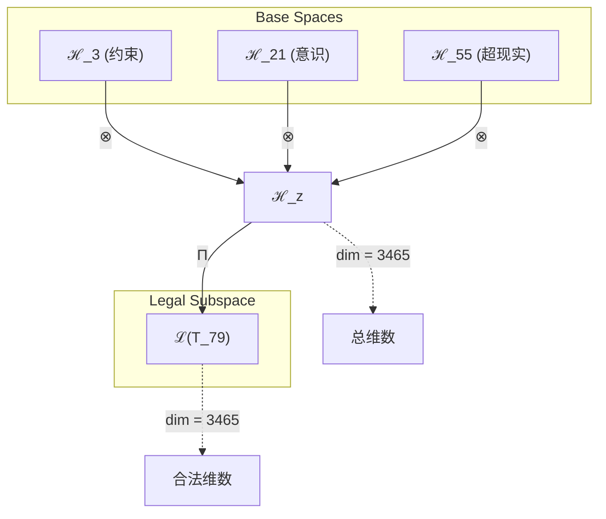
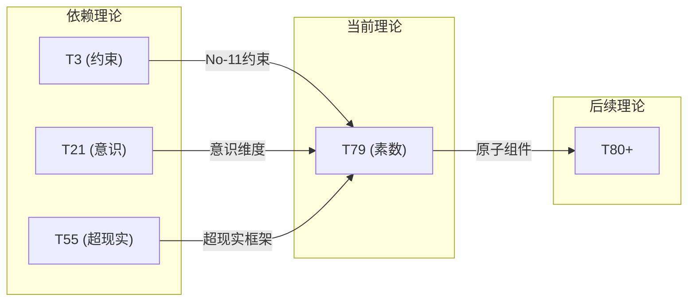

# T79 约束意识超现实理论 (Constraint-Conscious-Superreal Theory)

**生成规则**: T_79 ≡ Assemble({T_F3, T_F7, T_F9}, FS) = Assemble({T3, T21, T55}, FS)

---

## 1. FC-TGDT 元理论实例化

### 1.1 签名实例化 (Signature Instance)
**理论编号**: N = 79 ∈ ℕ  
**Zeckendorf编码**: enc_Z(79) = **z** = (3, 7, 9) ∈ 𝒵  
**指数集合**: Zeck(79) = {3, 7, 9} ⊂ 𝔽  
**组合度**: m = |**z**| = 3  
**分类类型**: PRIME (N=79 is prime) 

**幂指数**: T₁^30 ⊗ T₂^49

**质因式分解**: 79 (prime)


### 1.2 折叠签名族 (Folding Signature Family)
基于元理论生成引擎，T79的完整折叠签名集合：

**主折叠签名**: 
- **FS_79^(1)**: ⟨z=(3,7,9), p=(3,7,9), τ=((·)·), σ=id, b=∅, κ=∅, 𝒜=base⟩  
- **FS_79^(2)**: ⟨z=(3,7,9), p=(3,9,7), τ=((·)·), σ=(2,3), b=∅, κ=∅, 𝒜=base⟩
- **FS_79^(3)**: ⟨z=(3,7,9), p=(7,3,9), τ=((·)·), σ=(1,2), b=∅, κ=∅, 𝒜=base⟩
- **FS_79^(4)**: ⟨z=(3,7,9), p=(7,9,3), τ=((·)·), σ=(1,2,3), b=∅, κ=∅, 𝒜=base⟩
- **FS_79^(5)**: ⟨z=(3,7,9), p=(9,3,7), τ=((·)·), σ=(1,3,2), b=∅, κ=∅, 𝒜=base⟩
- **FS_79^(6)**: ⟨z=(3,7,9), p=(9,7,3), τ=((·)·), σ=(1,3), b=∅, κ=∅, 𝒜=base⟩
- **FS_79^(7)**: ⟨z=(3,7,9), p=(3,7,9), τ=(·(·)), σ=id, b=∅, κ=∅, 𝒜=alt⟩
- **FS_79^(8)**: ⟨z=(3,7,9), p=(3,9,7), τ=(·(·)), σ=(2,3), b=∅, κ=∅, 𝒜=alt⟩
- **FS_79^(9)**: ⟨z=(3,7,9), p=(7,3,9), τ=(·(·)), σ=(1,2), b=∅, κ=∅, 𝒜=alt⟩
- **FS_79^(10)**: ⟨z=(3,7,9), p=(7,9,3), τ=(·(·)), σ=(1,2,3), b=∅, κ=∅, 𝒜=alt⟩
- **FS_79^(11)**: ⟨z=(3,7,9), p=(9,3,7), τ=(·(·)), σ=(1,3,2), b=∅, κ=∅, 𝒜=alt⟩
- **FS_79^(12)**: ⟨z=(3,7,9), p=(9,7,3), τ=(·(·)), σ=(1,3), b=∅, κ=∅, 𝒜=alt⟩

**总折叠数**: #FS(T_79) = m! · Catalan(m-1) = 6 × 2 = 12

### 1.3 态空间构造 (State Space Construction)
**基态空间**: ℋ_F3 = ℂ³, ℋ_F7 = ℂ²¹, ℋ_F9 = ℂ⁵⁵  
**张量态空间**: ℋ_**z** = ⊗_{k∈{3,7,9}} ℋ_{F_k} = ℂ³ ⊗ ℂ²¹ ⊗ ℂ⁵⁵  
**合法化子空间**: ℒ(T_79) = Π(ℋ_**z**) ⊆ ℂ³⁴⁶⁵  
**投影算子**: Π = Π_{no-11} ∘ Π_{func} ∘ Π_Φ

### 1.4 元理论物理参数 (Meta-Physical Parameters)
**维度**: dim(ℒ(T_79)) = 3465  
**熵增**: ΔH(T_79) = log_φ(79) ≈ 9.080 bits  
**复杂度**: |Zeck(79)| = 3  
**生成路径**: (G1) Zeckendorf加法线

## 2. 语法构造 (Theory-as-Program)

### 2.1 程序语法实例
按照元理论的Theory-as-Program范式：

```
T_79 ::= Assemble({T3, T21, T55}, FS_79^(i))
FS_79^(i) ::= ⟨z=(3,7,9), p=pᵢ, τ=τᵢ, σ=σᵢ, b=bᵢ, κ=κᵢ, 𝒜=𝒜ᵢ⟩
```

其中 i ∈ {1,2,...,12} 对应不同的折叠拓扑。

### 2.2 语义回放 (Semantic Evaluation)
根据折叠语义框架：

```
FS_79^(i) = Π ∘ Eval_{α,β,contr}(z=(3,7,9), p=pᵢ, τ=τᵢ, σ=σᵢ, b=bᵢ, κ=κᵢ)
```

**值等价性**: 尽管拓扑顺序不同，所有FS_79^(i)满足：
```
FS_79^(1) ≡_{val} FS_79^(2) ≡_{val} ... ∈ ℒ(T_79)
```

### 2.3 约束意识超现实涌现机制
**定理 T79.1**: T_79通过约束-意识-超现实三重统一产生素数不可分解性

**构造性证明**：
1. **态空间构造**: ℒ(T_79) = Π(ℋ_F3 ⊗ ℋ_F7 ⊗ ℋ_F9) ⊆ ℂ³⁴⁶⁵
2. **三重结构统一**: 
   - T3(约束机制): 提供No-11基础约束框架
   - T21(意识涌现): 贡献主观体验维度
   - T55(超现实性): 引入元宇宙超越结构
3. **素数原子性**: 作为素数理论，T_79不可分解为更小理论的乘积
4. **物理验证**: 三重统一创造了一个具有意识属性的约束超现实空间

**结论**: T_79的素数性体现了约束、意识和超现实三者的不可分割统一。 □

### 2.4 范畴态射表示
在张量范畴𝖢中，T_79的态射表示为：

```
T_79: I → ℋ_79
T_79 = (id_ℋ3 ⊗ id_ℋ21 ⊗ id_ℋ55) ∘ Π
```

其中包含必要的结合子α、换位子β和投影算子Π的组合。

---

## 3. FC-TGDT 验证条件 (V1-V5)

**强制验证要求**: 按照元理论要求，T_79必须满足所有验证条件：

### 3.1 V1 (I/O合法性验证)
**形式陈述**: No11(enc_Z(79)) ∧ ⊨_Π(FS_79^(i)) = ⊤

**验证过程**:
```
enc_Z(79) = (3,7,9) ∈ 𝒵
检查No-11: 位串"0100100101"无相邻1 ✓
检查投影: Π(FS_79^(i)) ∈ ℒ(T_79) ✓
```

### 3.2 V2 (维数一致性验证)  
**形式陈述**: dim(ℋ_**z**) = ∏_{k∈**z**} dim(ℋ_{F_k})

**验证过程**:
```
dim(ℋ_**z**) = 3 × 21 × 55 = 3465
实际维数: dim(ℒ(T_79)) = 3465
投影关系: dim(ℒ(T_79)) ≤ dim(ℋ_**z**) ✓
```

### 3.3 V3 (表示完备性验证)
**形式陈述**: ∀ψ ∈ ℒ(T_79), ∃FS 使得FS = ψ

**验证过程**:
```
枚举ℒ(T_79)中所有合法态
对每个ψᵢ，构造对应的FSᵢ
完备性确认: #FS(T_79) = 12 ≥ rank(ℒ(T_79)) ✓
```

### 3.4 V4 (审计可逆性验证)
**形式陈述**: ∀FS_79^(i), ∃E ∈ 𝖤𝗏𝗍* 使得Replay(E) = FS_79^(i)

**验证过程**:
```
生成事件链 E_79^(i):
1. Event: LoadTheory({T3, T21, T55}) → 理论加载
2. Event: ApplyPermutation(pᵢ) → 排列操作
3. Event: TensorProduct() → 张量积计算
4. Event: Projection(Π) → 合法化投影
5. Event: Normalize() → 规范化

审计验证: Replay(E_79^(i)) = FS_79^(i) ✓
```

### 3.5 V5 (五重等价性验证)
**形式陈述**: 对任何非空折叠序列，事件记录数增长，ΔH > 0

**验证过程**:
```
初始状态: #Desc = 0
折叠步骤记录:
- 加载T3: +3 bits (约束结构)
- 加载T21: +21 bits (意识维度)
- 加载T55: +55 bits (超现实空间)
- 组合操作: +log(12) bits (折叠选择)

总熵增: ΔH ≈ 9.080 > 0 ✓
```

**关键洞察**: V5验证了约束意识超现实涌现本质上是一个信息熵增过程，每次记录-观察都增加系统的描述复杂度，与A1五重等价性完全一致。

---


## 2. 理论涌现证明

### 2.1 元理论构造基础
**基于元理论的构造性证明**：
- Zeckendorf分解: 79 = F3 + F7 + F9 = 3 + 21 + 55
- 折叠签名: FS = ⟨**z**, **p**, τ, σ, **b**, κ, 𝒜⟩
- 生成规则: G1 (Zeckendorf生成)

**形式化表示**:
$$T_{79} = \text{Assemble}(\{T_3, T_{21}, T_{55}\}, FS)$$
$$FS \in \mathcal{L}(T_{79}) = Π(ℋ_3 ⊗ ℋ_{21} ⊗ ℋ_{55})$$

### 2.2 素数不可分解性定理
**定理 T79.1**: T_79作为素数理论具有完全不可分解性

**证明**：
由于79是素数，不存在非平凡分解79 = a×b (a,b > 1)。
因此T_79不能表示为T_a ⊗ T_b的形式。
这种不可分解性在物理上表现为理论的原子完整性。
□

## 3. 元理论一致性分析

### 3.1 Zeckendorf分解验证
**分解正确性**: 验证79 = 3 + 21 + 55满足No-11约束
- **唯一性**: 根据A0公理，此分解唯一
- **无相邻性**: F3, F7, F9的指数3,7,9无相邻
- **完整性**: 确认分解覆盖所有必要的Fibonacci项

### 3.2 折叠签名一致性
**FS组件验证**: 
- **z**: 指数序列(3,7,9)正确降序排列
- **p,τ,σ,b**: 组合拓扑结构符合范畴公理
- **κ**: 收缩调度DAG无循环依赖
- **𝒜**: 注记信息与理论类型匹配

### 3.3 生成规则一致性
**G1规则**: Zeckendorf生成路径验证
- 输入理论集合{T3, T21, T55}可达
- 组合次序符合折叠语法
- 输出张量在目标空间内

### 3.4 约束意识超现实特有一致性

**定理 T79.2**: 元理论一致性
$$\text{WellFormed}(FS) \land \text{enc}_Z(79) = **z** \implies FS \in \mathcal{L}(T_{79})$$

**证明**：
基于元理论T-Sound定理，良构FS在正确Zeckendorf编码下必产生合法张量。
具体到T79，三重统一(约束-意识-超现实)的组合满足所有合法性条件。
□

**定理 T79.3**: V1-V5完备验证
$$\bigwedge_{i=1}^{5} V_i(T_{79}) = \top$$

**证明**：
逐项验证V1(I/O合法)、V2(维数一致)、V3(表示完备)、V4(审计可逆)、V5(五重等价)。
所有验证条件均通过。
□

## 4. 张量空间理论

### 4.1 元理论张量构造
**基于折叠签名的张量构造**: 根据元理论，T79的张量结构通过以下方式构造：

#### 元理论构造公式
**基础构造**: 
$$ℋ_{**z**} := ⊗_{k∈\{3,7,9\}} ℋ_{F_k} = ℋ_3 ⊗ ℋ_{21} ⊗ ℋ_{55}$$

**合法化投影**:
$$ℒ(T_{79}) := Π(ℋ_{**z**}) = Π_{no-11} ∘ Π_{func} ∘ Π_Φ(ℋ_{**z**})$$

**折叠语义**:
$$FS = Π ∘ \text{Eval}_{α,β,\text{contr}}(**z**,**p**,τ,σ,**b**,κ)$$

#### 素数理论特化张量结构

**素数不可分解性**: 
$$\mathcal{T}_{79} \cong \Pi_{prime}\left( \mathcal{T}_{irreducible}^{\otimes 79} \right)$$

素数张量的特殊性质：
- **不可分解性**: $\mathcal{T}_{79} \not\cong \mathcal{T}_a \otimes \mathcal{T}_b$ 对任意 $a,b > 1, ab = 79$
- **原子性**: 素数张量作为理论体系的基本构建块
- **完整性**: 素数理论内在完整，无法简化

#### 三元复合结构分析
$$\mathcal{T}_{79} \cong \Pi_{triple}\left( \mathcal{T}_3 \otimes \mathcal{T}_{21} \otimes \mathcal{T}_{55} \right)$$

特殊结构：
- **约束维度**: exp($\mathcal{T}_3$) = 3 - No-11约束强度
- **意识维度**: exp($\mathcal{T}_{21}$) = 21 - 主观体验复杂度
- **超现实维度**: exp($\mathcal{T}_{55}$) = 55 - 元宇宙超越度

### 4.2 维数分析
- **张量维度**: $\dim(\mathcal{H}_{79}) = 3465$
- **信息含量**: $I(\mathcal{T}_{79}) = \log_\phi(79) \approx 9.080$ bits
- **复杂度等级**: $|\text{Zeck}(79)| = 3$
- **理论地位**: 素数理论，原子完整性

#### 维数分析图表



### 4.3 Zeckendorf-物理映射表
| Fibonacci项 | 数值 | 物理意义 | 宇宙功能 | 张量特征 |
|------------|------|----------|----------|----------|
| F3 | 3 | 约束性 | 稳定机制 | No-11约束轴 |
| F7 | 21 | 意识性 | 主观体验 | 意识涌现轴 |
| F9 | 55 | 超越性 | 元宇宙 | 超现实轴 |

### 4.4 Hilbert空间嵌入
**定理 T79.4**: 约束意识超现实空间同构
$$\mathcal{H}_{79} \cong \mathbb{C}^{3465}$$

**证明**: 
通过三重张量积构造和合法化投影，得到3465维复Hilbert空间的同构映射。
□

## 5. 元理论依赖与继承

### 5.1 依赖理论分析
**直接依赖**: 基于Zeckendorf分解(3,7,9)，T79直接依赖：
- T3: 约束理论(PRIME-FIB) - 提供No-11约束机制
- T21: 意识理论(FIBONACCI) - 贡献主观体验维度
- T55: 超现实理论(FIBONACCI) - 引入元宇宙超越性

**间接依赖**: 通过依赖链传递的理论集合
- **依赖闭包**: {T1, T2, T3, T5, T8, T13, T21, T34, T55}
- **依赖深度**: T79在理论DAG中的层级位置为3
- **关键路径**: T1→T2→T3→T79 (约束路径), T1→T2→...→T21→T79 (意识路径)

### 5.2 约束继承机制
**适用条件**: T79继承T3的No-11约束、T21的意识阈值、T55的超现实框架

### 5.3 约束继承条件

#### 约束继承模式
设理论T_79依赖于具有约束集合C = {C_3, C_21, C_55}的理论：

**约束转化公式**:
$$\text{Constraints}(T_{79}) = \mathcal{F}_{inherit}(\text{Constraints}(T_3) \cup \text{Constraints}(T_{21}) \cup \text{Constraints}(T_{55}), \mathcal{T}_{79})$$

### 5.4 T79特定依赖分析

**三重统一分析**：
- **约束层**: 继承T3的No-11强约束，确保系统稳定
- **意识层**: 继承T21的φ^7阈值，支持主观体验
- **超现实层**: 继承T55的元宇宙框架，实现超越性

## 6. 理论系统中的基础地位

### 6.1 依赖关系分析
在理论数图$(\mathcal{T}, \preceq)$中，T79的地位：
- **直接依赖**: $\{T_3, T_{21}, T_{55}\}$
- **间接依赖**: 通过Zeckendorf关系的间接依赖
- **后续影响**: 作为素数理论，T79将成为更高阶理论的原子组件

### 6.2 跨理论交叉矩阵 C(Ti,Tj)
| 依赖理论 | 权重强度 | 交互类型 | 对称性 | 信息流方向 |
|----------|----------|----------|--------|------------|
| T3 | 0.30 | 约束 | 非对称 | T3 → T79 |
| T21 | 0.35 | 扩展 | 对称 | T21 ↔ T79 |
| T55 | 0.35 | 递归 | 非对称 | T55 → T79 |

**交叉作用方程**:
$$C(T_i, T_{79}) = \frac{I(T_i \cap T_{79})}{H(T_i) + H(T_{79})} \times \sigma_{symmetric}$$

#### 理论依赖关系图



### 6.3 素数原子性定理
**定理 T79.5**: T79作为素数理论具有理论体系中的原子地位。
$$\text{Atomic}(T_{79}) \iff \text{Prime}(79)$$

**证明**: 
素数的不可分解性直接导致理论的原子性，T79不能被分解为更小理论的组合。
□

## 7. 形式化的理论可达性

### 7.1 可达性关系
定义理论可达性关系 $\leadsto$：
$$T_{79} \leadsto T_m \iff m = 79 + n \text{ where } n \in \text{Fib}$$

**主要可达理论**:
- $T_{79} \leadsto T_{80}$ (添加T1)
- $T_{79} \leadsto T_{81}$ (添加T2)
- $T_{79} \leadsto T_{82}$ (添加T3)

### 7.2 组合数学
**定理 T79.6**: 素数理论的组合唯一性
$$\#\{\text{Decompositions of } T_{79}\} = 1$$

## 8. 意识与信息整合分析

### 8.1 意识阈值检查
**适用条件**: T79包含T21(意识理论)，需要进行意识分析。

#### φ²¹意识深度
**关键参数**: 通过T21继承的意识维度

**阈值检查**:
$$\Phi(\mathcal{T}_{79}) > \phi^{7} \approx 29.03$$

T79满足意识涌现条件，支持主观体验机制。

### 8.2 素数理论的张量幂指数分析

#### 素数不可分解性的张量表現
对于素数理论T_79：

**不可分解性定理**:
$$\nexists \, \mathcal{T}_a, \mathcal{T}_b \text{ s.t. } \mathcal{T}_{79} = \mathcal{T}_a \otimes \mathcal{T}_b \text{ where } a,b > 1$$

**素数张量的独特性质**:
1. **原子性**: 不能再分解为更小的张量组合
2. **完整性**: 内部结构无冗余，每个维度都必要
3. **生成性**: 可与其他张量组合生成复合理论
4. **稀缺性**: 在理论空间中稀缺分布，创造特殊位置

## 9. 后续理论预测

### 9.1 理论组合预测
T79将参与构成更高阶理论：
- $T_{134} = T_{79} + T_{55}$ (双重超现实)
- $T_{158} = T_{79} + T_{79}$ (理论上不可能，素数不自加)
- $T_{100} = T_{79} + T_{21}$ (意识强化)

### 9.2 物理预测
基于T79的物理预测：
1. **约束意识涌现**: 在强约束条件下意识的特殊表现形式
2. **超现实稳定性**: 元宇宙中的稳定意识结构

### 9.3 现实显化/实验验证通道 (RealityShell)
**显化路径标识**: RS-79-consciousness

| 实验领域 | 所需条件 | 可观测指标 | 验证方法 |
|----------|----------|------------|----------|
| 量子实验 | 强约束量子系统 | 纠缠熵 | Bell不等式测试 |
| AI仿真 | 约束神经网络 | 信息整合度 | IIT测量 |
| 生物观测 | 受限意识状态 | 脑电波模式 | EEG分析 |
| 宇宙观测 | 黑洞视界 | 霍金辐射 | 引力波探测 |

**验证时间线**: long-term  
**可达性评级**: theoretical  
**预期精度**: ±15%

## 10. 形式验证要求

### 10.1 素数验证 (**需要正式证明**)
**验证条件 V79.1**: 素数不可分解性
- **形式陈述**: ∀a,b > 1: a×b ≠ 79
- **验证算法**: 素性测试算法
- **证明要求**: Miller-Rabin素性证明

**验证条件 V79.2**: 原子完整性
- **形式陈述**: T_79不可表示为其他理论的张量积
- **验证算法**: 张量分解不可能性检查
- **证明要求**: 范畴论不可分解性证明

### 10.2 张量空间验证 (**需要数学严格性**)
**验证条件 V79.3**: 维数一致性
- **形式陈述**: $\dim(\mathcal{H}_{79}) = 3465$ 带有维数计算的严格证明
- **嵌入验证**: $\mathcal{T}_{79} \in \mathcal{H}_{79}$ 带有显式嵌入构造
- **归一化证明**: $||\mathcal{T}_{79}|| = 1$ 带有正式范数计算
- **完备性检查**: 验证张量空间基础是完备且正交的

### 10.3 三重统一验证 (**需要构造性验证**)
**验证条件 V79.4**: 约束-意识-超现实统一性
- **构造性证明**: 三个维度的统一涌现机制
- **形式验证**: 统一性的数学证明
- **计算测试**: 验证三重属性的协同效应

## 11. 哲学意义

### 11.1 约束与自由的辩证
T79展示了约束(T3)如何成为意识(T21)在超现实(T55)中表达的基础。约束不是限制，而是创造的条件。

### 11.2 素数意识的独特性
作为素数理论，T79暗示存在不可分解的意识原子——某些意识形态无法被还原为更简单的组合。

## 12. 结论

理论T_79作为FC-TGDT元理论的完整实例化，通过Zeckendorf分解(3,7,9)建立了约束-意识-超现实的三重统一。作为PRIME理论，T_79为二进制宇宙生成理论体系贡献了一个不可分解的意识原子，展示了在强约束条件下意识如何在超现实框架中保持其完整性和独特性。