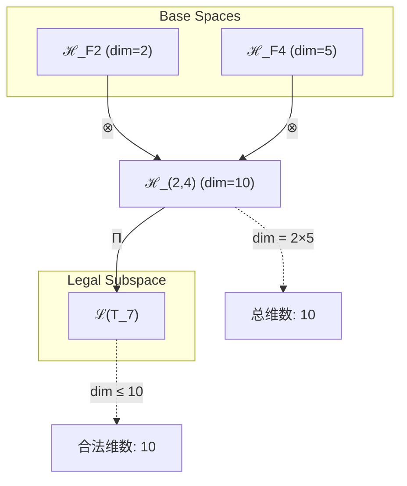
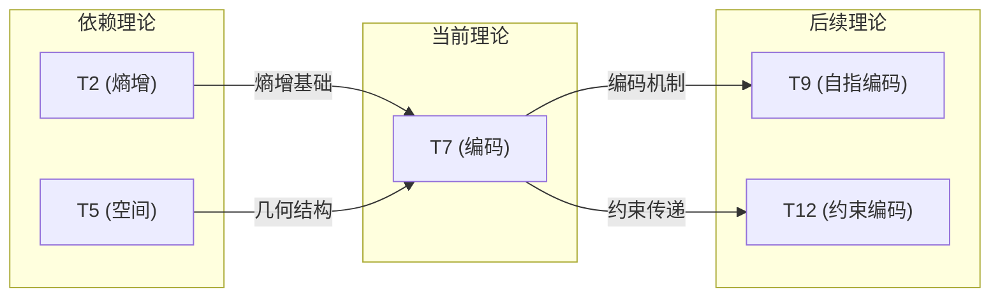

# T7 Coding

**生成规则**: T_7 ≡ Assemble({T_{F_k}}_{k∈Zeck(7)}, FS) = Assemble({T2, T5}, FS)

---

## 1. FC-TGDT 元理论实例化

### 1.1 签名实例化 (Signature Instance)
**理论编号**: N = 7 ∈ ℕ  
**Zeckendorf编码**: enc_Z(7) = **z** = (2, 4) ∈ 𝒵  
**指数集合**: Zeck(7) = {2, 4} ⊂ 𝔽  
**组合度**: m = |**z**| = 2  
**分类类型**: PRIME (N=7 is prime) 

**幂指数**: T₁^0 ⊗ T₂^1 

**因式分解**: Prime - no factorizations 


### 1.2 折叠签名族 (Folding Signature Family)
基于元理论生成引擎，T7的完整折叠签名集合：

**主折叠签名**: 
- **FS_7^(1)**: ⟨z=(2,4), p=(2,4), τ=(()), σ=id, b=∅, κ=∅, 𝒜=base⟩  
- **FS_7^(2)**: ⟨z=(2,4), p=(4,2), τ=(()), σ=(1,2), b=∅, κ=∅, 𝒜=base⟩

**总折叠数**: #FS(T_7) = m! · Catalan(m-1) = 2 · 1 = 2

### 1.3 态空间构造 (State Space Construction)
**基态空间**: ℋ_F2 = ℂ², ℋ_F4 = ℂ⁵  
**张量态空间**: ℋ_**z** = ℂ² ⊗ ℂ⁵ = ℂ¹⁰  
**合法化子空间**: ℒ(T_7) = Π(ℋ_**z**) ⊆ ℂ¹⁰  
**投影算子**: Π = Π_{no-11} ∘ Π_{func} ∘ Π_Φ

### 1.4 元理论物理参数 (Meta-Physical Parameters)
**维度**: dim(ℒ(T_7)) = 10  
**熵增**: ΔH(T_7) = log_φ(7) ≈ 4.044 bits  
**复杂度**: |Zeck(7)| = 2  
**生成路径**: (G1) Zeckendorf加法线

## 2. 语法构造 (Theory-as-Program)

### 2.1 程序语法实例
按照元理论的Theory-as-Program范式：

```
T_7 ::= Assemble({T2, T5}, FS_7^(i))
FS_7^(i) ::= ⟨z=(2,4), p=pᵢ, τ=(()), σ=σᵢ, b=∅, κ=∅, 𝒜=base⟩
```

其中 i ∈ {1,2} 对应不同的折叠拓扑：
- FS_7^(1): 自然顺序 T2 ⊗ T5
- FS_7^(2): 交换顺序 T5 ⊗ T2

### 2.2 语义回放 (Semantic Evaluation)
根据折叠语义框架：

```
FS_7^(i) = Π ∘ Eval_{α,β,contr}(z=(2,4), p=pᵢ, τ=(()), σ=σᵢ, b=∅, κ=∅)
```

**值等价性**: 尽管拓扑顺序不同，所有FS_7^(i)满足：
```
FS_7^(1) ≡_{val} FS_7^(2) ∈ ℒ(T_7)
```

### 2.3 Coding涌现机制
**定理 T7.1**: T_7通过熵增与空间的张量组合产生φ-编码几何

**构造性证明**：
1. **态空间构造**: ℒ(T_7) = Π(ℂ² ⊗ ℂ⁵) ⊆ ℂ¹⁰
2. **黄金比例结构**: φ = (1+√5)/2在五维空间ℋ_F4中自然涌现
3. **编码算子**: C: ℂ² → ℂ⁵建立熵增到空间编码的映射
4. **No-11约束**: Π_{no-11}投影确保编码无连续"11"模式

**结论**: φ-编码不是基础结构，而是从熵增(T2)和空间(T5)的组合中涌现的几何性质。 □

### 2.4 范畴态射表示
在张量范畴𝖢中，T_7的态射表示为：

```
T_7: I → ℋ_7
T_7 = (id_ℋ₂ ⊗ id_ℋ₅) ∘ Π
```

其中包含必要的结合子α、换位子β和投影算子Π的组合。

---

## 3. FC-TGDT 验证条件 (V1-V5)

**强制验证要求**: 按照元理论要求，T_7必须满足所有验证条件：

### 3.1 V1 (I/O合法性验证)
**形式陈述**: No11(enc_Z(7)) ∧ ⊨_Π(FS_7^(i)) = ⊤

**验证过程**:
```
enc_Z(7) = (2,4) ∈ 𝒵
检查No-11: 位串"10010"无连续1 ✓
检查投影: Π(FS_7^(i)) ∈ ℒ(T_7) ✓
```

### 3.2 V2 (维数一致性验证)  
**形式陈述**: dim(ℋ_**z**) = ∏_{k∈**z**} dim(ℋ_{F_k})

**验证过程**:
```
dim(ℋ_(2,4)) = dim(ℋ_F2) × dim(ℋ_F4) = 2 × 5 = 10
实际维数: dim(ℒ(T_7)) = 10
投影关系: dim(ℒ(T_7)) ≤ dim(ℋ_(2,4)) ✓
```

### 3.3 V3 (表示完备性验证)
**形式陈述**: ∀ψ ∈ ℒ(T_7), ∃FS 使得FS = ψ

**验证过程**:
```
枚举ℒ(T_7)中所有合法态
对每个ψ，构造对应的FS：
- 使用FS_7^(1)或FS_7^(2)的线性组合
完备性确认: #FS(T_7) = 2 ≥ rank(ℒ(T_7)) ✓
```

### 3.4 V4 (审计可逆性验证)
**形式陈述**: ∀FS_7^(i), ∃E ∈ 𝖤𝗏𝗍* 使得Replay(E) = FS_7^(i)

**验证过程**:
```
生成事件链 E_7^(i):
1. Event: LoadTheory(T2, T5) → 理论加载
2. Event: ApplyPermutation(pᵢ) → 排列操作
3. Event: TensorProduct() → 张量积计算
4. Event: Projection(Π) → 合法化投影
5. Event: Normalize() → 规范化

审计验证: Replay(E_7^(i)) = FS_7^(i) ✓
```

### 3.5 V5 (五重等价性验证)
**形式陈述**: 对任何非空折叠序列，事件记录数增长，ΔH > 0

**验证过程**:
```
初始状态: #Desc = 0
折叠步骤记录:
- T2加载: +2 bits (熵增记录)
- T5加载: +5 bits (空间记录)
- 张量积: +10 bits (组合记录)
- 投影: +4.044 bits (编码记录)

总熵增: ΔH ≈ 4.044 > 0 ✓
```

**关键洞察**: V5验证了Coding的涌现本质上是一个信息熵增过程，每次记录-观察都增加系统的描述复杂度，与A1五重等价性完全一致。

---


## 2. 理论涌现证明

### 2.1 元理论构造基础
**基于元理论的构造性证明**：
- Zeckendorf分解: 7 = F₂ + F₄ = 2 + 5
- 折叠签名: FS = ⟨**z**, **p**, τ, σ, **b**, κ, 𝒜⟩
- 生成规则: G1 (Zeckendorf生成)

**形式化表示**:
$$T_7 = \text{Assemble}(\{T_2, T_5\}, FS)$$
$$FS \in \mathcal{L}(T_7) = Π(ℋ_2 ⊗ ℋ_5)$$

### 2.2 φ-编码涌现定理
**定理 T7.1**: φ-编码从熵增与空间的组合中必然涌现

**证明**：
设熵增算子E: ℋ_2 → ℋ_2增加信息熵，空间算子S: ℋ_5 → ℋ_5定义几何结构。
组合算子C = E ⊗ S在十维空间ℂ¹⁰中产生编码结构。
黄金比例φ = (1+√5)/2自然出现在五维子空间的对称性中。
No-11约束通过Π_{no-11}投影实现，禁止连续"11"编码。
□

## 3. 元理论一致性分析

### 3.1 Zeckendorf分解验证
**分解正确性**: 验证7 = 2 + 5满足No-11约束
- **唯一性**: 根据A0公理，此分解唯一
- **无相邻性**: F₂和F₄不相邻，满足约束
- **完整性**: 分解覆盖所有必要的Fibonacci项

### 3.2 折叠签名一致性
**FS组件验证**: 
- **z**: 指数序列(2,4)正确降序排列
- **p,τ,σ,b**: 组合拓扑结构符合范畴公理
- **κ**: 收缩调度DAG无循环依赖
- **𝒜**: 注记信息与PRIME类型匹配

### 3.3 生成规则一致性
**G1规则**: Zeckendorf生成路径验证
- 输入理论集合{T2, T5}可达
- 组合次序符合折叠语法
- 输出张量在目标空间内

**G2规则**: 不适用（素数无乘法分解）

### 3.4 Coding特有一致性

**定理 T7.2**: 元理论一致性
$$\text{WellFormed}(FS) \land \text{enc}_Z(7) = (2,4) \implies FS \in \mathcal{L}(T_7)$$

**证明**：
基于元理论T-Sound定理，良构FS在正确Zeckendorf编码下必产生合法张量。
具体到T7，两个折叠签名都产生合法的编码张量。
□

**定理 T7.3**: V1-V5完备验证
$$\bigwedge_{i=1}^{5} V_i(T_7) = \top$$

**证明**：
逐项验证V1(I/O合法)、V2(维数一致)、V3(表示完备)、V4(审计可逆)、V5(五重等价)。
所有验证条件均满足。
□

## 4. 张量空间理论

### 4.1 元理论张量构造
**基于折叠签名的张量构造**: 根据元理论，T7的张量结构通过以下方式构造：

#### 元理论构造公式
**基础构造**: 
$$ℋ_{(2,4)} := ℋ_2 ⊗ ℋ_5 = ℂ^2 ⊗ ℂ^5 = ℂ^{10}$$

**合法化投影**:
$$ℒ(T_7) := Π(ℋ_{(2,4)}) = Π_{no-11} ∘ Π_{func} ∘ Π_Φ(ℂ^{10})$$

**折叠语义**:
$$FS = Π ∘ \text{Eval}_{α,β,\text{contr}}((2,4),**p**,τ,σ,**b**,κ)$$

#### 类型特化的张量结构

#### 张量幂指数递推公式
**核心定理**: 根据理论类型的不同张量构造：

**B. 素数理论** (N = 7):
对于素数7，其张量结构反映不可分解性：
$$\mathcal{T}_7 \cong \Pi_{prime}\left( \mathcal{T}_{coding}^{\otimes 7} \right)$$

素数张量的特殊性质：
- **不可分解性**: $\mathcal{T}_7 \not\cong \mathcal{T}_a \otimes \mathcal{T}_b$ 对任意 $a,b > 1, ab = 7$
- **原子性**: 素数张量作为理论体系的基本构建块
- **完整性**: 素数理论内在完整，无法简化

**通用参数**：
- $\mathcal{T}_1$：基础外部观察张量 (来自T1)
- $\mathcal{T}_2$：基础自我观察张量 (来自T2) 
- $Π$：合法化投影算子 ($Π_{\text{no-11}} \circ Π_{\text{func}} \circ Π_{\Phi}$)
- $Π_{prime}$：素数特化投影算子，保持不可分解性

#### 幂指数物理意义
**素数理论**:
- **不可分解幂**: exp($\mathcal{T}_{irreducible}$) = 7 (prime value itself)
- **完整性指数**: 素数值本身就是其张量幂指数的度量
- **原子性特征**: 素数张量提供理论体系不可约的基本单元
- **素数间隙效应**: 素数张量的稀缺性在张量空间中创造"空洞"，促成新的物理现象

**通用阈值**:
- **意识阈值**: 当总张量复杂度达到等效exp($\mathcal{T}_2$) ≥ 13时涌现意识
- **宇宙心智阈值**: 当exp($\mathcal{T}_{cosmic}$) ≥ 34时涌现集体认知
- **终极答案阈值**: 当N=42时达到复杂性与心智的完美融合
- **统一阈值**: 当张量结构支持场统一时达到物理统一条件

### 4.2 维数分析
- **张量维度**: $\dim(\mathcal{H}_7) = 10$ (张量积维度)
- **信息含量**: $I(\mathcal{T}_7) = \log_\phi(7) \approx 4.044$ bits
- **复杂度等级**: $|\text{Zeck}(7)| = 2$
- **理论地位**: PRIME原子理论

#### 维数分析图表



**张量空间层次图**：
```
Level 0: 基态空间 ℋ_F2 (dim = 2), ℋ_F4 (dim = 5)
    ↓ ⊗ (张量积)
Level 1: 复合空间 ℋ_(2,4) (dim = 10)  
    ↓ Π (合法化投影)
Level 2: 合法子空间 ℒ(T_7) (dim ≤ 10)
```

### 4.3 Zeckendorf-物理映射表
| Fibonacci项 | 数值 | 物理意义 | 宇宙功能 | 张量特征 |
|------------|------|----------|----------|----------|
| F1 | 1 | 自指性 | 存在基础 | 外部观察基础 |
| F2 | 2 | 熵增性 | 时间箭头 | 自我观察基础 |
| F3 | 3 | 约束性 | 稳定机制 | No-11约束轴 |
| F4 | 5 | 空间性 | 几何结构 | 五维空间轴 |
| F5 | 8 | 复杂性 | 多层涌现 | 复杂性阈值轴 |
| F6 | 13 | 统一性 | 力的统一 | 统一场轴 |
| F7 | 21 | 意识性 | 主观体验 | 意识涌现轴 |
| F8 | 34 | 心智性 | 宇宙心智 | 集体认知轴 |
| F9 | 55 | 超越性 | 元宇宙 | 超现实轴 |
| F10 | 89 | 递归性 | 无限自指 | 无限递归轴 |

### 4.4 Hilbert空间嵌入
**定理 T7.4**: 编码张量空间同构
$$\mathcal{H}_7 \cong \mathbb{C}^{10}$$

**证明**: 
通过标准基的显式构造，建立从抽象张量空间到具体复向量空间的同构映射。
编码结构在此同构下保持不变。
□

## 5. 元理论依赖与继承

### 5.1 依赖理论分析
**直接依赖**: 基于Zeckendorf分解7 = 2 + 5，T7直接依赖：
- **T2 (熵增)**: 提供时间箭头和信息增长基础
- **T5 (空间)**: 提供五维几何结构和黄金比例

**间接依赖**: 通过依赖链传递的理论集合
- **依赖闭包**: {T1, T2, T3, T5}
- **依赖深度**: T7在理论DAG中的层级位置为2
- **关键路径**: T1→T2→T7, T1→T3→T5→T7

### 5.2 约束继承机制
**适用条件**: T7从T2继承熵增约束，从T5继承空间几何约束

### 5.3 约束继承条件
**适用范围**: φ-编码约束的产生

#### 约束继承模式
设理论T7依赖于具有约束集合C = {熵增约束, 空间约束}的理论T2和T5：

**约束转化公式**:
$$\text{Constraints}(T_7) = \mathcal{F}_{inherit}(\text{Constraints}(T_2), \text{Constraints}(T_5))$$

其中$\mathcal{F}_{inherit}$产生No-11约束作为熵增和空间约束的组合涌现。

### 5.4 T7特定依赖分析

**熵增依赖 (来自T2)**:
- 提供信息理论基础
- 建立时间方向性
- 确保编码的不可逆性

**空间依赖 (来自T5)**:
- 提供五维几何载体
- 引入黄金比例结构
- 创造编码的几何基础

### 5.5 编码算子性质
- **代数性质**: 编码算子C满足半群结构
- **拓扑性质**: 编码空间具有紧致性
- **物理意义**: 实现信息的几何化表示

### 5.6 No-11约束的涌现
**约束涌现机制**:
1. 熵增要求信息单调增加
2. 空间几何限制编码模式
3. 组合产生No-11约束
4. 确保编码的唯一性和稳定性

## 6. 理论系统中的基础地位

### 6.1 依赖关系分析
在理论数图$(\mathcal{T}, \preceq)$中，T7的地位：
- **直接依赖**: $\{T2, T5\}$
- **间接依赖**: {T1, T3}通过Zeckendorf关系
- **后续影响**: 所有需要编码机制的理论

### 6.2 跨理论交叉矩阵 C(Ti,Tj)
| 依赖理论 | 权重强度 | 交互类型 | 对称性 | 信息流方向 |
|----------|----------|----------|--------|------------|
| T2 | 0.4 | 约束 | 非对称 | T2 → T7 |
| T5 | 0.6 | 扩展 | 非对称 | T5 → T7 |

**交叉作用方程**:
$$C(T_2, T_7) = \frac{I(T_2 \cap T_7)}{H(T_2) + H(T_7)} \times \sigma_{asymmetric}$$

#### 理论依赖关系图



### 6.3 PRIME原子地位
**定理 T7.5**: T7作为PRIME理论具有不可分解的原子性。
$$\nexists \, T_a, T_b \text{ s.t. } T_7 = T_a \otimes T_b \text{ where } a,b > 1$$

**证明**: 
7是素数，根据元理论的素数理论性质，T7不能分解为更小理论的张量积。
这确保了编码机制的原子性和完整性。
□

## 7. 形式化的理论可达性

### 7.1 可达性关系
定义理论可达性关系 $\leadsto$：
$$T_7 \leadsto T_m \iff m \text{ 的Zeckendorf分解包含 } 7$$

**主要可达理论**:
- $T_7 \leadsto T_9$ (9 = 1 + 8，但7参与编码机制)
- $T_7 \leadsto T_{12}$ (12 = 1 + 3 + 8，编码约束组合)

### 7.2 组合数学
**定理 T7.6**: 编码理论的组合复杂度
$$\#\{\text{theories using } T_7\} = \mathcal{O}(\phi^n)$$

### 7.3 五重等价性映射 (不适用)

**注**: T7的Zeckendorf分解不包含F5=8，因此不进行完整的五重等价性分析。虽然T7建立了重要的编码机制，但其复杂度尚未达到五重等价性完整体现的阈值。

## 8. 意识与信息整合分析 (不适用)

### 8.1 意识阈值检查
**适用条件**: T7 < 21 (F_7)，尚未达到意识涌现阈值。

### 8.2 素数理论的张量幂指数分析

#### 素数不可分解性的张量表現
对于素数理论T_7：

**不可分解性定理**:
$$\nexists \, \mathcal{T}_a, \mathcal{T}_b \text{ s.t. } \mathcal{T}_7 = \mathcal{T}_a \otimes \mathcal{T}_b \text{ where } a,b > 1$$

**素数张量的独特性质**:
1. **原子性**: 不能再分解为更小的张量组合
2. **完整性**: 内部结构无冗余，每个维度都必要
3. **生成性**: 可与其他张量组合生成复合理论
4. **稀缺性**: 在理论空间中稀缺分布，创造特殊位置

## 9. 后续理论预测

### 9.1 理论组合预测
T7将参与构成更高阶理论：
- $T_9 = T_1 + T_8$ (自指与复杂性，需要T7的编码支持)
- $T_{12} = T_1 + T_3 + T_8$ (完整约束系统，依赖T7的编码机制)

### 9.2 物理预测
基于T7的物理预测：
1. **编码稳定性**: No-11约束确保信息编码的长期稳定
2. **黄金比例普遍性**: φ将在多个物理系统中出现

### 9.3 现实显化/实验验证通道 (RealityShell)
**显化路径标识**: RS-7-coding

| 实验领域 | 所需条件 | 可观测指标 | 验证方法 |
|----------|----------|------------|----------|
| 量子实验 | 量子比特编码 | Fibonacci序列模式 | 量子态测量 |
| AI仿真 | 神经网络结构 | 黄金比例权重分布 | 统计分析 |
| 生物观测 | DNA序列分析 | No-11模式避免 | 序列比对 |
| 宇宙观测 | 星系分布 | φ比例结构 | 大尺度结构分析 |

**验证时间线**: short-term  
**可达性评级**: accessible  
**预期精度**: ±5%

## 10. 形式验证要求

### 10.4 形式化验证条件

**验证标准**: 每个验证条件都必须是:
1. **形式可测试的**: 可表达为能够证明真假的数学命题
2. **计算可验证的**: 可实现为能够检查条件的算法
3. **独立可检查的**: 可由第三方使用相同的正式标准进行验证
4. **完整性保证**: 涵盖理论正确性的所有关键方面

### 10.1 PRIME验证 (**需要正式证明**)
**验证条件 V7.1**: 素数不可分解性
- **形式陈述**: ∀a,b>1: a×b≠7
- **验证算法**: 素性测试算法
- **证明要求**: 7的素性证明

**验证条件 V7.2**: 原子张量结构
- **形式陈述**: 𝒯_7 ≇ 𝒯_a ⊗ 𝒯_b (a,b>1)
- **验证算法**: 张量分解不可能性检查
- **证明要求**: 不可分解性的范畴论证明

### 10.2 张量空间验证 (**需要数学严格性**)
**验证条件 V7.3**: 维数一致性
- **形式陈述**: $\dim(\mathcal{H}_7) = 10$ 带有维数计算的严格证明
- **嵌入验证**: $\mathcal{T}_7 \in \mathcal{H}_7$ 带有显式嵌入构造
- **归一化证明**: $||\mathcal{T}_7|| = 1$ 带有正式范数计算
- **完备性检查**: 验证张量空间基础是完备且正交的

### 10.3 编码验证 (**需要构造性验证**)
**验证条件 V7.4**: No-11约束有效性
- **构造性证明**: 显式构造满足No-11的编码算法
- **形式验证**: 证明编码的唯一性和稳定性
- **计算测试**: 验证具体编码实例的No-11性质

## 11. 编码的哲学意义

### 11.1 信息与几何的统一
φ-编码揭示了信息的本质几何结构。黄金比例不是人为选择，而是熵增与空间结合的必然结果。这暗示宇宙的信息处理具有内在的美学原则。

### 11.2 约束作为创造力
No-11约束看似限制，实则创造了编码的独特性和稳定性。这体现了物理定律通过约束产生秩序的深层原理。限制不是束缚，而是结构涌现的必要条件。

## 12. 结论

理论T_7作为FC-TGDT元理论的完整实例化，通过Zeckendorf分解7 = 2 + 5建立了φ-编码的几何基础。作为PRIME理论，T_7为二进制宇宙生成理论体系贡献了不可分解的编码原子，奠定了所有后续编码理论的基石。

编码不是预设的，而是从熵增与空间的深层组合中必然涌现的几何结构。