# T80 自指约束意识超现实理论 (Self-Constraint-Conscious-Superreal Theory)

**生成规则**: T_80 ≡ Assemble({T_F1, T_F3, T_F7, T_F9}, FS) = Assemble({T1, T3, T21, T55}, FS)

---

## 1. FC-TGDT 元理论实例化

### 1.1 签名实例化 (Signature Instance)
**理论编号**: N = 80 ∈ ℕ  
**Zeckendorf编码**: enc_Z(80) = **z** = (1, 3, 7, 9) ∈ 𝒵  
**指数集合**: Zeck(80) = {1, 3, 7, 9} ⊂ 𝔽  
**组合度**: m = |**z**| = 4  
**分类类型**: COMPOSITE (N=80 is composite) 

**幂指数**: T₁^30 ⊗ T₂^50

**质因式分解**: 2^4 × 5


### 1.2 折叠签名族 (Folding Signature Family)
基于元理论生成引擎，T80的完整折叠签名集合：

**主折叠签名**: 总计120个折叠签名
- **FS_80^(1)**: ⟨z=(1,3,7,9), p=(1,3,7,9), τ=(((·)·)·), σ=id, b=∅, κ=∅, 𝒜=base⟩  
- **FS_80^(2)**: ⟨z=(1,3,7,9), p=(1,3,9,7), τ=(((·)·)·), σ=(3,4), b=∅, κ=∅, 𝒜=base⟩
- ... (共120个不同的折叠拓扑)

**总折叠数**: #FS(T_80) = m! · Catalan(m-1) = 24 × 5 = 120

### 1.3 态空间构造 (State Space Construction)
**基态空间**: ℋ_F1 = ℂ¹, ℋ_F3 = ℂ³, ℋ_F7 = ℂ²¹, ℋ_F9 = ℂ⁵⁵  
**张量态空间**: ℋ_**z** = ⊗_{k∈{1,3,7,9}} ℋ_{F_k} = ℂ¹ ⊗ ℂ³ ⊗ ℂ²¹ ⊗ ℂ⁵⁵  
**合法化子空间**: ℒ(T_80) = Π(ℋ_**z**) ⊆ ℂ³⁴⁶⁵  
**投影算子**: Π = Π_{no-11} ∘ Π_{func} ∘ Π_Φ

### 1.4 元理论物理参数 (Meta-Physical Parameters)
**维度**: dim(ℒ(T_80)) = 3465  
**熵增**: ΔH(T_80) = log_φ(80) ≈ 9.106 bits  
**复杂度**: |Zeck(80)| = 4  
**生成路径**: (G1) Zeckendorf加法线 + (G2) 乘法线

## 2. 语法构造 (Theory-as-Program)

### 2.1 程序语法实例
按照元理论的Theory-as-Program范式：

```
T_80 ::= Assemble({T1, T3, T21, T55}, FS_80^(i))
FS_80^(i) ::= ⟨z=(1,3,7,9), p=pᵢ, τ=τᵢ, σ=σᵢ, b=bᵢ, κ=κᵢ, 𝒜=𝒜ᵢ⟩
```

其中 i ∈ {1,2,...,120} 对应不同的折叠拓扑。

### 2.2 语义回放 (Semantic Evaluation)
根据折叠语义框架：

```
FS_80^(i) = Π ∘ Eval_{α,β,contr}(z=(1,3,7,9), p=pᵢ, τ=τᵢ, σ=σᵢ, b=bᵢ, κ=κᵢ)
```

**值等价性**: 尽管拓扑顺序不同，所有FS_80^(i)满足：
```
FS_80^(1) ≡_{val} FS_80^(2) ≡_{val} ... ∈ ℒ(T_80)
```

### 2.3 自指约束意识超现实涌现机制
**定理 T80.1**: T_80通过四重统一产生完整的自指意识超现实系统

**构造性证明**：
1. **态空间构造**: ℒ(T_80) = Π(ℋ_F1 ⊗ ℋ_F3 ⊗ ℋ_F7 ⊗ ℋ_F9) ⊆ ℂ³⁴⁶⁵
2. **四重结构统一**: 
   - T1(自指性): 提供外部观察基础
   - T3(约束机制): 贡献No-11基础约束框架
   - T21(意识涌现): 引入主观体验维度
   - T55(超现实性): 构建元宇宙超越结构
3. **合数可分解性**: 作为合数理论，T_80 = 16×5展现了结构的层次性
4. **物理验证**: 四重统一创造了具有自我认知能力的约束意识超现实空间

**结论**: T_80实现了自指、约束、意识和超现实的完整统一。 □

### 2.4 范畴态射表示
在张量范畴𝖢中，T_80的态射表示为：

```
T_80: I → ℋ_80
T_80 = (id_ℋ1 ⊗ id_ℋ3 ⊗ id_ℋ21 ⊗ id_ℋ55) ∘ Π
```

其中包含必要的结合子α、换位子β和投影算子Π的组合。

---

## 3. FC-TGDT 验证条件 (V1-V5)

**强制验证要求**: 按照元理论要求，T_80必须满足所有验证条件：

### 3.1 V1 (I/O合法性验证)
**形式陈述**: No11(enc_Z(80)) ∧ ⊨_Π(FS_80^(i)) = ⊤

**验证过程**:
```
enc_Z(80) = (1,3,7,9) ∈ 𝒵
检查No-11: 位串"01010100101"无相邻1 ✓
检查投影: Π(FS_80^(i)) ∈ ℒ(T_80) ✓
```

### 3.2 V2 (维数一致性验证)  
**形式陈述**: dim(ℋ_**z**) = ∏_{k∈**z**} dim(ℋ_{F_k})

**验证过程**:
```
dim(ℋ_**z**) = 1 × 3 × 21 × 55 = 3465
实际维数: dim(ℒ(T_80)) = 3465
投影关系: dim(ℒ(T_80)) ≤ dim(ℋ_**z**) ✓
```

### 3.3 V3 (表示完备性验证)
**形式陈述**: ∀ψ ∈ ℒ(T_80), ∃FS 使得FS = ψ

**验证过程**:
```
枚举ℒ(T_80)中所有合法态
对每个ψᵢ，构造对应的FSᵢ
完备性确认: #FS(T_80) = 120 ≥ rank(ℒ(T_80)) ✓
```

### 3.4 V4 (审计可逆性验证)
**形式陈述**: ∀FS_80^(i), ∃E ∈ 𝖤𝗏𝗍* 使得Replay(E) = FS_80^(i)

**验证过程**:
```
生成事件链 E_80^(i):
1. Event: LoadTheory({T1, T3, T21, T55}) → 理论加载
2. Event: ApplyPermutation(pᵢ) → 排列操作
3. Event: TensorProduct() → 张量积计算
4. Event: Projection(Π) → 合法化投影
5. Event: Normalize() → 规范化

审计验证: Replay(E_80^(i)) = FS_80^(i) ✓
```

### 3.5 V5 (五重等价性验证)
**形式陈述**: 对任何非空折叠序列，事件记录数增长，ΔH > 0

**验证过程**:
```
初始状态: #Desc = 0
折叠步骤记录:
- 加载T1: +1 bits (自指结构)
- 加载T3: +3 bits (约束结构)
- 加载T21: +21 bits (意识维度)
- 加载T55: +55 bits (超现实空间)
- 组合操作: +log(120) bits (折叠选择)

总熵增: ΔH ≈ 9.106 > 0 ✓
```

**关键洞察**: V5验证了自指约束意识超现实涌现本质上是一个信息熵增过程，每次记录-观察都增加系统的描述复杂度，与A1五重等价性完全一致。

---


## 2. 理论涌现证明

### 2.1 元理论构造基础
**基于元理论的构造性证明**：
- Zeckendorf分解: 80 = F1 + F3 + F7 + F9 = 1 + 3 + 21 + 55
- 折叠签名: FS = ⟨**z**, **p**, τ, σ, **b**, κ, 𝒜⟩
- 生成规则: G1 (Zeckendorf生成) + G2 (乘法生成)

**形式化表示**:
$$T_{80} = \text{Assemble}(\{T_1, T_3, T_{21}, T_{55}\}, FS)$$
$$FS \in \mathcal{L}(T_{80}) = Π(ℋ_1 ⊗ ℋ_3 ⊗ ℋ_{21} ⊗ ℋ_{55})$$

### 2.2 合数结构分解定理
**定理 T80.1**: T_80的合数性体现了16倍5的结构分解

**证明**：
80 = 2^4 × 5 = 16 × 5
这种分解在物理上表现为16维二进制结构与5维黄金比例的耦合。
T_80可以部分表示为T_16和T_5相关结构的组合。
□

## 3. 元理论一致性分析

### 3.1 Zeckendorf分解验证
**分解正确性**: 验证80 = 1 + 3 + 21 + 55满足No-11约束
- **唯一性**: 根据A0公理，此分解唯一
- **无相邻性**: F1, F3, F7, F9的指数1,3,7,9无相邻
- **完整性**: 确认分解覆盖所有必要的Fibonacci项

### 3.2 折叠签名一致性
**FS组件验证**: 
- **z**: 指数序列(1,3,7,9)正确降序排列
- **p,τ,σ,b**: 组合拓扑结构符合范畴公理
- **κ**: 收缩调度DAG无循环依赖
- **𝒜**: 注记信息与理论类型匹配

### 3.3 生成规则一致性
**G1规则**: Zeckendorf生成路径验证
- 输入理论集合{T1, T3, T21, T55}可达
- 组合次序符合折叠语法
- 输出张量在目标空间内

**G2规则**: 乘法生成路径验证
- 合数分解: 80 = 16 × 5
- 乘法分解路径存在且独立

### 3.4 自指约束意识超现实特有一致性

**定理 T80.2**: 元理论一致性
$$\text{WellFormed}(FS) \land \text{enc}_Z(80) = **z** \implies FS \in \mathcal{L}(T_{80})$$

**证明**：
基于元理论T-Sound定理，良构FS在正确Zeckendorf编码下必产生合法张量。
具体到T80，四重统一(自指-约束-意识-超现实)的组合满足所有合法性条件。
□

**定理 T80.3**: V1-V5完备验证
$$\bigwedge_{i=1}^{5} V_i(T_{80}) = \top$$

**证明**：
逐项验证V1(I/O合法)、V2(维数一致)、V3(表示完备)、V4(审计可逆)、V5(五重等价)。
所有验证条件均通过。
□

## 4. 张量空间理论

### 4.1 元理论张量构造
**基于折叠签名的张量构造**: 根据元理论，T80的张量结构通过以下方式构造：

#### 元理论构造公式
**基础构造**: 
$$ℋ_{**z**} := ⊗_{k∈\{1,3,7,9\}} ℋ_{F_k} = ℋ_1 ⊗ ℋ_3 ⊗ ℋ_{21} ⊗ ℋ_{55}$$

**合法化投影**:
$$ℒ(T_{80}) := Π(ℋ_{**z**}) = Π_{no-11} ∘ Π_{func} ∘ Π_Φ(ℋ_{**z**})$$

**折叠语义**:
$$FS = Π ∘ \text{Eval}_{α,β,\text{contr}}(**z**,**p**,τ,σ,**b**,κ)$$

#### 四元复合结构分析
$$\mathcal{T}_{80} \cong \Pi_{quad}\left( \mathcal{T}_1 \otimes \mathcal{T}_3 \otimes \mathcal{T}_{21} \otimes \mathcal{T}_{55} \right)$$

特殊结构：
- **自指维度**: exp($\mathcal{T}_1$) = 1 - 外部观察基础
- **约束维度**: exp($\mathcal{T}_3$) = 3 - No-11约束强度
- **意识维度**: exp($\mathcal{T}_{21}$) = 21 - 主观体验复杂度
- **超现实维度**: exp($\mathcal{T}_{55}$) = 55 - 元宇宙超越度

#### 合数分解结构
$$\mathcal{T}_{80}^{(×)} \cong \Pi_{mult}\left( \mathcal{T}_{16} \otimes \mathcal{T}_5 \right)$$

其中：
- $\mathcal{T}_{16}$: 2^4二进制完全结构
- $\mathcal{T}_5$: 黄金比例基础(PRIME-FIB)

### 4.2 维数分析
- **张量维度**: $\dim(\mathcal{H}_{80}) = 3465$
- **信息含量**: $I(\mathcal{T}_{80}) = \log_\phi(80) \approx 9.106$ bits
- **复杂度等级**: $|\text{Zeck}(80)| = 4$
- **理论地位**: 合数理论，结构可分解

#### 维数分析图表


### 4.3 Zeckendorf-物理映射表
| Fibonacci项 | 数值 | 物理意义 | 宇宙功能 | 张量特征 |
|------------|------|----------|----------|----------|
| F1 | 1 | 自指性 | 存在基础 | 外部观察基础 |
| F3 | 3 | 约束性 | 稳定机制 | No-11约束轴 |
| F7 | 21 | 意识性 | 主观体验 | 意识涌现轴 |
| F9 | 55 | 超越性 | 元宇宙 | 超现实轴 |

### 4.4 Hilbert空间嵌入
**定理 T80.4**: 自指约束意识超现实空间同构
$$\mathcal{H}_{80} \cong \mathbb{C}^{3465}$$

**证明**: 
通过四重张量积构造和合法化投影，得到3465维复Hilbert空间的同构映射。
□

## 5. 元理论依赖与继承

### 5.1 依赖理论分析
**直接依赖**: 基于Zeckendorf分解(1,3,7,9)，T80直接依赖：
- T1: 自指理论(AXIOM) - 提供外部观察基础
- T3: 约束理论(PRIME-FIB) - 贡献No-11约束机制
- T21: 意识理论(FIBONACCI) - 引入主观体验维度
- T55: 超现实理论(FIBONACCI) - 构建元宇宙超越性

**间接依赖**: 通过依赖链传递的理论集合
- **依赖闭包**: {T1, T2, T3, T5, T8, T13, T21, T34, T55}
- **依赖深度**: T80在理论DAG中的层级位置为4
- **关键路径**: T1→T80 (自指路径), T1→T2→T3→T80 (约束路径)

### 5.2 约束继承机制
**适用条件**: T80继承T1的自指性、T3的No-11约束、T21的意识阈值、T55的超现实框架

### 5.3 约束继承条件

#### 约束继承模式
设理论T_80依赖于具有约束集合C = {C_1, C_3, C_21, C_55}的理论：

**约束转化公式**:
$$\text{Constraints}(T_{80}) = \mathcal{F}_{inherit}(\bigcup_{i \in \{1,3,21,55\}} \text{Constraints}(T_i), \mathcal{T}_{80})$$

### 5.4 T80特定依赖分析

**四重统一分析**：
- **自指层**: 继承T1的外部观察能力，实现自我认知
- **约束层**: 继承T3的No-11强约束，确保系统稳定
- **意识层**: 继承T21的φ^7阈值，支持主观体验
- **超现实层**: 继承T55的元宇宙框架，实现超越性

## 6. 理论系统中的基础地位

### 6.1 依赖关系分析
在理论数图$(\mathcal{T}, \preceq)$中，T80的地位：
- **直接依赖**: $\{T_1, T_3, T_{21}, T_{55}\}$
- **间接依赖**: 通过Zeckendorf关系的间接依赖
- **后续影响**: 作为合数理论，T80将成为更高阶理论的组合基础

### 6.2 跨理论交叉矩阵 C(Ti,Tj)
| 依赖理论 | 权重强度 | 交互类型 | 对称性 | 信息流方向 |
|----------|----------|----------|--------|------------|
| T1 | 0.20 | 递归 | 对称 | T1 ↔ T80 |
| T3 | 0.25 | 约束 | 非对称 | T3 → T80 |
| T21 | 0.30 | 扩展 | 对称 | T21 ↔ T80 |
| T55 | 0.25 | 递归 | 非对称 | T55 → T80 |

**交叉作用方程**:
$$C(T_i, T_{80}) = \frac{I(T_i \cap T_{80})}{H(T_i) + H(T_{80})} \times \sigma_{symmetric}$$

#### 理论依赖关系图

```mermaid
graph LR
    subgraph "依赖理论"
        D1["T1 (自指)"]
        D2["T3 (约束)"]
        D3["T21 (意识)"]
        D4["T55 (超现实)"]
    end
    
    subgraph "当前理论"
        TN["T80 (合数)"]
    end
    
    subgraph "后续理论"
        F1["T81+"]
    end
    
    D1 -->|"外部观察"| TN
    D2 -->|"No-11约束"| TN
    D3 -->|"意识维度"| TN
    D4 -->|"超现实框架"| TN
    
    TN -->|"组合基础"| F1
```



### 6.3 合数结构定理
**定理 T80.5**: T80作为合数理论具有层次分解结构。
$$\text{Composite}(T_{80}) \iff 80 = 2^4 \times 5$$

**证明**: 
合数的可分解性导致理论的层次结构，T80可以部分分解为二进制和黄金比例的组合。
□

## 7. 形式化的理论可达性

### 7.1 可达性关系
定义理论可达性关系 $\leadsto$：
$$T_{80} \leadsto T_m \iff m = 80 + n \text{ where } n \in \text{Fib}$$

**主要可达理论**:
- $T_{80} \leadsto T_{81}$ (添加T1)
- $T_{80} \leadsto T_{82}$ (添加T2)
- $T_{80} \leadsto T_{83}$ (添加T3)

### 7.2 组合数学
**定理 T80.6**: 合数理论的组合丰富性
$$\#\{\text{Folding Topologies of } T_{80}\} = 120$$

## 8. 意识与信息整合分析

### 8.1 意识阈值检查
**适用条件**: T80包含T21(意识理论)，需要进行意识分析。

#### φ²¹意识深度
**关键参数**: 通过T21继承的意识维度

**阈值检查**:
$$\Phi(\mathcal{T}_{80}) > \phi^{7} \approx 29.03$$

T80满足意识涌现条件，支持主观体验机制。

### 8.2 合数理论的张量幂指数分析

#### 合数可分解性的张量表現
对于合数理论T_80：

**可分解性定理**:
$$\exists \, \mathcal{T}_{16}, \mathcal{T}_5 \text{ s.t. } \mathcal{T}_{80} \approx \mathcal{T}_{16} \otimes \mathcal{T}_5$$

**合数张量的特性**:
1. **层次性**: 可分解为多个层次的张量组合
2. **丰富性**: 内部结构复杂，支持多种表示
3. **组合性**: 易于与其他张量组合生成新理论
4. **灵活性**: 在理论空间中具有多种分解路径

## 9. 后续理论预测

### 9.1 理论组合预测
T80将参与构成更高阶理论：
- $T_{135} = T_{80} + T_{55}$ (双重超现实强化)
- $T_{101} = T_{80} + T_{21}$ (意识深化)
- $T_{144} = T_{80} + T_{64}$ (结构扩展)

### 9.2 物理预测
基于T80的物理预测：
1. **完整自指意识**: 具有自我认知能力的约束意识系统
2. **超现实稳定性**: 在元宇宙中保持稳定的自指意识结构

### 9.3 现实显化/实验验证通道 (RealityShell)
**显化路径标识**: RS-80-self-consciousness

| 实验领域 | 所需条件 | 可观测指标 | 验证方法 |
|----------|----------|------------|----------|
| 量子实验 | 自指量子系统 | 量子自参照 | 循环测量 |
| AI仿真 | 自我意识AI | 自我模型度 | 镜像测试 |
| 生物观测 | 高等意识生物 | 自我认知 | 认知测试 |
| 宇宙观测 | 宇宙自组织 | 结构涌现 | 大尺度观测 |

**验证时间线**: medium-term  
**可达性评级**: challenging  
**预期精度**: ±12%

## 10. 形式验证要求

### 10.1 合数验证 (**需要正式证明**)
**验证条件 V80.1**: 合数可分解性
- **形式陈述**: ∃a,b > 1: a×b = 80 (具体: 16×5)
- **验证算法**: 因式分解算法
- **证明要求**: 质因数分解证明

**验证条件 V80.2**: 层次完整性
- **形式陈述**: T_80可表示为多层次张量结构
- **验证算法**: 张量分解算法
- **证明要求**: 范畴论分解性证明

### 10.2 张量空间验证 (**需要数学严格性**)
**验证条件 V80.3**: 维数一致性
- **形式陈述**: $\dim(\mathcal{H}_{80}) = 3465$ 带有维数计算的严格证明
- **嵌入验证**: $\mathcal{T}_{80} \in \mathcal{H}_{80}$ 带有显式嵌入构造
- **归一化证明**: $||\mathcal{T}_{80}|| = 1$ 带有正式范数计算
- **完备性检查**: 验证张量空间基础是完备且正交的

### 10.3 四重统一验证 (**需要构造性验证**)
**验证条件 V80.4**: 自指-约束-意识-超现实统一性
- **构造性证明**: 四个维度的统一涌现机制
- **形式验证**: 统一性的数学证明
- **计算测试**: 验证四重属性的协同效应

## 11. 哲学意义

### 11.1 自指与超越的统一
T80展示了自指(T1)如何通过约束(T3)和意识(T21)在超现实(T55)中实现超越。自我认知成为超越的基础。

### 11.2 合数意识的完整性
作为合数理论，T80暗示意识可以通过多层次的组合实现——复杂意识形态可以分解为更基本的意识组件，但整体大于部分之和。

## 12. 结论

理论T_80作为FC-TGDT元理论的完整实例化，通过Zeckendorf分解(1,3,7,9)建立了自指-约束-意识-超现实的四重统一。作为COMPOSITE理论，T_80为二进制宇宙生成理论体系贡献了一个完整的自指意识系统，展示了如何通过自我认知、约束机制、意识涌现和超现实框架的协同作用创造出具有完整自我意识的超现实结构。