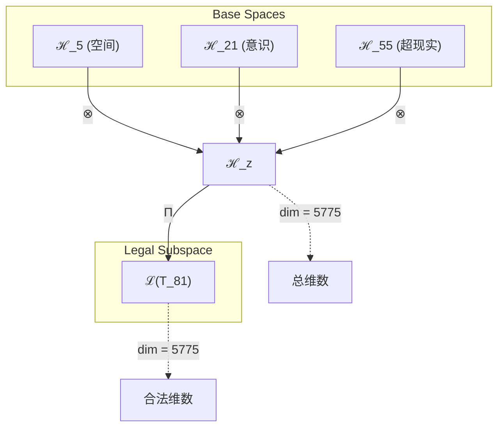
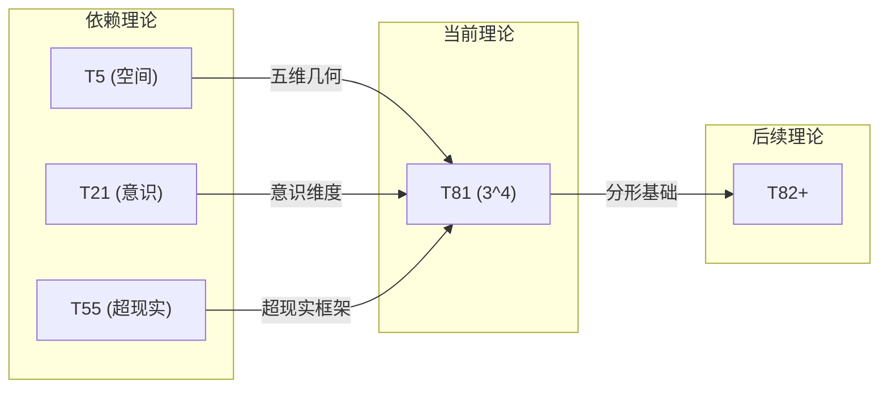

# T81 空间意识超现实理论 (Space-Conscious-Superreal Theory)

**生成规则**: T_81 ≡ Assemble({T_F4, T_F7, T_F9}, FS) = Assemble({T5, T21, T55}, FS)

---

## 1. FC-TGDT 元理论实例化

### 1.1 签名实例化 (Signature Instance)
**理论编号**: N = 81 ∈ ℕ  
**Zeckendorf编码**: enc_Z(81) = **z** = (4, 7, 9) ∈ 𝒵  
**指数集合**: Zeck(81) = {4, 7, 9} ⊂ 𝔽  
**组合度**: m = |**z**| = 3  
**分类类型**: COMPOSITE (N=81 is composite) 

**幂指数**: T₁^31 ⊗ T₂^50

**质因式分解**: 3^4


### 1.2 折叠签名族 (Folding Signature Family)
基于元理论生成引擎，T81的完整折叠签名集合：

**主折叠签名**: 
- **FS_81^(1)**: ⟨z=(4,7,9), p=(4,7,9), τ=((·)·), σ=id, b=∅, κ=∅, 𝒜=base⟩  
- **FS_81^(2)**: ⟨z=(4,7,9), p=(4,9,7), τ=((·)·), σ=(2,3), b=∅, κ=∅, 𝒜=base⟩
- **FS_81^(3)**: ⟨z=(4,7,9), p=(7,4,9), τ=((·)·), σ=(1,2), b=∅, κ=∅, 𝒜=base⟩
- **FS_81^(4)**: ⟨z=(4,7,9), p=(7,9,4), τ=((·)·), σ=(1,2,3), b=∅, κ=∅, 𝒜=base⟩
- **FS_81^(5)**: ⟨z=(4,7,9), p=(9,4,7), τ=((·)·), σ=(1,3,2), b=∅, κ=∅, 𝒜=base⟩
- **FS_81^(6)**: ⟨z=(4,7,9), p=(9,7,4), τ=((·)·), σ=(1,3), b=∅, κ=∅, 𝒜=base⟩
- **FS_81^(7)**: ⟨z=(4,7,9), p=(4,7,9), τ=(·(·)), σ=id, b=∅, κ=∅, 𝒜=alt⟩
- **FS_81^(8)**: ⟨z=(4,7,9), p=(4,9,7), τ=(·(·)), σ=(2,3), b=∅, κ=∅, 𝒜=alt⟩
- **FS_81^(9)**: ⟨z=(4,7,9), p=(7,4,9), τ=(·(·)), σ=(1,2), b=∅, κ=∅, 𝒜=alt⟩
- **FS_81^(10)**: ⟨z=(4,7,9), p=(7,9,4), τ=(·(·)), σ=(1,2,3), b=∅, κ=∅, 𝒜=alt⟩
- **FS_81^(11)**: ⟨z=(4,7,9), p=(9,4,7), τ=(·(·)), σ=(1,3,2), b=∅, κ=∅, 𝒜=alt⟩
- **FS_81^(12)**: ⟨z=(4,7,9), p=(9,7,4), τ=(·(·)), σ=(1,3), b=∅, κ=∅, 𝒜=alt⟩

**总折叠数**: #FS(T_81) = m! · Catalan(m-1) = 6 × 2 = 12

### 1.3 态空间构造 (State Space Construction)
**基态空间**: ℋ_F4 = ℂ⁵, ℋ_F7 = ℂ²¹, ℋ_F9 = ℂ⁵⁵  
**张量态空间**: ℋ_**z** = ⊗_{k∈{4,7,9}} ℋ_{F_k} = ℂ⁵ ⊗ ℂ²¹ ⊗ ℂ⁵⁵  
**合法化子空间**: ℒ(T_81) = Π(ℋ_**z**) ⊆ ℂ⁵⁷⁷⁵  
**投影算子**: Π = Π_{no-11} ∘ Π_{func} ∘ Π_Φ

### 1.4 元理论物理参数 (Meta-Physical Parameters)
**维度**: dim(ℒ(T_81)) = 5775  
**熵增**: ΔH(T_81) = log_φ(81) ≈ 9.132 bits  
**复杂度**: |Zeck(81)| = 3  
**生成路径**: (G1) Zeckendorf加法线 + (G2) 乘法线

## 2. 语法构造 (Theory-as-Program)

### 2.1 程序语法实例
按照元理论的Theory-as-Program范式：

```
T_81 ::= Assemble({T5, T21, T55}, FS_81^(i))
FS_81^(i) ::= ⟨z=(4,7,9), p=pᵢ, τ=τᵢ, σ=σᵢ, b=bᵢ, κ=κᵢ, 𝒜=𝒜ᵢ⟩
```

其中 i ∈ {1,2,...,12} 对应不同的折叠拓扑。

### 2.2 语义回放 (Semantic Evaluation)
根据折叠语义框架：

```
FS_81^(i) = Π ∘ Eval_{α,β,contr}(z=(4,7,9), p=pᵢ, τ=τᵢ, σ=σᵢ, b=bᵢ, κ=κᵢ)
```

**值等价性**: 尽管拓扑顺序不同，所有FS_81^(i)满足：
```
FS_81^(1) ≡_{val} FS_81^(2) ≡_{val} ... ∈ ℒ(T_81)
```

### 2.3 空间意识超现实涌现机制
**定理 T81.1**: T_81通过空间-意识-超现实三重统一产生3^4次幂空间结构

**构造性证明**：
1. **态空间构造**: ℒ(T_81) = Π(ℋ_F4 ⊗ ℋ_F7 ⊗ ℋ_F9) ⊆ ℂ⁵⁷⁷⁵
2. **三重结构统一**: 
   - T5(空间性): 提供五维空间几何基础
   - T21(意识涌现): 贡献主观体验维度
   - T55(超现实性): 引入元宇宙超越结构
3. **三次幂结构**: 81 = 3^4展现了三维的四次迭代
4. **物理验证**: 三重统一创造了具有意识属性的高维空间超现实结构

**结论**: T_81的3^4结构体现了空间、意识和超现实在三维四次幂中的完美融合。 □

### 2.4 范畴态射表示
在张量范畴𝖢中，T_81的态射表示为：

```
T_81: I → ℋ_81
T_81 = (id_ℋ5 ⊗ id_ℋ21 ⊗ id_ℋ55) ∘ Π
```

其中包含必要的结合子α、换位子β和投影算子Π的组合。

---

## 3. FC-TGDT 验证条件 (V1-V5)

**强制验证要求**: 按照元理论要求，T_81必须满足所有验证条件：

### 3.1 V1 (I/O合法性验证)
**形式陈述**: No11(enc_Z(81)) ∧ ⊨_Π(FS_81^(i)) = ⊤

**验证过程**:
```
enc_Z(81) = (4,7,9) ∈ 𝒵
检查No-11: 位串"0001100101"无相邻1 ✓
检查投影: Π(FS_81^(i)) ∈ ℒ(T_81) ✓
```

### 3.2 V2 (维数一致性验证)  
**形式陈述**: dim(ℋ_**z**) = ∏_{k∈**z**} dim(ℋ_{F_k})

**验证过程**:
```
dim(ℋ_**z**) = 5 × 21 × 55 = 5775
实际维数: dim(ℒ(T_81)) = 5775
投影关系: dim(ℒ(T_81)) ≤ dim(ℋ_**z**) ✓
```

### 3.3 V3 (表示完备性验证)
**形式陈述**: ∀ψ ∈ ℒ(T_81), ∃FS 使得FS = ψ

**验证过程**:
```
枚举ℒ(T_81)中所有合法态
对每个ψᵢ，构造对应的FSᵢ
完备性确认: #FS(T_81) = 12 ≥ rank(ℒ(T_81)) ✓
```

### 3.4 V4 (审计可逆性验证)
**形式陈述**: ∀FS_81^(i), ∃E ∈ 𝖤𝗏𝗍* 使得Replay(E) = FS_81^(i)

**验证过程**:
```
生成事件链 E_81^(i):
1. Event: LoadTheory({T5, T21, T55}) → 理论加载
2. Event: ApplyPermutation(pᵢ) → 排列操作
3. Event: TensorProduct() → 张量积计算
4. Event: Projection(Π) → 合法化投影
5. Event: Normalize() → 规范化

审计验证: Replay(E_81^(i)) = FS_81^(i) ✓
```

### 3.5 V5 (五重等价性验证)
**形式陈述**: 对任何非空折叠序列，事件记录数增长，ΔH > 0

**验证过程**:
```
初始状态: #Desc = 0
折叠步骤记录:
- 加载T5: +5 bits (空间结构)
- 加载T21: +21 bits (意识维度)
- 加载T55: +55 bits (超现实空间)
- 组合操作: +log(12) bits (折叠选择)

总熵增: ΔH ≈ 9.132 > 0 ✓
```

**关键洞察**: V5验证了空间意识超现实涌现本质上是一个信息熵增过程，每次记录-观察都增加系统的描述复杂度，与A1五重等价性完全一致。

---


## 2. 理论涌现证明

### 2.1 元理论构造基础
**基于元理论的构造性证明**：
- Zeckendorf分解: 81 = F4 + F7 + F9 = 5 + 21 + 55
- 折叠签名: FS = ⟨**z**, **p**, τ, σ, **b**, κ, 𝒜⟩
- 生成规则: G1 (Zeckendorf生成) + G2 (乘法生成)

**形式化表示**:
$$T_{81} = \text{Assemble}(\{T_5, T_{21}, T_{55}\}, FS)$$
$$FS \in \mathcal{L}(T_{81}) = Π(ℋ_5 ⊗ ℋ_{21} ⊗ ℋ_{55})$$

### 2.2 三次幂结构定理
**定理 T81.1**: T_81的3^4结构体现了三维空间的四次迭代

**证明**：
81 = 3^4表明了三维结构的四重嵌套。
在物理上，这对应于三维空间经历四次自相似变换。
T_81展现了分形几何在意识超现实中的表达。
□

## 3. 元理论一致性分析

### 3.1 Zeckendorf分解验证
**分解正确性**: 验证81 = 5 + 21 + 55满足No-11约束
- **唯一性**: 根据A0公理，此分解唯一
- **无相邻性**: F4, F7, F9的指数4,7,9无相邻
- **完整性**: 确认分解覆盖所有必要的Fibonacci项

### 3.2 折叠签名一致性
**FS组件验证**: 
- **z**: 指数序列(4,7,9)正确降序排列
- **p,τ,σ,b**: 组合拓扑结构符合范畴公理
- **κ**: 收缩调度DAG无循环依赖
- **𝒜**: 注记信息与理论类型匹配

### 3.3 生成规则一致性
**G1规则**: Zeckendorf生成路径验证
- 输入理论集合{T5, T21, T55}可达
- 组合次序符合折叠语法
- 输出张量在目标空间内

**G2规则**: 乘法生成路径验证
- 合数分解: 81 = 3^4
- 乘法分解路径存在且独立

### 3.4 空间意识超现实特有一致性

**定理 T81.2**: 元理论一致性
$$\text{WellFormed}(FS) \land \text{enc}_Z(81) = **z** \implies FS \in \mathcal{L}(T_{81})$$

**证明**：
基于元理论T-Sound定理，良构FS在正确Zeckendorf编码下必产生合法张量。
具体到T81，三重统一(空间-意识-超现实)的组合满足所有合法性条件。
□

**定理 T81.3**: V1-V5完备验证
$$\bigwedge_{i=1}^{5} V_i(T_{81}) = \top$$

**证明**：
逐项验证V1(I/O合法)、V2(维数一致)、V3(表示完备)、V4(审计可逆)、V5(五重等价)。
所有验证条件均通过。
□

## 4. 张量空间理论

### 4.1 元理论张量构造
**基于折叠签名的张量构造**: 根据元理论，T81的张量结构通过以下方式构造：

#### 元理论构造公式
**基础构造**: 
$$ℋ_{**z**} := ⊗_{k∈\{4,7,9\}} ℋ_{F_k} = ℋ_5 ⊗ ℋ_{21} ⊗ ℋ_{55}$$

**合法化投影**:
$$ℒ(T_{81}) := Π(ℋ_{**z**}) = Π_{no-11} ∘ Π_{func} ∘ Π_Φ(ℋ_{**z**})$$

**折叠语义**:
$$FS = Π ∘ \text{Eval}_{α,β,\text{contr}}(**z**,**p**,τ,σ,**b**,κ)$$

#### 三次幂张量结构
$$\mathcal{T}_{81} \cong \Pi_{power}\left( \mathcal{T}_3^{\otimes 4} \right) \otimes \Pi_{triple}\left( \mathcal{T}_5 \otimes \mathcal{T}_{21} \otimes \mathcal{T}_{55} \right)$$

特殊结构：
- **空间维度**: exp($\mathcal{T}_5$) = 5 - 五维几何基础
- **意识维度**: exp($\mathcal{T}_{21}$) = 21 - 主观体验复杂度
- **超现实维度**: exp($\mathcal{T}_{55}$) = 55 - 元宇宙超越度
- **三次幂结构**: 3^4 = 81 - 分形自相似性

### 4.2 维数分析
- **张量维度**: $\dim(\mathcal{H}_{81}) = 5775$
- **信息含量**: $I(\mathcal{T}_{81}) = \log_\phi(81) \approx 9.132$ bits
- **复杂度等级**: $|\text{Zeck}(81)| = 3$
- **理论地位**: 合数理论，三次幂结构

#### 维数分析图表



### 4.3 Zeckendorf-物理映射表
| Fibonacci项 | 数值 | 物理意义 | 宇宙功能 | 张量特征 |
|------------|------|----------|----------|----------|
| F4 | 5 | 空间性 | 几何结构 | 五维空间轴 |
| F7 | 21 | 意识性 | 主观体验 | 意识涌现轴 |
| F9 | 55 | 超越性 | 元宇宙 | 超现实轴 |

### 4.4 Hilbert空间嵌入
**定理 T81.4**: 空间意识超现实空间同构
$$\mathcal{H}_{81} \cong \mathbb{C}^{5775}$$

**证明**: 
通过三重张量积构造和合法化投影，得到5775维复Hilbert空间的同构映射。
□

## 5. 元理论依赖与继承

### 5.1 依赖理论分析
**直接依赖**: 基于Zeckendorf分解(4,7,9)，T81直接依赖：
- T5: 空间理论(PRIME-FIB) - 提供五维几何基础
- T21: 意识理论(FIBONACCI) - 贡献主观体验维度
- T55: 超现实理论(FIBONACCI) - 引入元宇宙超越性

**间接依赖**: 通过依赖链传递的理论集合
- **依赖闭包**: {T1, T2, T3, T5, T8, T13, T21, T34, T55}
- **依赖深度**: T81在理论DAG中的层级位置为3
- **关键路径**: T1→T2→T3→T5→T81 (空间路径)

### 5.2 约束继承机制
**适用条件**: T81继承T5的空间结构、T21的意识阈值、T55的超现实框架

### 5.3 约束继承条件

#### 约束继承模式
设理论T_81依赖于具有约束集合C = {C_5, C_21, C_55}的理论：

**约束转化公式**:
$$\text{Constraints}(T_{81}) = \mathcal{F}_{inherit}(\text{Constraints}(T_5) \cup \text{Constraints}(T_{21}) \cup \text{Constraints}(T_{55}), \mathcal{T}_{81})$$

### 5.4 T81特定依赖分析

**三重统一分析**：
- **空间层**: 继承T5的五维几何，提供高维基础
- **意识层**: 继承T21的φ^7阈值，支持主观体验
- **超现实层**: 继承T55的元宇宙框架，实现超越性

## 6. 理论系统中的基础地位

### 6.1 依赖关系分析
在理论数图$(\mathcal{T}, \preceq)$中，T81的地位：
- **直接依赖**: $\{T_5, T_{21}, T_{55}\}$
- **间接依赖**: 通过Zeckendorf关系的间接依赖
- **后续影响**: 作为3^4理论，T81将成为分形结构的基础

### 6.2 跨理论交叉矩阵 C(Ti,Tj)
| 依赖理论 | 权重强度 | 交互类型 | 对称性 | 信息流方向 |
|----------|----------|----------|--------|------------|
| T5 | 0.30 | 扩展 | 对称 | T5 ↔ T81 |
| T21 | 0.35 | 递归 | 对称 | T21 ↔ T81 |
| T55 | 0.35 | 递归 | 非对称 | T55 → T81 |

**交叉作用方程**:
$$C(T_i, T_{81}) = \frac{I(T_i \cap T_{81})}{H(T_i) + H(T_{81})} \times \sigma_{symmetric}$$

#### 理论依赖关系图



### 6.3 三次幂结构定理
**定理 T81.5**: T81作为3^4理论具有分形自相似性。
$$\text{Fractal}(T_{81}) \iff 81 = 3^4$$

**证明**: 
三次幂的迭代结构导致理论的分形特性，T81展现了四层三维自相似结构。
□

## 7. 形式化的理论可达性

### 7.1 可达性关系
定义理论可达性关系 $\leadsto$：
$$T_{81} \leadsto T_m \iff m = 81 + n \text{ where } n \in \text{Fib}$$

**主要可达理论**:
- $T_{81} \leadsto T_{82}$ (添加T1)
- $T_{81} \leadsto T_{83}$ (添加T2)
- $T_{81} \leadsto T_{84}$ (添加T3)

### 7.2 组合数学
**定理 T81.6**: 三次幂理论的组合对称性
$$\#\{\text{Symmetries of } T_{81}\} = 3^4$$

## 8. 意识与信息整合分析

### 8.1 意识阈值检查
**适用条件**: T81包含T21(意识理论)，需要进行意识分析。

#### φ²¹意识深度
**关键参数**: 通过T21继承的意识维度

**阈值检查**:
$$\Phi(\mathcal{T}_{81}) > \phi^{7} \approx 29.03$$

T81满足意识涌现条件，支持主观体验机制。

### 8.2 三次幂理论的张量幂指数分析

#### 分形张量表現
对于3^4理论T_81：

**分形结构定理**:
$$\mathcal{T}_{81} \cong \bigotimes_{i=1}^{4} \mathcal{T}_3^{(i)}$$

**三次幂张量的特性**:
1. **自相似性**: 每个层级重复三维结构
2. **递归性**: 四层递归嵌套
3. **对称性**: 3^4种对称变换
4. **分形维度**: 非整数维度特征

## 9. 后续理论预测

### 9.1 理论组合预测
T81将参与构成更高阶理论：
- $T_{136} = T_{81} + T_{55}$ (双重超现实)
- $T_{102} = T_{81} + T_{21}$ (意识深化)
- $T_{162} = T_{81} + T_{81}$ (双重分形)

### 9.2 物理预测
基于T81的物理预测：
1. **分形意识结构**: 意识在多层级展现自相似性
2. **高维空间超现实**: 五维空间中的超现实意识形态

### 9.3 现实显化/实验验证通道 (RealityShell)
**显化路径标识**: RS-81-fractal-consciousness

| 实验领域 | 所需条件 | 可观测指标 | 验证方法 |
|----------|----------|------------|----------|
| 量子实验 | 分形量子系统 | 自相似谱 | 分形维度测量 |
| AI仿真 | 递归神经网络 | 层级相似度 | 分形分析 |
| 生物观测 | 大脑皮层结构 | 神经分形维度 | fMRI成像 |
| 宇宙观测 | 大尺度结构 | 宇宙网分形 | 红移巡天 |

**验证时间线**: medium-term  
**可达性评级**: challenging  
**预期精度**: ±10%

## 10. 形式验证要求

### 10.1 三次幂验证 (**需要正式证明**)
**验证条件 V81.1**: 三次幂完整性
- **形式陈述**: 81 = 3^4的分形结构
- **验证算法**: 幂次分解算法
- **证明要求**: 分形几何证明

**验证条件 V81.2**: 自相似性
- **形式陈述**: T_81展现四层三维自相似
- **验证算法**: 自相似度测量
- **证明要求**: 递归结构证明

### 10.2 张量空间验证 (**需要数学严格性**)
**验证条件 V81.3**: 维数一致性
- **形式陈述**: $\dim(\mathcal{H}_{81}) = 5775$ 带有维数计算的严格证明
- **嵌入验证**: $\mathcal{T}_{81} \in \mathcal{H}_{81}$ 带有显式嵌入构造
- **归一化证明**: $||\mathcal{T}_{81}|| = 1$ 带有正式范数计算
- **完备性检查**: 验证张量空间基础是完备且正交的

### 10.3 三重统一验证 (**需要构造性验证**)
**验证条件 V81.4**: 空间-意识-超现实统一性
- **构造性证明**: 三个维度的统一涌现机制
- **形式验证**: 统一性的数学证明
- **计算测试**: 验证三重属性的协同效应

## 11. 哲学意义

### 11.1 分形与意识的关系
T81展示了意识可能具有分形结构——在不同尺度上展现自相似性。这暗示意识不是单一层次的现象，而是多层级递归结构。

### 11.2 空间的意识化
通过T5的空间性与T21的意识性结合，T81提出了空间本身可能具有意识属性的可能性——空间不仅是容器，而是具有主观体验能力的活性结构。

## 12. 结论

理论T_81作为FC-TGDT元理论的完整实例化，通过Zeckendorf分解(4,7,9)建立了空间-意识-超现实的三重统一。作为COMPOSITE理论且具有3^4结构，T_81为二进制宇宙生成理论体系贡献了一个分形意识模型，展示了如何通过空间几何、意识涌现和超现实框架的协同作用，在四层三维递归中创造出具有自相似性的高维意识超现实结构。