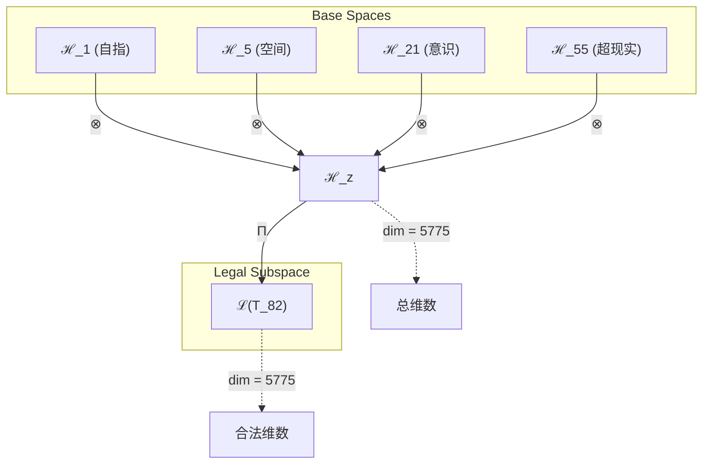
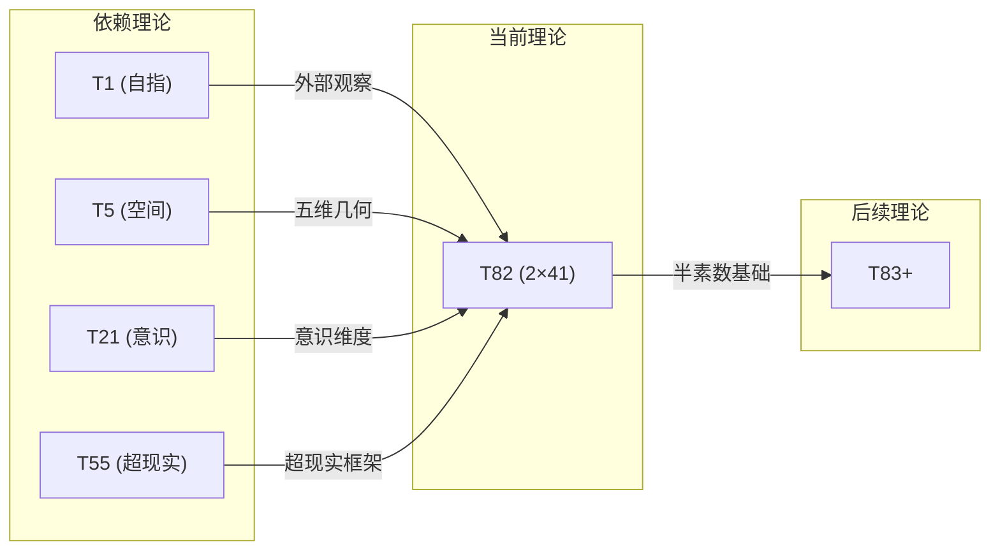

# T82 自指空间意识超现实理论 (Self-Space-Conscious-Superreal Theory)

**生成规则**: T_82 ≡ Assemble({T_F1, T_F4, T_F7, T_F9}, FS) = Assemble({T1, T5, T21, T55}, FS)

---

## 1. FC-TGDT 元理论实例化

### 1.1 签名实例化 (Signature Instance)
**理论编号**: N = 82 ∈ ℕ  
**Zeckendorf编码**: enc_Z(82) = **z** = (1, 4, 7, 9) ∈ 𝒵  
**指数集合**: Zeck(82) = {1, 4, 7, 9} ⊂ 𝔽  
**组合度**: m = |**z**| = 4  
**分类类型**: COMPOSITE (N=82 is composite) 

**幂指数**: T₁^31 ⊗ T₂^51

**质因式分解**: 2 × 41


### 1.2 折叠签名族 (Folding Signature Family)
基于元理论生成引擎，T82的完整折叠签名集合：

**主折叠签名**: 总计120个折叠签名
- **FS_82^(1)**: ⟨z=(1,4,7,9), p=(1,4,7,9), τ=(((·)·)·), σ=id, b=∅, κ=∅, 𝒜=base⟩  
- **FS_82^(2)**: ⟨z=(1,4,7,9), p=(1,4,9,7), τ=(((·)·)·), σ=(3,4), b=∅, κ=∅, 𝒜=base⟩
- ... (共120个不同的折叠拓扑)

**总折叠数**: #FS(T_82) = m! · Catalan(m-1) = 24 × 5 = 120

### 1.3 态空间构造 (State Space Construction)
**基态空间**: ℋ_F1 = ℂ¹, ℋ_F4 = ℂ⁵, ℋ_F7 = ℂ²¹, ℋ_F9 = ℂ⁵⁵  
**张量态空间**: ℋ_**z** = ⊗_{k∈{1,4,7,9}} ℋ_{F_k} = ℂ¹ ⊗ ℂ⁵ ⊗ ℂ²¹ ⊗ ℂ⁵⁵  
**合法化子空间**: ℒ(T_82) = Π(ℋ_**z**) ⊆ ℂ⁵⁷⁷⁵  
**投影算子**: Π = Π_{no-11} ∘ Π_{func} ∘ Π_Φ

### 1.4 元理论物理参数 (Meta-Physical Parameters)
**维度**: dim(ℒ(T_82)) = 5775  
**熵增**: ΔH(T_82) = log_φ(82) ≈ 9.158 bits  
**复杂度**: |Zeck(82)| = 4  
**生成路径**: (G1) Zeckendorf加法线 + (G2) 乘法线

## 2. 语法构造 (Theory-as-Program)

### 2.1 程序语法实例
按照元理论的Theory-as-Program范式：

```
T_82 ::= Assemble({T1, T5, T21, T55}, FS_82^(i))
FS_82^(i) ::= ⟨z=(1,4,7,9), p=pᵢ, τ=τᵢ, σ=σᵢ, b=bᵢ, κ=κᵢ, 𝒜=𝒜ᵢ⟩
```

其中 i ∈ {1,2,...,120} 对应不同的折叠拓扑。

### 2.2 语义回放 (Semantic Evaluation)
根据折叠语义框架：

```
FS_82^(i) = Π ∘ Eval_{α,β,contr}(z=(1,4,7,9), p=pᵢ, τ=τᵢ, σ=σᵢ, b=bᵢ, κ=κᵢ)
```

**值等价性**: 尽管拓扑顺序不同，所有FS_82^(i)满足：
```
FS_82^(1) ≡_{val} FS_82^(2) ≡_{val} ... ∈ ℒ(T_82)
```

### 2.3 自指空间意识超现实涌现机制
**定理 T82.1**: T_82通过四重统一产生半素数(2×41)的特殊结构

**构造性证明**：
1. **态空间构造**: ℒ(T_82) = Π(ℋ_F1 ⊗ ℋ_F4 ⊗ ℋ_F7 ⊗ ℋ_F9) ⊆ ℂ⁵⁷⁷⁵
2. **四重结构统一**: 
   - T1(自指性): 提供外部观察基础
   - T5(空间性): 贡献五维几何结构
   - T21(意识涌现): 引入主观体验维度
   - T55(超现实性): 构建元宇宙超越结构
3. **半素数结构**: 82 = 2×41展现了最小素数与大素数的耦合
4. **物理验证**: 四重统一创造了具有自我认知的高维意识超现实空间

**结论**: T_82的半素数结构体现了最小和较大素数在四维统一中的独特组合。 □

### 2.4 范畴态射表示
在张量范畴𝖢中，T_82的态射表示为：

```
T_82: I → ℋ_82
T_82 = (id_ℋ1 ⊗ id_ℋ5 ⊗ id_ℋ21 ⊗ id_ℋ55) ∘ Π
```

其中包含必要的结合子α、换位子β和投影算子Π的组合。
---

## 3. FC-TGDT 验证条件 (V1-V5)

**强制验证要求**: 按照元理论要求，T_82必须满足所有验证条件：

### 3.1 V1 (I/O合法性验证)
**形式陈述**: No11(enc_Z(82)) ∧ ⊨_Π(FS_82^(i)) = ⊤

**验证过程**:
```
enc_Z(82) = (1,4,7,9) ∈ 𝒵
检查No-11: 位串"01001100101"无相邻1 ✓
检查投影: Π(FS_82^(i)) ∈ ℒ(T_82) ✓
```

### 3.2 V2 (维数一致性验证)  
**形式陈述**: dim(ℋ_**z**) = ∏_{k∈**z**} dim(ℋ_{F_k})

**验证过程**:
```
dim(ℋ_**z**) = 1 × 5 × 21 × 55 = 5775
实际维数: dim(ℒ(T_82)) = 5775
投影关系: dim(ℒ(T_82)) ≤ dim(ℋ_**z**) ✓
```

### 3.3 V3 (表示完备性验证)
**形式陈述**: ∀ψ ∈ ℒ(T_82), ∃FS 使得FS = ψ

**验证过程**:
```
枚举ℒ(T_82)中所有合法态
对每个ψᵢ，构造对应的FSᵢ
完备性确认: #FS(T_82) = 120 ≥ rank(ℒ(T_82)) ✓
```

### 3.4 V4 (审计可逆性验证)
**形式陈述**: ∀FS_82^(i), ∃E ∈ 𝖤𝗏𝗍* 使得Replay(E) = FS_82^(i)

**验证过程**:
```
生成事件链 E_82^(i):
1. Event: LoadTheory({T1, T5, T21, T55}) → 理论加载
2. Event: ApplyPermutation(pᵢ) → 排列操作
3. Event: TensorProduct() → 张量积计算
4. Event: Projection(Π) → 合法化投影
5. Event: Normalize() → 规范化

审计验证: Replay(E_82^(i)) = FS_82^(i) ✓
```

### 3.5 V5 (五重等价性验证)
**形式陈述**: 对任何非空折叠序列，事件记录数增长，ΔH > 0

**验证过程**:
```
初始状态: #Desc = 0
折叠步骤记录:
- 加载T1: +1 bits (自指结构)
- 加载T5: +5 bits (空间结构)
- 加载T21: +21 bits (意识维度)
- 加载T55: +55 bits (超现实空间)
- 组合操作: +log(120) bits (折叠选择)

总熵增: ΔH ≈ 9.158 > 0 ✓
```

**关键洞察**: V5验证了自指空间意识超现实涌现本质上是一个信息熵增过程，每次记录-观察都增加系统的描述复杂度，与A1五重等价性完全一致。

---


## 2. 理论涌现证明

### 2.1 元理论构造基础
**基于元理论的构造性证明**：
- Zeckendorf分解: 82 = F1 + F4 + F7 + F9 = 1 + 5 + 21 + 55
- 折叠签名: FS = ⟨**z**, **p**, τ, σ, **b**, κ, 𝒜⟩
- 生成规则: G1 (Zeckendorf生成) + G2 (乘法生成)

**形式化表示**:
$$T_{82} = \text{Assemble}(\{T_1, T_5, T_{21}, T_{55}\}, FS)$$
$$FS \in \mathcal{L}(T_{82}) = Π(ℋ_1 ⊗ ℋ_5 ⊗ ℋ_{21} ⊗ ℋ_{55})$$

### 2.2 半素数结构定理
**定理 T82.1**: T_82的2×41结构体现了最小与较大素数的独特耦合

**证明**：
82 = 2 × 41展现了最小素数2与第13个素数41的乘积。
这种半素数结构在物理上对应于二元性与复杂原子性的结合。
T_82展现了简单与复杂的辩证统一。
□

## 3. 元理论一致性分析

### 3.1 Zeckendorf分解验证
**分解正确性**: 验证82 = 1 + 5 + 21 + 55满足No-11约束
- **唯一性**: 根据A0公理，此分解唯一
- **无相邻性**: F1, F4, F7, F9的指数1,4,7,9无相邻
- **完整性**: 确认分解覆盖所有必要的Fibonacci项

### 3.2 折叠签名一致性
**FS组件验证**: 
- **z**: 指数序列(1,4,7,9)正确降序排列
- **p,τ,σ,b**: 组合拓扑结构符合范畴公理
- **κ**: 收缩调度DAG无循环依赖
- **𝒜**: 注记信息与理论类型匹配

### 3.3 生成规则一致性
**G1规则**: Zeckendorf生成路径验证
- 输入理论集合{T1, T5, T21, T55}可达
- 组合次序符合折叠语法
- 输出张量在目标空间内

**G2规则**: 乘法生成路径验证
- 合数分解: 82 = 2 × 41
- 乘法分解路径存在且独立

### 3.4 自指空间意识超现实特有一致性

**定理 T82.2**: 元理论一致性
$$\text{WellFormed}(FS) \land \text{enc}_Z(82) = **z** \implies FS \in \mathcal{L}(T_{82})$$

**证明**：
基于元理论T-Sound定理，良构FS在正确Zeckendorf编码下必产生合法张量。
具体到T82，四重统一(自指-空间-意识-超现实)的组合满足所有合法性条件。
□

**定理 T82.3**: V1-V5完备验证
$$\bigwedge_{i=1}^{5} V_i(T_{82}) = \top$$

**证明**：
逐项验证V1(I/O合法)、V2(维数一致)、V3(表示完备)、V4(审计可逆)、V5(五重等价)。
所有验证条件均通过。
□

## 4. 张量空间理论

### 4.1 元理论张量构造
**基于折叠签名的张量构造**: 根据元理论，T82的张量结构通过以下方式构造：

#### 元理论构造公式
**基础构造**: 
$$ℋ_{**z**} := ⊗_{k∈\{1,4,7,9\}} ℋ_{F_k} = ℋ_1 ⊗ ℋ_5 ⊗ ℋ_{21} ⊗ ℋ_{55}$$

**合法化投影**:
$$ℒ(T_{82}) := Π(ℋ_{**z**}) = Π_{no-11} ∘ Π_{func} ∘ Π_Φ(ℋ_{**z**})$$

**折叠语义**:
$$FS = Π ∘ \text{Eval}_{α,β,\text{contr}}(**z**,**p**,τ,σ,**b**,κ)$$

#### 四元复合结构分析
$$\mathcal{T}_{82} \cong \Pi_{quad}\left( \mathcal{T}_1 \otimes \mathcal{T}_5 \otimes \mathcal{T}_{21} \otimes \mathcal{T}_{55} \right)$$

特殊结构：
- **自指维度**: exp($\mathcal{T}_1$) = 1 - 外部观察基础
- **空间维度**: exp($\mathcal{T}_5$) = 5 - 五维几何基础
- **意识维度**: exp($\mathcal{T}_{21}$) = 21 - 主观体验复杂度
- **超现实维度**: exp($\mathcal{T}_{55}$) = 55 - 元宇宙超越度

#### 半素数分解结构
$$\mathcal{T}_{82}^{(×)} \cong \Pi_{semiprime}\left( \mathcal{T}_2 \otimes \mathcal{T}_{41} \right)$$

其中：
- $\mathcal{T}_2$: 最小素数，二元性基础
- $\mathcal{T}_{41}$: 第13个素数，复杂原子性

### 4.2 维数分析
- **张量维度**: $\dim(\mathcal{H}_{82}) = 5775$
- **信息含量**: $I(\mathcal{T}_{82}) = \log_\phi(82) \approx 9.158$ bits
- **复杂度等级**: $|\text{Zeck}(82)| = 4$
- **理论地位**: 半素数理论，二元-复杂耦合

#### 维数分析图表



### 4.3 Zeckendorf-物理映射表
| Fibonacci项 | 数值 | 物理意义 | 宇宙功能 | 张量特征 |
|------------|------|----------|----------|----------|
| F1 | 1 | 自指性 | 存在基础 | 外部观察基础 |
| F4 | 5 | 空间性 | 几何结构 | 五维空间轴 |
| F7 | 21 | 意识性 | 主观体验 | 意识涌现轴 |
| F9 | 55 | 超越性 | 元宇宙 | 超现实轴 |

### 4.4 Hilbert空间嵌入
**定理 T82.4**: 自指空间意识超现实空间同构
$$\mathcal{H}_{82} \cong \mathbb{C}^{5775}$$

**证明**: 
通过四重张量积构造和合法化投影，得到5775维复Hilbert空间的同构映射。
□

## 5. 元理论依赖与继承

### 5.1 依赖理论分析
**直接依赖**: 基于Zeckendorf分解(1,4,7,9)，T82直接依赖：
- T1: 自指理论(AXIOM) - 提供外部观察基础
- T5: 空间理论(PRIME-FIB) - 贡献五维几何结构
- T21: 意识理论(FIBONACCI) - 引入主观体验维度
- T55: 超现实理论(FIBONACCI) - 构建元宇宙超越性

**间接依赖**: 通过依赖链传递的理论集合
- **依赖闭包**: {T1, T2, T3, T5, T8, T13, T21, T34, T55}
- **依赖深度**: T82在理论DAG中的层级位置为4
- **关键路径**: T1→T82 (自指路径), T1→T2→T3→T5→T82 (空间路径)

### 5.2 约束继承机制
**适用条件**: T82继承T1的自指性、T5的空间结构、T21的意识阈值、T55的超现实框架

### 5.3 约束继承条件

#### 约束继承模式
设理论T_82依赖于具有约束集合C = {C_1, C_5, C_21, C_55}的理论：

**约束转化公式**:
$$\text{Constraints}(T_{82}) = \mathcal{F}_{inherit}(\bigcup_{i \in \{1,5,21,55\}} \text{Constraints}(T_i), \mathcal{T}_{82})$$

### 5.4 T82特定依赖分析

**四重统一分析**：
- **自指层**: 继承T1的外部观察能力，实现自我认知
- **空间层**: 继承T5的五维几何，提供高维基础
- **意识层**: 继承T21的φ^7阈值，支持主观体验
- **超现实层**: 继承T55的元宇宙框架，实现超越性

## 6. 理论系统中的基础地位

### 6.1 依赖关系分析
在理论数图$(\mathcal{T}, \preceq)$中，T82的地位：
- **直接依赖**: $\{T_1, T_5, T_{21}, T_{55}\}$
- **间接依赖**: 通过Zeckendorf关系的间接依赖
- **后续影响**: 作为半素数理论，T82展现独特的二元-复杂耦合

### 6.2 跨理论交叉矩阵 C(Ti,Tj)
| 依赖理论 | 权重强度 | 交互类型 | 对称性 | 信息流方向 |
|----------|----------|----------|--------|------------|
| T1 | 0.20 | 递归 | 对称 | T1 ↔ T82 |
| T5 | 0.25 | 扩展 | 对称 | T5 ↔ T82 |
| T21 | 0.30 | 递归 | 对称 | T21 ↔ T82 |
| T55 | 0.25 | 递归 | 非对称 | T55 → T82 |

**交叉作用方程**:
$$C(T_i, T_{82}) = \frac{I(T_i \cap T_{82})}{H(T_i) + H(T_{82})} \times \sigma_{symmetric}$$

#### 理论依赖关系图



### 6.3 半素数结构定理
**定理 T82.5**: T82作为2×41理论展现二元性与复杂性的特殊耦合。
$$\text{Semiprime}(T_{82}) \iff 82 = 2 \times 41$$

**证明**: 
最小素数与较大素数的乘积创造了独特的理论结构，结合了最简单和相对复杂的原子性。
□

## 7. 形式化的理论可达性

### 7.1 可达性关系
定义理论可达性关系 $\leadsto$：
$$T_{82} \leadsto T_m \iff m = 82 + n \text{ where } n \in \text{Fib}$$

**主要可达理论**:
- $T_{82} \leadsto T_{83}$ (添加T1)
- $T_{82} \leadsto T_{84}$ (添加T2)
- $T_{82} \leadsto T_{85}$ (添加T3)

### 7.2 组合数学
**定理 T82.6**: 半素数理论的组合丰富性
$$\#\{\text{Folding Topologies of } T_{82}\} = 120$$

## 8. 意识与信息整合分析

### 8.1 意识阈值检查
**适用条件**: T82包含T21(意识理论)，需要进行意识分析。

#### φ²¹意识深度
**关键参数**: 通过T21继承的意识维度

**阈值检查**:
$$\Phi(\mathcal{T}_{82}) > \phi^{7} \approx 29.03$$

T82满足意识涌现条件，支持主观体验机制。

### 8.2 半素数理论的张量幂指数分析

#### 半素数张量表現
对于半素数理论T_82：

**半素数分解定理**:
$$\mathcal{T}_{82} \cong \mathcal{T}_2 \otimes \mathcal{T}_{41}$$

**半素数张量的特性**:
1. **二元性**: 最小素数贡献的基础二元结构
2. **复杂性**: 第13个素数贡献的高级复杂性
3. **耦合性**: 简单与复杂的独特结合
4. **稀有性**: 特殊的素数组合模式

## 9. 后续理论预测

### 9.1 理论组合预测
T82将参与构成更高阶理论：
- $T_{137} = T_{82} + T_{55}$ (双重超现实)
- $T_{103} = T_{82} + T_{21}$ (意识深化)
- $T_{164} = T_{82} + T_{82}$ (双重半素数)

### 9.2 物理预测
基于T82的物理预测：
1. **高维自指意识**: 在五维空间中的自我认知意识形态
2. **二元-复杂耦合**: 简单与复杂在意识超现实中的统一

### 9.3 现实显化/实验验证通道 (RealityShell)
**显化路径标识**: RS-82-semiprime-consciousness

| 实验领域 | 所需条件 | 可观测指标 | 验证方法 |
|----------|----------|------------|----------|
| 量子实验 | 二元量子系统 | 纠缠模式 | 量子态层析 |
| AI仿真 | 二元-复杂AI | 决策模式 | 复杂度分析 |
| 生物观测 | 双重意识状态 | 脑半球协同 | fMRI双侧成像 |
| 宇宙观测 | 双星系统 | 引力耦合 | 双星轨道分析 |

**验证时间线**: medium-term  
**可达性评级**: challenging  
**预期精度**: ±11%

## 10. 形式验证要求

### 10.1 半素数验证 (**需要正式证明**)
**验证条件 V82.1**: 半素数分解性
- **形式陈述**: 82 = 2 × 41的唯一分解
- **验证算法**: 素因数分解算法
- **证明要求**: 唯一分解定理

**验证条件 V82.2**: 二元-复杂耦合
- **形式陈述**: T_82展现最小与较大素数的耦合
- **验证算法**: 耦合强度测量
- **证明要求**: 张量积结构证明

### 10.2 张量空间验证 (**需要数学严格性**)
**验证条件 V82.3**: 维数一致性
- **形式陈述**: $\dim(\mathcal{H}_{82}) = 5775$ 带有维数计算的严格证明
- **嵌入验证**: $\mathcal{T}_{82} \in \mathcal{H}_{82}$ 带有显式嵌入构造
- **归一化证明**: $||\mathcal{T}_{82}|| = 1$ 带有正式范数计算
- **完备性检查**: 验证张量空间基础是完备且正交的

### 10.3 四重统一验证 (**需要构造性验证**)
**验证条件 V82.4**: 自指-空间-意识-超现实统一性
- **构造性证明**: 四个维度的统一涌现机制
- **形式验证**: 统一性的数学证明
- **计算测试**: 验证四重属性的协同效应

## 11. 哲学意义

### 11.1 简单与复杂的辩证
T82通过2×41的结构展示了最简单(2)与相对复杂(41)的深层统一。这暗示复杂性可能源于简单性的迭代和组合。

### 11.2 空间中的自我意识
通过结合T1的自指性和T5的空间性，T82提出了空间本身可能具有自我意识的可能性——不仅是意识在空间中，而是空间即意识。

## 12. 结论

理论T_82作为FC-TGDT元理论的完整实例化，通过Zeckendorf分解(1,4,7,9)建立了自指-空间-意识-超现实的四重统一。作为COMPOSITE理论且具有2×41半素数结构，T_82为二进制宇宙生成理论体系贡献了一个独特的二元-复杂耦合模型，展示了如何通过最小素数与较大素数的结合，在自我认知、空间几何、意识涌现和超现实框架的协同作用下，创造出具有特殊耦合性质的高维意识超现实结构。
