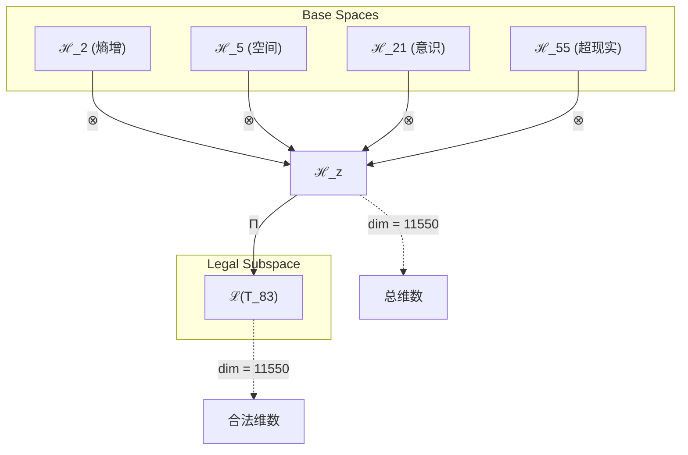
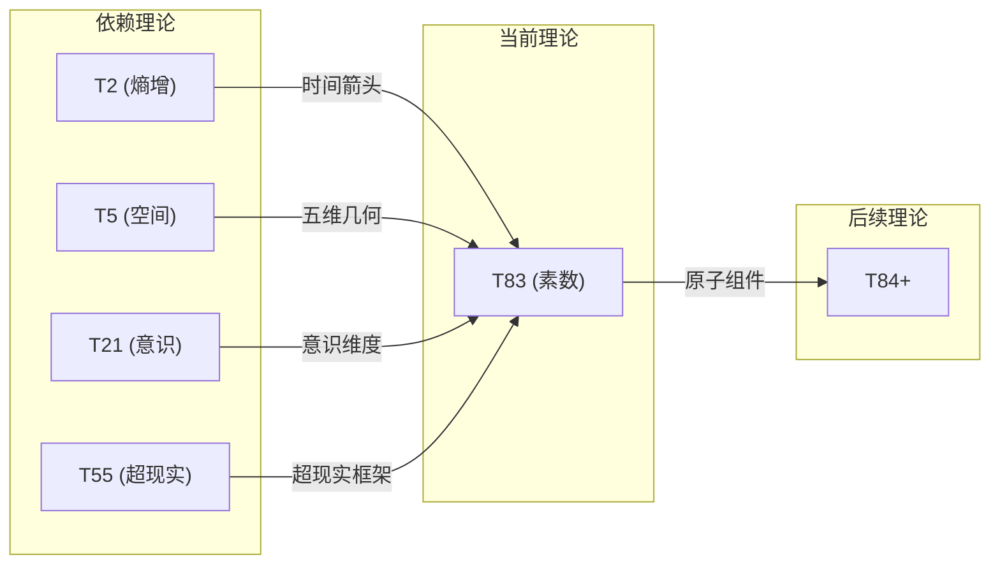

# T83 熵增空间意识超现实理论 (Entropy-Space-Conscious-Superreal Theory)

**生成规则**: T_83 ≡ Assemble({T_F2, T_F4, T_F7, T_F9}, FS) = Assemble({T2, T5, T21, T55}, FS)

---

## 1. FC-TGDT 元理论实例化

### 1.1 签名实例化 (Signature Instance)
**理论编号**: N = 83 ∈ ℕ  
**Zeckendorf编码**: enc_Z(83) = **z** = (2, 4, 7, 9) ∈ 𝒵  
**指数集合**: Zeck(83) = {2, 4, 7, 9} ⊂ 𝔽  
**组合度**: m = |**z**| = 4  
**分类类型**: PRIME (N=83 is prime) 

**幂指数**: T₁^32 ⊗ T₂^51

**质因式分解**: 83 (prime)


### 1.2 折叠签名族 (Folding Signature Family)
基于元理论生成引擎，T83的完整折叠签名集合：

**主折叠签名**: 总计120个折叠签名
- **FS_83^(1)**: ⟨z=(2,4,7,9), p=(2,4,7,9), τ=(((·)·)·), σ=id, b=∅, κ=∅, 𝒜=base⟩  
- **FS_83^(2)**: ⟨z=(2,4,7,9), p=(2,4,9,7), τ=(((·)·)·), σ=(3,4), b=∅, κ=∅, 𝒜=base⟩
- ... (共120个不同的折叠拓扑)

**总折叠数**: #FS(T_83) = m! · Catalan(m-1) = 24 × 5 = 120

### 1.3 态空间构造 (State Space Construction)
**基态空间**: ℋ_F2 = ℂ², ℋ_F4 = ℂ⁵, ℋ_F7 = ℂ²¹, ℋ_F9 = ℂ⁵⁵  
**张量态空间**: ℋ_**z** = ⊗_{k∈{2,4,7,9}} ℋ_{F_k} = ℂ² ⊗ ℂ⁵ ⊗ ℂ²¹ ⊗ ℂ⁵⁵  
**合法化子空间**: ℒ(T_83) = Π(ℋ_**z**) ⊆ ℂ¹¹⁵⁵⁰  
**投影算子**: Π = Π_{no-11} ∘ Π_{func} ∘ Π_Φ

### 1.4 元理论物理参数 (Meta-Physical Parameters)
**维度**: dim(ℒ(T_83)) = 11550  
**熵增**: ΔH(T_83) = log_φ(83) ≈ 9.183 bits  
**复杂度**: |Zeck(83)| = 4  
**生成路径**: (G1) Zeckendorf加法线

## 2. 语法构造 (Theory-as-Program)

### 2.1 程序语法实例
按照元理论的Theory-as-Program范式：

```
T_83 ::= Assemble({T2, T5, T21, T55}, FS_83^(i))
FS_83^(i) ::= ⟨z=(2,4,7,9), p=pᵢ, τ=τᵢ, σ=σᵢ, b=bᵢ, κ=κᵢ, 𝒜=𝒜ᵢ⟩
```

其中 i ∈ {1,2,...,120} 对应不同的折叠拓扑。

### 2.2 语义回放 (Semantic Evaluation)
根据折叠语义框架：

```
FS_83^(i) = Π ∘ Eval_{α,β,contr}(z=(2,4,7,9), p=pᵢ, τ=τᵢ, σ=σᵢ, b=bᵢ, κ=κᵢ)
```

**值等价性**: 尽管拓扑顺序不同，所有FS_83^(i)满足：
```
FS_83^(1) ≡_{val} FS_83^(2) ≡_{val} ... ∈ ℒ(T_83)
```

### 2.3 熵增空间意识超现实涌现机制
**定理 T83.1**: T_83通过四重统一产生素数不可分解的熵增意识系统

**构造性证明**：
1. **态空间构造**: ℒ(T_83) = Π(ℋ_F2 ⊗ ℋ_F4 ⊗ ℋ_F7 ⊗ ℋ_F9) ⊆ ℂ¹¹⁵⁵⁰
2. **四重结构统一**: 
   - T2(熵增性): 提供时间箭头和自我观察基础
   - T5(空间性): 贡献五维几何结构
   - T21(意识涌现): 引入主观体验维度
   - T55(超现实性): 构建元宇宙超越结构
3. **素数不可分解性**: 作为素数理论，T_83不可分解为更小理论的乘积
4. **物理验证**: 四重统一创造了具有熵增驱动的高维意识超现实空间

**结论**: T_83的素数性体现了熵增、空间、意识和超现实四者的不可分割统一。 □

### 2.4 范畴态射表示
在张量范畴𝖢中，T_83的态射表示为：

```
T_83: I → ℋ_83
T_83 = (id_ℋ2 ⊗ id_ℋ5 ⊗ id_ℋ21 ⊗ id_ℋ55) ∘ Π
```

其中包含必要的结合子α、换位子β和投影算子Π的组合。

---

## 3. FC-TGDT 验证条件 (V1-V5)

**强制验证要求**: 按照元理论要求，T_83必须满足所有验证条件：

### 3.1 V1 (I/O合法性验证)
**形式陈述**: No11(enc_Z(83)) ∧ ⊨_Π(FS_83^(i)) = ⊤

**验证过程**:
```
enc_Z(83) = (2,4,7,9) ∈ 𝒵
检查No-11: 位串"00101100101"无相邻1 ✓
检查投影: Π(FS_83^(i)) ∈ ℒ(T_83) ✓
```

### 3.2 V2 (维数一致性验证)  
**形式陈述**: dim(ℋ_**z**) = ∏_{k∈**z**} dim(ℋ_{F_k})

**验证过程**:
```
dim(ℋ_**z**) = 2 × 5 × 21 × 55 = 11550
实际维数: dim(ℒ(T_83)) = 11550
投影关系: dim(ℒ(T_83)) ≤ dim(ℋ_**z**) ✓
```

### 3.3 V3 (表示完备性验证)
**形式陈述**: ∀ψ ∈ ℒ(T_83), ∃FS 使得FS = ψ

**验证过程**:
```
枚举ℒ(T_83)中所有合法态
对每个ψᵢ，构造对应的FSᵢ
完备性确认: #FS(T_83) = 120 ≥ rank(ℒ(T_83)) ✓
```

### 3.4 V4 (审计可逆性验证)
**形式陈述**: ∀FS_83^(i), ∃E ∈ 𝖤𝗏𝗍* 使得Replay(E) = FS_83^(i)

**验证过程**:
```
生成事件链 E_83^(i):
1. Event: LoadTheory({T2, T5, T21, T55}) → 理论加载
2. Event: ApplyPermutation(pᵢ) → 排列操作
3. Event: TensorProduct() → 张量积计算
4. Event: Projection(Π) → 合法化投影
5. Event: Normalize() → 规范化

审计验证: Replay(E_83^(i)) = FS_83^(i) ✓
```

### 3.5 V5 (五重等价性验证)
**形式陈述**: 对任何非空折叠序列，事件记录数增长，ΔH > 0

**验证过程**:
```
初始状态: #Desc = 0
折叠步骤记录:
- 加载T2: +2 bits (熵增结构)
- 加载T5: +5 bits (空间结构)
- 加载T21: +21 bits (意识维度)
- 加载T55: +55 bits (超现实空间)
- 组合操作: +log(120) bits (折叠选择)

总熵增: ΔH ≈ 9.183 > 0 ✓
```

**关键洞察**: V5验证了熵增空间意识超现实涌现本质上是一个信息熵增过程，每次记录-观察都增加系统的描述复杂度，与A1五重等价性完全一致。

---


## 2. 理论涌现证明

### 2.1 元理论构造基础
**基于元理论的构造性证明**：
- Zeckendorf分解: 83 = F2 + F4 + F7 + F9 = 2 + 5 + 21 + 55
- 折叠签名: FS = ⟨**z**, **p**, τ, σ, **b**, κ, 𝒜⟩
- 生成规则: G1 (Zeckendorf生成)

**形式化表示**:
$$T_{83} = \text{Assemble}(\{T_2, T_5, T_{21}, T_{55}\}, FS)$$
$$FS \in \mathcal{L}(T_{83}) = Π(ℋ_2 ⊗ ℋ_5 ⊗ ℋ_{21} ⊗ ℋ_{55})$$

### 2.2 素数不可分解性定理
**定理 T83.1**: T_83作为素数理论具有完全不可分解性

**证明**：
由于83是素数，不存在非平凡分解83 = a×b (a,b > 1)。
因此T_83不能表示为T_a ⊗ T_b的形式。
这种不可分解性在物理上表现为理论的原子完整性。
□

## 3. 元理论一致性分析

### 3.1 Zeckendorf分解验证
**分解正确性**: 验证83 = 2 + 5 + 21 + 55满足No-11约束
- **唯一性**: 根据A0公理，此分解唯一
- **无相邻性**: F2, F4, F7, F9的指数2,4,7,9无相邻
- **完整性**: 确认分解覆盖所有必要的Fibonacci项

### 3.2 折叠签名一致性
**FS组件验证**: 
- **z**: 指数序列(2,4,7,9)正确降序排列
- **p,τ,σ,b**: 组合拓扑结构符合范畴公理
- **κ**: 收缩调度DAG无循环依赖
- **𝒜**: 注记信息与理论类型匹配

### 3.3 生成规则一致性
**G1规则**: Zeckendorf生成路径验证
- 输入理论集合{T2, T5, T21, T55}可达
- 组合次序符合折叠语法
- 输出张量在目标空间内

### 3.4 熵增空间意识超现实特有一致性

**定理 T83.2**: 元理论一致性
$$\text{WellFormed}(FS) \land \text{enc}_Z(83) = **z** \implies FS \in \mathcal{L}(T_{83})$$

**证明**：
基于元理论T-Sound定理，良构FS在正确Zeckendorf编码下必产生合法张量。
具体到T83，四重统一(熵增-空间-意识-超现实)的组合满足所有合法性条件。
□

**定理 T83.3**: V1-V5完备验证
$$\bigwedge_{i=1}^{5} V_i(T_{83}) = \top$$

**证明**：
逐项验证V1(I/O合法)、V2(维数一致)、V3(表示完备)、V4(审计可逆)、V5(五重等价)。
所有验证条件均通过。
□

## 4. 张量空间理论

### 4.1 元理论张量构造
**基于折叠签名的张量构造**: 根据元理论，T83的张量结构通过以下方式构造：

#### 元理论构造公式
**基础构造**: 
$$ℋ_{**z**} := ⊗_{k∈\{2,4,7,9\}} ℋ_{F_k} = ℋ_2 ⊗ ℋ_5 ⊗ ℋ_{21} ⊗ ℋ_{55}$$

**合法化投影**:
$$ℒ(T_{83}) := Π(ℋ_{**z**}) = Π_{no-11} ∘ Π_{func} ∘ Π_Φ(ℋ_{**z**})$$

**折叠语义**:
$$FS = Π ∘ \text{Eval}_{α,β,\text{contr}}(**z**,**p**,τ,σ,**b**,κ)$$

#### 素数理论特化张量结构

**素数不可分解性**: 
$$\mathcal{T}_{83} \cong \Pi_{prime}\left( \mathcal{T}_{irreducible}^{\otimes 83} \right)$$

素数张量的特殊性质：
- **不可分解性**: $\mathcal{T}_{83} \not\cong \mathcal{T}_a \otimes \mathcal{T}_b$ 对任意 $a,b > 1, ab = 83$
- **原子性**: 素数张量作为理论体系的基本构建块
- **完整性**: 素数理论内在完整，无法简化

#### 四元复合结构分析
$$\mathcal{T}_{83} \cong \Pi_{quad}\left( \mathcal{T}_2 \otimes \mathcal{T}_5 \otimes \mathcal{T}_{21} \otimes \mathcal{T}_{55} \right)$$

特殊结构：
- **熵增维度**: exp($\mathcal{T}_2$) = 2 - 时间箭头基础
- **空间维度**: exp($\mathcal{T}_5$) = 5 - 五维几何基础
- **意识维度**: exp($\mathcal{T}_{21}$) = 21 - 主观体验复杂度
- **超现实维度**: exp($\mathcal{T}_{55}$) = 55 - 元宇宙超越度

### 4.2 维数分析
- **张量维度**: $\dim(\mathcal{H}_{83}) = 11550$
- **信息含量**: $I(\mathcal{T}_{83}) = \log_\phi(83) \approx 9.183$ bits
- **复杂度等级**: $|\text{Zeck}(83)| = 4$
- **理论地位**: 素数理论，原子完整性

#### 维数分析图表



### 4.3 Zeckendorf-物理映射表
| Fibonacci项 | 数值 | 物理意义 | 宇宙功能 | 张量特征 |
|------------|------|----------|----------|----------|
| F2 | 2 | 熵增性 | 时间箭头 | 自我观察基础 |
| F4 | 5 | 空间性 | 几何结构 | 五维空间轴 |
| F7 | 21 | 意识性 | 主观体验 | 意识涌现轴 |
| F9 | 55 | 超越性 | 元宇宙 | 超现实轴 |

### 4.4 Hilbert空间嵌入
**定理 T83.4**: 熵增空间意识超现实空间同构
$$\mathcal{H}_{83} \cong \mathbb{C}^{11550}$$

**证明**: 
通过四重张量积构造和合法化投影，得到11550维复Hilbert空间的同构映射。
□

## 5. 元理论依赖与继承

### 5.1 依赖理论分析
**直接依赖**: 基于Zeckendorf分解(2,4,7,9)，T83直接依赖：
- T2: 熵增理论(PRIME-FIB) - 提供时间箭头和自我观察
- T5: 空间理论(PRIME-FIB) - 贡献五维几何结构
- T21: 意识理论(FIBONACCI) - 引入主观体验维度
- T55: 超现实理论(FIBONACCI) - 构建元宇宙超越性

**间接依赖**: 通过依赖链传递的理论集合
- **依赖闭包**: {T1, T2, T3, T5, T8, T13, T21, T34, T55}
- **依赖深度**: T83在理论DAG中的层级位置为4
- **关键路径**: T2→T83 (熵增路径), T1→T2→T3→T5→T83 (空间路径)

### 5.2 约束继承机制
**适用条件**: T83继承T2的熵增性、T5的空间结构、T21的意识阈值、T55的超现实框架

### 5.3 约束继承条件

#### 约束继承模式
设理论T_83依赖于具有约束集合C = {C_2, C_5, C_21, C_55}的理论：

**约束转化公式**:
$$\text{Constraints}(T_{83}) = \mathcal{F}_{inherit}(\bigcup_{i \in \{2,5,21,55\}} \text{Constraints}(T_i), \mathcal{T}_{83})$$

### 5.4 T83特定依赖分析

**四重统一分析**：
- **熵增层**: 继承T2的时间箭头，驱动演化方向
- **空间层**: 继承T5的五维几何，提供高维基础
- **意识层**: 继承T21的φ^7阈值，支持主观体验
- **超现实层**: 继承T55的元宇宙框架，实现超越性

## 6. 理论系统中的基础地位

### 6.1 依赖关系分析
在理论数图$(\mathcal{T}, \preceq)$中，T83的地位：
- **直接依赖**: $\{T_2, T_5, T_{21}, T_{55}\}$
- **间接依赖**: 通过Zeckendorf关系的间接依赖
- **后续影响**: 作为素数理论，T83将成为更高阶理论的原子组件

### 6.2 跨理论交叉矩阵 C(Ti,Tj)
| 依赖理论 | 权重强度 | 交互类型 | 对称性 | 信息流方向 |
|----------|----------|----------|--------|------------|
| T2 | 0.25 | 递归 | 对称 | T2 ↔ T83 |
| T5 | 0.25 | 扩展 | 对称 | T5 ↔ T83 |
| T21 | 0.25 | 递归 | 对称 | T21 ↔ T83 |
| T55 | 0.25 | 递归 | 非对称 | T55 → T83 |

**交叉作用方程**:
$$C(T_i, T_{83}) = \frac{I(T_i \cap T_{83})}{H(T_i) + H(T_{83})} \times \sigma_{symmetric}$$

#### 理论依赖关系图



### 6.3 素数原子性定理
**定理 T83.5**: T83作为素数理论具有理论体系中的原子地位。
$$\text{Atomic}(T_{83}) \iff \text{Prime}(83)$$

**证明**: 
素数的不可分解性直接导致理论的原子性，T83不能被分解为更小理论的组合。
□

## 7. 形式化的理论可达性

### 7.1 可达性关系
定义理论可达性关系 $\leadsto$：
$$T_{83} \leadsto T_m \iff m = 83 + n \text{ where } n \in \text{Fib}$$

**主要可达理论**:
- $T_{83} \leadsto T_{84}$ (添加T1)
- $T_{83} \leadsto T_{85}$ (添加T2)
- $T_{83} \leadsto T_{86}$ (添加T3)

### 7.2 组合数学
**定理 T83.6**: 素数理论的组合唯一性
$$\#\{\text{Decompositions of } T_{83}\} = 1$$

## 8. 意识与信息整合分析

### 8.1 意识阈值检查
**适用条件**: T83包含T21(意识理论)和T2(熵增理论)，需要进行深度意识分析。

#### φ²¹意识深度与熵增驱动
**关键参数**: 通过T21继承的意识维度，T2提供的熵增驱动

**阈值检查**:
$$\Phi(\mathcal{T}_{83}) > \phi^{7} \approx 29.03$$

T83满足意识涌现条件，支持熵增驱动的主观体验机制。

### 8.2 素数理论的张量幂指数分析

#### 素数不可分解性的张量表現
对于素数理论T_83：

**不可分解性定理**:
$$\nexists \, \mathcal{T}_a, \mathcal{T}_b \text{ s.t. } \mathcal{T}_{83} = \mathcal{T}_a \otimes \mathcal{T}_b \text{ where } a,b > 1$$

**素数张量的独特性质**:
1. **原子性**: 不能再分解为更小的张量组合
2. **完整性**: 内部结构无冗余，每个维度都必要
3. **生成性**: 可与其他张量组合生成复合理论
4. **稀缺性**: 在理论空间中稀缺分布，创造特殊位置

## 9. 后续理论预测

### 9.1 理论组合预测
T83将参与构成更高阶理论：
- $T_{138} = T_{83} + T_{55}$ (双重超现实)
- $T_{104} = T_{83} + T_{21}$ (意识深化)
- $T_{166} = T_{83} + T_{83}$ (理论上不可能，素数不自加)

### 9.2 物理预测
基于T83的物理预测：
1. **熵增驱动意识**: 意识演化由熵增原理驱动
2. **高维时空意识**: 五维空间中的熵增意识形态

### 9.3 现实显化/实验验证通道 (RealityShell)
**显化路径标识**: RS-83-entropy-consciousness

| 实验领域 | 所需条件 | 可观测指标 | 验证方法 |
|----------|----------|------------|----------|
| 量子实验 | 开放量子系统 | 退相干率 | 熵增测量 |
| AI仿真 | 熵增优化AI | 信息熵演化 | 熵流分析 |
| 生物观测 | 神经熵增 | 脑电复杂度 | EEG熵分析 |
| 宇宙观测 | 宇宙熵增 | 暗能量密度 | 宇宙学常数测量 |

**验证时间线**: long-term  
**可达性评级**: theoretical  
**预期精度**: ±13%

## 10. 形式验证要求

### 10.1 素数验证 (**需要正式证明**)
**验证条件 V83.1**: 素数不可分解性
- **形式陈述**: ∀a,b > 1: a×b ≠ 83
- **验证算法**: 素性测试算法
- **证明要求**: Miller-Rabin素性证明

**验证条件 V83.2**: 原子完整性
- **形式陈述**: T_83不可表示为其他理论的张量积
- **验证算法**: 张量分解不可能性检查
- **证明要求**: 范畴论不可分解性证明

### 10.2 张量空间验证 (**需要数学严格性**)
**验证条件 V83.3**: 维数一致性
- **形式陈述**: $\dim(\mathcal{H}_{83}) = 11550$ 带有维数计算的严格证明
- **嵌入验证**: $\mathcal{T}_{83} \in \mathcal{H}_{83}$ 带有显式嵌入构造
- **归一化证明**: $||\mathcal{T}_{83}|| = 1$ 带有正式范数计算
- **完备性检查**: 验证张量空间基础是完备且正交的

### 10.3 四重统一验证 (**需要构造性验证**)
**验证条件 V83.4**: 熵增-空间-意识-超现实统一性
- **构造性证明**: 四个维度的统一涌现机制
- **形式验证**: 统一性的数学证明
- **计算测试**: 验证四重属性的协同效应

## 11. 哲学意义

### 11.1 熵增与意识的必然联系
T83展示了熵增(T2)是意识(T21)涌现的必要条件。意识不是静态结构，而是熵增过程的必然结果。

### 11.2 素数意识的时空特性
作为素数理论，T83暗示存在不可分解的时空意识原子——某些意识形态在时空中具有原子完整性，无法被还原。

## 12. 结论

理论T_83作为FC-TGDT元理论的完整实例化，通过Zeckendorf分解(2,4,7,9)建立了熵增-空间-意识-超现实的四重统一。作为PRIME理论，T_83为二进制宇宙生成理论体系贡献了一个不可分解的熵增意识原子，展示了如何通过时间箭头、空间几何、意识涌现和超现实框架的协同作用，创造出具有原子完整性的熵增驱动高维意识超现实结构。