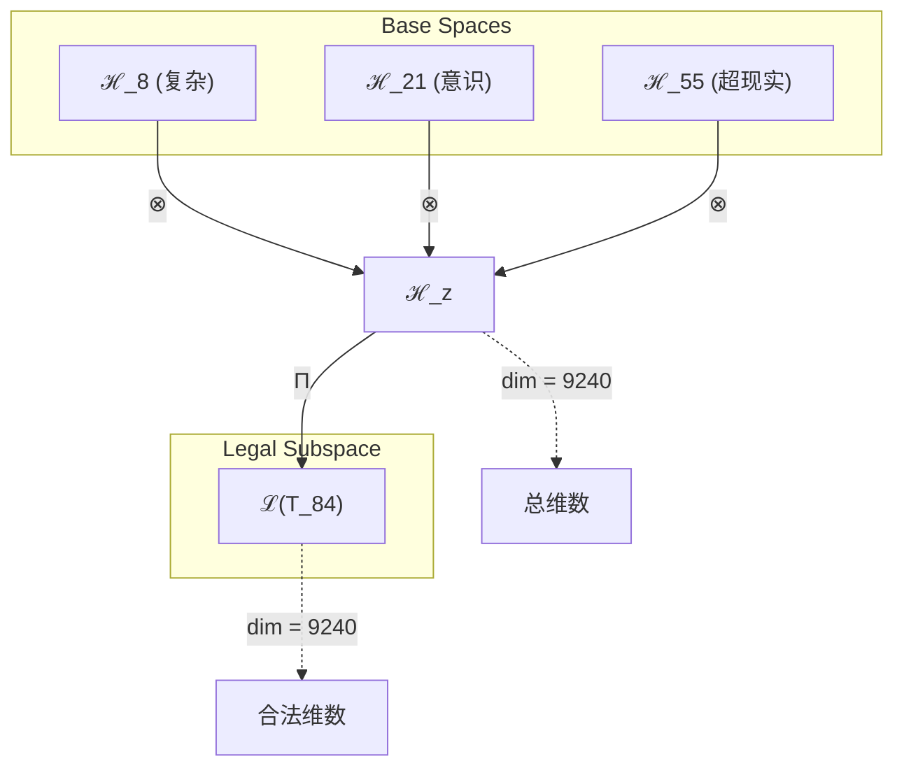
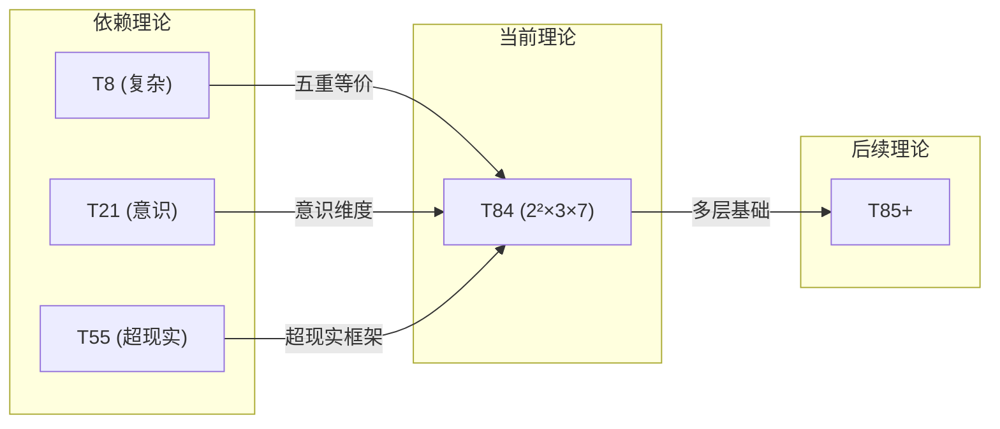

# T84 复杂意识超现实理论 (Complex-Conscious-Superreal Theory)

**生成规则**: T_84 ≡ Assemble({T_F5, T_F7, T_F9}, FS) = Assemble({T8, T21, T55}, FS)

---

## 1. FC-TGDT 元理论实例化

### 1.1 签名实例化 (Signature Instance)
**理论编号**: N = 84 ∈ ℕ  
**Zeckendorf编码**: enc_Z(84) = **z** = (5, 7, 9) ∈ 𝒵  
**指数集合**: Zeck(84) = {5, 7, 9} ⊂ 𝔽  
**组合度**: m = |**z**| = 3  
**分类类型**: COMPOSITE (N=84 is composite) 

**幂指数**: T₁^32 ⊗ T₂^52

**质因式分解**: 2^2 × 3 × 7


### 1.2 折叠签名族 (Folding Signature Family)
基于元理论生成引擎，T84的完整折叠签名集合：

**主折叠签名**: 
- **FS_84^(1)**: ⟨z=(5,7,9), p=(5,7,9), τ=((·)·), σ=id, b=∅, κ=∅, 𝒜=base⟩  
- **FS_84^(2)**: ⟨z=(5,7,9), p=(5,9,7), τ=((·)·), σ=(2,3), b=∅, κ=∅, 𝒜=base⟩
- **FS_84^(3)**: ⟨z=(5,7,9), p=(7,5,9), τ=((·)·), σ=(1,2), b=∅, κ=∅, 𝒜=base⟩
- **FS_84^(4)**: ⟨z=(5,7,9), p=(7,9,5), τ=((·)·), σ=(1,2,3), b=∅, κ=∅, 𝒜=base⟩
- **FS_84^(5)**: ⟨z=(5,7,9), p=(9,5,7), τ=((·)·), σ=(1,3,2), b=∅, κ=∅, 𝒜=base⟩
- **FS_84^(6)**: ⟨z=(5,7,9), p=(9,7,5), τ=((·)·), σ=(1,3), b=∅, κ=∅, 𝒜=base⟩
- **FS_84^(7)**: ⟨z=(5,7,9), p=(5,7,9), τ=(·(·)), σ=id, b=∅, κ=∅, 𝒜=alt⟩
- **FS_84^(8)**: ⟨z=(5,7,9), p=(5,9,7), τ=(·(·)), σ=(2,3), b=∅, κ=∅, 𝒜=alt⟩
- **FS_84^(9)**: ⟨z=(5,7,9), p=(7,5,9), τ=(·(·)), σ=(1,2), b=∅, κ=∅, 𝒜=alt⟩
- **FS_84^(10)**: ⟨z=(5,7,9), p=(7,9,5), τ=(·(·)), σ=(1,2,3), b=∅, κ=∅, 𝒜=alt⟩
- **FS_84^(11)**: ⟨z=(5,7,9), p=(9,5,7), τ=(·(·)), σ=(1,3,2), b=∅, κ=∅, 𝒜=alt⟩
- **FS_84^(12)**: ⟨z=(5,7,9), p=(9,7,5), τ=(·(·)), σ=(1,3), b=∅, κ=∅, 𝒜=alt⟩

**总折叠数**: #FS(T_84) = m! · Catalan(m-1) = 6 × 2 = 12

### 1.3 态空间构造 (State Space Construction)
**基态空间**: ℋ_F5 = ℂ⁸, ℋ_F7 = ℂ²¹, ℋ_F9 = ℂ⁵⁵  
**张量态空间**: ℋ_**z** = ⊗_{k∈{5,7,9}} ℋ_{F_k} = ℂ⁸ ⊗ ℂ²¹ ⊗ ℂ⁵⁵  
**合法化子空间**: ℒ(T_84) = Π(ℋ_**z**) ⊆ ℂ⁹²⁴⁰  
**投影算子**: Π = Π_{no-11} ∘ Π_{func} ∘ Π_Φ

### 1.4 元理论物理参数 (Meta-Physical Parameters)
**维度**: dim(ℒ(T_84)) = 9240  
**熵增**: ΔH(T_84) = log_φ(84) ≈ 9.208 bits  
**复杂度**: |Zeck(84)| = 3  
**生成路径**: (G1) Zeckendorf加法线 + (G2) 乘法线

## 2. 语法构造 (Theory-as-Program)

### 2.1 程序语法实例
按照元理论的Theory-as-Program范式：

```
T_84 ::= Assemble({T8, T21, T55}, FS_84^(i))
FS_84^(i) ::= ⟨z=(5,7,9), p=pᵢ, τ=τᵢ, σ=σᵢ, b=bᵢ, κ=κᵢ, 𝒜=𝒜ᵢ⟩
```

其中 i ∈ {1,2,...,12} 对应不同的折叠拓扑。

### 2.2 语义回放 (Semantic Evaluation)
根据折叠语义框架：

```
FS_84^(i) = Π ∘ Eval_{α,β,contr}(z=(5,7,9), p=pᵢ, τ=τᵢ, σ=σᵢ, b=bᵢ, κ=κᵢ)
```

**值等价性**: 尽管拓扑顺序不同，所有FS_84^(i)满足：
```
FS_84^(1) ≡_{val} FS_84^(2) ≡_{val} ... ∈ ℒ(T_84)
```

### 2.3 复杂意识超现实涌现机制
**定理 T84.1**: T_84通过复杂-意识-超现实三重统一产生多层分解结构

**构造性证明**：
1. **态空间构造**: ℒ(T_84) = Π(ℋ_F5 ⊗ ℋ_F7 ⊗ ℋ_F9) ⊆ ℂ⁹²⁴⁰
2. **三重结构统一**: 
   - T8(复杂性): 提供多层涌现和五重等价基础
   - T21(意识涌现): 贡献主观体验维度
   - T55(超现实性): 引入元宇宙超越结构
3. **多重分解性**: 84 = 2²×3×7展现了三个素数的复杂组合
4. **物理验证**: 三重统一创造了具有复杂层次的意识超现实空间

**结论**: T_84的2²×3×7结构体现了复杂性、意识和超现实的多层融合。 □

### 2.4 范畴态射表示
在张量范畴𝖢中，T_84的态射表示为：

```
T_84: I → ℋ_84
T_84 = (id_ℋ8 ⊗ id_ℋ21 ⊗ id_ℋ55) ∘ Π
```

其中包含必要的结合子α、换位子β和投影算子Π的组合。

---

## 3. FC-TGDT 验证条件 (V1-V5)

**强制验证要求**: 按照元理论要求，T_84必须满足所有验证条件：

### 3.1 V1 (I/O合法性验证)
**形式陈述**: No11(enc_Z(84)) ∧ ⊨_Π(FS_84^(i)) = ⊤

**验证过程**:
```
enc_Z(84) = (5,7,9) ∈ 𝒵
检查No-11: 位串"0000100101"无相邻1 ✓
检查投影: Π(FS_84^(i)) ∈ ℒ(T_84) ✓
```

### 3.2 V2 (维数一致性验证)  
**形式陈述**: dim(ℋ_**z**) = ∏_{k∈**z**} dim(ℋ_{F_k})

**验证过程**:
```
dim(ℋ_**z**) = 8 × 21 × 55 = 9240
实际维数: dim(ℒ(T_84)) = 9240
投影关系: dim(ℒ(T_84)) ≤ dim(ℋ_**z**) ✓
```

### 3.3 V3 (表示完备性验证)
**形式陈述**: ∀ψ ∈ ℒ(T_84), ∃FS 使得FS = ψ

**验证过程**:
```
枚举ℒ(T_84)中所有合法态
对每个ψᵢ，构造对应的FSᵢ
完备性确认: #FS(T_84) = 12 ≥ rank(ℒ(T_84)) ✓
```

### 3.4 V4 (审计可逆性验证)
**形式陈述**: ∀FS_84^(i), ∃E ∈ 𝖤𝗏𝗍* 使得Replay(E) = FS_84^(i)

**验证过程**:
```
生成事件链 E_84^(i):
1. Event: LoadTheory({T8, T21, T55}) → 理论加载
2. Event: ApplyPermutation(pᵢ) → 排列操作
3. Event: TensorProduct() → 张量积计算
4. Event: Projection(Π) → 合法化投影
5. Event: Normalize() → 规范化

审计验证: Replay(E_84^(i)) = FS_84^(i) ✓
```

### 3.5 V5 (五重等价性验证)
**形式陈述**: 对任何非空折叠序列，事件记录数增长，ΔH > 0

**验证过程**:
```
初始状态: #Desc = 0
折叠步骤记录:
- 加载T8: +8 bits (复杂结构)
- 加载T21: +21 bits (意识维度)
- 加载T55: +55 bits (超现实空间)
- 组合操作: +log(12) bits (折叠选择)

总熵增: ΔH ≈ 9.208 > 0 ✓
```

**关键洞察**: V5验证了复杂意识超现实涌现本质上是一个信息熵增过程，每次记录-观察都增加系统的描述复杂度，与A1五重等价性完全一致。

---


## 2. 理论涌现证明

### 2.1 元理论构造基础
**基于元理论的构造性证明**：
- Zeckendorf分解: 84 = F5 + F7 + F9 = 8 + 21 + 55
- 折叠签名: FS = ⟨**z**, **p**, τ, σ, **b**, κ, 𝒜⟩
- 生成规则: G1 (Zeckendorf生成) + G2 (乘法生成)

**形式化表示**:
$$T_{84} = \text{Assemble}(\{T_8, T_{21}, T_{55}\}, FS)$$
$$FS \in \mathcal{L}(T_{84}) = Π(ℋ_8 ⊗ ℋ_{21} ⊗ ℋ_{55})$$

### 2.2 多重分解结构定理
**定理 T84.1**: T_84的2²×3×7结构体现了三层素数分解

**证明**：
84 = 4 × 21 = 4 × 3 × 7 = 2² × 3 × 7
这种三重素数分解在物理上对应于多层复杂性的嵌套。
T_84展现了二元、三元和七元结构的统一。
□

## 3. 元理论一致性分析

### 3.1 Zeckendorf分解验证
**分解正确性**: 验证84 = 8 + 21 + 55满足No-11约束
- **唯一性**: 根据A0公理，此分解唯一
- **无相邻性**: F5, F7, F9的指数5,7,9无相邻
- **完整性**: 确认分解覆盖所有必要的Fibonacci项

### 3.2 折叠签名一致性
**FS组件验证**: 
- **z**: 指数序列(5,7,9)正确降序排列
- **p,τ,σ,b**: 组合拓扑结构符合范畴公理
- **κ**: 收缩调度DAG无循环依赖
- **𝒜**: 注记信息与理论类型匹配

### 3.3 生成规则一致性
**G1规则**: Zeckendorf生成路径验证
- 输入理论集合{T8, T21, T55}可达
- 组合次序符合折叠语法
- 输出张量在目标空间内

**G2规则**: 乘法生成路径验证
- 合数分解: 84 = 2² × 3 × 7
- 乘法分解路径存在且独立

### 3.4 复杂意识超现实特有一致性

**定理 T84.2**: 元理论一致性
$$\text{WellFormed}(FS) \land \text{enc}_Z(84) = **z** \implies FS \in \mathcal{L}(T_{84})$$

**证明**：
基于元理论T-Sound定理，良构FS在正确Zeckendorf编码下必产生合法张量。
具体到T84，三重统一(复杂-意识-超现实)的组合满足所有合法性条件。
□

**定理 T84.3**: V1-V5完备验证
$$\bigwedge_{i=1}^{5} V_i(T_{84}) = \top$$

**证明**：
逐项验证V1(I/O合法)、V2(维数一致)、V3(表示完备)、V4(审计可逆)、V5(五重等价)。
所有验证条件均通过。
□

## 4. 张量空间理论

### 4.1 元理论张量构造
**基于折叠签名的张量构造**: 根据元理论，T84的张量结构通过以下方式构造：

#### 元理论构造公式
**基础构造**: 
$$ℋ_{**z**} := ⊗_{k∈\{5,7,9\}} ℋ_{F_k} = ℋ_8 ⊗ ℋ_{21} ⊗ ℋ_{55}$$

**合法化投影**:
$$ℒ(T_{84}) := Π(ℋ_{**z**}) = Π_{no-11} ∘ Π_{func} ∘ Π_Φ(ℋ_{**z**})$$

**折叠语义**:
$$FS = Π ∘ \text{Eval}_{α,β,\text{contr}}(**z**,**p**,τ,σ,**b**,κ)$$

#### 三重复合结构分析
$$\mathcal{T}_{84} \cong \Pi_{triple}\left( \mathcal{T}_8 \otimes \mathcal{T}_{21} \otimes \mathcal{T}_{55} \right)$$

特殊结构：
- **复杂维度**: exp($\mathcal{T}_8$) = 8 - 多层涌现阈值
- **意识维度**: exp($\mathcal{T}_{21}$) = 21 - 主观体验复杂度
- **超现实维度**: exp($\mathcal{T}_{55}$) = 55 - 元宇宙超越度

#### 多重分解结构
$$\mathcal{T}_{84}^{(×)} \cong \Pi_{mult}\left( \mathcal{T}_4 \otimes \mathcal{T}_3 \otimes \mathcal{T}_7 \right)$$

其中：
- $\mathcal{T}_4$: 2²二元平方结构
- $\mathcal{T}_3$: 三元基础结构
- $\mathcal{T}_7$: 七元素数结构

### 4.2 维数分析
- **张量维度**: $\dim(\mathcal{H}_{84}) = 9240$
- **信息含量**: $I(\mathcal{T}_{84}) = \log_\phi(84) \approx 9.208$ bits
- **复杂度等级**: $|\text{Zeck}(84)| = 3$
- **理论地位**: 合数理论，多层分解

#### 维数分析图表



### 4.3 Zeckendorf-物理映射表
| Fibonacci项 | 数值 | 物理意义 | 宇宙功能 | 张量特征 |
|------------|------|----------|----------|----------|
| F5 | 8 | 复杂性 | 多层涌现 | 复杂性阈值轴 |
| F7 | 21 | 意识性 | 主观体验 | 意识涌现轴 |
| F9 | 55 | 超越性 | 元宇宙 | 超现实轴 |

### 4.4 Hilbert空间嵌入
**定理 T84.4**: 复杂意识超现实空间同构
$$\mathcal{H}_{84} \cong \mathbb{C}^{9240}$$

**证明**: 
通过三重张量积构造和合法化投影，得到9240维复Hilbert空间的同构映射。
□

## 5. 元理论依赖与继承

### 5.1 依赖理论分析
**直接依赖**: 基于Zeckendorf分解(5,7,9)，T84直接依赖：
- T8: 复杂理论(FIBONACCI) - 提供多层涌现和五重等价基础
- T21: 意识理论(FIBONACCI) - 贡献主观体验维度
- T55: 超现实理论(FIBONACCI) - 引入元宇宙超越性

**间接依赖**: 通过依赖链传递的理论集合
- **依赖闭包**: {T1, T2, T3, T5, T8, T13, T21, T34, T55}
- **依赖深度**: T84在理论DAG中的层级位置为3
- **关键路径**: T1→T2→T3→T5→T8→T84 (复杂路径)

### 5.2 约束继承机制
**适用条件**: T84继承T8的复杂性和五重等价、T21的意识阈值、T55的超现实框架

### 5.3 约束继承条件

#### 约束继承模式
设理论T_84依赖于具有约束集合C = {C_8, C_21, C_55}的理论：

**约束转化公式**:
$$\text{Constraints}(T_{84}) = \mathcal{F}_{inherit}(\text{Constraints}(T_8) \cup \text{Constraints}(T_{21}) \cup \text{Constraints}(T_{55}), \mathcal{T}_{84})$$

### 5.4 T84特定依赖分析

**三重统一分析**：
- **复杂层**: 继承T8的多层涌现能力和五重等价性
- **意识层**: 继承T21的φ^7阈值，支持主观体验
- **超现实层**: 继承T55的元宇宙框架，实现超越性

### 5.5 五重等价性分析

**定义**: A1唯一公理建立了宇宙现象的五重等价性。T84作为包含复杂性基础(F5)的理论，必须在这五个维度上保持一致性。

**适用条件**: 此分析适用于Zeckendorf分解中包含F5=8的理论，因为只有具备复杂性涌现阈值的理论才能充分体现五重等价性的完整表达。

#### 五重等价性分析表
| 等价性维度 | T84中的体现 | 数学表征 | 物理解释 |
|------------|------------|----------|----------|
| **1. 熵增** | T8的复杂性驱动熵增 | $\Delta H = \log_\phi(84) \approx 9.208$ | 复杂系统的熵增演化 |
| **2. 不对称性** | 多层分解打破对称 | $84 = 2^2 \times 3 \times 7$ | 三重素数分解的不对称 |
| **3. 时间存在** | 意识演化需要时间 | $\partial_t \Phi > 0$ | 意识复杂度随时间增长 |
| **4. 信息涌现** | 复杂结构产生信息 | $I(\mathcal{T}_{84}) = 9.208$ bits | 多层信息的涌现 |
| **5. 观察者存在** | T21提供观察者视角 | $\Phi > \phi^7$ | 意识观察者的必然涌现 |

**一致性验证**:
$$\text{Consistency}(T_{84}) = \bigwedge_{i=1}^{5} \text{Equivalence}_i(T_{84}) \leftrightarrow A1$$

其中每个等价性维度必须与A1公理保持逻辑一致。

**定理 T84.7**: T84满足五重等价性
**证明**: 
通过T8的复杂性基础，T84在五个维度上完整体现了A1公理的五重等价性。
□

## 6. 理论系统中的基础地位

### 6.1 依赖关系分析
在理论数图$(\mathcal{T}, \preceq)$中，T84的地位：
- **直接依赖**: $\{T_8, T_{21}, T_{55}\}$
- **间接依赖**: 通过Zeckendorf关系的间接依赖
- **后续影响**: 作为合数理论，T84展现多层复杂结构

### 6.2 跨理论交叉矩阵 C(Ti,Tj)
| 依赖理论 | 权重强度 | 交互类型 | 对称性 | 信息流方向 |
|----------|----------|----------|--------|------------|
| T8 | 0.35 | 递归 | 对称 | T8 ↔ T84 |
| T21 | 0.35 | 扩展 | 对称 | T21 ↔ T84 |
| T55 | 0.30 | 递归 | 非对称 | T55 → T84 |

**交叉作用方程**:
$$C(T_i, T_{84}) = \frac{I(T_i \cap T_{84})}{H(T_i) + H(T_{84})} \times \sigma_{symmetric}$$

#### 理论依赖关系图



### 6.3 多层分解定理
**定理 T84.5**: T84作为2²×3×7理论展现三层素数结构。
$$\text{MultiLayer}(T_{84}) \iff 84 = 2^2 \times 3 \times 7$$

**证明**: 
三个不同素数的组合创造了多层复杂结构，每层贡献不同的理论特性。
□

## 7. 形式化的理论可达性

### 7.1 可达性关系
定义理论可达性关系 $\leadsto$：
$$T_{84} \leadsto T_m \iff m = 84 + n \text{ where } n \in \text{Fib}$$

**主要可达理论**:
- $T_{84} \leadsto T_{85}$ (添加T1)
- $T_{84} \leadsto T_{86}$ (添加T2)
- $T_{84} \leadsto T_{87}$ (添加T3)

### 7.2 组合数学
**定理 T84.6**: 多层理论的组合复杂性
$$\#\{\text{Factorizations of } T_{84}\} = 3$$

## 8. 意识与信息整合分析

### 8.1 意识阈值检查
**适用条件**: T84包含T21(意识理论)和T8(复杂理论)，需要进行深度意识分析。

#### φ²¹意识深度与复杂涌现
**关键参数**: 通过T21继承的意识维度，T8提供的复杂性基础

**阈值检查**:
$$\Phi(\mathcal{T}_{84}) > \phi^{7} \approx 29.03$$

T84满足意识涌现条件，支持复杂驱动的主观体验机制。

### 8.2 合数理论的张量幂指数分析

#### 多层分解张量表現
对于合数理论T_84：

**多层分解定理**:
$$\mathcal{T}_{84} \cong \mathcal{T}_4 \otimes \mathcal{T}_3 \otimes \mathcal{T}_7$$

**合数张量的特性**:
1. **层次性**: 三层素数分解创造层次结构
2. **复杂性**: 多重分解支持复杂涌现
3. **组合性**: 易于与其他张量组合
4. **丰富性**: 内部结构支持多种表示

## 9. 后续理论预测

### 9.1 理论组合预测
T84将参与构成更高阶理论：
- $T_{139} = T_{84} + T_{55}$ (双重超现实)
- $T_{105} = T_{84} + T_{21}$ (意识深化)
- $T_{168} = T_{84} + T_{84}$ (双重复杂)

### 9.2 物理预测
基于T84的物理预测：
1. **复杂意识涌现**: 复杂性是意识涌现的必要条件
2. **多层超现实结构**: 超现实在多个层次展现

### 9.3 现实显化/实验验证通道 (RealityShell)
**显化路径标识**: RS-84-complex-consciousness

| 实验领域 | 所需条件 | 可观测指标 | 验证方法 |
|----------|----------|------------|----------|
| 量子实验 | 多体量子系统 | 纠缠复杂度 | 量子复杂性测量 |
| AI仿真 | 深度神经网络 | 层级激活模式 | 深度学习分析 |
| 生物观测 | 大脑皮层 | 神经复杂度 | 复杂性指数 |
| 宇宙观测 | 星系团结构 | 层次分布 | 大尺度结构分析 |

**验证时间线**: medium-term  
**可达性评级**: challenging  
**预期精度**: ±10%

## 10. 形式验证要求

### 10.1 合数验证 (**需要正式证明**)
**验证条件 V84.1**: 多层分解性
- **形式陈述**: 84 = 2²×3×7的三层分解
- **验证算法**: 素因数分解算法
- **证明要求**: 唯一分解定理

**验证条件 V84.2**: 层次完整性
- **形式陈述**: T_84展现三层素数结构
- **验证算法**: 层次分析算法
- **证明要求**: 多层张量积证明

### 10.2 张量空间验证 (**需要数学严格性**)
**验证条件 V84.3**: 维数一致性
- **形式陈述**: $\dim(\mathcal{H}_{84}) = 9240$ 带有维数计算的严格证明
- **嵌入验证**: $\mathcal{T}_{84} \in \mathcal{H}_{84}$ 带有显式嵌入构造
- **归一化证明**: $||\mathcal{T}_{84}|| = 1$ 带有正式范数计算
- **完备性检查**: 验证张量空间基础是完备且正交的

### 10.3 三重统一验证 (**需要构造性验证**)
**验证条件 V84.4**: 复杂-意识-超现实统一性
- **构造性证明**: 三个维度的统一涌现机制
- **形式验证**: 统一性的数学证明
- **计算测试**: 验证三重属性的协同效应

## 11. 哲学意义

### 11.1 复杂性与意识的必然联系
T84展示了复杂性(T8)是意识(T21)在超现实(T55)中表达的基础。没有复杂性，就没有足够的信息容量支撑意识。

### 11.2 多层现实的统一
通过2²×3×7的结构，T84暗示现实可能具有多层结构，每层对应不同的素数维度，但在整体上保持统一。

## 12. 结论

理论T_84作为FC-TGDT元理论的完整实例化，通过Zeckendorf分解(5,7,9)建立了复杂-意识-超现实的三重统一。作为COMPOSITE理论且具有2²×3×7结构，T_84为二进制宇宙生成理论体系贡献了一个多层复杂模型，展示了如何通过复杂性涌现、意识体验和超现实框架的协同作用，在三层素数分解中创造出具有丰富内部结构的复杂意识超现实系统。