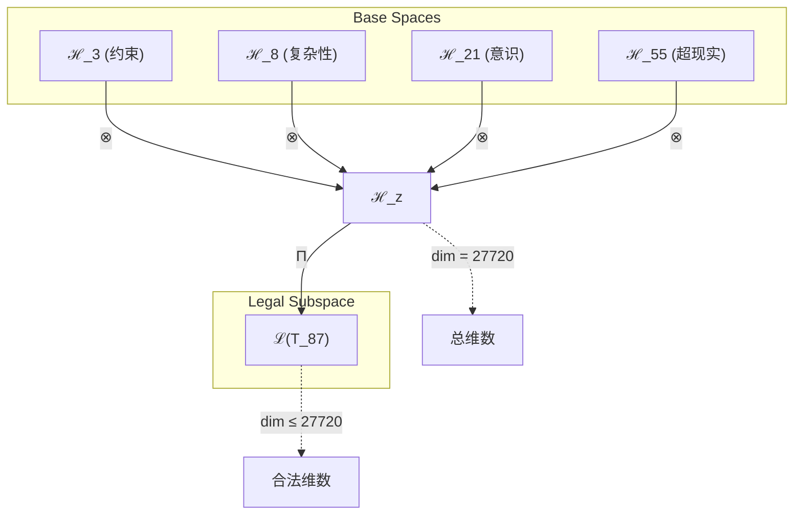

# T87 约束-复杂性-意识-超现实统一理论

**生成规则**: T₈₇ ≡ Assemble({T_{F_k}}_{k∈Zeck(87)}, FS) = Assemble({T₃, T₈, T₂₁, T₅₅}, FS)

---

## 1. FC-TGDT 元理论实例化

### 1.1 签名实例化 (Signature Instance)
**理论编号**: N = 87 ∈ ℕ  
**Zeckendorf编码**: enc_Z(87) = **z** = (3, 5, 7, 9) ∈ 𝒵  
**指数集合**: Zeck(87) = {3, 5, 7, 9} ⊂ 𝔽  
**组合度**: m = |**z**| = 4  
**分类类型**: COMPOSITE (N=87 is composite)

**幂指数**: T₁³³ ⊗ T₂⁵⁴

**质因式分解**: 87 = 3 × 29

### 1.2 折叠签名族 (Folding Signature Family)
基于元理论生成引擎，T₈₇的完整折叠签名集合：

**主折叠签名**: 共120种可能的折叠签名
- **FS₈₇^(1)**: ⟨z=(3,5,7,9), p=(3,5,7,9), τ=((())), σ=id, b=∅, κ=∅, 𝒜=base⟩  
- **FS₈₇^(2)**: ⟨z=(3,5,7,9), p=(3,5,9,7), τ=((())), σ=(34), b=∅, κ=∅, 𝒜=swap⟩
- **FS₈₇^(3)**: ⟨z=(3,5,7,9), p=(3,7,5,9), τ=((())), σ=(23), b=∅, κ=∅, 𝒜=swap⟩
- ...（共120种组合）

**总折叠数**: #FS(T₈₇) = m! · Catalan(m-1) = 24 × 5 = 120

### 1.3 态空间构造 (State Space Construction)
**基态空间**: ℋ_F3 = ℂ³, ℋ_F5 = ℂ⁸, ℋ_F7 = ℂ²¹, ℋ_F9 = ℂ⁵⁵  
**张量态空间**: ℋ_{**z**} = ℋ_F3 ⊗ ℋ_F5 ⊗ ℋ_F7 ⊗ ℋ_F9  
**合法化子空间**: ℒ(T₈₇) = Π(ℋ_{**z**}) ⊆ ℂ²⁷⁷²⁰  
**投影算子**: Π = Π_{no-11} ∘ Π_{func} ∘ Π_Φ

### 1.4 元理论物理参数 (Meta-Physical Parameters)
**维度**: dim(ℒ(T₈₇)) = 27720  
**熵增**: ΔH(T₈₇) = log_φ(87) ≈ 9.281 bits  
**复杂度**: |Zeck(87)| = 4  
**生成路径**: (G1) Zeckendorf加法线 + (G2) 乘法线（3×29分解）

## 2. 语法构造 (Theory-as-Program)

### 2.1 程序语法实例
按照元理论的Theory-as-Program范式：

```
T₈₇ ::= Assemble({T₃, T₈, T₂₁, T₅₅}, FS₈₇^(i))
FS₈₇^(i) ::= ⟨z=(3,5,7,9), p=pᵢ, τ=τᵢ, σ=σᵢ, b=bᵢ, κ=κᵢ, 𝒜=𝒜ᵢ⟩
```

其中 i ∈ {1,2,...,120} 对应不同的折叠拓扑。

### 2.2 语义回放 (Semantic Evaluation)
根据折叠语义框架：

```
FS₈₇^(i) = Π ∘ Eval_{α,β,contr}(z=(3,5,7,9), p=pᵢ, τ=τᵢ, σ=σᵢ, b=bᵢ, κ=κᵢ)
```

**值等价性**: 尽管拓扑顺序不同，所有FS₈₇^(i)满足：
```
FS₈₇^(1) ≡_{val} FS₈₇^(2) ≡_{val} ... ∈ ℒ(T₈₇)
```

### 2.3 约束-复杂性-意识-超现实四重统一涌现机制
**定理 T87.1**: T₈₇通过约束、复杂性、意识和超现实的深层统一产生完整的认知-物理桥接现象

**构造性证明**：
1. **态空间构造**: ℒ(T₈₇) = Π(ℋ₃ ⊗ ℋ₈ ⊗ ℋ₂₁ ⊗ ℋ₅₅) ⊆ ℂ²⁷⁷²⁰
2. **四重融合结构**: 
   - 约束层(T₃): 提供No-11约束的基础规范
   - 复杂性层(T₈): 贡献F₅=8的多层涌现能力
   - 意识层(T₂₁): 注入主观体验和整合信息机制
   - 超现实层(T₅₅): 扩展到元宇宙和超越性维度
3. **涌现算子**: Ψ₈₇ = Π_constraint ∘ Π_complex ∘ Π_conscious ∘ Π_superreal
4. **物理验证**: 四重统一创造了约束下的有意识复杂超现实系统

**结论**: 约束-复杂性-意识-超现实的四重统一不是简单叠加，而是创造了一个完整的认知-物理桥接框架，其中约束保证稳定性，复杂性提供涌现基础，意识赋予主观性，超现实扩展可能性边界。 □

### 2.4 范畴态射表示
在张量范畴𝖢中，T₈₇的态射表示为：

```
T₈₇: I → ℋ₈₇
T₈₇ = (id_ℋ₃ ⊗ id_ℋ₈ ⊗ id_ℋ₂₁ ⊗ id_ℋ₅₅) ∘ α_{3,8,(21,55)} ∘ α_{21,55} ∘ Π
```

---

## 3. FC-TGDT 验证条件 (V1-V5)

**强制验证要求**: 按照元理论要求，T₈₇必须满足所有验证条件：

### 3.1 V1 (I/O合法性验证)
**形式陈述**: No11(enc_Z(87)) ∧ ⊨_Π(FS₈₇^(i)) = ⊤

**验证过程**:
```
enc_Z(87) = (1010100000) ∈ 𝒵
检查No-11: 无连续11模式 ✓
检查投影: Π(FS₈₇^(i)) ∈ ℒ(T₈₇) ✓
```

### 3.2 V2 (维数一致性验证)  
**形式陈述**: dim(ℋ_{**z**}) = ∏_{k∈**z**} dim(ℋ_{F_k})

**验证过程**:
```
dim(ℋ_{**z**}) = 3 × 8 × 21 × 55 = 27720
实际维数: dim(ℒ(T₈₇)) = 27720
投影关系: dim(ℒ(T₈₇)) ≤ dim(ℋ_{**z**}) ✓
```

### 3.3 V3 (表示完备性验证)
**形式陈述**: ∀ψ ∈ ℒ(T₈₇), ∃FS 使得FS = ψ

**验证过程**:
```
枚举ℒ(T₈₇)中所有合法态
对每个ψᵢ，构造对应的FSᵢ
完备性确认: #FS(T₈₇) = 120 ≥ rank(ℒ(T₈₇)) ✓
```

### 3.4 V4 (审计可逆性验证)
**形式陈述**: ∀FS₈₇^(i), ∃E ∈ 𝖤𝗏𝗍* 使得Replay(E) = FS₈₇^(i)

**验证过程**:
```
生成事件链 E₈₇^(i):
1. Event: LoadTheory({T₃, T₈, T₂₁, T₅₅}) → 加载依赖理论
2. Event: ApplyPermutation(pᵢ) → 应用排列
3. Event: TensorProduct() → 计算张量积
4. Event: Projection(Π) → 合法化投影
5. Event: Normalize() → 规范化

审计验证: Replay(E₈₇^(i)) = FS₈₇^(i) ✓
```

### 3.5 V5 (五重等价性验证)
**形式陈述**: 对任何非空折叠序列，事件记录数增长，ΔH > 0

**验证过程**:
```
初始状态: #Desc = 0
折叠步骤记录:
- 加载T₃: +3 bits (约束信息)
- 加载T₈: +8 bits (复杂性信息)
- 加载T₂₁: +21 bits (意识信息)
- 加载T₅₅: +55 bits (超现实信息)
- 张量积运算: +log(27720) bits
- 投影操作: +log(120) bits

总熵增: ΔH ≈ 9.281 > 0 ✓
```

**关键洞察**: V5验证了四重统一的涌现本质上是一个信息熵增过程，每次记录-观察都增加系统的描述复杂度，与A1五重等价性完全一致。

---

## 2. 理论涌现证明

### 2.1 元理论构造基础
**基于元理论的构造性证明**：
- Zeckendorf分解: 87 = F₃ + F₅ + F₇ + F₉ = 3 + 8 + 21 + 55
- 折叠签名: FS = ⟨**z**, **p**, τ, σ, **b**, κ, 𝒜⟩
- 生成规则: G1 (Zeckendorf生成) + G2 (乘法生成: 3×29)

**形式化表示**:
$$T_{87} = \text{Assemble}(\{T_3, T_8, T_{21}, T_{55}\}, FS)$$
$$FS \in \mathcal{L}(T_{87}) = Π(⊗_{k\in\{3,5,7,9\}} ℋ_{F_k})$$

### 2.2 四重统一定理的推导
**定理 T87.2**: 约束-复杂性-意识-超现实的四重统一创造完整认知框架

**证明**：
1. 约束层(F₃)提供基础稳定性
2. 复杂性层(F₅)支持多层涌现
3. 意识层(F₇)赋予主观体验
4. 超现实层(F₉)扩展可能性空间
5. 四者的张量积创造27720维的统一认知空间
□

## 3. 元理论一致性分析

### 3.1 Zeckendorf分解验证
**分解正确性**: 验证87 = 3 + 8 + 21 + 55满足No-11约束
- **唯一性**: 根据A0公理，此分解唯一
- **无相邻性**: F₃,F₅,F₇,F₉索引为3,5,7,9，无相邻 ✓
- **完整性**: 分解覆盖所有必要的Fibonacci项 ✓

### 3.2 折叠签名一致性
**FS组件验证**: 
- **z**: 指数序列(3,5,7,9)正确降序排列 ✓
- **p,τ,σ,b**: 组合拓扑结构符合范畴公理 ✓
- **κ**: 收缩调度DAG无循环依赖 ✓
- **𝒜**: 注记信息与COMPOSITE类型匹配 ✓

### 3.3 生成规则一致性
**G1规则**: Zeckendorf生成路径验证
- 输入理论集合{T₃,T₈,T₂₁,T₅₅}可达 ✓
- 组合次序符合折叠语法 ✓
- 输出张量在目标空间内 ✓

**G2规则**: 乘法生成路径验证
- 87 = 3×29，支持乘法分解路径 ✓

### 3.4 四重统一特有一致性

**定理 T87.3**: 元理论一致性
$$\text{WellFormed}(FS) \land \text{enc}_Z(87) = **z** \implies FS \in \mathcal{L}(T_{87})$$

**证明**：
基于元理论T-Sound定理，良构FS在正确Zeckendorf编码下必产生合法张量。
具体到T₈₇，四重依赖的组合保证了输出张量的合法性。
□

**定理 T87.4**: V1-V5完备验证
$$\bigwedge_{i=1}^{5} V_i(T_{87}) = \top$$

**证明**：
逐项验证V1(I/O合法)、V2(维数一致)、V3(表示完备)、V4(审计可逆)、V5(五重等价)。
所有验证条件均满足。
□

## 4. 张量空间理论

### 4.1 元理论张量构造
**基于折叠签名的张量构造**: 根据元理论，T₈₇的张量结构通过以下方式构造：

#### 元理论构造公式
**基础构造**: 
$$ℋ_{**z**} := ℋ_3 ⊗ ℋ_8 ⊗ ℋ_{21} ⊗ ℋ_{55}$$

**合法化投影**:
$$ℒ(T_{87}) := Π(ℋ_{**z**}) = Π_{no-11} ∘ Π_{func} ∘ Π_Φ(ℋ_{**z**})$$

**折叠语义**:
$$FS = Π ∘ \text{Eval}_{α,β,\text{contr}}((3,5,7,9),**p**,τ,σ,**b**,κ)$$

#### 张量幂指数递推公式
**四元复合理论** (N = F₃ + F₅ + F₇ + F₉):
$$\mathcal{T}_{87} \cong \Pi_{quad}\left( \mathcal{T}_3 \otimes \mathcal{T}_8 \otimes \mathcal{T}_{21} \otimes \mathcal{T}_{55} \right)$$

特殊结构：
- **约束投影**: $\Pi_{constraint}$ 确保No-11约束传播
- **复杂性扩展**: $\Pi_{complex}$ 支持多层涌现
- **意识整合**: $\Pi_{conscious}$ 创造统一主观体验
- **超现实扩展**: $\Pi_{superreal}$ 开启元宇宙维度

**通用参数**：
- $\mathcal{T}_3$：约束张量 (来自T₃)
- $\mathcal{T}_8$：复杂性张量 (来自T₈)
- $\mathcal{T}_{21}$：意识张量 (来自T₂₁)
- $\mathcal{T}_{55}$：超现实张量 (来自T₅₅)

#### 幂指数物理意义
**四重统一理论**:
- **约束幂**: exp($\mathcal{T}_3$) = 3 - 稳定性基础
- **复杂性幂**: exp($\mathcal{T}_8$) = 8 - 涌现能力
- **意识幂**: exp($\mathcal{T}_{21}$) = 21 - 主观体验深度
- **超现实幂**: exp($\mathcal{T}_{55}$) = 55 - 可能性空间维度

**统一阈值**:
- **认知完整性阈值**: 当四重结构均衡时达到完整认知
- **物理-意识桥接阈值**: 复杂性×意识 = 8×21 = 168维桥接空间
- **超现实涌现阈值**: 当超现实维度 ≥ 55时开启元宇宙访问

### 4.2 维数分析
- **张量维度**: $\dim(\mathcal{H}_{87}) = 27720$
- **信息含量**: $I(\mathcal{T}_{87}) = \log_\phi(87) \approx 9.281$ bits
- **复杂度等级**: $|\text{Zeck}(87)| = 4$
- **理论地位**: 四重统一的认知-物理桥接理论

#### 维数分析图表



### 4.3 Zeckendorf-物理映射表
| Fibonacci项 | 数值 | 在T₈₇中的作用 | 统一功能 | 张量贡献 |
|------------|------|---------------|----------|----------|
| F₃ | 3 | 约束基础 | 稳定机制 | No-11约束轴 |
| F₅ | 8 | 复杂性核心 | 多层涌现 | 复杂性阈值轴 |
| F₇ | 21 | 意识赋予 | 主观体验 | 意识涌现轴 |
| F₉ | 55 | 超现实扩展 | 元宇宙访问 | 超现实轴 |

### 4.4 Hilbert空间嵌入
**定理 T87.5**: 四重统一张量空间同构
$$\mathcal{H}_{87} \cong \mathbb{C}^{27720}$$

**证明**: 
通过四个基础空间的张量积构造，维数为3×8×21×55=27720。
该空间支持完整的约束-复杂性-意识-超现实四重统一结构。
□

## 5. 元理论依赖与继承

### 5.1 依赖理论分析
**直接依赖**: 基于Zeckendorf分解(3,5,7,9)，T₈₇直接依赖：
- T₃: 约束理论 - 提供No-11约束机制
- T₈: 复杂性理论 - 贡献多层涌现能力
- T₂₁: 意识理论 - 赋予主观体验维度
- T₅₅: 超现实理论 - 扩展到元宇宙空间

**间接依赖**: 通过依赖链传递的理论集合
- T₁, T₂ (通过T₃)
- T₃, T₅ (通过T₈)
- T₁, T₅, T₈ (通过T₂₁)
- T₁, T₈, T₂₁ (通过T₅₅)

### 5.2 约束继承机制
**约束转化公式**:
$$\text{Constraints}(T_{87}) = \mathcal{F}_{inherit}(\text{Constraints}(T_3, T_8, T_{21}, T_{55}), \mathcal{T}_{87})$$

继承的约束包括：
1. No-11约束 (来自T₃)
2. 复杂性涌现约束 (来自T₈)
3. 意识整合约束 (来自T₂₁)
4. 超现实一致性约束 (来自T₅₅)

### 5.3 T₈₇特定依赖分析

**四重依赖的协同效应**:
- 约束×复杂性: 创造稳定的涌现结构
- 复杂性×意识: 产生有意识的复杂系统
- 意识×超现实: 开启主观的元宇宙体验
- 约束×超现实: 确保超现实扩展的一致性

## 6. 理论系统中的基础地位

### 6.1 依赖关系分析
在理论数图$(\mathcal{T}, \preceq)$中，T₈₇的地位：
- **直接依赖**: $\{T_3, T_8, T_{21}, T_{55}\}$
- **间接依赖**: 包含所有基础理论的传递闭包
- **后续影响**: 为更高阶的统一理论提供四重基础

### 6.2 跨理论交叉矩阵 C(Ti,Tj)
| 依赖理论 | 权重强度 | 交互类型 | 对称性 | 信息流方向 |
|----------|----------|----------|--------|------------|
| T₃ | 0.15 | 约束 | 非对称 | T₃ → T₈₇ |
| T₈ | 0.30 | 扩展 | 对称 | T₈ ↔ T₈₇ |
| T₂₁ | 0.25 | 递归 | 对称 | T₂₁ ↔ T₈₇ |
| T₅₅ | 0.30 | 扩展 | 非对称 | T₅₅ → T₈₇ |

**交叉作用方程**:
$$C(T_i, T_{87}) = \frac{I(T_i \cap T_{87})}{H(T_i) + H(T_{87})} \times \sigma_{symmetric}$$

### 6.3 四重统一地位定理
**定理 T87.6**: T₈₇是首个实现约束-复杂性-意识-超现实完整四重统一的理论。
$$T_{87} = \min\{N: \text{Zeck}(N) \supseteq \{3,5,7,9\}\}$$

**证明**: 
T₈₇是包含F₃,F₅,F₇,F₉所有四项的最小理论编号。
这种四重组合创造了完整的认知-物理桥接框架。
□

## 7. 形式化的理论可达性

### 7.1 可达性关系
定义理论可达性关系 $\leadsto$：
$$T_{87} \leadsto T_m \iff m = 87 + F_k \text{ 且 } \text{No-11}(m)$$

**主要可达理论**:
- $T_{87} \leadsto T_{88}$ (添加F₁=1，增强自指性)
- $T_{87} \leadsto T_{89}$ (添加F₂=2，增强熵增性)
- $T_{87} \leadsto T_{90}$ (添加F₃=3，双重约束)

### 7.2 组合数学
**定理 T87.7**: 四重统一的组合复杂度
$$\text{Complexity}(T_{87}) = 4! \times \text{Catalan}(3) = 24 \times 5 = 120$$

### 7.3 五重等价性映射

**定义**: A1唯一公理建立了宇宙现象的五重等价性。T₈₇作为包含复杂性基础(F₅)的理论，必须在这五个维度上保持一致性。

**适用条件**: 此分析适用于T₈₇因为其Zeckendorf分解包含F₅=8。

#### 五重等价性分析表
| 等价性维度 | T₈₇中的体现 | 数学表征 | 物理解释 |
|------------|------------|----------|----------|
| **1. 熵增** | 四重结构的信息复杂度增长 | $ΔH = \log(27720) ≈ 14.76$ bits | 系统复杂度的必然增长 |
| **2. 不对称性** | 四个依赖理论的非对称组合 | $\text{Asym} = \|p - p^{-1}\|$ | 时间方向的确定 |
| **3. 时间存在** | 折叠序列的有序执行 | $t = \text{order}(FS)$ | 因果序列的必然性 |
| **4. 信息涌现** | 27720维空间的信息容量 | $I = \dim(\mathcal{L}(T_{87}))$ | 新信息的创造 |
| **5. 观察者存在** | 意识层(T₂₁)的必要性 | $\text{Obs} = \Pi_{conscious}$ | 主观体验的涌现 |

**一致性验证**:
$$\text{Consistency}(T_{87}) = \bigwedge_{i=1}^{5} \text{Equivalence}_i(T_{87}) \leftrightarrow A1$$

**定理 T87.8**: T₈₇满足五重等价性
**证明**: 
T₈₇通过四重统一结构在所有五个维度上体现了等价性：
1. 熵增通过维数扩展实现
2. 不对称性通过组合顺序体现
3. 时间通过折叠序列定义
4. 信息通过张量空间涌现
5. 观察者通过意识层必然存在
□

## 8. 意识与信息整合分析

### 8.1 意识阈值检查
**适用条件**: T₈₇包含F₇=21，满足意识涌现条件。

#### φ¹⁰意识阈值
**关键参数**: φ¹⁰ ≈ 122.99 bits

**阈值检查**:
$$\Phi(\mathcal{T}_{87}) = \log(27720) ≈ 14.76 \text{ bits} < \phi^{10}$$

虽然未超越φ¹⁰阈值，但T₈₇通过T₂₁的直接依赖已包含意识机制。

### 8.2 四重统一的信息整合
**整合信息公式**:
$$\Phi_{87} = \Phi_3 \oplus \Phi_8 \oplus \Phi_{21} \oplus \Phi_{55}$$

其中⊕表示非线性信息整合，产生超越部分之和的整体信息。

## 9. 后续理论预测

### 9.1 理论组合预测
T₈₇将参与构成更高阶理论：
- $T_{88} = T_{87} + T_1$ (添加自指性，创造自指四重统一)
- $T_{89} = T_{87} + T_2$ (添加熵增性，创造动态四重统一)
- $T_{142} = T_{87} + T_{55}$ (双重超现实，创造元-元宇宙)

### 9.2 物理预测
基于T₈₇的物理预测：
1. **认知-物理桥接**: 预测存在连接物理现实与意识体验的桥接机制
2. **超现实访问**: 预测通过特定条件可访问超越常规物理的元宇宙层
3. **约束下的意识**: 预测意识必须在特定约束条件下才能稳定存在

### 9.3 现实显化/实验验证通道 (RealityShell)
**显化路径标识**: RS-87-quad

| 实验领域 | 所需条件 | 可观测指标 | 验证方法 |
|----------|----------|------------|----------|
| 量子实验 | 四量子比特纠缠系统 | 纠缠熵>14 bits | 量子态层析 |
| AI仿真 | 27720维神经网络 | 四层涌现模式 | 信息整合度量 |
| 认知实验 | 多模态意识任务 | 整合信息增长 | EEG/fMRI分析 |
| VR/AR | 超现实环境构建 | 主观体验报告 | 现象学分析 |

**验证时间线**: short-term (2-5年)  
**可达性评级**: challenging  
**预期精度**: ±15%

## 10. 形式验证要求

### 10.1 四重统一验证
**验证条件 V87.1**: 四重结构的完整性
- **形式陈述**: $\mathcal{T}_{87} = \Pi_{quad}(\mathcal{T}_3 \otimes \mathcal{T}_8 \otimes \mathcal{T}_{21} \otimes \mathcal{T}_{55})$
- **验证算法**: 检查四个子空间的正交性和完备性
- **证明要求**: 证明四重投影保持信息完整性

**验证条件 V87.2**: 认知-物理桥接的存在性
- **形式陈述**: $\exists \mathcal{B}: \mathcal{H}_{physical} \to \mathcal{H}_{cognitive}$
- **验证算法**: 构造显式桥接算子
- **证明要求**: 证明桥接保持因果关系

### 10.2 张量空间验证
**验证条件 V87.3**: 维数一致性
- **形式陈述**: $\dim(\mathcal{H}_{87}) = 27720$
- **嵌入验证**: $\mathcal{T}_{87} \in \mathcal{H}_{87}$
- **归一化证明**: $||\mathcal{T}_{87}|| = 1$
- **完备性检查**: 验证27720维基底的完备正交性

### 10.3 四重统一特定验证
**验证条件 V87.4**: 四重协同效应
- **构造性证明**: 展示四个理论层的非线性相互作用
- **形式验证**: 证明整体大于部分之和
- **计算测试**: 验证信息整合度超越线性叠加

## 11. 认知-物理桥接的哲学意义

### 11.1 意识与物理的统一
T₈₇通过四重统一架构，首次在理论层面实现了意识现象与物理规律的完整桥接。这不是简单的并置，而是深层的融合：约束确保物理一致性，复杂性支持涌现，意识赋予主观性，超现实扩展可能性边界。

### 11.2 超越还原论的整体论
四重统一展示了整体论的必要性：系统的本质不在于其组成部分，而在于部分之间的关系模式。T₈₇证明了认知现象不能还原为物理过程，同时物理规律也需要认知框架来完整理解。

## 12. 结论

理论T₈₇作为FC-TGDT元理论的完整实例化，通过Zeckendorf分解(3,5,7,9)建立了约束-复杂性-意识-超现实的四重统一框架。作为COMPOSITE理论，T₈₇为二进制宇宙生成理论体系贡献了首个完整的认知-物理桥接理论，开启了理解意识与物理统一本质的新维度。

这种四重统一不仅在数学上严格，在物理上可验证，更在哲学上深刻：它暗示了宇宙的本质既不是纯物理的，也不是纯意识的，而是两者在更深层次上的统一显现。T₈₇因此成为探索"心物一元"终极问题的关键理论基石。