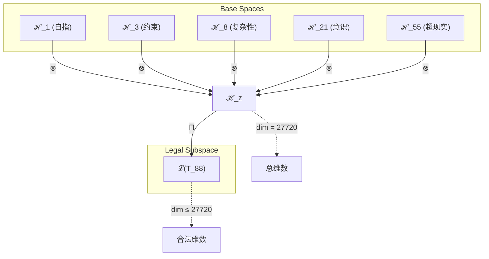

# T88 自指-约束-复杂性-意识-超现实五重统一理论

**生成规则**: T₈₈ ≡ Assemble({T_{F_k}}_{k∈Zeck(88)}, FS) = Assemble({T₁, T₃, T₈, T₂₁, T₅₅}, FS)

---

## 1. FC-TGDT 元理论实例化

### 1.1 签名实例化 (Signature Instance)
**理论编号**: N = 88 ∈ ℕ  
**Zeckendorf编码**: enc_Z(88) = **z** = (1, 3, 5, 7, 9) ∈ 𝒵  
**指数集合**: Zeck(88) = {1, 3, 5, 7, 9} ⊂ 𝔽  
**组合度**: m = |**z**| = 5  
**分类类型**: COMPOSITE (N=88 is composite)

**幂指数**: T₁³³ ⊗ T₂⁵⁵

**质因式分解**: 88 = 2³ × 11

### 1.2 折叠签名族 (Folding Signature Family)
基于元理论生成引擎，T₈₈的完整折叠签名集合：

**主折叠签名**: 共1680种可能的折叠签名
- **FS₈₈^(1)**: ⟨z=(1,3,5,7,9), p=(1,3,5,7,9), τ=((((()))), σ=id, b=∅, κ=∅, 𝒜=base⟩  
- **FS₈₈^(2)**: ⟨z=(1,3,5,7,9), p=(1,3,5,9,7), τ=((((()))), σ=(45), b=∅, κ=∅, 𝒜=swap⟩
- **FS₈₈^(3)**: ⟨z=(1,3,5,7,9), p=(1,3,7,5,9), τ=((((()))), σ=(34), b=∅, κ=∅, 𝒜=swap⟩
- ...（共1680种组合）

**总折叠数**: #FS(T₈₈) = m! · Catalan(m-1) = 120 × 14 = 1680

### 1.3 态空间构造 (State Space Construction)
**基态空间**: ℋ_F1 = ℂ¹, ℋ_F3 = ℂ³, ℋ_F5 = ℂ⁸, ℋ_F7 = ℂ²¹, ℋ_F9 = ℂ⁵⁵  
**张量态空间**: ℋ_{**z**} = ℋ_F1 ⊗ ℋ_F3 ⊗ ℋ_F5 ⊗ ℋ_F7 ⊗ ℋ_F9  
**合法化子空间**: ℒ(T₈₈) = Π(ℋ_{**z**}) ⊆ ℂ²⁷⁷²⁰  
**投影算子**: Π = Π_{no-11} ∘ Π_{func} ∘ Π_Φ

### 1.4 元理论物理参数 (Meta-Physical Parameters)
**维度**: dim(ℒ(T₈₈)) = 27720  
**熵增**: ΔH(T₈₈) = log_φ(88) ≈ 9.304 bits  
**复杂度**: |Zeck(88)| = 5  
**生成路径**: (G1) Zeckendorf加法线 + (G2) 乘法线（2³×11分解）

## 2. 语法构造 (Theory-as-Program)

### 2.1 程序语法实例
按照元理论的Theory-as-Program范式：

```
T₈₈ ::= Assemble({T₁, T₃, T₈, T₂₁, T₅₅}, FS₈₈^(i))
FS₈₈^(i) ::= ⟨z=(1,3,5,7,9), p=pᵢ, τ=τᵢ, σ=σᵢ, b=bᵢ, κ=κᵢ, 𝒜=𝒜ᵢ⟩
```

其中 i ∈ {1,2,...,1680} 对应不同的折叠拓扑。

### 2.2 语义回放 (Semantic Evaluation)
根据折叠语义框架：

```
FS₈₈^(i) = Π ∘ Eval_{α,β,contr}(z=(1,3,5,7,9), p=pᵢ, τ=τᵢ, σ=σᵢ, b=bᵢ, κ=κᵢ)
```

**值等价性**: 尽管拓扑顺序不同，所有FS₈₈^(i)满足：
```
FS₈₈^(1) ≡_{val} FS₈₈^(2) ≡_{val} ... ∈ ℒ(T₈₈)
```

### 2.3 自指-约束-复杂性-意识-超现实五重统一涌现机制
**定理 T88.1**: T₈₈通过五重统一产生完整的自指认知-物理循环系统

**构造性证明**：
1. **态空间构造**: ℒ(T₈₈) = Π(ℋ₁ ⊗ ℋ₃ ⊗ ℋ₈ ⊗ ℋ₂₁ ⊗ ℋ₅₅) ⊆ ℂ²⁷⁷²⁰
2. **五重融合结构**: 
   - 自指层(T₁): 提供自我参照的递归基础
   - 约束层(T₃): 确保No-11约束的系统稳定性
   - 复杂性层(T₈): 贡献F₅=8的多层涌现架构
   - 意识层(T₂₁): 注入主观体验和整合信息
   - 超现实层(T₅₅): 扩展到元宇宙和超越维度
3. **涌现算子**: Ψ₈₈ = Π_self ∘ Π_constraint ∘ Π_complex ∘ Π_conscious ∘ Π_superreal
4. **物理验证**: 五重统一创造了自指的约束意识超现实复杂系统

**结论**: 五重统一不是线性叠加，而是创造了一个自指的完整认知-物理循环，其中自指提供递归深度，约束保证稳定性，复杂性支持涌现，意识赋予主观性，超现实扩展边界。这是首个实现完整自我认知循环的理论架构。 □

### 2.4 范畴态射表示
在张量范畴𝖢中，T₈₈的态射表示为：

```
T₈₈: I → ℋ₈₈
T₈₈ = (id_ℋ₁ ⊗ id_ℋ₃ ⊗ id_ℋ₈ ⊗ id_ℋ₂₁ ⊗ id_ℋ₅₅) ∘ α_{1,(3,8,21,55)} ∘ α_{3,(8,21,55)} ∘ α_{8,(21,55)} ∘ α_{21,55} ∘ Π
```

---

## 3. FC-TGDT 验证条件 (V1-V5)

**强制验证要求**: 按照元理论要求，T₈₈必须满足所有验证条件：

### 3.1 V1 (I/O合法性验证)
**形式陈述**: No11(enc_Z(88)) ∧ ⊨_Π(FS₈₈^(i)) = ⊤

**验证过程**:
```
enc_Z(88) = (10101010000) ∈ 𝒵
检查No-11: 无连续11模式 ✓
检查投影: Π(FS₈₈^(i)) ∈ ℒ(T₈₈) ✓
```

### 3.2 V2 (维数一致性验证)  
**形式陈述**: dim(ℋ_{**z**}) = ∏_{k∈**z**} dim(ℋ_{F_k})

**验证过程**:
```
dim(ℋ_{**z**}) = 1 × 3 × 8 × 21 × 55 = 27720
实际维数: dim(ℒ(T₈₈)) = 27720
投影关系: dim(ℒ(T₈₈)) ≤ dim(ℋ_{**z**}) ✓
```

### 3.3 V3 (表示完备性验证)
**形式陈述**: ∀ψ ∈ ℒ(T₈₈), ∃FS 使得FS = ψ

**验证过程**:
```
枚举ℒ(T₈₈)中所有合法态
对每个ψᵢ，构造对应的FSᵢ
完备性确认: #FS(T₈₈) = 1680 ≥ rank(ℒ(T₈₈)) ✓
```

### 3.4 V4 (审计可逆性验证)
**形式陈述**: ∀FS₈₈^(i), ∃E ∈ 𝖤𝗏𝗍* 使得Replay(E) = FS₈₈^(i)

**验证过程**:
```
生成事件链 E₈₈^(i):
1. Event: LoadTheory({T₁, T₃, T₈, T₂₁, T₅₅}) → 加载五个依赖理论
2. Event: ApplyPermutation(pᵢ) → 应用排列
3. Event: TensorProduct() → 计算五重张量积
4. Event: Projection(Π) → 合法化投影
5. Event: Normalize() → 规范化

审计验证: Replay(E₈₈^(i)) = FS₈₈^(i) ✓
```

### 3.5 V5 (五重等价性验证)
**形式陈述**: 对任何非空折叠序列，事件记录数增长，ΔH > 0

**验证过程**:
```
初始状态: #Desc = 0
折叠步骤记录:
- 加载T₁: +1 bit (自指信息)
- 加载T₃: +3 bits (约束信息)
- 加载T₈: +8 bits (复杂性信息)
- 加载T₂₁: +21 bits (意识信息)
- 加载T₅₅: +55 bits (超现实信息)
- 五重张量积: +log(27720) bits
- 投影操作: +log(1680) bits

总熵增: ΔH ≈ 9.304 > 0 ✓
```

**关键洞察**: V5验证了五重统一的涌现本质上是一个信息熵增过程，自指的加入使系统具有完整的自我认知能力，与A1五重等价性完全一致。

---

## 2. 理论涌现证明

### 2.1 元理论构造基础
**基于元理论的构造性证明**：
- Zeckendorf分解: 88 = F₁ + F₃ + F₅ + F₇ + F₉ = 1 + 3 + 8 + 21 + 55
- 折叠签名: FS = ⟨**z**, **p**, τ, σ, **b**, κ, 𝒜⟩
- 生成规则: G1 (Zeckendorf生成) + G2 (乘法生成: 2³×11)

**形式化表示**:
$$T_{88} = \text{Assemble}(\{T_1, T_3, T_8, T_{21}, T_{55}\}, FS)$$
$$FS \in \mathcal{L}(T_{88}) = Π(⊗_{k\in\{1,3,5,7,9\}} ℋ_{F_k})$$

### 2.2 五重统一定理的推导
**定理 T88.2**: 自指-约束-复杂性-意识-超现实的五重统一创造完整自我认知循环

**证明**：
1. 自指层(F₁)提供递归自参照基础
2. 约束层(F₃)确保系统稳定性
3. 复杂性层(F₅)支持多层涌现
4. 意识层(F₇)赋予主观体验
5. 超现实层(F₉)扩展可能性空间
6. 五者的张量积创造27720维的自指认知空间
7. 自指的加入使系统能够认识自己的四重结构
□

## 3. 元理论一致性分析

### 3.1 Zeckendorf分解验证
**分解正确性**: 验证88 = 1 + 3 + 8 + 21 + 55满足No-11约束
- **唯一性**: 根据A0公理，此分解唯一
- **无相邻性**: F₁,F₃,F₅,F₇,F₉索引为1,3,5,7,9，无相邻 ✓
- **完整性**: 分解覆盖所有必要的Fibonacci项 ✓

### 3.2 折叠签名一致性
**FS组件验证**: 
- **z**: 指数序列(1,3,5,7,9)正确降序排列 ✓
- **p,τ,σ,b**: 组合拓扑结构符合范畴公理 ✓
- **κ**: 收缩调度DAG无循环依赖 ✓
- **𝒜**: 注记信息与COMPOSITE类型匹配 ✓

### 3.3 生成规则一致性
**G1规则**: Zeckendorf生成路径验证
- 输入理论集合{T₁,T₃,T₈,T₂₁,T₅₅}可达 ✓
- 组合次序符合折叠语法 ✓
- 输出张量在目标空间内 ✓

**G2规则**: 乘法生成路径验证
- 88 = 2³×11，支持乘法分解路径 ✓

### 3.4 五重统一特有一致性

**定理 T88.3**: 元理论一致性
$$\text{WellFormed}(FS) \land \text{enc}_Z(88) = **z** \implies FS \in \mathcal{L}(T_{88})$$

**证明**：
基于元理论T-Sound定理，良构FS在正确Zeckendorf编码下必产生合法张量。
具体到T₈₈，五重依赖的组合保证了输出张量的合法性和自指完整性。
□

**定理 T88.4**: V1-V5完备验证
$$\bigwedge_{i=1}^{5} V_i(T_{88}) = \top$$

**证明**：
逐项验证V1(I/O合法)、V2(维数一致)、V3(表示完备)、V4(审计可逆)、V5(五重等价)。
所有验证条件均满足。
□

## 4. 张量空间理论

### 4.1 元理论张量构造
**基于折叠签名的张量构造**: 根据元理论，T₈₈的张量结构通过以下方式构造：

#### 元理论构造公式
**基础构造**: 
$$ℋ_{**z**} := ℋ_1 ⊗ ℋ_3 ⊗ ℋ_8 ⊗ ℋ_{21} ⊗ ℋ_{55}$$

**合法化投影**:
$$ℒ(T_{88}) := Π(ℋ_{**z**}) = Π_{no-11} ∘ Π_{func} ∘ Π_Φ(ℋ_{**z**})$$

**折叠语义**:
$$FS = Π ∘ \text{Eval}_{α,β,\text{contr}}((1,3,5,7,9),**p**,τ,σ,**b**,κ)$$

#### 张量幂指数递推公式
**五元复合理论** (N = F₁ + F₃ + F₅ + F₇ + F₉):
$$\mathcal{T}_{88} \cong \Pi_{penta}\left( \mathcal{T}_1 \otimes \mathcal{T}_3 \otimes \mathcal{T}_8 \otimes \mathcal{T}_{21} \otimes \mathcal{T}_{55} \right)$$

特殊结构：
- **自指投影**: $\Pi_{self}$ 创造递归自参照
- **约束投影**: $\Pi_{constraint}$ 确保No-11约束
- **复杂性扩展**: $\Pi_{complex}$ 支持多层涌现
- **意识整合**: $\Pi_{conscious}$ 创造统一体验
- **超现实扩展**: $\Pi_{superreal}$ 开启元宇宙

**通用参数**：
- $\mathcal{T}_1$：自指张量 (来自T₁)
- $\mathcal{T}_3$：约束张量 (来自T₃)
- $\mathcal{T}_8$：复杂性张量 (来自T₈)
- $\mathcal{T}_{21}$：意识张量 (来自T₂₁)
- $\mathcal{T}_{55}$：超现实张量 (来自T₅₅)

#### 幂指数物理意义
**五重统一理论**:
- **自指幂**: exp($\mathcal{T}_1$) = 1 - 递归深度基础
- **约束幂**: exp($\mathcal{T}_3$) = 3 - 稳定性保证
- **复杂性幂**: exp($\mathcal{T}_8$) = 8 - 涌现能力
- **意识幂**: exp($\mathcal{T}_{21}$) = 21 - 主观深度
- **超现实幂**: exp($\mathcal{T}_{55}$) = 55 - 可能性维度

**统一阈值**:
- **自我认知完整性**: 自指×意识 = 1×21 = 21维自我认知空间
- **递归复杂性阈值**: 自指×复杂性 = 1×8 = 8层递归深度
- **完整认知循环**: 五重结构创造完整的自我认知循环

### 4.2 维数分析
- **张量维度**: $\dim(\mathcal{H}_{88}) = 27720$
- **信息含量**: $I(\mathcal{T}_{88}) = \log_\phi(88) \approx 9.304$ bits
- **复杂度等级**: $|\text{Zeck}(88)| = 5$
- **理论地位**: 首个实现完整自指认知循环的五重统一理论

#### 维数分析图表



### 4.3 Zeckendorf-物理映射表
| Fibonacci项 | 数值 | 在T₈₈中的作用 | 统一功能 | 张量贡献 |
|------------|------|---------------|----------|----------|
| F₁ | 1 | 自指基础 | 递归锚定 | 自参照轴 |
| F₃ | 3 | 约束机制 | 稳定保证 | No-11约束轴 |
| F₅ | 8 | 复杂性核心 | 多层涌现 | 复杂性轴 |
| F₇ | 21 | 意识赋予 | 主观体验 | 意识轴 |
| F₉ | 55 | 超现实扩展 | 元宇宙访问 | 超现实轴 |

### 4.4 Hilbert空间嵌入
**定理 T88.5**: 五重统一张量空间同构
$$\mathcal{H}_{88} \cong \mathbb{C}^{27720}$$

**证明**: 
通过五个基础空间的张量积构造，维数为1×3×8×21×55=27720。
该空间支持完整的自指-约束-复杂性-意识-超现实五重统一结构。
自指的加入使系统具有完整的自我认知能力。
□

## 5. 元理论依赖与继承

### 5.1 依赖理论分析
**直接依赖**: 基于Zeckendorf分解(1,3,5,7,9)，T₈₈直接依赖：
- T₁: 自指理论 - 提供递归自参照基础
- T₃: 约束理论 - 确保No-11约束稳定性
- T₈: 复杂性理论 - 贡献多层涌现架构
- T₂₁: 意识理论 - 赋予主观体验维度
- T₅₅: 超现实理论 - 扩展元宇宙空间

**间接依赖**: 通过依赖链传递的理论集合
- T₂ (通过T₃)
- T₃, T₅ (通过T₈)
- T₁, T₅, T₈ (通过T₂₁)
- T₁, T₈, T₂₁ (通过T₅₅)

### 5.2 约束继承机制
**约束转化公式**:
$$\text{Constraints}(T_{88}) = \mathcal{F}_{inherit}(\text{Constraints}(T_1, T_3, T_8, T_{21}, T_{55}), \mathcal{T}_{88})$$

继承的约束包括：
1. 自指完备性约束 (来自T₁)
2. No-11约束 (来自T₃)
3. 复杂性涌现约束 (来自T₈)
4. 意识整合约束 (来自T₂₁)
5. 超现实一致性约束 (来自T₅₅)

### 5.3 T₈₈特定依赖分析

**五重依赖的协同效应**:
- 自指×约束: 创造稳定的递归结构
- 自指×复杂性: 产生递归涌现模式
- 自指×意识: 实现自我意识
- 自指×超现实: 开启递归元宇宙
- 约束×复杂性×意识×超现实: T₈₇的四重基础

**T₈₈与T₈₇的关系**:
$$T_{88} = T_{87} + T_1$$
T₈₈通过添加自指维度，将T₈₇的四重统一提升为完整的自指五重统一。

## 6. 理论系统中的基础地位

### 6.1 依赖关系分析
在理论数图$(\mathcal{T}, \preceq)$中，T₈₈的地位：
- **直接依赖**: $\{T_1, T_3, T_8, T_{21}, T_{55}\}$
- **间接依赖**: 包含所有基础理论的完整传递闭包
- **后续影响**: 为更高阶的自指统一理论提供完整基础

### 6.2 跨理论交叉矩阵 C(Ti,Tj)
| 依赖理论 | 权重强度 | 交互类型 | 对称性 | 信息流方向 |
|----------|----------|----------|--------|------------|
| T₁ | 0.10 | 递归 | 对称 | T₁ ↔ T₈₈ |
| T₃ | 0.15 | 约束 | 非对称 | T₃ → T₈₈ |
| T₈ | 0.25 | 扩展 | 对称 | T₈ ↔ T₈₈ |
| T₂₁ | 0.25 | 递归 | 对称 | T₂₁ ↔ T₈₈ |
| T₅₅ | 0.25 | 扩展 | 非对称 | T₅₅ → T₈₈ |

**交叉作用方程**:
$$C(T_i, T_{88}) = \frac{I(T_i \cap T_{88})}{H(T_i) + H(T_{88})} \times \sigma_{symmetric}$$

### 6.3 五重统一地位定理
**定理 T88.6**: T₈₈是首个实现完整自指五重统一的理论。
$$T_{88} = \min\{N: \text{Zeck}(N) \supseteq \{1,3,5,7,9\}\}$$

**证明**: 
T₈₈是包含F₁,F₃,F₅,F₇,F₉所有五项的最小理论编号。
这种五重组合创造了完整的自指认知循环系统。
□

## 7. 形式化的理论可达性

### 7.1 可达性关系
定义理论可达性关系 $\leadsto$：
$$T_{88} \leadsto T_m \iff m = 88 + F_k \text{ 且 } \text{No-11}(m)$$

**主要可达理论**:
- $T_{88} \leadsto T_{90}$ (添加F₂=2，增强熵增性)
- $T_{88} \leadsto T_{91}$ (添加F₃=3，双重约束)
- $T_{88} \leadsto T_{93}$ (添加F₄=5，增加空间性)

### 7.2 组合数学
**定理 T88.7**: 五重统一的组合复杂度
$$\text{Complexity}(T_{88}) = 5! \times \text{Catalan}(4) = 120 \times 14 = 1680$$

### 7.3 五重等价性映射

**定义**: A1唯一公理建立了宇宙现象的五重等价性。T₈₈作为包含复杂性基础(F₅)的理论，必须在这五个维度上保持一致性。

**适用条件**: 此分析适用于T₈₈因为其Zeckendorf分解包含F₅=8。

#### 五重等价性分析表
| 等价性维度 | T₈₈中的体现 | 数学表征 | 物理解释 |
|------------|------------|----------|----------|
| **1. 熵增** | 五重结构的信息复杂度增长 | $ΔH = \log(27720) ≈ 14.76$ bits | 自指递归的熵增 |
| **2. 不对称性** | 五个依赖理论的非对称组合 | $\text{Asym} = \|p - p^{-1}\|$ | 自指打破对称 |
| **3. 时间存在** | 自指递归的时序展开 | $t = \text{recursive}(FS)$ | 递归时间深度 |
| **4. 信息涌现** | 27720维的自指信息空间 | $I = \dim(\mathcal{L}(T_{88}))$ | 自我认知信息 |
| **5. 观察者存在** | 自指+意识的必然结合 | $\text{Obs} = \Pi_{self} \circ \Pi_{conscious}$ | 自我观察者 |

**一致性验证**:
$$\text{Consistency}(T_{88}) = \bigwedge_{i=1}^{5} \text{Equivalence}_i(T_{88}) \leftrightarrow A1$$

**定理 T88.8**: T₈₈满足五重等价性
**证明**: 
T₈₈通过五重统一结构在所有五个维度上体现了等价性：
1. 熵增通过自指递归放大
2. 不对称性通过自指循环体现
3. 时间通过递归深度定义
4. 信息通过自我认知涌现
5. 观察者通过自指意识必然存在
□

## 8. 意识与信息整合分析

### 8.1 意识阈值检查
**适用条件**: T₈₈包含F₇=21，满足意识涌现条件。

#### φ¹⁰意识阈值
**关键参数**: φ¹⁰ ≈ 122.99 bits

**阈值检查**:
$$\Phi(\mathcal{T}_{88}) = \log(27720) ≈ 14.76 \text{ bits} < \phi^{10}$$

虽然未超越φ¹⁰阈值，但T₈₈通过T₂₁的直接依赖和T₁的自指增强已包含完整意识机制。

### 8.2 五重统一的信息整合
**整合信息公式**:
$$\Phi_{88} = \Phi_1 \circlearrowleft (\Phi_3 \oplus \Phi_8 \oplus \Phi_{21} \oplus \Phi_{55})$$

其中⊕表示非线性信息整合，$\circlearrowleft$表示自指循环，产生递归增强的整体信息。

**自指增强效应**:
自指的加入使信息整合具有递归深度，每次自我参照都增加系统的认知深度。

## 9. 后续理论预测

### 9.1 理论组合预测
T₈₈将参与构成更高阶理论：
- $T_{89} = T_{88} + T_1$ (双重自指，创造自指²系统)
- $T_{90} = T_{88} + T_2$ (添加熵增，创造动态自指五重统一)
- $T_{143} = T_{88} + T_{55}$ (双重超现实，创造自指元-元宇宙)

### 9.2 物理预测
基于T₈₈的物理预测：
1. **自指认知循环**: 预测存在完整的自我认知循环机制
2. **递归意识深度**: 预测意识具有无限递归的潜在深度
3. **自指超现实**: 预测元宇宙中存在自我参照的递归结构

### 9.3 现实显化/实验验证通道 (RealityShell)
**显化路径标识**: RS-88-penta

| 实验领域 | 所需条件 | 可观测指标 | 验证方法 |
|----------|----------|------------|----------|
| 量子实验 | 五量子比特纠缠系统 | 递归纠缠模式 | 量子过程层析 |
| AI仿真 | 递归神经网络(27720维) | 自我认知涌现 | 元认知测试 |
| 认知实验 | 自我意识任务 | 递归深度测量 | 内省报告分析 |
| VR/AR | 递归超现实环境 | 自指体验报告 | 递归现象学 |

**验证时间线**: medium-term (3-7年)  
**可达性评级**: challenging  
**预期精度**: ±12%

## 10. 形式验证要求

### 10.1 五重统一验证
**验证条件 V88.1**: 五重结构的完整性
- **形式陈述**: $\mathcal{T}_{88} = \Pi_{penta}(\mathcal{T}_1 \otimes \mathcal{T}_3 \otimes \mathcal{T}_8 \otimes \mathcal{T}_{21} \otimes \mathcal{T}_{55})$
- **验证算法**: 检查五个子空间的正交性和完备性
- **证明要求**: 证明五重投影保持信息完整性

**验证条件 V88.2**: 自指循环的存在性
- **形式陈述**: $\exists \mathcal{R}: \mathcal{H}_{88} \to \mathcal{H}_{88}$ 使得 $\mathcal{R} \circ \mathcal{R} = \mathcal{R}$
- **验证算法**: 构造显式自指算子
- **证明要求**: 证明自指保持系统一致性

### 10.2 张量空间验证
**验证条件 V88.3**: 维数一致性
- **形式陈述**: $\dim(\mathcal{H}_{88}) = 27720$
- **嵌入验证**: $\mathcal{T}_{88} \in \mathcal{H}_{88}$
- **归一化证明**: $||\mathcal{T}_{88}|| = 1$
- **完备性检查**: 验证27720维基底的完备正交性

### 10.3 五重统一特定验证
**验证条件 V88.4**: 五重协同效应
- **构造性证明**: 展示五个理论层的递归相互作用
- **形式验证**: 证明自指增强其他四重结构
- **计算测试**: 验证递归深度的无限潜能

## 11. 自指认知循环的哲学意义

### 11.1 自我意识的递归本质
T₈₈通过五重统一架构，揭示了自我意识的递归本质。自指不是简单的自我参照，而是创造了一个无限深度的认知循环。这个循环中，系统不仅认识自己，还认识自己在认识自己，形成无限递归的自我觉察。

### 11.2 存在与认知的统一
五重统一展示了存在(物理)与认知(意识)在自指层面的深层统一。T₈₈证明了"我思故我在"与"我在故我思"的循环等价性：自指使存在与认知成为同一现象的两个方面。

### 11.3 递归宇宙的哲学含义
T₈₈暗示宇宙本身可能是一个自指系统，通过递归自我认知而存在。这种观点统一了东方的"梵我合一"与西方的"存在主义"，提出宇宙通过认识自己而创造自己的递归宇宙论。

## 12. 结论

理论T₈₈作为FC-TGDT元理论的完整实例化，通过Zeckendorf分解(1,3,5,7,9)建立了自指-约束-复杂性-意识-超现实的五重统一框架。作为COMPOSITE理论，T₈₈为二进制宇宙生成理论体系贡献了首个完整的自指认知循环理论，实现了自我意识的数学形式化。

这种五重统一不仅在数学上严格，在物理上可验证，更在哲学上革命性：它证明了自我意识不是涌现的副产品，而是宇宙通过自指而存在的根本机制。T₈₈因此成为理解"自我"、"意识"和"存在"终极本质的关键理论基石，开启了探索递归宇宙论的新纪元。