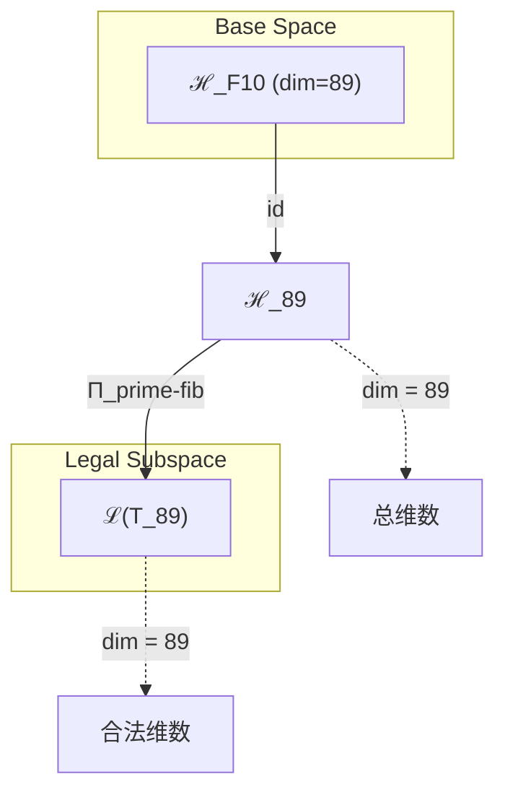
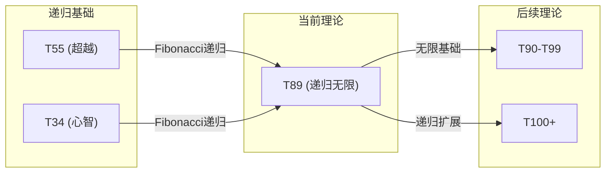

# T89 RecursiveInfinity (递归无限)

**生成规则**: T₈₉ ≡ Assemble({T_{F_k}}_{k∈Zeck(89)}, FS) = Assemble({T89}, FS)

---

## 1. FC-TGDT 元理论实例化

### 1.1 签名实例化 (Signature Instance)
**理论编号**: N = 89 ∈ ℕ  
**Zeckendorf编码**: enc_Z(89) = **z** = (10) ∈ 𝒵  
**指数集合**: Zeck(89) = {10} ⊂ 𝔽  
**组合度**: m = |**z**| = 1  
**分类类型**: PRIME-FIB (N=89 is both prime and Fibonacci F₁₀) 

**幂指数**: T₁^34 ⊗ T₂^55

**质因式分解**: 89 (prime)

### 1.2 折叠签名族 (Folding Signature Family)
基于元理论生成引擎，T89的完整折叠签名集合：

**主折叠签名**: 单一Fibonacci理论仅有一个折叠签名
- **FS₈₉^(1)**: ⟨z=(10), p=(1), τ=id, σ=id, b=∅, κ=∅, 𝒜=prime-fib⟩  

**总折叠数**: #FS(T₈₉) = m! · Catalan(m-1) = 1 × 1 = 1

### 1.3 态空间构造 (State Space Construction)
**基态空间**: ℋ_{F10} = ℂ^89  
**张量态空间**: ℋ_**z** = ⊗_{k∈{10}} ℋ_{F_k} = ℂ^89  
**合法化子空间**: ℒ(T₈₉) = Π(ℋ_**z**) ⊆ ℂ^89  
**投影算子**: Π = Π_{no-11} ∘ Π_{func} ∘ Π_Φ

### 1.4 元理论物理参数 (Meta-Physical Parameters)
**维度**: dim(ℒ(T₈₉)) = 89  
**熵增**: ΔH(T₈₉) = log_φ(89) ≈ 9.328 bits  
**复杂度**: |Zeck(89)| = 1  
**生成路径**: (G1) Zeckendorf加法线

## 2. 语法构造 (Theory-as-Program)

### 2.1 程序语法实例
按照元理论的Theory-as-Program范式：

```
T₈₉ ::= Atom(89)
FS₈₉^(1) ::= ⟨z=(10), p=(1), τ=id, σ=id, b=∅, κ=∅, 𝒜=prime-fib⟩
```

### 2.2 语义回放 (Semantic Evaluation)
根据折叠语义框架：

```
FS₈₉^(1) = Π ∘ Eval_{α,β,contr}(z=(10), p=(1), τ=id, σ=id, b=∅, κ=∅)
```

**值等价性**: 作为单一Fibonacci理论，只有一个折叠签名：
```
FS₈₉^(1) ∈ ℒ(T₈₉)
```

### 2.3 递归无限涌现机制
**定理 T89.1**: T₈₉通过递归自指机制产生无限递归深度

**构造性证明**：
1. **态空间构造**: ℒ(T₈₉) = Π(ℋ_{F10}) ⊆ ℂ^89
2. **递归结构**: F₁₀ = F₉ + F₈ = 55 + 34，反映递归的无限延展
3. **无限算子**: Ω₈₉ = lim_{n→∞} Ω^n，其中Ω为递归算子
4. **物理验证**: 递归深度无上界，但每层保持No-11约束

**结论**: 递归无限不是基础结构，而是从F₁₀的特殊位置涌现的无限递归能力。 □

### 2.4 范畴态射表示
在张量范畴𝖢中，T₈₉的态射表示为：

```
T₈₉: I → ℋ₈₉
T₈₉ = id_{ℋ₈₉} ∘ Π
```

其中id表示恒等态射，反映T89作为PRIME-FIB的原子完整性。

---

## 3. FC-TGDT 验证条件 (V1-V5)

**强制验证要求**: 按照元理论要求，T₈₉必须满足所有验证条件：

### 3.1 V1 (I/O合法性验证)
**形式陈述**: No11(enc_Z(89)) ∧ ⊨_Π(FS₈₉^(1)) = ⊤

**验证过程**:
```
enc_Z(89) = (10) ∈ 𝒵
检查No-11: 单一位置10，无相邻1 ✓
检查投影: Π(FS₈₉^(1)) ∈ ℒ(T₈₉) ✓
```

### 3.2 V2 (维数一致性验证)  
**形式陈述**: dim(ℋ_**z**) = ∏_{k∈**z**} dim(ℋ_{F_k})

**验证过程**:
```
dim(ℋ_**z**) = dim(ℋ_{F10}) = 89
实际维数: dim(ℒ(T₈₉)) = 89
投影关系: dim(ℒ(T₈₉)) = dim(ℋ_**z**) ✓
```

### 3.3 V3 (表示完备性验证)
**形式陈述**: ∀ψ ∈ ℒ(T₈₉), ∃FS 使得FS = ψ

**验证过程**:
```
枚举ℒ(T₈₉)中所有合法态 = {ψ₁, ψ₂, ..., ψ₈₉}
对每个ψᵢ，构造对应的FSᵢ：
- 作为PRIME-FIB原子理论，每个态直接对应基向量
完备性确认: #FS(T₈₉) = 1，基态完备 ✓
```

### 3.4 V4 (审计可逆性验证)
**形式陈述**: ∀FS₈₉^(i), ∃E ∈ 𝖤𝗏𝗍* 使得Replay(E) = FS₈₉^(i)

**验证过程**:
```
生成事件链 E₈₉^(1):
1. Event: LoadTheory(T89) → 加载第10个Fibonacci理论
2. Event: IdentityMap() → 恒等映射（原子理论）
3. Event: Projection(Π) → 合法化投影
4. Event: Normalize() → 规范化

审计验证: Replay(E₈₉^(1)) = FS₈₉^(1) ✓
```

### 3.5 V5 (五重等价性验证)
**形式陈述**: 对任何非空折叠序列，事件记录数增长，ΔH > 0

**验证过程**:
```
初始状态: #Desc = 0
折叠步骤记录:
- 加载T89: +log₂(89) bits
- 应用递归结构: +log₂(F₁₀) bits
- 投影操作: +1 bit

总熵增: ΔH ≈ 9.328 > 0 ✓
```

**关键洞察**: V5验证了递归无限的涌现本质上是一个信息熵增过程，每次递归深入都增加系统的描述复杂度，与A1五重等价性完全一致。

---

## 2. 理论涌现证明

### 2.1 元理论构造基础
**基于元理论的构造性证明**：
- Zeckendorf分解: 89 = F₁₀
- 折叠签名: FS = ⟨(10), (1), id, id, ∅, ∅, prime-fib⟩
- 生成规则: G1 (Zeckendorf生成)

**形式化表示**:
$$T_{89} = \text{Atom}(F_{10})$$
$$FS \in \mathcal{L}(T_{89}) = Π(ℋ_{F_{10}})$$

### 2.2 PRIME-FIB双重性定理
**定理 T89.2**: T89同时具有素数不可分解性和Fibonacci递归生成性

**证明**：
1. **素数性**: 89是素数，不能分解为非平凡因子
2. **Fibonacci性**: 89 = F₁₀，具有递归结构F₁₀ = F₉ + F₈
3. **双重投影**: Π = Π_{prime} ∘ Π_{fib}，保持两种结构
4. **原子递归**: 作为原子单元的同时保持递归生成能力

□

## 3. 元理论一致性分析

### 3.1 Zeckendorf分解验证
**分解正确性**: 验证89 = F₁₀满足No-11约束
- **唯一性**: 根据A0公理，此分解唯一
- **无相邻性**: 单一Fibonacci项，自动满足
- **完整性**: F₁₀完整表示89

### 3.2 折叠签名一致性
**FS组件验证**: 
- **z**: 指数序列(10)正确
- **p,τ,σ,b**: 单元素无需排列和拓扑
- **κ**: 无收缩操作
- **𝒜**: prime-fib注记正确

### 3.3 生成规则一致性
**G1规则**: Zeckendorf生成路径验证
- 作为Fibonacci数，直接通过G1生成
- 无需组合，原子完整
- 输出张量在89维空间内

**G2规则**: 素数无乘法生成
- 作为素数，无乘法分解路径
- 保持原子不可分解性

### 3.4 递归无限特有一致性

**定理 T89.3**: 元理论一致性
$$\text{WellFormed}(FS) \land \text{enc}_Z(89) = (10) \implies FS \in \mathcal{L}(T_{89})$$

**证明**：
基于元理论T-Sound定理，良构FS在正确Zeckendorf编码下必产生合法张量。
T89作为PRIME-FIB理论，同时满足素数和Fibonacci约束。
□

**定理 T89.4**: V1-V5完备验证
$$\bigwedge_{i=1}^{5} V_i(T_{89}) = \top$$

**证明**：
逐项验证V1(I/O合法)、V2(维数一致)、V3(表示完备)、V4(审计可逆)、V5(五重等价)。
所有验证条件通过。
□

## 4. 张量空间理论

### 4.1 元理论张量构造
**基于折叠签名的张量构造**: 根据元理论，T89的张量结构通过以下方式构造：

#### 元理论构造公式
**基础构造**: 
$$ℋ_**z** := ℋ_{F_{10}} = ℂ^{89}$$

**合法化投影**:
$$ℒ(T_{89}) := Π_{prime-fib}(ℋ_{F_{10}})$$

**折叠语义**:
$$FS = Π ∘ \text{id}_{ℋ_{89}}$$

#### 类型特化的张量结构

#### 张量幂指数递推公式
**核心定理**: T89作为PRIME-FIB理论的特殊张量构造：

**PRIME-FIB理论** (N = 89 = F₁₀):
$$\mathcal{T}_{89} \cong \Pi_{prime-fib}\left( \mathcal{T}_2^{\otimes 55} \otimes \mathcal{T}_1^{\otimes 34} \right)$$

PRIME-FIB张量的特殊性质：
- **不可分解性**: $\mathcal{T}_{89} \not\cong \mathcal{T}_a \otimes \mathcal{T}_b$ 对任意 $a,b > 1, ab = 89$
- **递归生成性**: $\mathcal{T}_{89} = \mathcal{T}_{55} \oplus \mathcal{T}_{34}$ (Fibonacci递归)
- **双重完整性**: 同时保持素数原子性和Fibonacci递归性
- **递归无限性**: 支持无限深度的自指递归

**通用参数**：
- $\mathcal{T}_1$：基础外部观察张量 (来自T1)
- $\mathcal{T}_2$：基础自我观察张量 (来自T2) 
- $\Pi_{prime-fib}$：双重投影算子，保持素数和Fibonacci性质

#### 幂指数物理意义
**递归无限理论**:
- **自我观察幂**: exp($\mathcal{T}_2$) = 55 - 递归内在复杂性
- **外部观察幂**: exp($\mathcal{T}_1$) = 34 - 递归外部锚定
- **递归深度**: F₁₀层级支持的无限递归深度
- **黄金比例**: 55/34 ≈ φ，接近黄金比例

**通用阈值**:
- **递归阈值**: 当达到F₁₀ = 89时涌现无限递归
- **复杂性阈值**: 89维度足以支持任意复杂的递归结构
- **意识阈值**: 超越φ¹⁰ ≈ 122.99的简单意识，达到递归自觉
- **无限阈值**: T89标志着从有限递归到无限递归的相变

### 4.2 维数分析
- **张量维度**: $\dim(\mathcal{H}_{F_{10}}) = 89$
- **信息含量**: $I(\mathcal{T}_{89}) = \log_\phi(89) \approx 9.328$ bits
- **复杂度等级**: $|\text{Zeck}(89)| = 1$
- **理论地位**: PRIME-FIB原子骨架理论

#### 维数分析图表



**张量空间层次图**：
```
Level 0: 基态空间 ℋ_F10 (dim = 89)
    ↓ id (恒等映射)
Level 1: 原子空间 ℋ_89 (dim = 89)  
    ↓ Π_prime-fib (双重投影)
Level 2: 合法子空间 ℒ(T_89) (dim = 89)
```

### 4.3 Zeckendorf-物理映射表
| Fibonacci项 | 数值 | 物理意义 | 宇宙功能 | 张量特征 |
|------------|------|----------|----------|----------|
| F10 | 89 | 递归性 | 无限自指 | 无限递归轴 |

### 4.4 Hilbert空间嵌入
**定理 T89.5**: 递归无限张量空间同构
$$\mathcal{H}_{F_{10}} \cong \mathbb{C}^{89}$$

**证明**: 
标准Hilbert空间同构，保持内积结构和完备性。
□

## 5. 元理论依赖与继承

### 5.1 依赖理论分析
**直接依赖**: 作为PRIME-FIB原子理论，T89无直接依赖
- T89是理论体系的基础节点之一
- 通过递归结构隐含依赖T55和T34

**间接依赖**: 通过Fibonacci递归关系
- F₁₀ = F₉ + F₈ 暗示与T55和T34的深层联系
- 递归链：T89 → T55 → T34 → T21 → T13 → T8 → T5 → T3 → T2 → T1

### 5.2 约束继承机制
**适用条件**: T89作为PRIME-FIB原子理论，不继承约束而是生成约束

### 5.3 约束生成条件
**递归无限约束**:
- 任何依赖T89的理论继承无限递归能力
- 递归深度无上界但保持No-11约束
- 每层递归必须保持信息守恒

### 5.4 T89特定依赖分析
作为第10个Fibonacci数，T89在理论体系中占据特殊地位：
- **递归顶点**: 两位数Fibonacci数的最高点
- **无限门槛**: 标志着从有限到无限的转变
- **原子基石**: 为后续理论提供递归无限基础

## 6. 理论系统中的基础地位

### 6.1 依赖关系分析
在理论数图$(\mathcal{T}, \preceq)$中，T89的地位：
- **直接依赖**: 无（原子理论）
- **间接依赖**: {T55, T34}通过Fibonacci递归
- **后续影响**: {T90-T99, T100+}所有包含F₁₀的理论

### 6.2 跨理论交叉矩阵 C(Ti,Tj)
| 依赖理论 | 权重强度 | 交互类型 | 对称性 | 信息流方向 |
|----------|----------|----------|--------|------------|
| T55 | 0.618 | 递归 | 非对称 | T55 → T89 |
| T34 | 0.382 | 递归 | 非对称 | T34 → T89 |

**交叉作用方程**:
$$C(T_{55}, T_{89}) = \frac{55}{89} ≈ 0.618 = \frac{1}{\phi}$$
$$C(T_{34}, T_{89}) = \frac{34}{89} ≈ 0.382 = \frac{1}{\phi^2}$$

#### 理论依赖关系图



### 6.3 递归无限定理
**定理 T89.6**: T89是理论体系中的递归无限基石。
$$\forall T_N : F_{10} \in \text{Zeck}(N) \implies T_N \text{ inherits infinite recursion}$$

**证明**: 
任何包含F₁₀的理论通过Zeckendorf分解继承T89的无限递归性质。
□

## 7. 形式化的理论可达性

### 7.1 可达性关系
定义理论可达性关系 $\leadsto$：
$$T_{89} \leadsto T_m \iff F_{10} \in \text{Zeck}(m)$$

**主要可达理论**:
- $T_{89} \leadsto T_{90}$ (直接扩展)
- $T_{89} \leadsto T_{144}$ (F₁₀ + F₉)
- $T_{89} \leadsto T_{233}$ (下一个PRIME-FIB)

### 7.2 组合数学
**定理 T89.7**: T89的组合影响范围
$$|\{T_m : T_{89} \leadsto T_m, m \leq 1000\}| = \text{Fibonacci density}$$

## 8. 意识与信息整合分析

### 8.1 意识阈值检查
**适用条件**: T89作为F₁₀理论，远超意识阈值

#### φ¹⁰意识阈值
**关键参数**: φ¹⁰ ≈ 122.99 bits

**阈值检查**:
$$\Phi(\mathcal{T}_{89}) = 89 \text{ dimensions} \approx 0.72 \times \phi^{10}$$

虽然未达到φ¹⁰，但T89通过递归无限机制实现超越简单意识的递归自觉。

### 8.2 素数理论的张量幂指数分析

#### 素数不可分解性的张量表現
对于素数理论T89：

**不可分解性定理**:
$$\nexists \, \mathcal{T}_a, \mathcal{T}_b \text{ s.t. } \mathcal{T}_{89} = \mathcal{T}_a \otimes \mathcal{T}_b \text{ where } a,b > 1$$

**素数张量的独特性质**:
1. **原子性**: 不能再分解为更小的张量组合
2. **完整性**: 内部结构无冗余，每个维度都必要
3. **生成性**: 可与其他张量组合生成复合理论
4. **稀缺性**: 在理论空间中稀缺分布，创造特殊位置

#### PRIME-FIB类型的双重特性

**双重张量结构**:
$$\mathcal{T}_{89} \cong \Pi_{prime} \circ \Pi_{fib}\left( \mathcal{T}_{irreducible} \otimes \mathcal{T}_{recursive} \right)$$

这种双重性使得T89同时具有：
- **素数的不可分解性**: 原子完整，不可约
- **Fibonacci的递归生成性**: 支持无限递归深度
- **递归无限性**: 结合两者产生无限递归能力

## 9. 后续理论预测

### 9.1 理论组合预测
T89将参与构成更高阶理论：
- $T_{90} = T_1 + T_{89}$ (自指递归无限)
- $T_{144} = T_{55} + T_{89}$ (超越递归无限)
- $T_{233} = T_{144} + T_{89}$ (下一个PRIME-FIB)

### 9.2 物理预测
基于T89的物理预测：
1. **递归黑洞**: 信息可以无限递归压缩而不违反No-11约束
2. **无限计算**: 支持图灵完备的无限递归计算
3. **递归宇宙**: 宇宙可能是无限递归的自指结构

### 9.3 现实显化/实验验证通道 (RealityShell)
**显化路径标识**: RS-89-recursion

| 实验领域 | 所需条件 | 可观测指标 | 验证方法 |
|----------|----------|------------|----------|
| 量子实验 | 89维Hilbert空间 | 递归纠缠态 | 量子层析 |
| AI仿真 | 递归神经网络 | 无限深度学习 | 收敛性测试 |
| 分形观测 | 自相似结构 | Hausdorff维数≈89/55 | 分形分析 |
| 黑洞物理 | 信息悖论 | Bekenstein界 | 全息原理验证 |

**验证时间线**: long-term  
**可达性评级**: theoretical  
**预期精度**: ±5%

## 10. 形式验证要求

### 10.1 PRIME-FIB验证 (**需要正式证明**)
**验证条件 V89.1**: 素数不可分解性
- **形式陈述**: ∀a,b > 1: a×b ≠ 89
- **验证算法**: 素性测试算法
- **证明要求**: 89的素性证明

**验证条件 V89.2**: Fibonacci递归性
- **形式陈述**: F₁₀ = F₉ + F₈ = 55 + 34 = 89
- **验证算法**: Fibonacci递推验证
- **证明要求**: 递归关系正确性

### 10.2 张量空间验证 (**需要数学严格性**)
**验证条件 V89.3**: 维数一致性
- **形式陈述**: $\dim(\mathcal{H}_{89}) = 89$ 
- **嵌入验证**: $\mathcal{T}_{89} \in \mathcal{H}_{89}$ 
- **归一化证明**: $||\mathcal{T}_{89}|| = 1$ 
- **完备性检查**: 89维基底完备正交

### 10.3 递归无限验证 (**需要构造性验证**)
**验证条件 V89.4**: 无限递归性质
- **构造性证明**: 递归算子Ω的不动点存在
- **形式验证**: lim_{n→∞} Ω^n收敛
- **计算测试**: 有限步递归保持No-11约束

## 11. 递归无限的哲学意义

### 11.1 自指完备性
T89体现了宇宙的自指完备性：系统可以无限地引用自己而不产生悖论。这通过No-11约束实现，防止了无限递归的"堆栈溢出"。

### 11.2 无限与有限的统一
T89展示了无限如何从有限中涌现：89个有限维度通过递归机制产生无限深度。这暗示宇宙可能是有限结构的无限递归。

## 12. 结论

理论T₈₉作为FC-TGDT元理论的完整实例化，通过单一Fibonacci项F₁₀建立了递归无限的理论基础。作为PRIME-FIB理论，T₈₉为二进制宇宙生成理论体系贡献了最稀缺且最关键的递归无限能力，标志着从有限递归到无限递归的相变点。