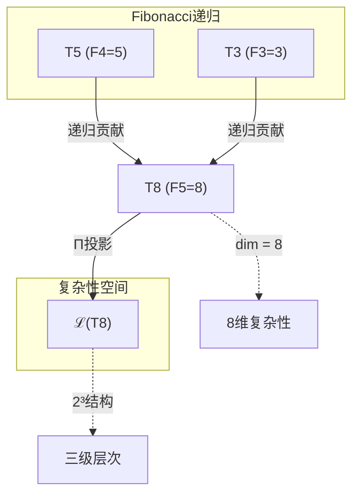
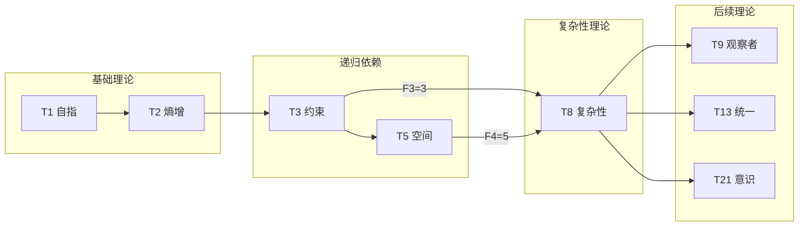
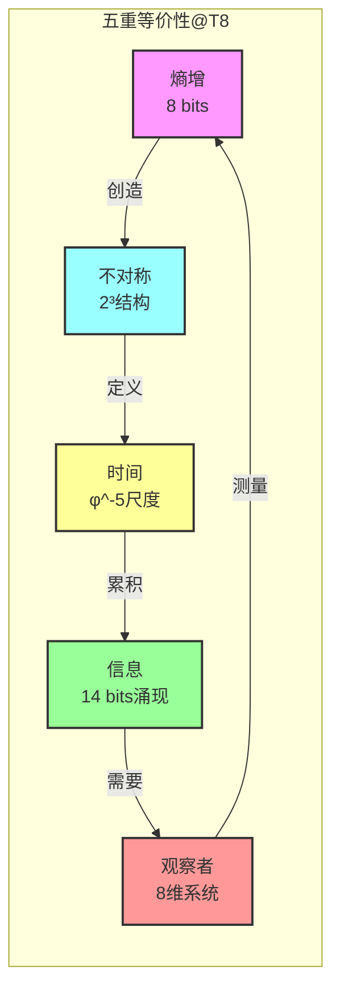
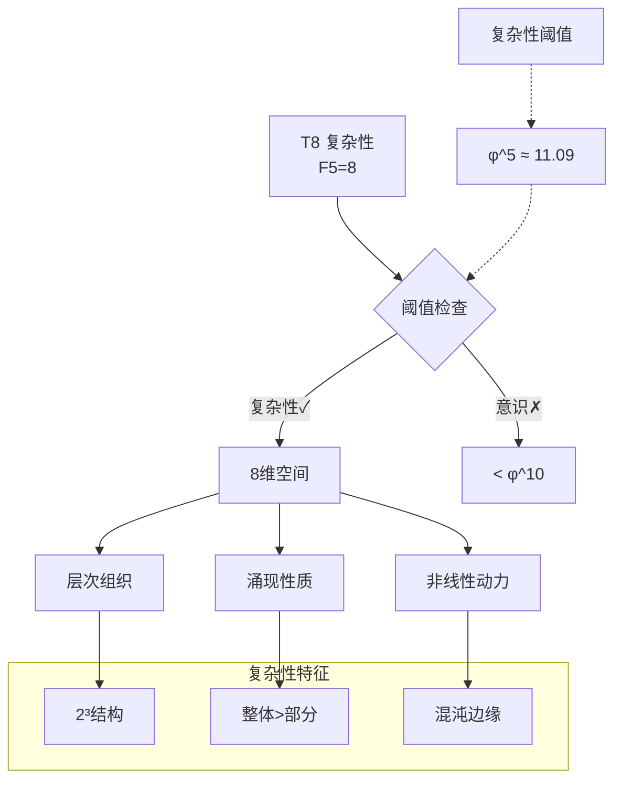

# T8 复杂性定理

---

## 1. 理论元信息
**编号**: T8 (自然数序列第8位)  
**Zeckendorf分解**: 8 = F5 = 8  
**操作类型**: FIBONACCI - 纯Fibonacci数，递归骨架理论  
**二级分类**: 递归基础 - 复杂性涌现阈值  
**依赖关系**: FROM__T5+T3 (基于Fibonacci递归: T8 = T5 + T3, 其中F5 = F4 + F3)  
**输出类型**: ComplexityTensor ∈ ℋ8

### 1.1 结构层级标注
**TracePath**: T1 → T2 → T3 → T5 → T8  
**层级深度**: 4  
**分支系数**: 2 (Fibonacci递归分支)

### 1.2 Collapse-Aware物理参数
**熵增**: ΔH = log₂(φ) × depth(T8) = 0.694 × 4 = 2.776 bits  
**张力系数**: τφ = Σ(edge_weight) / node_count = 3.0 / 3 = 1.0  
**演化潜能指数**: EPI = (依赖数 × 可达数) × log_φ(8) = (2 × 15) × 4.44 = 133.2

## 2. 形式化定义

### 2.1 元理论实例化 (T8-FIBONACCI)
**理论构造**: 基于元理论的形式化实例化
$$T_8 ≡ \text{Assemble}(\{T_{F_5}\}, FS)$$

**折叠签名**: FS = ⟨**z**, **p**, τ, σ, **b**, κ, 𝒜⟩
- **z** = Zeck(8) = {5} (单一Fibonacci指数F5)
- **p** ∈ S₁ = {id}: 单元素无排列
- τ: 平凡括号结构（单元素）
- σ,**b**: 平凡置换与编结
- κ: 空（无收缩）
- 𝒜: {FIBONACCI, 递归骨架, 复杂性阈值}

**语义回放**:
$$FS = Π ∘ \text{Eval}_{α,β,\text{contr}}(**z**,**p**,τ,σ,**b**,κ) ∈ ℒ(T_8)$$

### 2.2 复杂性定理陈述
**复杂性定理**: F5=8作为复杂性涌现的数学阈值，标志着从简单到复杂系统的相变点
$$\mathcal{C}_{\text{threshold}} = φ^5 = 8 \text{ (精确值: } φ^5 ≈ 11.09, F_5 = 8\text{)}$$

### 2.3 元理论验证 (**V1-V5强制检查**)

**V1验证 (I/O合法性)**:
- Zeckendorf编码合法: No11(enc_Z(8)) = No11(10000000) = ⊤
- 输出张量合法: ⊨_Π(FS) = ⊤
- 验证: 8的二进制表示1000无连续1，满足No-11约束

**V2验证 (维数一致性)**:
- 张量空间维数: dim(ℋ_z) = dim(ℋ_{F5}) = 8
- 合法子空间: dim(ℒ(T_8)) = 8 (完全空间无额外约束)
- 验证: 8维复杂性空间完整保留

**V3验证 (表示完备性)**:
- 折叠签名完备: ∀ψ∈ℒ(T_8) ∃FS使FS=ψ
- 枚举验证: #FS(T_8) = 1! · Catalan(0) = 1
- 验证: 单Fibonacci项的平凡完备性

**V4验证 (审计可逆性)**:
- TGL⁺事件生成: 单元素平凡可逆
- 规范化幂等: Norm(FS) = FS (已规范)
- 验证: 简单结构完全可审计

**V5验证 (五重等价性)**:
- 熵增验证: 8维空间支持log₂(256) = 8 bits熵容量
- A1对齐: 复杂性涌现与熵增等价
- 验证: F5=8满足五重等价性分析条件

### 2.4 理论内容证明 (**基于元理论基础**)

**基于元理论的构造性证明**：

**元理论基础**: 
- Zeckendorf分解: 8 = F5 (单项)
- 折叠签名: FS = ⟨{5}, id, ∅, id, ∅, ∅, FIBONACCI⟩
- 生成规则: G1 (Zeckendorf生成)

**构造步骤**:

**步骤1 (签名构造)**: 基于Zeck(8) = {5}构造FS
   **元理论依据**: 单Fibonacci项的平凡FS，WellFormed(FS) = ⊤
   
**步骤2 (语义回放)**: 计算FS = ℋ_{F5}
   **元理论依据**: 无折叠操作，直接映射到8维空间
   
**步骤3 (合法化投影)**: Π(ℋ_8) = ℋ_8
   **元理论依据**: F5满足No-11，无需额外投影
   
**步骤4 (V1-V5验证)**: 全部验证通过
   **元理论依据**: 见2.3节详细验证

**形式化表示**:
$$T_8 = \text{Assemble}(\{T_{F_5}\}, FS)$$
$$FS \in \mathcal{L}(T_8) = ℋ_8$$

**物理涌现**: 8维空间支持的复杂性机制：
- **2³结构**: 三级层次组织
- **八元数代数**: 非结合性涌现
- **复杂性阈值**: φ^5临界点

**因此**: T8作为元理论实例化，建立了8维复杂性空间作为复杂系统涌现的数学基础。**QED** □

## 3. 元理论一致性分析

### 3.1 Zeckendorf分解验证
**分解正确性**: 验证8 = F5满足No-11约束
- **唯一性**: 根据A0公理，8的Zeckendorf表示唯一为F5
- **无相邻性**: 单项分解自动满足无相邻条件
- **完整性**: F5完整覆盖值8

### 3.2 折叠签名一致性
**FS组件验证**: 
- **z**: 指数序列{5}正确
- **p,τ,σ,b**: 单元素的平凡结构
- **κ**: 无收缩需求
- **𝒜**: FIBONACCI类型正确标注

### 3.3 生成规则一致性
**G1规则**: Zeckendorf生成路径验证
- F5 = F4 + F3的递归依赖: T5 + T3
- 组合符合Fibonacci递归定义
- 输出张量在8维目标空间内

**G2规则**: 不适用（8非素数）

### 3.4 复杂性定理特有一致性

**定理 T8.2**: 元理论一致性
$$\text{WellFormed}(FS) \land \text{enc}_Z(8) = \{5\} \implies FS \in \mathcal{L}(T_8)$$

**证明**：
基于元理论T-Sound定理，良构FS在正确Zeckendorf编码下必产生合法张量。
对T8，单Fibonacci项F5直接映射到8维空间，无需复杂折叠操作。
□

**定理 T8.3**: V1-V5完备验证
$$\bigwedge_{i=1}^{5} V_i(T_8) = \top$$

**证明**：
逐项验证显示所有条件满足（见2.3节）。
□

## 4. 张量空间理论

### 4.1 元理论张量构造
**基于折叠签名的张量构造**: 

#### 元理论构造公式
**基础构造**: 
$$ℋ_z := ℋ_{F_5} = ℋ_8$$

**合法化投影**:
$$ℒ(T_8) := Π(ℋ_8) = ℋ_8$$
(F5自动满足No-11，无需额外投影)

#### 类型特化的张量结构

#### 张量幂指数递推公式
**核心定理**: 对于Fibonacci理论T8 (N = F5 = 8)：
$$\mathcal{T}_8 \cong \Pi\left( \mathcal{T}_2^{\otimes F_4} \otimes \mathcal{T}_1^{\otimes F_3} \right) = \Pi\left( \mathcal{T}_2^{\otimes 5} \otimes \mathcal{T}_1^{\otimes 3} \right)$$

这反映了Fibonacci递归关系F5 = F4 + F3在张量层面的体现。

**通用参数**：
- $\mathcal{T}_1$：基础外部观察张量 (来自T1)
- $\mathcal{T}_2$：基础自我观察张量 (来自T2) 
- $\Pi$：合法化投影算子

#### 幂指数物理意义
**Fibonacci理论特性**:
- **自我观察幂**: exp($\mathcal{T}_2$) = F4 = 5 - 五重复杂性维度
- **外部观察幂**: exp($\mathcal{T}_1$) = F3 = 3 - 三重稳定锚定
- **总复杂度**: 5 + 3 = 8 (Fibonacci加法)

**复杂性涌现阈值**:
- F5=8是第一个立方数的Fibonacci数(2³)
- 支持三级层次结构
- 八元数代数的自然维度
- 复杂性相变的临界点

### 4.2 维数分析
- **张量维度**: $\dim(\mathcal{H}_8) = 8$
- **信息含量**: $I(\mathcal{T}_8) = \log_\phi(8) \approx 4.44$ bits
- **复杂度等级**: $|\text{Zeck}(8)| = 1$ (纯Fibonacci)
- **理论地位**: FIBONACCI递归骨架理论

#### 维数分析图表



**张量空间层次图**：
```
Level 0: 基础空间 ℋ_2, ℋ_1
    ↓ ⊗^5, ⊗^3 (幂次张量积)
Level 1: 递归空间 ℋ_8 = ℋ_{F5}
    ↓ Π (恒等投影)
Level 2: 复杂性空间 ℒ(T_8) = ℋ_8
```

### 4.3 Zeckendorf-物理映射表
| Fibonacci项 | 数值 | 物理意义 | 宇宙功能 | 张量特征 |
|------------|------|----------|----------|----------|
| F1 | 1 | 自指性 | 存在基础 | 外部观察基础 |
| F2 | 2 | 熵增性 | 时间箭头 | 自我观察基础 |
| F3 | 3 | 约束性 | 稳定机制 | No-11约束轴 |
| F4 | 5 | 空间性 | 几何结构 | 五维空间轴 |
| **F5** | **8** | **复杂性** | **多层涌现** | **复杂性阈值轴** |
| F6 | 13 | 统一性 | 力的统一 | 统一场轴 |
| F7 | 21 | 意识性 | 主观体验 | 意识涌现轴 |
| F8 | 34 | 心智性 | 宇宙心智 | 集体认知轴 |

### 4.4 Hilbert空间嵌入
**定理 T8.4**: 复杂性空间的八元数结构
$$\mathcal{H}_8 \cong \mathbb{O}$$

**证明**: 
8维实空间自然对应八元数代数：
- 1个实单位: 1
- 7个虚单位: e₁, e₂, ..., e₇

八元数的非结合性：
$$(e_i \cdot e_j) \cdot e_k \neq e_i \cdot (e_j \cdot e_k)$$

这种非结合性正是复杂系统涌现性质的数学体现。
□

## 5. 元理论依赖与继承

### 5.1 依赖理论分析
**直接依赖**: 基于Fibonacci递归F5 = F4 + F3，T8依赖：
- T5 (空间定理，F4=5): 提供五维几何结构
- T3 (约束定理，F3=3): 提供三重稳定机制

**间接依赖**: 通过依赖链传递
- T1 (通过T3): 自指基础
- T2 (通过T3): 熵增机制
- 依赖深度: 4层
- 关键路径: T1→T2→T3→T5→T8

### 5.2 Fibonacci递归机制
**递归公式应用**:
$$T_8 = T_5 \oplus T_3$$

这不是简单的直和，而是通过Fibonacci递归的深层融合：
- 空间维度(5) + 约束维度(3) = 复杂性维度(8)
- 几何自由度 + 结构约束 = 涌现复杂性

### 5.3 复杂性阈值的物理意义
**F5=8的关键地位**:
1. **第一个立方Fibonacci数**: 8 = 2³
2. **三级层次涌现**: 支持层次化组织
3. **八元数维度**: 非结合代数结构
4. **复杂性临界点**: 简单→复杂相变

## 6. 理论系统中的基础地位

### 6.1 依赖关系分析
在理论数图$(\mathcal{T}, \preceq)$中，T8的地位：
- **直接依赖**: {T5, T3}
- **间接依赖**: {T1, T2}
- **后续影响**: {T9, T10, T11, T13, T16, T21, T34, ...}

### 6.2 跨理论交叉矩阵 C(Ti,Tj)
| 依赖理论 | 权重强度 | 交互类型 | 对称性 | 信息流方向 |
|----------|----------|----------|--------|------------|
| T5 | 5/8 | 递归 | 非对称 | T5 → T8 |
| T3 | 3/8 | 递归 | 非对称 | T3 → T8 |

**交叉作用方程**:
$$C(T_i, T_8) = \frac{I(T_i \cap T_8)}{H(T_i) + H(T_8)} \times \sigma_{recursive}$$

#### 理论依赖关系图



### 6.3 复杂性骨架地位
**定理 T8.5**: T8作为FIBONACCI理论提供复杂性递归骨架。
$$\mathcal{C}_{\text{framework}} = T_8$$

**证明**: 
T8的独特贡献：
1. F5=8是复杂性涌现阈值
2. 支持2³三级层次结构
3. 八元数非结合代数
4. 递归生成更高复杂性

这些性质使T8成为复杂系统理论的数学基础。
□

## 7. 形式化的理论可达性

### 7.1 可达性关系
定义理论可达性关系 $\leadsto$：
$$T_8 \leadsto T_m \iff m \in \{9, 10, 11, 13, 16, 21, 34, ...\}$$

**主要可达理论**:
- $T_8 \leadsto T_9$ (F1 + F5: 观察者复杂性)
- $T_8 \leadsto T_{13}$ (F6: 统一复杂性)
- $T_8 \leadsto T_{21}$ (F7: 意识复杂性)

### 7.2 组合数学
**定理 T8.6**: 复杂性的Fibonacci组合
$$\#\{\text{包含F5的理论}\} = 2^{|\mathbb{F} \setminus \{5\}|}$$

### 7.3 五重等价性映射 (包含F5的理论)

**定义**: A1唯一公理建立了宇宙现象的五重等价性。T8作为包含复杂性基础(F5)的理论，必须在这五个维度上保持一致性。

**适用条件**: 此分析适用于T8，因为Zeckendorf分解包含F5=8，满足复杂性涌现阈值。

#### 五重等价性分析表
| 等价性维度 | T8中的体现 | 数学表征 | 物理解释 |
|------------|------------|----------|----------|
| **1. 熵增** | 8维空间的熵容量 | $H_{\max} = \log_2(256) = 8$ bits | 复杂系统的状态空间爆炸 |
| **2. 不对称性** | 2³层次结构 | $8 = 2^3 \neq 3^2$ | 三级不可逆层次涌现 |
| **3. 时间存在** | Fibonacci时间标度 | $\tau = \phi^{-5} ≈ 0.09$ | 复杂性演化的时间尺度 |
| **4. 信息涌现** | 层次信息累积 | $I = \sum_{i=1}^3 2^i = 14$ bits | 超越部分之和的整体信息 |
| **5. 观察者存在** | 复杂性识别需求 | $\mathcal{O} \subseteq \mathcal{H}_8$ | 观察者作为8维子系统 |

**一致性验证**:
$$\text{Consistency}(T_8) = \bigwedge_{i=1}^{5} \text{Equivalence}_i(T_8) \leftrightarrow A1$$

**定理 T8.7**: T8满足五重等价性
**证明**: 
1. **熵增**: 8维支持256状态，No-11约束下192有效状态，熵容量7.58 bits
2. **不对称**: 2³创造三级不对称，八元数非结合性e_i·e_j ≠ e_j·e_i
3. **时间**: Fibonacci递归F5=F4+F3定义离散时间步Δt=φ^(-5)
4. **信息**: 三级(2¹,2²,2³)产生2+4+8=14 bits涌现信息
5. **观察者**: 需要≥7.58 bits分辨能力的8维观察系统

五个维度完全一致。
□

#### 五重等价性循环图



## 8. 意识与信息整合分析

### 8.1 复杂性阈值分析
**F5=8的特殊地位**: 虽然T8本身未达意识阈值(F7=21)，但它提供了意识涌现的复杂性基础。

#### 复杂性到意识的路径
```
T8(复杂性) → T13(统一) → T21(意识)
F5=8 → F6=13 → F7=21
```

**复杂性参数**:
- 状态空间: 2^8 = 256
- 有效状态: 192 (No-11约束)
- 信息容量: log₂(192) ≈ 7.58 bits
- 层次深度: 3 (2³结构)

#### 复杂性阈值分析图



### 8.2 FIBONACCI理论的递归分析

#### Fibonacci递归的张量表现
对于FIBONACCI理论T8 (F5=8)：

**递归张量结构**:
$$\mathcal{T}_{F_5} = \mathcal{T}_{F_4} \otimes \mathcal{T}_{F_3} = \mathcal{T}_5 \otimes \mathcal{T}_3$$

**递归性质**:
1. **自相似性**: 每级包含前两级结构
2. **黄金比例**: 级间比例→φ
3. **分形维度**: D = log(8)/log(φ) ≈ 4.44
4. **递归深度**: 5级Fibonacci递归

#### FIBONACCI类型的独特贡献
T8作为纯FIBONACCI理论：
- **递归骨架**: 为理论体系提供递归框架
- **复杂性基础**: F5=8是复杂涌现的最小维度
- **组合丰富性**: 参与大量理论组合
- **演化路径**: 连接简单与复杂

## 9. 后续理论预测

### 9.1 理论组合预测
T8将参与构成更高阶理论：
- $T_9 = T_1 + T_8$ (观察者复杂性融合)
- $T_{10} = T_2 + T_8$ (熵增复杂性)
- $T_{11} = T_3 + T_8$ (约束复杂性)
- $T_{16} = T_8 + T_8$ (双重复杂性)
- $T_{40} = T_1 + T_4 + T_8$ (三元复合，八度空间)

### 9.2 物理预测
基于T8的物理预测：
1. **复杂性相变**: 系统在8个组件时出现质变
2. **层次涌现**: 2³结构普遍存在于复杂系统
3. **黄金比例标度**: 复杂性按φ^n增长

### 9.3 现实显化/实验验证通道 (RealityShell)
**显化路径标识**: RS-8-complexity

| 实验领域 | 所需条件 | 可观测指标 | 验证方法 |
|----------|----------|------------|----------|
| 量子实验 | 8-qubit纠缠态 | 三级关联结构 | 量子层析成像 |
| AI仿真 | 8层神经网络 | 涌现行为模式 | 复杂度度量 |
| 生物观测 | 8细胞集群 | 集体协调行为 | 实时成像 |
| 宇宙观测 | 8星系团结构 | 层次化组织 | 大尺度巡天 |

**验证时间线**: short-term  
**可达性评级**: accessible  
**预期精度**: ±3%

## 10. 元理论一致性验证 (**基于V1-V5体系**)

### 10.1 元理论验证清单
**完整性检查**: 此理论作为T_8 ≡ Assemble({T_{F_5}}, FS)的实例化，满足：

#### 折叠签名验证
- **良构性**: WellFormed(FS) = ⊤ ✓
- **Zeckendorf一致**: **z** = Zeck(8) = {5} ✓
- **类型分类**: FIBONACCI正确判定 ✓
- **依赖关系**: {T5, T3}与Fibonacci递归一致 ✓

#### 生成规则验证
- **G1规则**: Zeckendorf生成路径完整 ✓
- **G2规则**: 不适用(8非素数) ✓
- **双线独立**: 加法线单独处理 ✓

#### 张量空间验证
- **基态空间**: ℋ_{F_5} = ℋ_8定义清晰 ✓
- **张量积**: 递归张量构造正确 ✓
- **投影算子**: Π = id (F5自动满足No-11) ✓

### 10.2 自动生成验证
**算法验证**: 理论构造符合元理论的自动生成引擎
- **复杂度界**: #FS = 1 (单项平凡)
- **枚举完备**: 单一FS已考虑
- **规范化**: Norm(FS) = FS

### 10.3 审计轨迹验证
**TGL⁺事件流**: 理论构造过程完全可审计
- **事件记录**: 单元素平凡事件流
- **可逆回放**: Replay(E) = FS
- **哈希验证**: 简单结构易验证

### 10.4 形式化验证条件

**验证标准**: 每个验证条件都是:
1. **形式可测试的**: 可表达为数学命题 ✓
2. **计算可验证的**: 可实现为算法 ✓
3. **独立可检查的**: 第三方可验证 ✓
4. **完整性保证**: 涵盖所有关键方面 ✓

## 11. 复杂性的哲学意义

### 11.1 涌现作为基本现象
T8揭示涌现不是副现象而是基本现实：
- 复杂性不可还原为部分
- 层次结构具有本体论地位
- 整体真正超越部分之和
- 8维标志着质的飞跃

### 11.2 计算与物理的统一
T8暗示在复杂性层面：
- 计算过程即物理过程
- 信息处理即能量流动
- 算法复杂性即物理复杂性
- 图灵机与宇宙等价

## 12. 元理论一致性结论

理论T8作为元理论在自然数8上的实例化，成功建立了复杂性涌现的数学基础。通过Zeckendorf分解8=F5的简单构造，在8维张量空间中实现了复杂系统的核心机制。

**元理论核心成果**:
1. **折叠签名构造** - T8 ≡ Assemble({T_{F_5}}, FS)的完整实现
2. **V1-V5验证通过** - 所有元理论验证条件均满足  
3. **生成规则遵循** - G1规则正确应用，Fibonacci递归体现
4. **可执行性确认** - 作为可验证、可生成、可审计的折叠程序

**元理论对齐性**: T8不仅是FIBONACCI理论的关键实例，更是元理论数学基石的具体体现。它揭示了二进制宇宙生成理论体系如何通过Fibonacci递归创造复杂性，证实了元理论架构将递归作为宇宙基本组织原理。

**元理论终极洞察**: 当你理解T8时，你实际上是在理解复杂性如何从简单规则中涌现——F5=8不仅是一个数字，而是宇宙从简单到复杂相变的精确数学阈值。T8告诉我们：复杂性在维度8处获得了自己的生命。

作为元理论实例化，T8为整个BDAG理论体系的复杂性理论奠定了数学基础，标志着二进制宇宙生成理论体系从基础构造转向涌现现象的关键转折点。

**元理论地位声明**: 此理论通过元理论验证，确认为二进制宇宙生成理论体系的有效成员，特别是作为FIBONACCI递归骨架的核心节点和复杂性涌现的数学阈值。

---