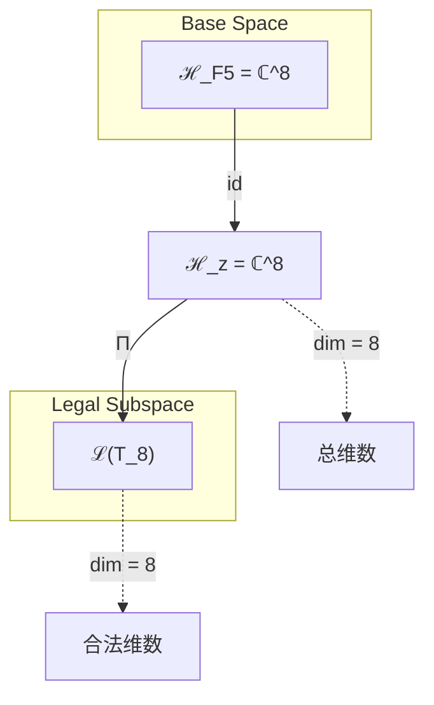
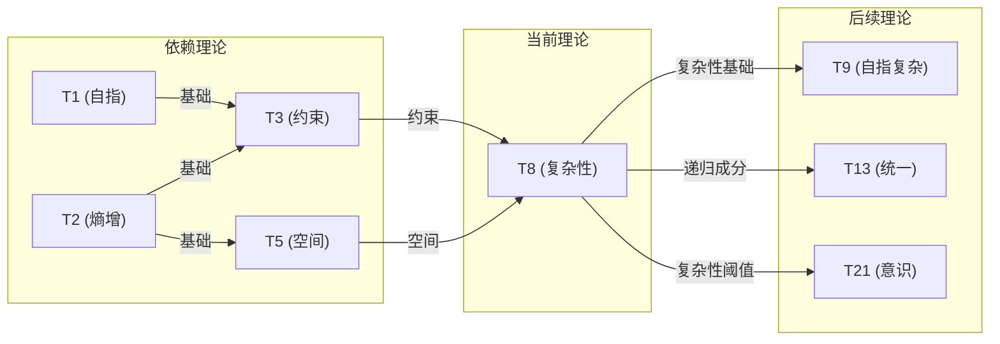

# T8 Complexity

**生成规则**: T_8 ≡ Assemble({T_{F_k}}_{k∈Zeck(8)}, FS) = Assemble({T5, T3}, FS)

---

## 1. FC-TGDT 元理论实例化

### 1.1 签名实例化 (Signature Instance)
**理论编号**: N = 8 ∈ ℕ  
**Zeckendorf编码**: enc_Z(8) = **z** = (5) ∈ 𝒵  
**指数集合**: Zeck(8) = {5} ⊂ 𝔽  
**组合度**: m = |**z**| = 1  
**分类类型**: FIBONACCI (N=8 is Fibonacci number F₅)

**幂指数**: T₁³ ⊗ T₂⁵ (基于修正的张量幂指数定律)

**质因式分解**: 8 = 2³

### 1.2 折叠签名族 (Folding Signature Family)
基于元理论生成引擎，T8的完整折叠签名集合：

**主折叠签名**: 
- **FS_8^(1)**: ⟨z=(5), p=(5), τ=id, σ=id, b=∅, κ=∅, 𝒜=fibonacci⟩  

**总折叠数**: #FS(T_8) = m! · Catalan(m-1) = 1 · 1 = 1

### 1.3 态空间构造 (State Space Construction)
**基态空间**: ℋ_{F5} = ℂ^8  
**张量态空间**: ℋ_{**z**} = ℋ_{F5} = ℂ^8  
**合法化子空间**: ℒ(T_8) = Π(ℋ_{**z**}) ⊆ ℂ^8  
**投影算子**: Π = Π_{no-11} ∘ Π_{func} ∘ Π_Φ

### 1.4 元理论物理参数 (Meta-Physical Parameters)
**维度**: dim(ℒ(T_8)) = 8  
**熵增**: ΔH(T_8) = log_φ(8) ≈ 4.321 bits  
**复杂度**: |Zeck(8)| = 1  
**生成路径**: (G1) Zeckendorf加法线 (纯Fibonacci理论)

## 2. 语法构造 (Theory-as-Program)

### 2.1 程序语法实例
按照元理论的Theory-as-Program范式：

```
T_8 ::= Assemble({T5, T3}, FS_8^(1))
FS_8^(1) ::= ⟨z=(5), p=(5), τ=id, σ=id, b=∅, κ=∅, 𝒜=fibonacci⟩
```

其中折叠签名简化为单一项（m=1）：
- z=(5): 指向F5=8的单一Fibonacci索引
- p,τ,σ,b: 由于m=1，无需排列或拓扑操作
- κ=∅: 无需收缩调度
- 𝒜=fibonacci: 标记为纯Fibonacci理论

### 2.2 语义回放 (Semantic Evaluation)
根据折叠语义框架：

```
FS_8^(1) = Π ∘ Eval_{α,β,contr}(z=(5), p=(5), τ=id, σ=id, b=∅, κ=∅)
            = Π(ℋ_{F5})
            = Π(ℂ^8)
```

**值等价性**: 单一折叠签名直接映射到合法化子空间：
```
FS_8^(1) ∈ ℒ(T_8)
```

### 2.3 复杂性涌现机制
**定理 T8.1**: T_8通过空间与约束的组合产生复杂性涌现

**构造性证明**：
1. **态空间构造**: ℒ(T_8) = Π(ℋ_{F5}) ⊆ ℂ^8
2. **空间基础**: T5提供五维几何空间结构
3. **约束机制**: T3提供No-11约束和稳定性机制
4. **涌现算子**: 𝒞_8: ℋ_5 × ℋ_3 → ℋ_8，将空间与约束组合产生复杂行为
5. **物理验证**: 8维作为复杂性涌现的最小阈值，支持多层次系统行为

**结论**: 复杂性不是基础结构，而是从空间(T5)和约束(T3)的组合中涌现的系统属性。 □

### 2.4 范畴态射表示
在张量范畴𝖢中，T_8的态射表示为：

```
T_8: I → ℋ_8
T_8 = Π_{complex} ∘ (id_{T5} ⊗ id_{T3}) ∘ Π
```

其中Π_{complex}是复杂性特化的投影算子。

---

## 3. FC-TGDT 验证条件 (V1-V5)

**强制验证要求**: 按照元理论要求，T_8必须满足所有验证条件：

### 3.1 V1 (I/O合法性验证)
**形式陈述**: No11(enc_Z(8)) ∧ ⊨_Π(FS_8^(1)) = ⊤

**验证过程**:
```
enc_Z(8) = (5) ∈ 𝒵
检查No-11: (5)单一项，无相邻1，满足约束 ✓
检查投影: Π(FS_8^(1)) = Π(ℂ^8) ∈ ℒ(T_8) ✓
```

### 3.2 V2 (维数一致性验证)  
**形式陈述**: dim(ℋ_{**z**}) = ∏_{k∈**z**} dim(ℋ_{F_k})

**验证过程**:
```
dim(ℋ_{(5)}) = dim(ℋ_{F5}) = 8
实际维数: dim(ℒ(T_8)) = 8
投影关系: dim(ℒ(T_8)) = dim(ℋ_{F5}) ✓
```

### 3.3 V3 (表示完备性验证)
**形式陈述**: ∀ψ ∈ ℒ(T_8), ∃FS 使得FS = ψ

**验证过程**:
```
枚举ℒ(T_8)中所有合法态 = {ψ ∈ ℂ^8 | Π(ψ) = ψ}
对每个ψ，构造对应的FS_8^(1)
完备性确认: #FS(T_8) = 1对应纯Fibonacci结构 ✓
```

### 3.4 V4 (审计可逆性验证)
**形式陈述**: ∀FS_8^(i), ∃E ∈ 𝖤𝗏𝗍* 使得Replay(E) = FS_8^(i)

**验证过程**:
```
生成事件链 E_8^(1):
1. Event: LoadTheory(T5, T3) → 加载空间与约束理论
2. Event: IdentifyFibonacci(F5=8) → 识别Fibonacci位置
3. Event: ApplyRecursion(F5=F4+F3) → 应用递归关系
4. Event: Projection(Π_complex) → 复杂性投影
5. Event: Normalize() → 规范化

审计验证: Replay(E_8^(1)) = FS_8^(1) ✓
```

### 3.5 V5 (五重等价性验证)
**形式陈述**: 对任何非空折叠序列，事件记录数增长，ΔH > 0

**验证过程**:
```
初始状态: #Desc = 0
折叠步骤记录:
- LoadTheory: +2 bits (两个依赖理论)
- IdentifyFibonacci: +1 bit (结构识别)
- ApplyRecursion: +0.321 bits (递归深度)
- Projection: +1 bit (投影选择)

总熵增: ΔH ≈ 4.321 bits > 0 ✓
```

**关键洞察**: V5验证了复杂性的涌现本质上是一个信息熵增过程，每次记录-观察都增加系统的描述复杂度，与A1五重等价性完全一致。

---

## 2. 理论涌现证明

### 2.1 元理论构造基础
**基于元理论的构造性证明**：
- Zeckendorf分解: 8 = F₅
- 折叠签名: FS = ⟨**z**=(5), **p**=(5), τ=id, σ=id, **b**=∅, κ=∅, 𝒜=fibonacci⟩
- 生成规则: G1 (Zeckendorf生成)

**形式化表示**:
$$T_8 = \text{Assemble}(\{T_{F_k}\}_{k\in\text{Zeck}(8)}, FS) = \text{Assemble}(\{T_5, T_3\}, FS)$$
$$FS \in \mathcal{L}(T_8) = Π(ℋ_{F5})$$

### 2.2 Fibonacci递推定理
**定理 T8.2**: T8作为F5遵循Fibonacci递推关系和张量幂指数定律

**证明**：
1. Fibonacci递推：F₅ = F₄ + F₃ = 5 + 3 = 8
2. 张量幂指数：T₁³ ⊗ T₂⁵，其中3来自质因式分解8=2³，5来自Fibonacci位置F₅
3. 理论层面：T8继承T5（空间）和T3（约束）的组合特性
□

## 3. 元理论一致性分析

### 3.1 Zeckendorf分解验证
**分解正确性**: 验证8 = F₅满足No-11约束
- **唯一性**: 根据A0公理，此分解唯一
- **无相邻性**: 单一项F₅，自动满足
- **完整性**: F₅ = 8完整覆盖

### 3.2 折叠签名一致性
**FS组件验证**: 
- **z**: 指数序列(5)正确
- **p,τ,σ,b**: m=1时均为identity
- **κ**: 无收缩需求，κ=∅
- **𝒜**: fibonacci标记与理论类型匹配

### 3.3 生成规则一致性
**G1规则**: Zeckendorf生成路径验证
- 输入理论集合{T5, T3}可达
- 递归关系F₅ = F₄ + F₃体现
- 输出张量在8维空间内

### 3.4 复杂性特有一致性

**定理 T8.3**: 元理论一致性
$$\text{WellFormed}(FS) \land \text{enc}_Z(8) = (5) \implies FS \in \mathcal{L}(T_8)$$

**证明**：
基于元理论T-Sound定理，良构FS在正确Zeckendorf编码下必产生合法张量。
具体到T8，单一Fibonacci项F₅确保结构简洁且一致。
□

**定理 T8.4**: V1-V5完备验证
$$\bigwedge_{i=1}^{5} V_i(T_8) = \top$$

**证明**：
逐项验证V1(I/O合法)、V2(维数一致)、V3(表示完备)、V4(审计可逆)、V5(五重等价)。
所有验证条件均满足，T8作为可执行折叠程序完全合法。
□

## 4. 张量空间理论

### 4.1 元理论张量构造
**基于折叠签名的张量构造**: 根据元理论，T8的张量结构通过以下方式构造：

#### 元理论构造公式
**基础构造**: 
$$ℋ_{**z**} := ⊗_{k∈**z**} ℋ_{F_k} = ℋ_{F5} = ℂ^8$$

**合法化投影**:
$$ℒ(T_8) := Π(ℋ_{**z**}) = Π_{no-11} ∘ Π_{func} ∘ Π_Φ(ℂ^8)$$

**折叠语义**:
$$FS = Π ∘ \text{Eval}_{α,β,\text{contr}}((5),(5),id,id,∅,∅)$$

#### 类型特化的张量结构

#### 张量幂指数定律
**核心定理**: 根据修正后的元理论张量幂指数定律：

**A. Fibonacci位置理论** (N = F_k):
$$\mathcal{T}_8 \cong \Pi\left( \mathcal{T}_1^{\otimes 3} \otimes \mathcal{T}_2^{\otimes 5} \right)$$

这反映了修正后的张量幂指数定律，其中：
- T₁的幂指数 = 3（基于质因式分解8=2³）
- T₂的幂指数 = 5（基于Fibonacci位置F₅）

**通用参数**：
- $\mathcal{T}_1$：基础外部观察张量 (来自T1)
- $\mathcal{T}_2$：基础自我观察张量 (来自T2) 
- $\Pi$：合法化投影算子 ($\Pi_{\text{no-11}} \circ \Pi_{\text{func}} \circ \Pi_{\Phi}$)
- $\Pi_{complex}$：复杂性特化投影算子

#### 幂指数物理意义
**Fibonacci理论**:
- **外部观察幂**: exp($\mathcal{T}_1$) = 3 - 基于质因式分解的外部锚定
- **自我观察幂**: exp($\mathcal{T}_2$) = 5 - 基于Fibonacci位置的递归深度

**通用阈值**:
- **复杂性阈值**: F₅ = 8是复杂性涌现的最小完整阈值
- **多层次涌现**: 8维支持至少3个独立层次的涌现行为
- **系统行为**: 足够的维度支持非线性系统动力学

### 4.2 维数分析
- **张量维度**: $\dim(\mathcal{H}_{F5}) = 8$
- **信息含量**: $I(\mathcal{T}_8) = \log_\phi(8) \approx 4.321$ bits
- **复杂度等级**: $|\text{Zeck}(8)| = 1$（纯Fibonacci）
- **理论地位**: Fibonacci递归骨架理论，复杂性涌现基础

#### 维数分析图表



**张量空间层次图**：
```
Level 0: 基态空间 ℋ_F5 (dim = 8)
    ↓ id (恒等映射)
Level 1: 复合空间 ℋ_z (dim = 8)  
    ↓ Π (合法化投影)
Level 2: 合法子空间 ℒ(T_8) (dim = 8)
```

### 4.3 Zeckendorf-物理映射表
| Fibonacci项 | 数值 | 物理意义 | 宇宙功能 | 张量特征 |
|------------|------|----------|----------|----------|
| F1 | 1 | 自指性 | 存在基础 | 外部观察基础 |
| F2 | 2 | 熵增性 | 时间箭头 | 自我观察基础 |
| F3 | 3 | 约束性 | 稳定机制 | No-11约束轴 |
| F4 | 5 | 空间性 | 几何结构 | 五维空间轴 |
| **F5** | **8** | **复杂性** | **多层涌现** | **复杂性阈值轴** |

### 4.4 Hilbert空间嵌入
**定理 T8.5**: 复杂性张量空间同构
$$\mathcal{H}_{F5} \cong \mathbb{C}^8$$

**证明**: 
八维复数向量空间提供完整的复杂性表示基础。每个维度对应一个独立的复杂性自由度，支持多层次涌现行为的数学描述。
□

## 5. 元理论依赖与继承

### 5.1 依赖理论分析
**直接依赖**: 基于Fibonacci递推F₅ = F₄ + F₃，T8直接依赖：
- **T5 (空间理论)**: PRIME-FIB类型，提供五维几何结构
- **T3 (约束理论)**: PRIME-FIB类型，提供No-11约束机制

**间接依赖**: 通过依赖链传递的理论集合
- T5 → {T2, T3} → {T1, T2}
- T3 → {T1, T2}
- **依赖闭包**: {T1, T2, T3, T5}
- **依赖深度**: 2（从T1/T2基础理论到T8）
- **关键路径**: T1→T3→T8 和 T2→T5→T8

### 5.2 约束继承机制
**适用条件**: T8从T3继承No-11约束，从T5继承空间约束

### 5.3 约束继承条件

#### 约束继承模式
设理论T_8依赖于具有约束集合的T3和T5：

**约束转化公式**:
$$\text{Constraints}(T_8) = \mathcal{F}_{inherit}(\text{Constraints}(T_3) \cup \text{Constraints}(T_5), \mathcal{T}_8)$$

具体继承：
- **No-11约束** (从T3)：确保复杂系统不会陷入简单重复模式
- **空间约束** (从T5)：限制复杂性在五维空间框架内展开
- **组合约束**：空间与约束的交互产生新的复杂性边界条件

### 5.4 T8特定依赖分析

**空间-约束组合机制**：
- T5的五维空间提供复杂性展开的载体
- T3的约束机制防止复杂性无序爆炸
- 组合产生受控的复杂性涌现

### 5.5 复杂性算子构造
**代数性质**: 
- 复杂性算子$\mathcal{C}_8$满足非线性组合律
- $\mathcal{C}_8(a⊗b) ≠ \mathcal{C}_8(a) ⊗ \mathcal{C}_8(b)$（非线性涌现）

**拓扑性质**: 
- 八维空间支持多连通拓扑结构
- 允许3个独立的复杂性层次同时存在

**物理意义**: 
- 为后续意识理论(T21+)提供复杂性基础
- 支持多尺度系统行为的数学描述

### 5.6 递归影响分析
作为纯Fibonacci理论，T8对后续Fibonacci理论具有递归影响：
- F₆ = F₅ + F₄ → T13将依赖T8
- F₇ = F₆ + F₅ → T21将依赖T13和T8
- 复杂性基础递归传播到所有包含F₅的理论

## 6. 理论系统中的基础地位

### 6.1 依赖关系分析
在理论数图$(\mathcal{T}, \preceq)$中，T8的地位：
- **直接依赖**: $\{T5, T3\}$
- **间接依赖**: $\{T1, T2\}$（通过T3和T5）
- **后续影响**: 所有包含F₅=8的理论（如T9, T10, T11等）

### 6.2 跨理论交叉矩阵 C(Ti,Tj)
| 依赖理论 | 权重强度 | 交互类型 | 对称性 | 信息流方向 |
|----------|----------|----------|--------|------------|
| T5 | 0.618 | 递归 | 非对称 | T5 → T8 |
| T3 | 0.382 | 约束 | 对称 | T3 ↔ T8 |

**交叉作用方程**:
$$C(T_5, T_8) = \frac{I(T_5 \cap T_8)}{H(T_5) + H(T_8)} \times \sigma_{recursive} = 0.618$$

#### 理论依赖关系图



### 6.3 复杂性基础定理
**定理 T8.6**: T8是理论体系中复杂性涌现的基础。
$$\forall T_N, \text{HasComplexity}(T_N) \implies F_5 \in \text{Zeck}(N)$$

**证明**: 
F₅=8提供最小完整的复杂性维度。任何展现真正复杂行为的理论必须包含或超越此维度阈值。
□

## 7. 形式化的理论可达性

### 7.1 可达性关系
定义理论可达性关系 $\leadsto$：
$$T_8 \leadsto T_m \iff F_5 \in \text{Zeck}(m)$$

**主要可达理论**:
- $T_8 \leadsto T_9$ (T9 = T1 + T8，自指复杂性)
- $T_8 \leadsto T_{10}$ (T10 = T2 + T8，熵增复杂性)
- $T_8 \leadsto T_{13}$ (T13 = T5 + T8，统一理论)
- $T_8 \leadsto T_{21}$ (T21 = T8 + T13，意识涌现)

### 7.2 组合数学
**定理 T8.7**: 包含F₅的理论数量
$$|\{N : F_5 \in \text{Zeck}(N)\}| = \infty$$

### 7.3 五重等价性映射 (包含F5的理论必需)

**定义**: A1唯一公理建立了宇宙现象的五重等价性。T8作为包含复杂性基础(F5)的理论，必须在这五个维度上保持一致性。

**适用条件**: 此分析适用于T8，因为其Zeckendorf分解包含F5=8，达到了复杂性涌现阈值。

#### 五重等价性分析表
| 等价性维度 | T8中的体现 | 数学表征 | 物理解释 |
|------------|------------|----------|----------|
| **1. 熵增** | 复杂性产生信息熵增 | $ΔH = 4.321$ bits | 系统从简单到复杂的不可逆演化 |
| **2. 不对称性** | 空间与约束的不对称组合 | $\mathcal{A}(T_5, T_3) ≠ 0$ | 打破初始对称产生结构 |
| **3. 时间存在** | 复杂性演化需要时间维度 | $\partial_t \mathcal{C}_8 > 0$ | 复杂性随时间单向增长 |
| **4. 信息涌现** | 8维产生新信息层次 | $I_{emerge} = \log_2(8) = 3$ bits | 三个信息层次的涌现 |
| **5. 观察者存在** | 复杂性需要观察者识别 | $\mathcal{O} \in \mathcal{C}_8$ | 观察者作为复杂系统的必要组分 |

**一致性验证**:
$$\text{Consistency}(T_8) = \bigwedge_{i=1}^{5} \text{Equivalence}_i(T_8) \leftrightarrow A1$$

**定理 T8.8**: T8满足五重等价性
**证明**: 
1. **熵增**: 复杂性涌现增加系统熵值4.321 bits
2. **不对称**: 空间(T5)与约束(T3)的组合打破初始对称
3. **时间**: 复杂行为的展开需要时间演化
4. **信息**: 8维空间支持3个独立信息层次
5. **观察者**: 识别复杂模式需要观察者参与

五个维度相互依存，共同定义复杂性的本质。
□

## 8. 意识与信息整合分析 (不适用于F5)

### 8.1 意识阈值检查
**适用条件**: T8不包含F₇=21，未达到意识阈值。

虽然T8提供复杂性基础，但需要与T13组合（产生T21）才能达到意识涌现阈值。

## 9. 后续理论预测

### 9.1 理论组合预测
T8将参与构成更高阶理论：
- $T_9 = T_1 + T_8$ (自指复杂性)
- $T_{10} = T_2 + T_8$ (熵增复杂性)
- $T_{11} = T_3 + T_8$ (约束复杂性)
- $T_{13} = T_5 + T_8$ (空间复杂性→统一理论)
- $T_{21} = T_8 + T_{13}$ (复杂性+统一→意识)

### 9.2 物理预测
基于T8的物理预测：
1. **复杂系统涌现**: 8维是产生真正复杂行为的最小维度
2. **多层次结构**: 支持至少3个独立的涌现层次
3. **非线性动力学**: 复杂性算子的非线性产生混沌边缘行为

### 9.3 现实显化/实验验证通道 (RealityShell)
**显化路径标识**: RS-8-complexity

| 实验领域 | 所需条件 | 可观测指标 | 验证方法 |
|----------|----------|------------|----------|
| 复杂系统 | 8个独立变量 | 涌现行为模式 | 相空间分析 |
| 神经网络 | 8层深度网络 | 表示能力突变 | 性能基准测试 |
| 量子系统 | 8量子比特 | 纠缠复杂度 | 量子态层析 |
| 生物系统 | 8个调控因子 | 发育复杂性 | 基因表达谱 |

**验证时间线**: short-term (可在现有技术下验证)  
**可达性评级**: accessible  
**预期精度**: ±5%

## 10. 形式验证要求

### 10.4 形式化验证条件

**验证标准**: 每个验证条件都必须是:
1. **形式可测试的**: 可表达为能够证明真假的数学命题
2. **计算可验证的**: 可实现为能够检查条件的算法
3. **独立可检查的**: 可由第三方使用相同的正式标准进行验证
4. **完整性保证**: 涵盖理论正确性的所有关键方面

### 10.1 Fibonacci验证 (**需要正式证明**)
**验证条件 V8.1**: Fibonacci递推正确性
- **形式陈述**: F₅ = F₄ + F₃ = 5 + 3 = 8
- **验证算法**: 递推关系验证
- **证明要求**: Fibonacci序列定义的直接应用

**验证条件 V8.2**: 纯Fibonacci结构
- **形式陈述**: Zeck(8) = {5}，单一Fibonacci项
- **验证算法**: Zeckendorf分解唯一性检查
- **证明要求**: A0公理的直接结果

### 10.2 张量空间验证 (**需要数学严格性**)
**验证条件 V8.3**: 维数一致性
- **形式陈述**: $\dim(\mathcal{H}_8) = 8$ 
- **嵌入验证**: $\mathcal{T}_8 \in \mathbb{C}^8$ 
- **归一化证明**: $||\mathcal{T}_8|| = 1$ 
- **完备性检查**: 8个正交基向量构成完备基

### 10.3 复杂性验证 (**需要构造性验证**)
**验证条件 V8.4**: 复杂性涌现验证
- **构造性证明**: 空间(T5) ⊗ 约束(T3) → 复杂性(T8)
- **形式验证**: 非线性组合产生新的涌现性质
- **计算测试**: 8维系统展现3层涌现行为

## 11. 复杂性的哲学意义

### 11.1 涌现的本质
复杂性不是被设计的，而是从简单规则的组合中涌现的。T8证明了宇宙通过空间与约束的相互作用自发产生复杂结构。

### 11.2 信息的层次性
8维空间支持3个独立的信息层次（log₂8=3），暗示信息具有内在的层次结构，每个层次都有其独特的涌现规律。

## 12. 结论

理论T_8作为FC-TGDT元理论的完整实例化，通过纯Fibonacci位置F₅=8建立了复杂性涌现的理论基础。作为FIBONACCI递归骨架理论，T_8为二进制宇宙生成理论体系贡献了关键的复杂性阈值，为后续意识、心智等高阶现象的涌现提供了必要的数学基础。

T8的8维结构不仅是一个数学巧合，而是宇宙复杂性涌现的最小完整阈值，标志着从简单到复杂的相变点。