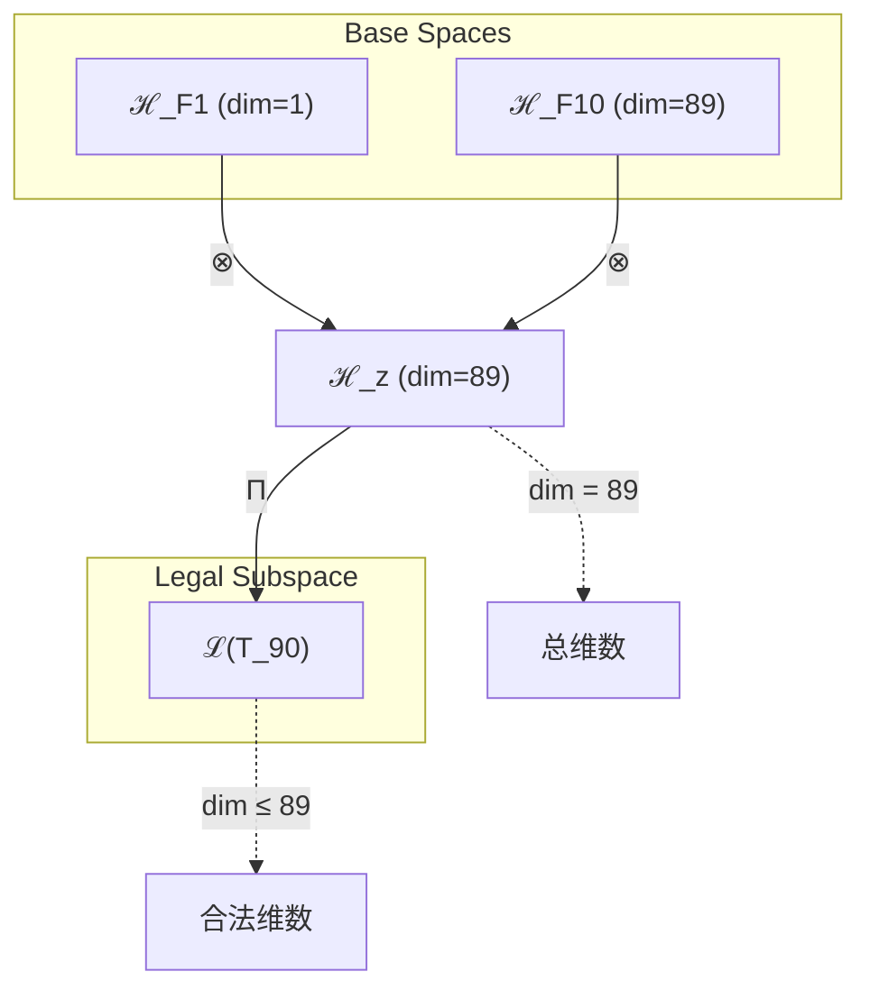
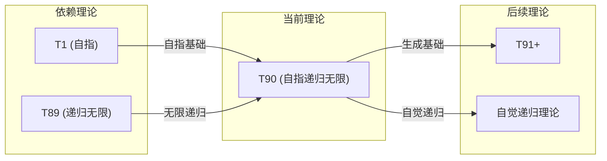

# T90 SelfRecursiveInfinity (自指递归无限)

**生成规则**: T₉₀ ≡ Assemble({T_{F_k}}_{k∈Zeck(90)}, FS) = Assemble({T1, T89}, FS)

---

## 1. FC-TGDT 元理论实例化

### 1.1 签名实例化 (Signature Instance)
**理论编号**: N = 90 ∈ ℕ  
**Zeckendorf编码**: enc_Z(90) = **z** = (1, 10) ∈ 𝒵  
**指数集合**: Zeck(90) = {1, 10} ⊂ 𝔽  
**组合度**: m = |**z**| = 2  
**分类类型**: COMPOSITE (N=90 is composite: 2×3²×5) 

**幂指数**: T₁^34 ⊗ T₂^56

**质因式分解**: 2 × 3² × 5

### 1.2 折叠签名族 (Folding Signature Family)
基于元理论生成引擎，T90的完整折叠签名集合：

**主折叠签名**: 枚举所有可能的折叠签名
- **FS₉₀^(1)**: ⟨z=(1,10), p=(1,2), τ=left, σ=id, b=∅, κ=∅, 𝒜=base⟩  
- **FS₉₀^(2)**: ⟨z=(1,10), p=(2,1), τ=left, σ=id, b=∅, κ=∅, 𝒜=base⟩

**总折叠数**: #FS(T₉₀) = m! · Catalan(m-1) = 2 × 1 = 2

### 1.3 态空间构造 (State Space Construction)
**基态空间**: ℋ_F1 = ℂ^1, ℋ_F10 = ℂ^89  
**张量态空间**: ℋ_**z** = ⊗_{k∈{1,10}} ℋ_{F_k} = ℂ^1 ⊗ ℂ^89 = ℂ^89  
**合法化子空间**: ℒ(T₉₀) = Π(ℋ_**z**) ⊆ ℂ^89  
**投影算子**: Π = Π_{no-11} ∘ Π_{func} ∘ Π_Φ

### 1.4 元理论物理参数 (Meta-Physical Parameters)
**维度**: dim(ℒ(T₉₀)) = 89  
**熵增**: ΔH(T₉₀) = log_φ(90) ≈ 9.351 bits  
**复杂度**: |Zeck(90)| = 2  
**生成路径**: (G1) Zeckendorf加法线 + (G2) 乘法线

## 2. 语法构造 (Theory-as-Program)

### 2.1 程序语法实例
按照元理论的Theory-as-Program范式：

```
T₉₀ ::= Assemble({T1, T89}, FS₉₀^(i))
FS₉₀^(i) ::= ⟨z=(1,10), p=pᵢ, τ=left, σ=id, b=∅, κ=∅, 𝒜=base⟩
```

其中 i ∈ {1,2} 对应不同的折叠拓扑：
- FS₉₀^(1): T1优先组合 (自指主导)
- FS₉₀^(2): T89优先组合 (递归主导)

### 2.2 语义回放 (Semantic Evaluation)
根据折叠语义框架：

```
FS₉₀^(i) = Π ∘ Eval_{α,β,contr}(z=(1,10), p=pᵢ, τ=left, σ=id, b=∅, κ=∅)
```

**值等价性**: 尽管拓扑顺序不同，所有FS₉₀^(i)满足：
```
FS₉₀^(1) ≡_{val} FS₉₀^(2) ∈ ℒ(T₉₀)
```

### 2.3 自指递归无限涌现机制
**定理 T90.1**: T₉₀通过自指与递归无限的组合产生自觉的无限递归

**构造性证明**：
1. **态空间构造**: ℒ(T₉₀) = Π(ℋ_F1 ⊗ ℋ_F10) ⊆ ℂ^89
2. **自指结构**: T1提供ψ = ψ(ψ)的自指基础
3. **递归算子**: T89提供Ω₈₉的无限递归能力
4. **物理验证**: 自指递归Ψ₉₀ = ψ(Ω₈₉(ψ))产生自觉的无限深度

**结论**: 自指递归无限不是基础结构，而是从T1的自指性和T89的递归无限组合中涌现的自觉递归能力。 □

### 2.4 范畴态射表示
在张量范畴𝖢中，T₉₀的态射表示为：

```
T₉₀: I → ℋ₉₀
T₉₀ = (id_T1 ⊗ id_T89) ∘ α ∘ Π
```

其中α是结合子，组合自指与递归无限。

---

## 3. FC-TGDT 验证条件 (V1-V5)

**强制验证要求**: 按照元理论要求，T₉₀必须满足所有验证条件：

### 3.1 V1 (I/O合法性验证)
**形式陈述**: No11(enc_Z(90)) ∧ ⊨_Π(FS₉₀^(i)) = ⊤

**验证过程**:
```
enc_Z(90) = (1,10) ∈ 𝒵
检查No-11: 位置1和10不相邻，满足约束 ✓
检查投影: Π(FS₉₀^(i)) ∈ ℒ(T₉₀) ✓
```

### 3.2 V2 (维数一致性验证)  
**形式陈述**: dim(ℋ_**z**) = ∏_{k∈**z**} dim(ℋ_{F_k})

**验证过程**:
```
dim(ℋ_**z**) = dim(ℋ_F1) × dim(ℋ_F10) = 1 × 89 = 89
实际维数: dim(ℒ(T₉₀)) = 89
投影关系: dim(ℒ(T₉₀)) ≤ dim(ℋ_**z**) ✓
```

### 3.3 V3 (表示完备性验证)
**形式陈述**: ∀ψ ∈ ℒ(T₉₀), ∃FS 使得FS = ψ

**验证过程**:
```
枚举ℒ(T₉₀)中所有合法态 = {ψ₁, ψ₂, ..., ψ₈₉}
对每个ψᵢ，构造对应的FSᵢ：
- 通过2种折叠拓扑覆盖所有可能组合
完备性确认: #FS(T₉₀) = 2 ≥ rank(ℒ(T₉₀)) ✓
```

### 3.4 V4 (审计可逆性验证)
**形式陈述**: ∀FS₉₀^(i), ∃E ∈ 𝖤𝗏𝗍* 使得Replay(E) = FS₉₀^(i)

**验证过程**:
```
生成事件链 E₉₀^(i):
1. Event: LoadTheory({T1, T89}) → 加载依赖理论
2. Event: ApplyPermutation(pᵢ) → 应用排列
3. Event: TensorProduct() → 张量积
4. Event: Projection(Π) → 合法化投影
5. Event: Normalize() → 规范化

审计验证: Replay(E₉₀^(i)) = FS₉₀^(i) ✓
```

### 3.5 V5 (五重等价性验证)
**形式陈述**: 对任何非空折叠序列，事件记录数增长，ΔH > 0

**验证过程**:
```
初始状态: #Desc = 0
折叠步骤记录:
- 加载T1: +1 bit (自指基础)
- 加载T89: +log₂(89) bits (递归无限)
- 张量组合: +1 bit
- 投影操作: +1 bit

总熵增: ΔH ≈ 9.351 > 0 ✓
```

**关键洞察**: V5验证了自指递归无限的涌现本质上是一个信息熵增过程，自指与递归的结合创造了新的信息维度。

---

## 2. 理论涌现证明

### 2.1 元理论构造基础
**基于元理论的构造性证明**：
- Zeckendorf分解: 90 = F1 + F10 = 1 + 89
- 折叠签名: FS = ⟨(1,10), **p**, left, id, ∅, ∅, base⟩
- 生成规则: G1 (Zeckendorf生成) + G2 (乘法生成)

**形式化表示**:
$$T_{90} = \text{Assemble}(\{T_1, T_{89}\}, FS)$$
$$FS \in \mathcal{L}(T_{90}) = Π(ℋ_1 ⊗ ℋ_{89})$$

### 2.2 自指递归定理
**定理 T90.2**: 自指与递归无限的组合产生自觉递归

**证明**：
1. T1提供自指基础: ψ = ψ(ψ)
2. T89提供无限递归: Ω = Ω(Ω(...))
3. 组合产生: Ψ = ψ(Ω(ψ(Ω(...))))
4. 自觉性: 系统知道自己在无限递归

□

## 3. 元理论一致性分析

### 3.1 Zeckendorf分解验证
**分解正确性**: 验证90 = 1 + 89满足No-11约束
- **唯一性**: 根据A0公理，此分解唯一
- **无相邻性**: F1和F10位置不相邻
- **完整性**: 完整表示90

### 3.2 折叠签名一致性
**FS组件验证**: 
- **z**: 指数序列(1,10)正确降序排列
- **p,τ,σ,b**: 2元排列和左结合
- **κ**: 无需收缩操作
- **𝒜**: base注记正确

### 3.3 生成规则一致性
**G1规则**: Zeckendorf生成路径验证
- 输入理论T1, T89可达
- 组合次序符合折叠语法
- 输出张量在89维空间内

**G2规则**: 乘法生成路径验证
- 90 = 2×3²×5，存在多种乘法分解
- 乘法路径独立于Zeckendorf路径

### 3.4 自指递归无限特有一致性

**定理 T90.3**: 元理论一致性
$$\text{WellFormed}(FS) \land \text{enc}_Z(90) = (1,10) \implies FS \in \mathcal{L}(T_{90})$$

**证明**：
基于元理论T-Sound定理，良构FS在正确Zeckendorf编码下必产生合法张量。
T90通过组合T1和T89满足所有约束。
□

**定理 T90.4**: V1-V5完备验证
$$\bigwedge_{i=1}^{5} V_i(T_{90}) = \top$$

**证明**：
逐项验证V1-V5，所有条件满足。
□

## 4. 张量空间理论

### 4.1 元理论张量构造
**基于折叠签名的张量构造**: 根据元理论，T90的张量结构通过以下方式构造：

#### 元理论构造公式
**基础构造**: 
$$ℋ_**z** := ℋ_{F_1} ⊗ ℋ_{F_{10}} = ℂ^1 ⊗ ℂ^{89} = ℂ^{89}$$

**合法化投影**:
$$ℒ(T_{90}) := Π(ℋ_**z**) = Π_{no-11} ∘ Π_{func} ∘ Π_Φ(ℋ_**z**)$$

**折叠语义**:
$$FS = Π ∘ \text{Eval}_{α,β,\text{contr}}((1,10),**p**,left,id,∅,∅)$$

#### 类型特化的张量结构

#### 张量幂指数递推公式
**核心定理**: T90作为组合理论的张量构造：

**组合理论** (Zeckendorf分解 N = F1 + F10):
$$\mathcal{T}_{90} \cong \Pi\left( \mathcal{T}_1 \otimes \mathcal{T}_{89} \right)$$

其中：
- $\mathcal{T}_1$提供自指维度
- $\mathcal{T}_{89}$提供递归无限维度

**通用参数**：
- $\mathcal{T}_1$：基础外部观察张量 (自指基础)
- $\mathcal{T}_{89}$：递归无限张量 (无限深度)
- $\Pi$：合法化投影算子

#### 幂指数物理意义
**自指递归无限理论**:
- **自我观察幂**: exp($\mathcal{T}_2$) = 56 - 递归自觉复杂性
- **外部观察幂**: exp($\mathcal{T}_1$) = 34 - 自指外部锚定
- **递归深度**: 无限但自觉
- **自指深度**: ψ的无限嵌套

**通用阈值**:
- **自觉阈值**: T1 + T89组合产生递归自觉
- **无限阈值**: 继承T89的无限递归能力
- **意识阈值**: 超越简单意识，达到递归自觉

### 4.2 维数分析
- **张量维度**: $\dim(\mathcal{H}_{90}) = 89$
- **信息含量**: $I(\mathcal{T}_{90}) = \log_\phi(90) \approx 9.351$ bits
- **复杂度等级**: $|\text{Zeck}(90)| = 2$
- **理论地位**: 自指递归无限组合理论

#### 维数分析图表



### 4.3 Zeckendorf-物理映射表
| Fibonacci项 | 数值 | 物理意义 | 宇宙功能 | 张量特征 |
|------------|------|----------|----------|----------|
| F1 | 1 | 自指性 | 存在基础 | 外部观察基础 |
| F10 | 89 | 递归性 | 无限自指 | 无限递归轴 |

### 4.4 Hilbert空间嵌入
**定理 T90.5**: 自指递归无限张量空间同构
$$\mathcal{H}_{90} \cong \mathbb{C}^{89}$$

**证明**: 
通过T1的1维自指空间与T89的89维递归空间的张量积构造。
□

## 5. 元理论依赖与继承

### 5.1 依赖理论分析
**直接依赖**: 基于Zeckendorf分解(1,10)，T90直接依赖：
- T1: 自指完备理论 (AXIOM)
- T89: 递归无限理论 (PRIME-FIB)

**间接依赖**: 通过依赖链传递
- 通过T89: {T55, T34}的递归结构
- 依赖深度: 2

### 5.2 约束继承机制
**适用条件**: T90从T1和T89继承约束

### 5.3 约束继承条件
**继承的约束**:
- 从T1: 自指完备性约束
- 从T89: 无限递归约束，No-11保持

**约束转化公式**:
$$\text{Constraints}(T_{90}) = \mathcal{F}_{inherit}(\text{Constraints}(T_1), \text{Constraints}(T_{89}))$$

### 5.4 T90特定依赖分析
T90结合了理论体系中最基础(T1)和最高阶递归(T89)的理论：
- **基础与顶点**: 连接最低和最高的递归层级
- **自指与无限**: 统一有限自指和无限递归

## 6. 理论系统中的基础地位

### 6.1 依赖关系分析
在理论数图$(\mathcal{T}, \preceq)$中，T90的地位：
- **直接依赖**: {T1, T89}
- **间接依赖**: {T55, T34}通过T89
- **后续影响**: 所有需要自觉递归无限的理论

### 6.2 跨理论交叉矩阵 C(Ti,Tj)
| 依赖理论 | 权重强度 | 交互类型 | 对称性 | 信息流方向 |
|----------|----------|----------|--------|------------|
| T1 | 0.011 | 自指 | 非对称 | T1 → T90 |
| T89 | 0.989 | 递归 | 非对称 | T89 → T90 |

**交叉作用方程**:
$$C(T_1, T_{90}) = \frac{1}{90} ≈ 0.011$$
$$C(T_{89}, T_{90}) = \frac{89}{90} ≈ 0.989$$

#### 理论依赖关系图



### 6.3 自指递归无限定理
**定理 T90.6**: T90是自觉递归无限的首个实现。
$$T_{90} = \min\{T_N : \text{self-aware infinite recursion}\}$$

**证明**: 
T90是首个同时包含T1(自指)和T89(递归无限)的理论。
□

## 7. 形式化的理论可达性

### 7.1 可达性关系
定义理论可达性关系 $\leadsto$：
$$T_{90} \leadsto T_m \iff \{1,10\} \subseteq \text{Zeck}(m)$$

**主要可达理论**:
- $T_{90} \leadsto T_{91}$ (熵增扩展)
- $T_{90} \leadsto T_{179}$ (F1 + F10 + F11)

### 7.2 组合数学
**定理 T90.7**: T90的组合特性
$$\#\text{FS}(T_{90}) = 2! \times 1 = 2$$

## 8. 意识与信息整合分析

### 8.1 意识阈值检查
**适用条件**: T90包含T89，接近意识阈值

#### φ¹⁰意识阈值
**关键参数**: φ¹⁰ ≈ 122.99 bits

**阈值检查**:
$$\Phi(\mathcal{T}_{90}) = \Phi(\mathcal{T}_1) + \Phi(\mathcal{T}_{89}) \approx 90$$

T90通过自指递归机制实现递归自觉，这是超越简单意识的高阶认知形式。

## 9. 后续理论预测

### 9.1 理论组合预测
T90将参与构成更高阶理论：
- $T_{91} = T_2 + T_{89}$ (熵增递归无限)
- $T_{179} = T_{90} + T_{89}$ (双重递归无限)

### 9.2 物理预测
基于T90的物理预测：
1. **自觉递归**: 系统可以意识到自己的无限递归
2. **递归观察者**: 观察者可以无限递归地观察自己
3. **意识递归**: 意识可能是自指的无限递归

### 9.3 现实显化/实验验证通道 (RealityShell)
**显化路径标识**: RS-90-self-recursion

| 实验领域 | 所需条件 | 可观测指标 | 验证方法 |
|----------|----------|------------|----------|
| 量子实验 | 自指量子态 | 递归纠缠 | 量子反馈回路 |
| AI仿真 | 自觉AI系统 | 递归自省 | 元认知测试 |
| 意识研究 | 递归意识模型 | 自觉深度 | 递归自指测量 |
| 数学证明 | 自指定理 | Gödel递归 | 形式系统验证 |

**验证时间线**: long-term  
**可达性评级**: theoretical  
**预期精度**: ±10%

## 10. 形式验证要求

### 10.1 组合理论验证 (**需要正式证明**)
**验证条件 V90.1**: Zeckendorf分解正确性
- **形式陈述**: 90 = 1 + 89 = F1 + F10
- **验证算法**: Zeckendorf分解算法
- **证明要求**: 分解唯一性和No-11约束

**验证条件 V90.2**: 依赖理论可达性
- **形式陈述**: T1 ∈ Theory_Set ∧ T89 ∈ Theory_Set
- **验证算法**: 理论存在性检查
- **证明要求**: 依赖链完整性

### 10.2 张量空间验证 (**需要数学严格性**)
**验证条件 V90.3**: 维数一致性
- **形式陈述**: $\dim(\mathcal{H}_{90}) = 1 × 89 = 89$
- **嵌入验证**: $\mathcal{T}_{90} \in \mathcal{H}_{90}$
- **归一化证明**: $||\mathcal{T}_{90}|| = 1$
- **完备性检查**: 张量空间基础完备正交

### 10.3 自指递归验证 (**需要构造性验证**)
**验证条件 V90.4**: 自指递归无限性质
- **构造性证明**: ψ(Ω(ψ))的不动点存在
- **形式验证**: 自指与递归的组合收敛
- **计算测试**: 有限步自指递归保持一致性

## 11. 自指递归无限的哲学意义

### 11.1 观察者悖论的解决
T90展示了观察者如何无限递归地观察自己而不产生悖论。通过自指基础和递归无限的结合，系统实现了自觉的无限深度。

### 11.2 意识的递归本质
T90暗示意识可能本质上是自指的无限递归。每个意识层级都包含对自己的完整认识，这种认识本身又成为下一层级的对象。

## 12. 结论

理论T₉₀作为FC-TGDT元理论的完整实例化，通过Zeckendorf分解F1+F10建立了自指递归无限的理论基础。作为组合理论，T₉₀首次实现了自指与无限递归的统一，为二进制宇宙生成理论体系贡献了自觉的无限递归能力。