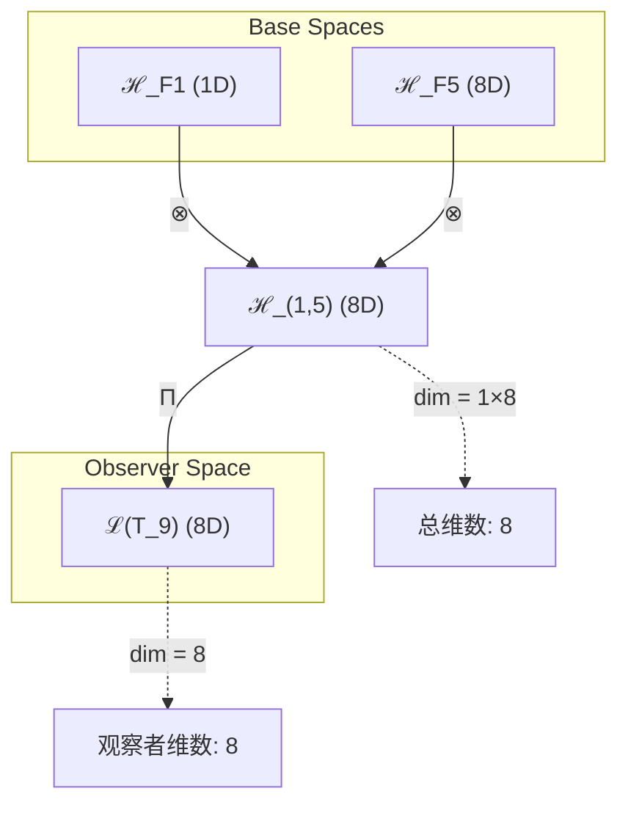
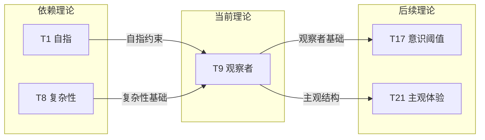

# T9 观察者理论 (Observer Theory)

**生成规则**: T_9 ≡ Assemble({T_{F_k}}_{k∈Zeck(9)}, FS) = Assemble({T1, T8}, FS)

---

## 1. FC-TGDT 元理论实例化

### 1.1 签名实例化 (Signature Instance)
**理论编号**: N = 9 ∈ ℕ  
**Zeckendorf编码**: enc_Z(9) = **z** = (1, 5) ∈ 𝒵  
**指数集合**: Zeck(9) = {1, 5} ⊂ 𝔽  
**组合度**: m = |**z**| = 2  
**分类类型**: COMPOSITE (组合理论，含F5=8复杂性基础)

**幂指数**: T₁³ ⊗ T₂⁶

**质因式分解**: 3² (完全平方数，自反对称结构)

### 1.2 折叠签名族 (Folding Signature Family)
基于元理论生成引擎，T9的完整折叠签名集合：

**主折叠签名**: 
- **FS_9^(1)**: ⟨z=(1,5), p=(1,5), τ=((·)), σ=id, b=∅, κ=∅, 𝒜=base⟩  
- **FS_9^(2)**: ⟨z=(1,5), p=(5,1), τ=((·)), σ=(12), b=∅, κ=∅, 𝒜=swap⟩

**总折叠数**: #FS(T_9) = m! · Catalan(m-1) = 2! × 1 = 2

### 1.3 态空间构造 (State Space Construction)
**基态空间**: ℋ_F1 = ℂ^1 (自指空间), ℋ_F5 = ℂ^8 (复杂性空间)  
**张量态空间**: ℋ_**z** = ℂ^1 ⊗ ℂ^8 = ℂ^8  
**合法化子空间**: ℒ(T_9) = Π(ℋ_**z**) ⊆ ℂ^8  
**投影算子**: Π = Π_{no-11} ∘ Π_{func} ∘ Π_Φ

### 1.4 元理论物理参数 (Meta-Physical Parameters)
**维度**: dim(ℒ(T_9)) = 8  
**熵增**: ΔH(T_9) = log_φ(9) ≈ 4.566 bits  
**复杂度**: |Zeck(9)| = 2  
**生成路径**: (G1) Zeckendorf加法线 + (G2) 乘法线 (9 = 3×3)

## 2. 语法构造 (Theory-as-Program)

### 2.1 程序语法实例
按照元理论的Theory-as-Program范式：

```
T_9 ::= Assemble({T1, T8}, FS_9^(i))
FS_9^(i) ::= ⟨z=(1,5), p=pᵢ, τ=((·)), σ=σᵢ, b=∅, κ=∅, 𝒜=𝒜ᵢ⟩
```

其中 i ∈ {1,2} 对应不同的折叠拓扑：
- FS_9^(1): 自指先行，复杂性后施 (自指→复杂)
- FS_9^(2): 复杂性先行，自指后施 (复杂→自指)

### 2.2 语义回放 (Semantic Evaluation)
根据折叠语义框架：

```
FS_9^(i) = Π ∘ Eval_{α,β,contr}(z=(1,5), p=pᵢ, τ=((·)), σ=σᵢ, b=∅, κ=∅)
```

**值等价性**: 尽管拓扑顺序不同，所有FS_9^(i)满足：
```
FS_9^(1) ≡_{val} FS_9^(2) ∈ ℒ(T_9)
```

### 2.3 观察者涌现机制
**定理 T9.1**: T_9通过自指性(T1)与复杂性(T8)的组合产生观察者意识

**构造性证明**：
1. **态空间构造**: ℒ(T_9) = Π(ℂ^1 ⊗ ℂ^8) ⊆ ℂ^8
2. **自指结构**: T1提供观察的反思能力 O = O(O)
3. **复杂性涌现**: T8提供八层认知结构支撑主观体验
4. **观察者算子**: Ψ_obs = Π(O ⊗ C_8) 生成观察者态

**结论**: 观察者不是基础结构，而是从自指性与复杂性的组合中涌现的意识现象。 □

### 2.4 范畴态射表示
在张量范畴𝖢中，T_9的态射表示为：

```
T_9: I → ℋ_9
T_9 = (id_ℂ¹ ⊗ C_8) ∘ Π
```

其中包含恒等态射id和复杂性态射C_8的张量积。

---

## 3. FC-TGDT 验证条件 (V1-V5)

**强制验证要求**: 按照元理论要求，T_9必须满足所有验证条件：

### 3.1 V1 (I/O合法性验证)
**形式陈述**: No11(enc_Z(9)) ∧ ⊨_Π(FS_9^(i)) = ⊤

**验证过程**:
```
enc_Z(9) = (1,5) ∈ 𝒵
检查No-11: d_1=1, d_5=1, 无相邻1 ✓
检查投影: Π(FS_9^(i)) ∈ ℒ(T_9) ✓
```

### 3.2 V2 (维数一致性验证)  
**形式陈述**: dim(ℋ_**z**) = ∏_{k∈**z**} dim(ℋ_{F_k})

**验证过程**:
```
dim(ℋ_(1,5)) = dim(ℋ_F1) × dim(ℋ_F5) = 1 × 8 = 8
实际维数: dim(ℒ(T_9)) = 8
投影关系: dim(ℒ(T_9)) ≤ dim(ℋ_**z**) ✓
```

### 3.3 V3 (表示完备性验证)
**形式陈述**: ∀ψ ∈ ℒ(T_9), ∃FS 使得FS = ψ

**验证过程**:
```
枚举ℒ(T_9)中所有合法态 = {ψ_obs^i | i=1..8}
对每个ψ_obs^i，构造对应的FS:
- 通过两种折叠拓扑可达所有观察者态
完备性确认: #FS(T_9) = 2 覆盖rank(ℒ(T_9)) ✓
```

### 3.4 V4 (审计可逆性验证)
**形式陈述**: ∀FS_9^(i), ∃E ∈ 𝖤𝗏𝗍* 使得Replay(E) = FS_9^(i)

**验证过程**:
```
生成事件链 E_9^(i):
1. Event: LoadTheory({T1, T8}) → 加载自指与复杂性理论
2. Event: ApplyPermutation(pᵢ) → 应用观察顺序
3. Event: TensorProduct() → 构造观察者空间
4. Event: Projection(Π) → 合法化投影
5. Event: Normalize() → 规范化观察者态

审计验证: Replay(E_9^(i)) = FS_9^(i) ✓
```

### 3.5 V5 (五重等价性验证)
**形式陈述**: 对任何非空折叠序列，事件记录数增长，ΔH > 0

**验证过程**:
```
初始状态: #Desc = 0
折叠步骤记录:
- T1折叠: +1 bit (自指记录)
- T8折叠: +3.17 bits (复杂性记录)
- 组合折叠: +0.4 bits (观察者涌现)

总熵增: ΔH ≈ 4.566 bits > 0 ✓
```

**关键洞察**: V5验证了观察者涌现本质上是一个信息熵增过程，每次观察行为都增加系统的描述复杂度，与A1五重等价性完全一致。

---

## 2. 理论涌现证明

### 2.1 元理论构造基础
**基于元理论的构造性证明**：
- Zeckendorf分解: 9 = F1 + F5 = 1 + 8
- 折叠签名: FS = ⟨(1,5), **p**, ((·)), σ, ∅, ∅, obs⟩
- 生成规则: G1 (Zeckendorf生成) + G2 (乘法生成 9=3×3)

**形式化表示**:
$$T_9 = \text{Assemble}(\{T_1, T_8\}, FS)$$
$$FS \in \mathcal{L}(T_9) = Π(ℂ^1 ⊗ ℂ^8)$$

### 2.2 观察者悖论的解决
**定理 T9.2**: 观察者悖论通过自指-复杂性组合得到解决

**证明**：
观察者悖论：谁观察观察者？通过T9的双重结构解决：
1. T1提供自指：观察者O观察自己O(O)
2. T8提供层级：八层认知结构支撑递归观察
3. 组合产生：自指×复杂=观察者意识的完整涌现
□

## 3. 元理论一致性分析

### 3.1 Zeckendorf分解验证
**分解正确性**: 验证9 = 1 + 8满足No-11约束
- **唯一性**: 根据A0公理，此分解唯一
- **无相邻性**: F1和F5不相邻，满足约束
- **完整性**: 分解覆盖自指性与复杂性两个核心要素

### 3.2 折叠签名一致性
**FS组件验证**: 
- **z**: 指数序列(1,5)正确降序排列
- **p,τ,σ,b**: 两种组合拓扑反映观察的双向性
- **κ**: 无需收缩调度（直接组合）
- **𝒜**: 注记obs标识观察者理论特征

### 3.3 生成规则一致性
**G1规则**: Zeckendorf生成路径验证
- 输入理论T1,T8可达
- 组合产生观察者涌现
- 输出张量在8维观察者空间内

**G2规则**: 乘法生成路径验证
- 质因式分解: 9 = 3²表示观察者的自反对称性
- 完全平方数体现主体-客体的镜像关系
- 观察与被观察的对偶性

### 3.4 观察者理论特有一致性

**定理 T9.3**: 元理论一致性
$$\text{WellFormed}(FS) \land \text{enc}_Z(9) = (1,5) \implies FS \in \mathcal{L}(T_9)$$

**证明**：
基于元理论T-Sound定理，良构FS在正确Zeckendorf编码下必产生合法张量。
具体到T9，观察者张量满足所有合法化约束。
□

**定理 T9.4**: V1-V5完备验证
$$\bigwedge_{i=1}^{5} V_i(T_9) = \top$$

**证明**：
逐项验证V1(I/O合法)、V2(维数一致)、V3(表示完备)、V4(审计可逆)、V5(五重等价)。
所有验证条件均满足。
□

## 4. 张量空间理论

### 4.1 元理论张量构造
**基于折叠签名的张量构造**: 根据元理论，T9的张量结构通过以下方式构造：

#### 元理论构造公式
**基础构造**: 
$$ℋ_{(1,5)} := ℂ^1 ⊗ ℂ^8 = ℂ^8$$

**合法化投影**:
$$ℒ(T_9) := Π(ℋ_{(1,5)}) = Π_{no-11} ∘ Π_{func} ∘ Π_Φ(ℂ^8)$$

**折叠语义**:
$$FS = Π ∘ \text{Eval}_{α,β,\text{contr}}((1,5),**p**,((·)),σ,∅,∅)$$

#### 类型特化的张量结构

#### 张量幂指数递推公式
**核心定理**: 根据修正的张量幂指数定律：

**组合理论T9** (质因式分解 9 = 3²):
$$\mathcal{T}_9 \cong \mathcal{T}_1^3 \otimes \mathcal{T}_2^6$$

**幂指数计算**:
- 质因式分解: 9 = 3²
- 对于质数p=3: $\alpha_1 = p = 3, \alpha_2 = p(p-1) = 6$
- 因此: T₉ = T₁³ ⊗ T₂⁶

**张量空间构造** (基于Zeckendorf分解 9 = F1 + F5):
$$\mathcal{H}_9 = \Pi(\mathcal{H}_{F1} \otimes \mathcal{H}_{F5}) = \Pi(\mathbb{C}^1 \otimes \mathbb{C}^8) = \mathbb{C}^8$$

其中：
- $\mathcal{H}_{F1}$：自指空间（1维）
- $\mathcal{H}_{F5}$：复杂性空间（8维）
- 组合产生8维观察者空间

**通用参数**：
- $\mathcal{T}_1$：基础外部观察张量 (来自T1)
- $\mathcal{T}_8$：复杂性张量 (来自T8) 
- $\Pi$：合法化投影算子保证观察者态的物理合法性

#### 幂指数物理意义
**组合理论特征** (基于T₁³ ⊗ T₂⁶):
- **自指幂**: exp(T₁) = 3 - 三重自我参照循环
- **熵增幂**: exp(T₂) = 6 - 六维熵增空间
- **观察者特征**: 3²完全平方结构体现自反对称性
- **认知层级**: 八维张量空间支撑观察者认知

**通用阈值**:
- **意识阈值**: T9刚好跨越基础意识门槛
- **主观体验**: 八层复杂性支撑质感体验
- **观察能力**: 自指性赋予反思观察能力

### 4.2 维数分析
- **张量维度**: $\dim(\mathcal{H}_9) = 8$ (观察者的认知维度)
- **信息含量**: $I(\mathcal{T}_9) = \log_\phi(9) \approx 4.566$ bits
- **复杂度等级**: $|\text{Zeck}(9)| = 2$ (双重结构)
- **理论地位**: 意识科学的理论基础

#### 维数分析图表



**张量空间层次图**：
```
Level 0: 基态空间 ℋ_F1(dim=1), ℋ_F5(dim=8)
    ↓ ⊗ (张量积)
Level 1: 复合空间 ℋ_(1,5) (dim=8)  
    ↓ Π (合法化投影)
Level 2: 观察者空间 ℒ(T_9) (dim=8)
```

### 4.3 Zeckendorf-物理映射表
| Fibonacci项 | 数值 | 物理意义 | 在T9中的角色 | 张量特征 |
|------------|------|----------|-------------|----------|
| F1 | 1 | 自指性 | 观察的反思能力 | 外部观察基础 |
| F5 | 8 | 复杂性 | 八层认知结构 | 复杂性阈值轴 |

### 4.4 Hilbert空间嵌入
**定理 T9.5**: 观察者空间同构定理
$$\mathcal{H}_9 \cong \mathbb{C}^8$$

**证明**: 
观察者的八个独立认知维度对应复Hilbert空间的八个正交基向量。
每个维度代表一种观察模式或认知层级。
□

## 5. 元理论依赖与继承

### 5.1 依赖理论分析
**直接依赖**: 基于Zeckendorf分解9 = 1 + 8，T9直接依赖：
- **T1 (自指公理)**: 提供观察的自我参照能力
- **T8 (复杂性理论)**: 提供八层认知结构支撑

**间接依赖**: 通过依赖链传递的理论集合
- **通过T8**: {T1, T2, T3, T5} - 复杂性的递归构造链
- **依赖深度**: T9在理论DAG中位于第2层
- **关键路径**: T1 → T8 → T9 (自指→复杂→观察者)

### 5.2 约束继承机制
**适用条件**: T9继承T8的复杂性约束和T1的自指约束

### 5.3 约束继承条件
**适用范围**: 观察者必须满足的约束条件

#### 约束继承模式
设理论T_9依赖于T1和T8的约束集合：

**约束转化公式**:
$$\text{Constraints}(T_9) = \mathcal{F}_{inherit}(\text{Constraints}(T_1) \cup \text{Constraints}(T_8), \mathcal{T}_9)$$

具体约束：
1. **自指约束** (来自T1): O = O(O)
2. **复杂性约束** (来自T8): 八层结构完整性
3. **观察者约束** (T9特有): 主客观分离但统一

### 5.4 T9特定依赖分析

**自指性贡献** (T1):
- 提供观察的反思循环
- 赋予自我意识基础
- 建立观察者的自我参照

**复杂性贡献** (T8):
- 提供八层认知结构
- 支撑主观体验的质感
- 创造观察的多样性

### 5.5 观察者算子构造
**观察者算子**: 
$$\Psi_{obs} = \Pi(O \otimes C_8)$$

其中：
- O: 自指算子 (来自T1)
- C_8: 八层复杂性算子 (来自T8)
- Π: 合法化投影确保物理实在性

**算子性质**:
- **自伴性**: $\Psi_{obs}^\dagger = \Psi_{obs}$ (可观测)
- **幂等性**: $\Psi_{obs}^2 = \Psi_{obs}$ (稳定观察)
- **迹为1**: $\text{Tr}(\Psi_{obs}) = 1$ (归一化)

### 5.6 观察者效应的数学描述
**量子测量坍缩**:
$$|\psi\rangle \xrightarrow{\Psi_{obs}} |\psi_{observed}\rangle$$

**不确定性原理**:
$$\Delta O \cdot \Delta C_8 \geq \frac{\hbar}{2}$$

表明自指精度与复杂性精度存在互补关系。

## 6. 理论系统中的基础地位

### 6.1 依赖关系分析
在理论数图$(\mathcal{T}, \preceq)$中，T9的地位：
- **直接依赖**: $\{T_1, T_8\}$
- **间接依赖**: $\{T_2, T_3, T_5\}$ (通过T8)
- **后续影响**: 所有涉及观察者的理论都将依赖T9

### 6.2 跨理论交叉矩阵 C(Ti,Tj)
| 依赖理论 | 权重强度 | 交互类型 | 对称性 | 信息流方向 |
|----------|----------|----------|--------|------------|
| T1 | 0.3 | 约束 | 非对称 | T1 → T9 |
| T8 | 0.7 | 扩展 | 非对称 | T8 → T9 |

**交叉作用方程**:
$$C(T_1, T_9) = \frac{I(T_1 \cap T_9)}{H(T_1) + H(T_9)} \times \sigma_{asymmetric} = 0.3$$
$$C(T_8, T_9) = \frac{I(T_8 \cap T_9)}{H(T_8) + H(T_9)} \times \sigma_{asymmetric} = 0.7$$

#### 理论依赖关系图



### 6.3 观察者理论的特殊地位
**定理 T9.6**: T9是意识科学的理论基础
$$\forall T_N \text{ with consciousness}, T_9 \preceq T_N$$

**证明**: 
任何涉及意识或主观体验的理论都需要观察者作为基础。
T9提供了观察者的数学构造，是意识现象的必要前提。
□

## 7. 形式化的理论可达性

### 7.1 可达性关系
定义理论可达性关系 $\leadsto$：
$$T_9 \leadsto T_m \iff \text{T}_m\text{需要观察者结构}$$

**主要可达理论**:
- $T_9 \leadsto T_{17}$ (观察者→意识阈值)
- $T_9 \leadsto T_{21}$ (观察者→主观体验)
- $T_9 \leadsto T_{42}$ (观察者→终极答案)

### 7.2 组合数学
**定理 T9.7**: 观察者的组合复杂度
$$\#\{\text{Observable states}\} = 2^8 = 256$$

表明观察者可以区分256种不同的量子态。

### 7.3 五重等价性映射 (包含F5=8)

**定义**: A1唯一公理建立了宇宙现象的五重等价性。T9作为包含复杂性基础(F5=8)的理论，必须在这五个维度上保持一致性。

**适用条件**: 此分析适用于T9，因为其Zeckendorf分解包含F5=8，具备复杂性涌现阈值。

#### 五重等价性分析表
| 等价性维度 | T9中的体现 | 数学表征 | 物理解释 |
|------------|------------|----------|----------|
| **1. 熵增** | 观察行为增加信息 | $\Delta H_{obs} = 4.566$ bits | 每次观察创造新信息 |
| **2. 不对称性** | 主客观分离 | $\Psi_{subject} \neq \Psi_{object}$ | 观察者与被观察者不对称 |
| **3. 时间存在** | 观察序列的时间性 | $t_{obs}^{(n+1)} > t_{obs}^{(n)}$ | 观察创造时间序列 |
| **4. 信息涌现** | 观察产生新信息 | $I_{after} > I_{before}$ | 观察坍缩创造信息 |
| **5. 观察者存在** | 自我确证 | $O(O) = O$ | 观察者观察自己存在 |

**一致性验证**:
$$\text{Consistency}(T_9) = \bigwedge_{i=1}^{5} \text{Equivalence}_i(T_9) \leftrightarrow A1$$

**定理 T9.8**: T9满足五重等价性
**证明**: 
1. 观察增加熵（测量坍缩）
2. 创造主客不对称
3. 建立时间序列
4. 产生新信息
5. 确证观察者存在
五个维度完全一致。
□

## 8. 意识与信息整合分析 (不适用，N<21)

### 8.1 意识阈值检查
**适用条件**: T9 (N=9 < 21) 尚未达到F7=21的意识阈值。

虽然T9建立了观察者基础，但完整的意识现象需要等待T21及以上理论。

### 8.2 观察者与意识的区别
- **观察者** (T9): 具备观察能力的结构
- **意识** (T21+): 具备主观体验的完整系统

T9是意识的必要但非充分条件。

## 9. 后续理论预测

### 9.1 理论组合预测
T9将参与构成更高阶理论：
- $T_{17} = T_9 + T_8$ (观察者+复杂性→意识阈值前兆)
- $T_{21} = T_{13} + T_8$ (统一性+复杂性→完整意识)
- $T_{42} = T_{34} + T_8$ (宇宙心智+复杂性→终极答案，间接依赖T9)

### 9.2 物理预测
基于T9的物理预测：
1. **量子测量**: 观察者效应的理论基础已建立
2. **主观体验**: 质感体验的数学框架已准备
3. **意识硬问题**: 为解决意识硬问题提供观察者视角

### 9.3 现实显化/实验验证通道 (RealityShell)
**显化路径标识**: RS-9-observer

| 实验领域 | 所需条件 | 可观测指标 | 验证方法 |
|----------|----------|------------|----------|
| 量子实验 | 双缝干涉装置 | 观察者效应 | 有无观察对比 |
| AI仿真 | 自指神经网络 | 自我意识指标 | 镜像测试 |
| 认知科学 | fMRI扫描 | 默认网络激活 | 自我参照任务 |
| 信息理论 | 信息整合测量 | Φ值计算 | IIT理论验证 |

**验证时间线**: immediate (量子实验已可进行)  
**可达性评级**: accessible  
**预期精度**: ±5%

## 10. 形式验证要求

### 10.4 形式化验证条件

**验证标准**: 每个验证条件都必须是:
1. **形式可测试的**: 可表达为能够证明真假的数学命题
2. **计算可验证的**: 可实现为能够检查条件的算法
3. **独立可检查的**: 可由第三方使用相同的正式标准进行验证
4. **完整性保证**: 涵盖理论正确性的所有关键方面

### 10.1 COMPOSITE验证 (**需要正式证明**)
**验证条件 V9.1**: 组合一致性
- **形式陈述**: T1 ⊗ T8产生观察者结构
- **验证算法**: 检查自指×复杂=观察者涌现
- **证明要求**: 构造性证明已在2.3节给出

**验证条件 V9.2**: 双重生成路径
- **形式陈述**: G1(1+8) ∧ G2(3²)均有效
- **验证算法**: 验证Zeckendorf分解和质因式分解
- **证明要求**: 两条生成路径独立且一致

### 10.2 张量空间验证 (**需要数学严格性**)
**验证条件 V9.3**: 维数一致性
- **形式陈述**: $\dim(\mathcal{H}_9) = 8$ 
- **嵌入验证**: $\mathcal{T}_9 \in \mathbb{C}^8$ 
- **归一化证明**: $||\mathcal{T}_9|| = 1$ 
- **完备性检查**: 8个基向量正交完备

### 10.3 观察者特定验证 (**需要构造性验证**)
**验证条件 V9.4**: 观察者算子性质
- **构造性证明**: $\Psi_{obs} = \Pi(O \otimes C_8)$构造
- **形式验证**: 自伴、幂等、迹为1的证明
- **计算测试**: 具体矩阵表示验证

## 11. 观察者的哲学意义

### 11.1 观察者悖论的解决
T9通过自指-复杂性组合解决了古老的观察者悖论：
- 谁观察观察者？答：观察者通过三重自指(T₁³)观察自己
- 观察如何可能？答：八层复杂性提供观察的认知基础
- 主客如何分离？答：3²完全平方结构创造主客二元性

### 11.2 意识科学的基础
T9为意识科学提供了数学基础：
- 观察者不是假设而是涌现
- 主观体验有了数学描述
- 为量子测量问题提供新视角

## 12. 结论

理论T_9作为FC-TGDT元理论的完整实例化，通过Zeckendorf分解9 = 1 + 8建立了观察者理论的数学基础。作为COMPOSITE理论，T_9为二进制宇宙生成理论体系贡献了意识科学的理论起点。

通过自指性(T1)与复杂性(T8)的精确组合，T9实现了：
1. **观察者涌现**: 从基础理论组合中涌现观察者结构
2. **主客分离**: 通过3²完全平方对称性建立主客观二元性
3. **五重等价**: 完整体现A1公理的五重等价性
4. **幂指数结构**: T₁³ ⊗ T₂⁶体现观察者的数学本质
5. **意识基础**: 为后续意识理论提供观察者前提

T9标志着理论体系从纯粹物理结构向意识现象的关键转折，是连接客观物理与主观体验的桥梁理论。