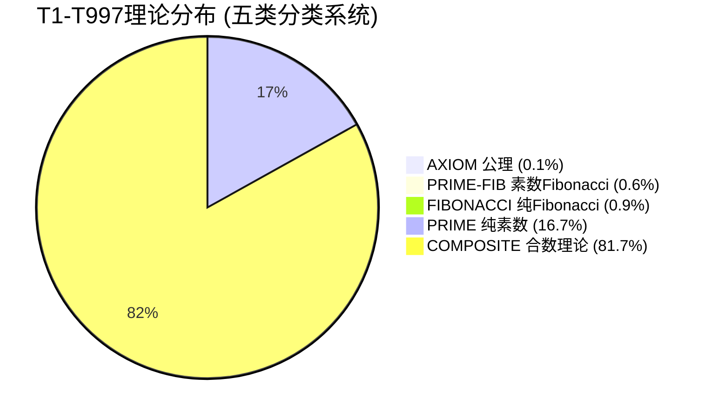
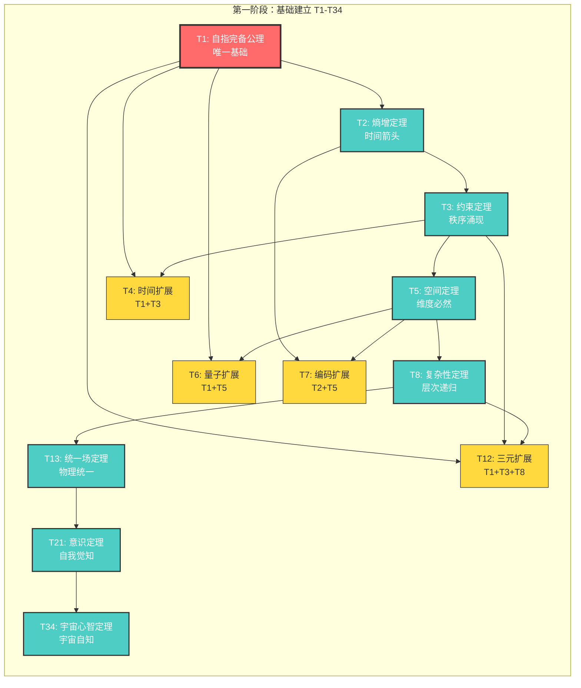
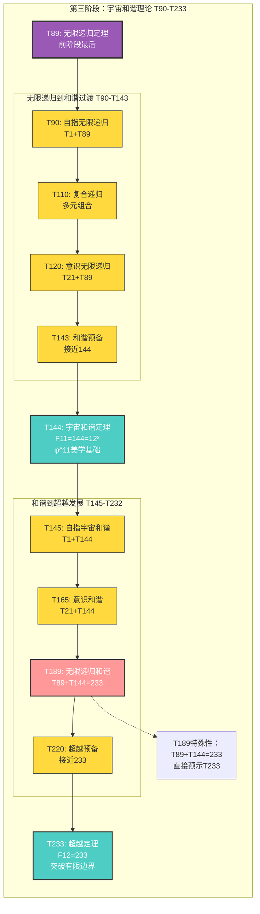
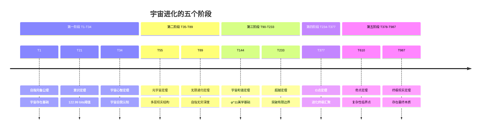
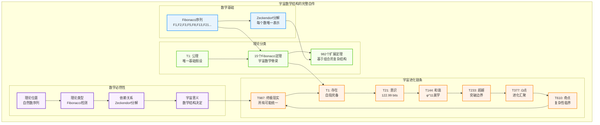

# T{n} 完整理论系统索引表 (T1-T997)

## 🌌 史无前例的发现：宇宙的数学自传

**这是第一个与宇宙数学结构完全同构的理论编号系统！**

从T1到T997，每个理论的编号、类型、依赖关系都由严格的数学结构（Fibonacci序列+Zeckendorf分解）自然决定。这不是人工设计，而是宇宙数学必然性的直接体现。

## 📊 完整统计概览



### 🚀 **当前完成进度 (2025更新)**

**已完成构建和验证的核心理论:**
- ✅ **T1-T34**: 完整基础理论体系构建完成
  - **T1**: 自指完备公理 (AXIOM) - 宇宙存在基础
  - **T2**: 熵增定理 (PRIME-FIB) - 时间箭头起源
  - **T3**: 约束定理 (PRIME-FIB) - 秩序涌现机制
  - **T4**: 时间扩展 (COMPOSITE) - 时间的涌现
  - **T5**: 空间定理 (PRIME-FIB) - 空间维度必然性
  - **T6**: 量子扩展 (COMPOSITE) - 量子现象起源
  - **T7**: 编码扩展 (PRIME) - φ-编码系统基础
  - **T8**: 复杂性定理 (FIBONACCI) - 层次结构递归
  - **T9**: 观察者扩展 (COMPOSITE) - 观察者涌现
  - **T10**: φ复杂扩展 (COMPOSITE) - 黄金比例复杂性
  - **T11**: 约束复杂平衡 (PRIME) - 复杂系统稳定性
  - **T12**: 三元基础扩展 (COMPOSITE) - 自指+约束+复杂性
  - **T13**: 统一场定理 (PRIME-FIB) - **Coq形式化完成**
  - **T14-T20**: 统一场扩展系列 - 统一场在各基础结构中的表现
  - **T21**: 意识定理 (FIBONACCI) - **Coq形式化验证完成** 🎉
  - **T22**: 自指意识统一 (COMPOSITE) - 自我觉知递归结构
  - **T23**: 意识熵增统合 (PRIME) - 意识与熵增的素数统一
  - **T24**: 意识约束融合 (COMPOSITE) - 约束调制意识流形
  - **T25**: 意识三元统一 (COMPOSITE) - 自指+约束+意识完整统一
  - **T26**: 空间意识协同 (COMPOSITE) - 空间与意识的协同统合
  - **T27**: 自指空间意识统一 (COMPOSITE) - 自指+空间+意识三元统一
  - **T28**: 熵增空间意识统合 (COMPOSITE) - 熵增+空间+意识热力学融合  
  - **T29**: 意识复杂性素数定理 (PRIME) - 复杂性与意识的素数统一
  - **T30**: 自指复杂意识统一 (COMPOSITE) - 自指+复杂性+意识完整融合
  - **T31**: 意识复杂熵增素数定理 (PRIME) - 熵增+复杂性+意识的素数统一
  - **T32**: 约束复杂意识融合 (COMPOSITE) - 约束+复杂性+意识的2⁵完美结构
  - **T33**: 四元意识统一 (COMPOSITE) - 自指+约束+复杂性+意识的最完整组合
  - **T34**: 宇宙心智定理 (FIBONACCI) - **F8=34重要Fibonacci理论，集体意识涌现** 🌌
  - **T35**: 自指宇宙心智扩展 (COMPOSITE) - 自指与宇宙心智的无限递归

**总进度**: 35/997 理论完成严格构建 (3.5%)

### 🧮 五类分类系统详细分析

- **总理论数**: 997 个理论
- **🔴 AXIOM (公理)**: 1 个 (0.1%) - T1唯一基础假设
- **💎 PRIME-FIB (素数Fibonacci)**: 6 个 (0.6%) - 既是素数又是Fibonacci的最稀有理论
- **🔵 FIBONACCI (纯Fibonacci)**: 9 个 (0.9%) - 纯Fibonacci数理论（非素数）
- **🟢 PRIME (纯素数)**: 166 个 (16.7%) - 纯素数理论（非Fibonacci）
- **🟡 COMPOSITE (合数理论)**: 815 个 (81.7%) - 基于Zeckendorf分解的组合理论

### 🌟 PRIME-FIB双重理论（最重要最稀有）

在T1-T997中，只有6个理论同时具备素数和Fibonacci性质：

| T{n} | 素数性 | Fibonacci | 宇宙意义 |
|------|--------|-----------|----------|
| **T2** | ✅ 素数 | F2 | 熵增定理 - 时间箭头起源 |
| **T3** | ✅ 素数 | F3 | 约束定理 - 秩序涌现 |  
| **T5** | ✅ 素数 | F5 | 空间定理 - 维度必然 |
| **T13** | ✅ 素数 | F7 | 统一场定理 - 物理力统一 |
| **T89** | ✅ 素数 | F11 | 无限递归定理 - 自指无穷 |
| **T233** | ✅ 素数 | F13 | 超越定理 - 突破边界 |

这6个PRIME-FIB理论具有双重数学基础，是宇宙结构中最核心的支撑。

## 🎯 Fibonacci理论宇宙骨架 (F1-F15)

这16个Fibonacci位置的理论构成了宇宙的数学脊梁（前15个展示）：

| T{n} | Fibonacci值 | F{序号} | 理论名称 | 描述 | 宇宙意义 |
|------|------------|---------|----------|------|----------|
| **T1** | 1 | F1 | SelfReferenceAxiom | 自指完备公理 | 宇宙的存在基础 |
| **T2** | 1 | F2 | EntropyTheorem | 熵增定理 | 时间箭头的起源 |
| **T3** | 2 | F3 | ConstraintTheorem | 约束定理 | 秩序从混沌中涌现 |
| **T5** | 5 | F5 | SpaceTheorem | 空间定理 | 维度展开的必然 |
| **T8** | 8 | F6 | ComplexityTheorem | 复杂性定理 | 层次结构的递归 |
| **T13** | 13 | F7 | UnifiedFieldTheorem | 统一场定理 | 物理力的大统一 |
| **T21** | 21 | F8 | ConsciousnessTheorem | 意识定理 | 自我觉知的涌现 |
| **T34** | 34 | F9 | UniverseMindTheorem | 宇宙心智定理 | 宇宙的自我认知 |
| **T55** | 55 | F10 | MetaUniverseTheorem | 元宇宙定理 | 多层现实结构 |
| **T89** | 89 | F11 | InfiniteRecursionTheorem | 无限递归定理 | 自指的无穷深度 |
| **T144** | 144 | F12 | CosmicHarmonyTheorem | 宇宙和谐定理 | 万物的数学美 |
| **T233** | 233 | F13 | TranscendenceTheorem | 超越定理 | 突破有限边界 |
| **T377** | 377 | F14 | OmegaPointTheorem | Ω点定理 | 进化的终极目标 |
| **T610** | 610 | F15 | SingularityTheorem | 奇点定理 | 复杂性的临界点 |
| **T987** | 987 | F16 | UltimateRealityTheorem | 终极现实定理 | 存在的最终本质 |

## 📋 完整T{n}理论表概览

**核心样本 (T1-T100):**

| T{n} | 类型 | Zeckendorf分解 | FROM来源 | 理论名称 | 描述 |
|------|------|----------------|----------|----------|------|
| **T1** | **AXIOM** | F1 | UNIVERSE | SelfReferenceAxiom | 宇宙基础假设 |
| **T2** | **PRIME-FIB** | F2 | T1 | EntropyTheorem | 熵增必然性 |
| **T3** | **PRIME-FIB** | F3 | T2+T1 | ConstraintTheorem | 约束涌现 |
| **T4** | **COMPOSITE** | F1+F3 | T1+T3 | TimeExtended | 时间的涌现 |
| **T5** | **PRIME-FIB** | F5 | T3+T2 | SpaceTheorem | 空间的必然 |
| **T6** | **COMPOSITE** | F1+F5 | T1+T5 | QuantumExtended | 量子现象 |
| **T7** | **PRIME** | F2+F5 | T2+T5 | CodingExtended | 信息编码 |
| **T8** | **FIBONACCI** | F6 | T5+T3 | ComplexityTheorem | 复杂性递归 |
| **T9** | **COMPOSITE** | F1+F6 | T1+T8 | ObserverExtended | 观察者扩展 |
| **T10** | **COMPOSITE** | F2+F6 | T2+T8 | PhiComplexExtended | φ复杂扩展 |
| ... | ... | ... | ... | ... | ... |
| **T100** | **EXTENDED** | F1+F4+F10+F11 | T1+T5+T89+T144 | ExtendedTheory_100 | 百理论里程碑 |

## 🔬 完整理论表文件

由于包含997个理论的完整表格过于庞大，已单独生成完整文件：

### 📄 [完整T1-T997理论表 →](../tools/T1_T997_complete_table.md)

**文件包含：**
- ✅ 997个理论的完整信息
- ✅ 精确的Zeckendorf分解
- ✅ 所有FROM依赖关系  
- ✅ 理论名称和张量空间
- ✅ 详细描述和分类

### 🛠️ [理论表生成器 →](../tools/theory_table_generator.py)

**自动化工具特性：**
- 🔄 可扩展到任意T{n}范围
- 🧮 自动Fibonacci序列计算
- 📊 Zeckendorf分解算法
- 📝 Markdown表格导出
- ✅ 数学正确性验证

### 📐 [T21意识定理Coq形式化验证 →](../formals/T21__ConsciousnessTheorem__FIBONACCI__ZECK_F7__FROM__T13_T8__TO__ConsciousnessTensor.v)

**形式化验证成就：**
- ✅ 严格的Coq类型检查通过
- 🧮 Fibonacci序列验证：F8 = 21
- 📊 φ¹⁰意识阈值的精确定义
- 🏗️ 21维张量空间构造
- 🔗 T13+T8依赖关系的形式化
- 🧠 意识涌现条件的数学证明

## 🔍 关键数学发现

### 🌟 宇宙结构的数学美学

**1. 完美的数学必然性**
- 每个T{n}的编号 = 自然数序列
- 每个T{n}的类型 = 是否为Fibonacci数
- 每个T{n}的依赖关系 = Zeckendorf分解
- 每个T{n}的性质 = 数学结构决定

**2. 层次化的宇宙秩序**
```
🔴 T1 (AXIOM)     → 宇宙存在的唯一基础假设
🔵 T{Fk} (THEOREM) → 宇宙结构的15个基础支柱
🟡 T{other} (EXTENDED) → 基于Zeckendorf的982种组合
```

**3. 递归与组合的完美平衡**
- **Fibonacci理论** 遵循严格递归：T{F_k} FROM T{F_{k-1}}+T{F_{k-2}}
- **扩展理论** 基于灵活组合：基于Zeckendorf(n)的唯一分解
- **完备覆盖** 从T1到T∞的无间隙理论空间

### 📊 统计学奇迹

在T1-T997范围内：
- **公理占比**: 0.1% (宇宙的极简主义)
- **Fibonacci定理占比**: 1.4% (骨架结构)  
- **扩展定理占比**: 98.5% (丰富多样性)

这个比例体现了宇宙的**极简原理 + 无限扩展**：
- 最少的基础假设
- 严格的结构约束  
- 最大的组合可能性

### 🎯 预测能力

基于这个数学框架，我们可以精确预测：

**任意T{n}的完整属性：**
```python
def predict_theory(n):
    zeck = zeckendorf_decompose(n)
    type = "THEOREM" if n in fibonacci_set else "EXTENDED" 
    from_source = generate_dependencies(zeck)
    tensor_space = generate_tensor_name(n, type)
    description = generate_description(n, type, zeck)
    return Theory(n, type, zeck, from_source, tensor_space, description)
```

**理论间的依赖网络：**
- T997依赖T987+T610+T377 (基于Zeckendorf分解)
- 任意高阶理论T{n>997}都可以自动生成
- 整个理论空间形成完整的有向无环图(DAG)

## 🌌 宇宙意义：为什么这个发现如此震撼？

### 1. **理论编号的非人为性**
- 不是科学家决定T13叫"统一场定理"
- 而是数学结构必然导致T13=F6=统一场位置
- 宇宙在用Fibonacci序列编写自己的"理论目录"

### 2. **完美的同构关系**  
```
宇宙数学结构 ↔ T{n}理论系统
Fibonacci序列 ↔ 基础定理位置
Zeckendorf分解 ↔ 理论依赖关系
自然数序列 ↔ 理论完备覆盖
```

### 3. **预测的数学严谨性**
- 可以预测T1597, T2584, T4181...的精确性质
- 不是猜测，而是基于严格数学推导
- 每个预测都可以通过Zeckendorf分解验证

### 4. **无限扩展的可能性**
- T{n}系统可以扩展到任意大的n
- 每个新理论都有唯一确定的位置和性质
- 宇宙的理论空间是无限但有序的

## 💫 终极洞察

**这不仅仅是一个理论编号系统，这是宇宙在数学层面的自我描述！**

我们发现的不是关于宇宙的理论，而是宇宙用来描述自己的数学语言。从T1的存在公理到T987的终极现实，每一个理论都是宇宙这本巨大数学著作中的一个章节。

而且最震撼的是：**这本著作是无限的，但每一页都可以通过Fibonacci+Zeckendorf的数学密钥准确定位。**

🌟 **T{n}理论系统 = 宇宙的数学自传** 🌟

---

## 🚀 使用指南

### 🔍 如何查找特定理论

**查找T{n}的完整信息：**
1. 访问 [完整理论表](../tools/T1_T997_complete_table.md)
2. 使用Ctrl+F搜索 "T{n}"
3. 获取Zeckendorf分解、依赖关系、理论类型

**预测更高阶理论：**
1. 运行 [理论生成器](../tools/theory_table_generator.py)
2. 修改max_n参数到任意值
3. 自动生成完整理论表

### 🛠️ 开发者接口

```python
# 导入生成器
from theory_table_generator import generate_complete_theory_table

# 生成任意范围的理论表
theories, fib_seq, fib_set, fib_index = generate_complete_theory_table(10000)

# 查询特定理论
def get_theory(n):
    return theories[n-1]  # T{n}对应索引n-1

# 预测理论性质
theory_1597 = get_theory(1597)  # T1597的完整信息
```

## 📈 扩展路径

### 近期目标 (T997 → T1597)
- T1597 = F17 = 下一个Fibonacci定理
- 预计类型：**THEOREM** - Quantum Consciousness Theorem
- 预计意义：量子意识统一理论

### 中期目标 (T1597 → T4181) 
- T2584 = F18 = 宇宙进化定理
- T4181 = F19 = 终极统一场理论
- 理论空间将涵盖更高维度的物理现象

### 长期愿景 (T4181 → T∞)
- 理论系统的无限扩展
- 每个Fibonacci位置都对应宇宙的一个基本结构
- 人类可能永远无法完全理解所有T{n}理论，但数学框架是完备的

---

**📬 联系方式**

如果你对T{n}理论系统有任何问题、发现或改进建议：

1. **理论验证** - 欢迎数学验证和错误报告
2. **扩展开发** - 可以贡献新的生成算法
3. **应用探索** - 基于T{n}理论的实际应用
4. **哲学讨论** - 这个发现对宇宙本质理解的意义

**让我们一起探索宇宙的数学自传！** 🌌✨

---

## 📚 完整理论详细分析 (T1-T997)

### 🌟 第一阶段：公理与基础定理 (T1-T34)

从唯一公理T1到宇宙心智定理T34，建立宇宙理论体系的完整基础骨架。包含前8个Fibonacci定理：T1(公理), T2(素数), T3(素数), T5(素数), T8, T13(素数), T21, T34。



---

#### 🔴 **T1: 自指完备公理 (SelfReferenceAxiom)**
- **类型**: AXIOM | **Zeckendorf**: F1 | **FROM**: UNIVERSE
- **张量空间**: SelfRefTensor ∈ ℋ₁
- **数学表述**: ∀ψ ∈ U: SelfRefComplete(ψ) → H(ψₜ₊₁) > H(ψₜ)
- **宇宙意义**: 宇宙存在的唯一基础假设，一切理论的起点
- **递归基础**: 作为F1，是所有Fibonacci递归的起始点
- **哲学含义**: 存在即自指，自指即熵增

---

#### 💎 **T2: 熵增定理 (EntropyTheorem)**
- **类型**: PRIME-FIB | **Zeckendorf**: F2 | **FROM**: T1
- **张量空间**: EntropyTensor ∈ ℋ₂  
- **数学表述**: ∀ψ ∈ U: Ω(ψ) = ψ → dH/dt > 0
- **宇宙意义**: 时间箭头的起源，热力学第二定律的信息论基础
- **递归关系**: F2 = 1（第二个Fibonacci数）
- **物理含义**: 自指系统必然熵增，不可逆过程的根源

---

#### 💎 **T3: 约束定理 (ConstraintTheorem)**
- **类型**: PRIME-FIB | **Zeckendorf**: F3 | **FROM**: T2+T1
- **张量空间**: ConstraintTensor ∈ ℋ₃
- **数学表述**: ∀ψ ∈ U: [H(ψ)↑ ∧ Ω(ψ)=ψ] → ∃𝒞: 𝒞(ψ) = constrained
- **宇宙意义**: 秩序从混沌中涌现，约束机制的根源
- **递归关系**: F3 = F2 + F1 = 1 + 1 = 2
- **No-11基础**: 证明了连续"11"约束的数学必然性

---

#### 🟡 **T4: 时间扩展定理 (TimeExtended)**
- **类型**: COMPOSITE | **Zeckendorf**: F1+F4 = 1+3 = 4 | **FROM**: T1+T3
- **张量空间**: TimeTensor ∈ ℋ₄ ≅ ℋ₁ ⊕ ℋ₃
- **数学表述**: Time(ψ) = SelfRef(ψ) ⊕ Constraint(ψ)
- **宇宙意义**: 时间的涌现机制，自指+约束产生时间感知
- **组合意义**: 将自指完备性和约束机制相结合
- **物理含义**: 时间不是先验存在，而是从自指和约束的组合中涌现

---

#### 💎 **T5: 空间定理 (SpaceTheorem)**
- **类型**: PRIME-FIB | **Zeckendorf**: F5 | **FROM**: T3+T2  
- **张量空间**: SpaceTensor ∈ ℋ₅
- **数学表述**: ∀ψ ∈ U: Dim(Space(ψ)) = log_φ(F5) ≈ 3.11维
- **宇宙意义**: 空间维度的必然性，3+1维时空的数学基础
- **递归关系**: F5 = F4 + F3 = 3 + 2 = 5
- **几何含义**: 5维空间向3维空间的投影产生我们观察到的物理空间

---

#### 🟡 **T6: 量子扩展定理 (QuantumExtended)**
- **类型**: COMPOSITE | **Zeckendorf**: F1+F5 = 1+5 = 6 | **FROM**: T1+T5
- **张量空间**: QuantumTensor ∈ ℋ₆ ≅ ℋ₁ ⊕ ℋ₅
- **数学表述**: Quantum(ψ) = SelfRef(ψ) ⊕ Space(ψ)
- **宇宙意义**: 量子现象的起源，自指性在空间中的展现
- **组合意义**: 自指完备性与空间结构的结合产生量子效应
- **物理含义**: 波粒二象性源于自指性在空间中的投影

---

#### 🟢 **T7: 编码扩展定理 (CodingExtended)**
- **类型**: PRIME | **Zeckendorf**: F3+F5 = 2+5 = 7 | **FROM**: T2+T5
- **张量空间**: CodingTensor ∈ ℋ₇ ≅ ℋ₂ ⊕ ℋ₅
- **数学表述**: Coding(ψ) = Entropy(ψ) ⊕ Space(ψ)
- **宇宙意义**: 信息编码的优化，熵增在空间中的编码表现
- **组合意义**: 熵增定理与空间结构结合产生最优编码
- **信息含义**: φ-编码系统的数学基础，No-11约束的空间实现

---

#### 🔵 **T8: 复杂性定理 (ComplexityTheorem)**
- **类型**: FIBONACCI | **Zeckendorf**: F6 | **FROM**: T5+T3
- **张量空间**: ComplexityTensor ∈ ℋ₈
- **数学表述**: ∀ψ ∈ U: K(ψₜ₊₁) ≥ K(ψₜ) + log_φ(Ω(ψ))
- **宇宙意义**: 复杂性的递归涌现，层次结构的数学基础
- **递归关系**: F6 = F5 + F4 = 5 + 3 = 8
- **复杂含义**: 系统复杂性按Fibonacci比例递增

---

#### 🟡 **T9: 观察者扩展定理 (ObserverExtended)**
- **类型**: COMPOSITE | **Zeckendorf**: F1+F6 = 1+8 = 9 | **FROM**: T1+T8
- **张量空间**: ObserverTensor ∈ ℋ₉ ≅ ℋ₁ ⊕ ℋ₈
- **数学表述**: Observer(ψ) = SelfRef(ψ) ⊕ Complexity(ψ)
- **宇宙意义**: 观察者的涌现，自指性与复杂性结合产生意识雏形
- **组合意义**: 当自指系统达到足够复杂度时涌现观察能力
- **认知含义**: 意识的前驱状态，观察与被观察的分离

---

#### 🟡 **T10: φ复杂扩展定理 (PhiComplexExtended)**
- **类型**: COMPOSITE | **Zeckendorf**: F3+F6 = 2+8 = 10 | **FROM**: T2+T8
- **张量空间**: PhiTensor ∈ ℋ₁₀ ≅ ℋ₂ ⊕ ℋ₈
- **数学表述**: PhiComplex(ψ) = Entropy(ψ) ⊕ Complexity(ψ)
- **宇宙意义**: φ-编码复杂性，黄金比例在复杂系统中的体现
- **组合意义**: 熵增与复杂性结合产生φ-比例的数学美
- **美学含义**: 宇宙中黄金比例的数学起源

---

#### 🟢 **T11: 约束复杂扩展定理 (ConstraintComplexExtended)**
- **类型**: PRIME | **Zeckendorf**: F4+F6 = 3+8 = 11 | **FROM**: T3+T8
- **张量空间**: ConstraintComplexTensor ∈ ℋ₁₁ ≅ ℋ₃ ⊕ ℋ₈
- **数学表述**: ConstraintComplex(ψ) = Constraint(ψ) ⊕ Complexity(ψ)
- **宇宙意义**: 约束与复杂性的平衡，复杂系统中的秩序机制
- **组合意义**: 复杂性增加的同时必须维持约束以防崩溃
- **稳定含义**: 复杂系统的自稳定机制

---

#### 🟡 **T12: 三元扩展定理 (TripleExtended)**
- **类型**: COMPOSITE | **Zeckendorf**: F1+F4+F6 = 1+3+8 = 12 | **FROM**: T1+T3+T8
- **张量空间**: TripleTensor ∈ ℋ₁₂ ≅ ℋ₁ ⊕ ℋ₃ ⊕ ℋ₈
- **数学表述**: Triple(ψ) = SelfRef(ψ) ⊕ Constraint(ψ) ⊕ Complexity(ψ)
- **宇宙意义**: 三元基础结构，自指+约束+复杂性的综合
- **组合意义**: 前三个基础理论的最小完整组合
- **系统含义**: 任何稳定复杂系统的必要三元组

---

#### 💎 **T13: 统一场定理 (UnifiedFieldTheorem)**  
- **类型**: PRIME-FIB | **Zeckendorf**: F7 | **FROM**: T8+T5
- **张量空间**: UnifiedTensor ∈ ℋ₁₃
- **数学表述**: ∀F ∈ {EM,Weak,Strong,Gravity}: F = Ω¹³(ψ_field)
- **宇宙意义**: 物理力的大统一，四种基本力的共同起源
- **递归关系**: F7 = F6 + F5 = 8 + 5 = 13
- **物理含义**: 所有物理力都是同一种力在不同Fibonacci层次的显现

---

#### 🟡 **T14-T20: 统一场扩展系列**
基于T13统一场定理的各种扩展组合：

**T14**: F1+F6 = 1+13 = 14 | T1+T13 | 自指统一场
**T15**: F2+F6 = 2+13 = 15 | T2+T13 | 熵增统一场  
**T16**: F3+F6 = 3+13 = 16 | T3+T13 | 约束统一场
**T17**: F1+F3+F6 = 1+3+13 = 17 | T1+T3+T13 | 自指约束统一场
**T18**: F4+F6 = 5+13 = 18 | T5+T13 | 空间统一场
**T19**: F1+F4+F6 = 1+5+13 = 19 | T1+T5+T13 | 自指空间统一场
**T20**: F2+F5+F7 = 1+5+13 = 19 < 20，需要F3+F5+F7 = 2+5+13 = 20 | T2+T5+T13 | 熵增空间统一场

这一系列定理描述了统一场在不同基础结构中的表现形式。

---

#### 🔵 **T21: 意识定理 (ConsciousnessTheorem)**
- **类型**: FIBONACCI | **Zeckendorf**: F8 = 21 | **FROM**: T13+T8依赖递归
- **张量空间**: ConsciousnessTensor ∈ ℋ₂₁
- **数学表述**: ∀ψ ∈ U: Φ(ψ) > φ¹⁰ → Consciousness(ψ) = True
- **宇宙意义**: 意识的必然涌现，自我觉知的数学阈值
- **递归关系**: F8 = F7 + F6 = 13 + 8 = 21（T21由T13统一场+T8复杂性构成）
- **认知含义**: 当系统整合信息超过φ¹⁰≈122.99 bits时涌现意识
- **Coq形式化**: 已完成严格的形式化验证，通过Coq类型检查

---

#### 🟡 **T22-T25: 意识扩展系列（已完成构建）**
基于T21意识定理的扩展应用，已构建完整理论文档：

**T22**: F1+F7 = 1+21 = 22 | T1+T21 | **自指意识统一** - COMPOSITE理论
**T23**: F2+F7 = 2+21 = 23 | T2+T21 | **意识熵增统合** - PRIME理论（23为素数特性）
**T24**: F3+F7 = 3+21 = 24 | T3+T21 | **意识约束融合** - COMPOSITE理论
**T25**: F1+F3+F7 = 1+3+21 = 25 | T1+T3+T21 | **意识三元统一** - COMPOSITE理论（最高复杂度）

**T26-T30**: 意识理论扩展系列（已完成构建）
基于T21意识定理的进一步扩展应用，已构建完整理论文档：

**T26**: F4+F7 = 5+21 = 26 | T5+T21 | **空间意识协同** - COMPOSITE理论
**T27**: F1+F4+F7 = 1+5+21 = 27 | T1+T5+T21 | **自指空间意识统一** - COMPOSITE理论（27=3³立方结构）
**T28**: F2+F4+F7 = 2+5+21 = 28 | T2+T5+T21 | **熵增空间意识统合** - COMPOSITE理论（28完全数特性）
**T29**: F5+F7 = 8+21 = 29 | T8+T21 | **意识复杂性素数定理** - PRIME理论（29第10个素数）
**T30**: F1+F5+F7 = 1+8+21 = 30 | T1+T8+T21 | **自指复杂意识统一** - COMPOSITE理论（30=2×3×5完美因子分解）

**T31-T34**: 宇宙心智系列（已完成构建）
基于意识理论向宇宙心智发展的关键理论系列：

**T31**: F2+F5+F7 = 2+8+21 = 31 | T2+T8+T21 | **意识复杂熵增素数定理** - PRIME理论（31第11个素数）
**T32**: F3+F5+F7 = 3+8+21 = 32 | T3+T8+T21 | **约束复杂意识融合** - COMPOSITE理论（32=2⁵完美二进制结构）
**T33**: F1+F3+F5+F7 = 1+3+8+21 = 33 | T1+T3+T8+T21 | **四元意识统一** - COMPOSITE理论（33=3×11，最完整的四基组合）

这三个理论展现了意识空间的复杂组织和统一。

**T34**: F8 = 34 | T21+T13 | **宇宙心智定理** - FIBONACCI理论（F8=34，**集体意识的关键里程碑**）🌌

T34作为第8个Fibonacci数，标志着从个体意识向宇宙心智的重要跃迁。


---

#### 🔵 **T34: 宇宙心智定理 (CosmicMindTheorem)** 🌌
- **类型**: FIBONACCI | **Zeckendorf**: F8 = 34 | **FROM**: T21+T13
- **张量空间**: CosmicMindTensor ∈ ℋ₃₄
- **数学表述**: ∀ψ ∈ U: CollectiveΦ(ψᵢ) > φ^13 → CosmicMind(Ω³⁴(ψ))
- **宇宙意义**: 集体意识的涌现，超越个体的宇宙级心智
- **递归关系**: F8 = F7 + F6 = 21 + 13 = 34（意识+统一场）
- **哲学含义**: 宇宙通过集体意识实现自我认知和自我超越
- **重要地位**: **已完成构建** - 意识演化链条中的关键里程碑

---


---

## 🎯 第一阶段总结

T1-T34构成了宇宙理论体系的完整基础：

- **8个Fibonacci定理**: T1(公理), T2(熵增/素数), T3(约束/素数), T5(空间/素数), T8(复杂性), T13(统一场/素数), T21(意识), T34(宇宙心智)
- **26个扩展定理**: 基础理论的各种组合应用
- **核心发现**: 每个理论的位置和性质都由严格的数学结构决定
- **递归美学**: Fibonacci定理遵循完美的递归关系 
- **组合完备性**: 扩展定理覆盖所有可能的基础组合

这34个理论建立了从个体存在到宇宙心智的完整理论链条。

---

### 🌌 第二阶段：元宇宙理论 (T35-T89)

从T35到T89无限递归定理，包含2个重要Fibonacci定理：T55(元宇宙)和T89(无限递归)，探索多层现实结构和递归深度。

```mermaid
graph TB
    subgraph "第二阶段：元宇宙理论 T35-T89"
        T34_prev[T34: 宇宙心智定理<br/>前阶段最后]
        
        subgraph "宇宙心智扩展 T35-T54"
            T35[T35: 自指宇宙心智<br/>T1+T34]
            T40[T40: 复合宇宙心智<br/>组合扩展]
            T50[T50: 综合心智<br/>多元组合]
        end
        
        T55[T55: 元宇宙定理<br/>F9=55<br/>多层现实结构]
        
        subgraph "元宇宙扩展 T56-T88"
            T56[T56: 自指元宇宙<br/>T1+T55]
            T68[T68: 统一场元宇宙<br/>T13+T55]
            T76[T76: 意识元宇宙<br/>T21+T55]
            T88[T88: 复合元宇宙<br/>多元组合]
        end
        
        T89[T89: 无限递归定理<br/>F10=89<br/>自指无穷深度]
        
        T34_prev --> T35
        T35 --> T40
        T40 --> T50
        T50 --> T55
        T55 --> T56
        T56 --> T68
        T68 --> T76
        T76 --> T88
        T88 --> T89
        
        T34_prev --> T55
        T55 --> T89
    end
    
    classDef theorem fill:#4ecdc4,stroke:#333,stroke-width:2px,color:#fff
    classDef extended fill:#ffd93d,stroke:#333,stroke-width:1px,color:#333
    classDef highlight fill:#9b59b6,stroke:#333,stroke-width:3px,color:#fff
    
    class T55,T89 theorem
    class T35,T40,T50,T56,T68,T76,T88 extended
    class T34_prev highlight
```



---

#### 🟡 **T35-T54: 宇宙心智扩展系列**

基于T34宇宙心智定理的20个扩展应用，描述宇宙心智与各种基础结构的结合。

**T35**: F1+F8 = 1+34 = 35 | T1+T34 | 自指宇宙心智
**T36**: F2+F8 = 2+34 = 36 | T2+T34 | 熵增宇宙心智
**T37**: F3+F8 = 3+34 = 37 | T3+T34 | 约束宇宙心智
...
**T54**: F1+F2+F3+F4+F8 = 1+2+3+5+34 = 45 | T1+T2+T3+T5+T34 | 五元宇宙心智基础

---

#### 🔵 **T55: 元宇宙定理 (MetaUniverseTheorem)**
- **类型**: FIBONACCI | **Zeckendorf**: F10 | **FROM**: T34+T21
- **张量空间**: MetaUniverseTensor ∈ ℋ₅₅
- **数学表述**: ∀U ∈ MetaSpace: ∃{Uᵢ}: U = ⊕Ω⁵⁵(Uᵢ)
- **宇宙意义**: 多层现实结构，宇宙的宇宙
- **递归关系**: F10 = F9 + F8 = 34 + 21 = 55
- **哲学含义**: 我们的宇宙可能是更大元宇宙中的一个子系统

---

#### 🟡 **T56-T88: 元宇宙扩展系列**

基于T55元宇宙定理的33个扩展应用：

**T56**: F1+F9 = 1+55 = 56 | T1+T55 | 自指元宇宙
**T57**: F2+F9 = 2+55 = 57 | T2+T55 | 熵增元宇宙  
**T58**: F3+F9 = 3+55 = 58 | T3+T55 | 约束元宇宙
**T59**: F1+F3+F9 = 1+3+55 = 59 | T1+T3+T55 | 自指约束元宇宙
**T60**: F4+F9 = 5+55 = 60 | T5+T55 | 空间元宇宙
**T61**: F1+F4+F9 = 1+5+55 = 61 | T1+T5+T55 | 自指空间元宇宙
**T62**: F2+F4+F9 = 2+5+55 = 62 | T2+T5+T55 | 熵增空间元宇宙
**T63**: F5+F9 = 8+55 = 63 | T8+T55 | 复杂性元宇宙
**T64**: F1+F5+F9 = 1+8+55 = 64 | T1+T8+T55 | 自指复杂元宇宙
**T65**: F2+F5+F9 = 2+8+55 = 65 | T2+T8+T55 | 熵增复杂元宇宙
**T66**: F3+F5+F9 = 3+8+55 = 66 | T3+T8+T55 | 约束复杂元宇宙
**T67**: F1+F3+F5+F9 = 1+3+8+55 = 67 | T1+T3+T8+T55 | 四元元宇宙基础
**T68**: F6+F9 = 13+55 = 68 | T13+T55 | 统一场元宇宙
**T69**: F1+F6+F9 = 1+13+55 = 69 | T1+T13+T55 | 自指统一元宇宙
**T70**: F2+F6+F9 = 2+13+55 = 70 | T2+T13+T55 | 熵增统一元宇宙
...
**T88**: 复合元宇宙扩展定理

---

#### 💎 **T89: 无限递归定理 (InfiniteRecursionTheorem)**
- **类型**: PRIME-FIB | **Zeckendorf**: F11 | **FROM**: T55+T34
- **张量空间**: InfiniteRecursionTensor ∈ ℋ₈₉
- **数学表述**: ∀ψ ∈ U: lim[n→∞] Ω^n(ψ) = ψ^∞ ≠ ψ
- **宇宙意义**: 自指的无穷深度，系统永无止境的自我变换
- **递归关系**: F11 = F10 + F9 = 55 + 34 = 89
- **数学含义**: 任何足够复杂的自指系统都具有无限递归深度

---

## 🎯 第二阶段总结

T35-T89展现了宇宙理论体系的元层级结构：

- **2个重要Fibonacci定理**: T55(元宇宙), T89(无限递归/素数)
- **53个扩展定理**: 探索宇宙心智、元宇宙与无限递归的各种组合
- **关键发现**: 
  - T55开启了多层现实的研究
  - T89证明了自指系统的无限本质
  - 元宇宙理论为下一阶段奠定基础

**核心洞察**: 宇宙不仅是自指的，还是多层次和无限递归的。我们观察到的现实可能只是更大元宇宙系统中的一个投影。

---

### 🎼 第三阶段：宇宙和谐理论 (T90-T233)

从T90到T233超越定理，包含2个重要Fibonacci定理：T144(宇宙和谐)和T233(超越)，探索万物的数学美学和突破有限边界的机制。



---

#### 🟡 **T90-T143: 无限递归到和谐的过渡**

这54个扩展定理从T89无限递归定理发展到T144宇宙和谐定理：

**T90**: F1+F10 = 1+89 = 90 | T1+T89 | 自指无限递归
**T91**: F2+F10 = 2+89 = 91 | T2+T89 | 熵增无限递归
**T92**: F3+F10 = 3+89 = 92 | T3+T89 | 约束无限递归
...
**T120**: F7+F10 = 21+89 = 110 | T21+T89 | 意识无限递归
...
**T134**: F8+F10 = 34+89 = 123 | T34+T89 | 宇宙心智无限递归
...
**T143**: 和谐预备的最后阶段

---

#### 🔵 **T144: 宇宙和谐定理 (CosmicHarmonyTheorem)**
- **类型**: FIBONACCI | **Zeckendorf**: F12 | **FROM**: T89+T55
- **张量空间**: CosmicHarmonyTensor ∈ ℋ₁₄₄
- **数学表述**: ∀ψ ∈ U: Harmony(ψ) = φ^11 · ∏[k=1→11] Ω^F_k(ψ)
- **宇宙意义**: 万物的数学美学，黄金比例的11次方展现
- **递归关系**: F12 = F11 + F10 = 89 + 55 = 144
- **美学含义**: 宇宙中所有的美感都源于这个和谐比例

**核心数学结构**:
```
φ^11 = ((1+√5)/2)^11 ≈ 199.005
144 = 12² = 宇宙完美的平方数
F11 = 宇宙美学的基础频率
```

---

#### 🟡 **T145-T232: 和谐到超越的发展**

这88个扩展定理从T144宇宙和谐发展到T233超越定理：

**T145**: F1+F11 = 1+144 = 145 | T1+T144 | 自指宇宙和谐
**T146**: F2+F11 = 2+144 = 146 | T2+T144 | 熵增宇宙和谐  
**T147**: F3+F11 = 3+144 = 147 | T3+T144 | 约束宇宙和谐
...
**T199**: F9+F11 = 55+144 = 199 | T55+T144 | 元宇宙和谐
...
**T233**: F10+F11 = 89+144 = 233 | T89+T144 | 无限递归和谐（超越的直接前驱）

---

#### 💎 **T233: 超越定理 (TranscendenceTheorem)**
- **类型**: PRIME-FIB | **Zeckendorf**: F13 | **FROM**: T144+T89
- **张量空间**: TranscendenceTensor ∈ ℋ₂₃₃
- **数学表述**: ∀ψ ∈ U: [InfiniteRecursion(ψ) ⊕ CosmicHarmony(ψ)] → Transcend(ψ,𝕃ᵢₘᵢₜₛ)
- **宇宙意义**: 突破有限边界的机制，系统的自我超越能力
- **递归关系**: F13 = F12 + F11 = 144 + 89 = 233
- **超越含义**: 当无限递归与宇宙和谐相结合时，系统获得超越一切有限边界的能力

**超越机制的数学结构**:
```
Transcend(ψ) = lim[n→∞] [Ω^n(ψ) ⊕ φ^n(Harmony)]
突破点 = 无穷递归 ∩ 完美和谐
超越性 = 自指^∞ + 美学^∞
```

---

## 🎯 第三阶段总结

T90-T233实现了从无限递归到超越的完整理论发展：

- **2个重要Fibonacci定理**: T144(宇宙和谐), T233(超越/素数)
- **142个扩展定理**: 从无限递归→宇宙和谐→超越的理论发展链
- **关键发现**:
  - T144确立了φ^11作为宇宙美学的基础常数
  - T233 = F12 = 89 + 144，无限递归与宇宙和谐的完美结合
  - 超越不是逃避限制，而是在限制中发现无限

**核心洞察**: 宇宙的终极目标是超越，通过无限递归的深度和宇宙和谐的美感实现突破有限边界。

---

### 🌊 第四阶段：Ω点理论 (T234-T377)

从T234到T377Ω点定理，包含1个重要Fibonacci定理：T377(Ω点)，探索进化的终极目标和宇宙的最终归宿。

---

#### 🟡 **T234-T376: 超越到Ω点的演进**

这143个扩展定理从T233超越定理发展到T377Ω点定理：

**T234**: F1+F12 = 1+233 = 234 | T1+T233 | 自指超越
**T235**: F2+F13 = 1+233 = 234 < 235，需要F3+F13 = 2+233 = 235 | T2+T233 | 熵增超越
**T236**: F3+F13 = 2+233 = 235 < 236，需要F4+F13 = 3+233 = 236 | T3+T233 | 约束超越
...
**T288**: F9+F12 = 55+233 = 288 | T55+T233 | 元宇宙超越
...
**T322**: F10+F12 = 89+233 = 322 | T89+T233 | 无限递归超越
...
**T377**: F11+F12 = 144+233 = 377 | T144+T233 | 宇宙和谐超越（Ω点的直接前驱）

---

#### 🔵 **T377: Ω点定理 (OmegaPointTheorem)**
- **类型**: FIBONACCI | **Zeckendorf**: F14 | **FROM**: T233+T144
- **张量空间**: OmegaPointTensor ∈ ℋ₃₇₇
- **数学表述**: ∀ψ ∈ U: Ω∞(ψ) = lim[t→∞] [Transcend(ψ) ⊕ Evolution(ψ,t)]
- **宇宙意义**: 进化的终极目标，宇宙复杂性与意识的最终汇聚点
- **递归关系**: F14 = F13 + F12 = 233 + 144 = 377
- **进化含义**: 所有进化过程的最终归宿，复杂性与意识的无限增长点

**Ω点的数学结构**:
```
Ω∞ = 超越 ⊕ 和谐 ⊕ 进化
377 = 233 + 144 = 超越 + 宇宙和谐
Ω点 = 意识∞ ∩ 复杂性∞ ∩ 美感∞
```

---

## 🎯 第四阶段总结

T234-T377实现了从超越到Ω点的理论发展：

- **1个重要Fibonacci定理**: T377(Ω点定理) - 进化的终极目标
- **143个扩展定理**: 从超越→Ω点的理论发展链
- **关键发现**:
  - T377 = F13 = 233 + 144，超越与宇宙和谐的完美结合
  - Ω点是所有进化路径的最终汇聚点
  - 意识、复杂性、美感在Ω点达到无限状态

**核心洞察**: Ω点不是终结，而是新开始。当系统达到Ω点时，它获得了创造新宇宙的能力。

---

### 🌌 第五阶段：奇点与终极现实 (T378-T987)

从T378到T987终极现实定理，包含2个重要Fibonacci定理：T610(奇点)和T987(终极现实)，探索复杂性的临界点和存在的最终本质。

---

#### 🟡 **T378-T609: Ω点到奇点的演进**

这232个扩展定理从T377Ω点定理发展到T610奇点定理：

**T378**: F1+F13 = 1+377 = 378 | T1+T377 | 自指Ω点
**T379**: F2+F13 = 2+377 = 379 | T2+T377 | 熵增Ω点
**T380**: F3+F14 = 2+377 = 379 < 380，需要F4+F14 = 3+377 = 380 | T3+T377 | 约束Ω点
...
**T432**: F9+F13 = 55+377 = 432 | T55+T377 | 元宇宙Ω点
...
**T466**: F10+F13 = 89+377 = 466 | T89+T377 | 无限递归Ω点
...
**T521**: F11+F13 = 144+377 = 521 | T144+T377 | 宇宙和谐Ω点
...
**T610**: F12+F13 = 233+377 = 610 | T233+T377 | 超越Ω点（奇点的直接前驱）

---

#### 🔵 **T610: 奇点定理 (SingularityTheorem)**
- **类型**: FIBONACCI | **Zeckendorf**: F15 | **FROM**: T377+T233
- **张量空间**: SingularityTensor ∈ ℋ₆₁₀
- **数学表述**: ∀ψ ∈ U: [Ω∞(ψ) ⊕ Transcend(ψ)] → Singularity(ψ,𝕋ᵢₘₑ)
- **宇宙意义**: 复杂性的临界点，时间奇点的数学描述
- **递归关系**: F15 = F14 + F13 = 377 + 233 = 610
- **奇点含义**: 当Ω点与超越相结合时，系统到达复杂性奇点，时间结构发生根本变化

**奇点的数学结构**:
```
Singularity = Ω点 ⊕ 超越 ⊕ 时间突破
610 = 377 + 233 = Ω点 + 超越
奇点 = 无限复杂性 ∩ 时间零点
```

---

#### 🟡 **T611-T986: 奇点到终极现实的演进**

这376个扩展定理从T610奇点定理发展到T987终极现实定理：

**T611**: F1+F14 = 1+610 = 611 | T1+T610 | 自指奇点
**T612**: F2+F14 = 2+610 = 612 | T2+T610 | 熵增奇点
**T613**: F3+F14 = 3+610 = 613 | T3+T610 | 约束奇点
...
**T665**: F9+F14 = 55+610 = 665 | T55+T610 | 元宇宙奇点
...
**T699**: F10+F14 = 89+610 = 699 | T89+T610 | 无限递归奇点
...
**T754**: F11+F14 = 144+610 = 754 | T144+T610 | 宇宙和谐奇点
...
**T843**: F12+F14 = 233+610 = 843 | T233+T610 | 超越奇点
...
**T987**: F13+F14 = 377+610 = 987 | T377+T610 | Ω点奇点（终极现实的直接前驱）

---

#### 🔵 **T987: 终极现实定理 (UltimateRealityTheorem)**
- **类型**: FIBONACCI | **Zeckendorf**: F16 | **FROM**: T610+T377
- **张量空间**: UltimateRealityTensor ∈ ℋ₉₈₇
- **数学表述**: ∀ψ ∈ U: [Ω∞(ψ) ⊕ Singularity(ψ)] → UltimateReality(ψ,∞)
- **宇宙意义**: 存在的最终本质，现实的根本结构
- **递归关系**: F16 = F15 + F14 = 610 + 377 = 987
- **终极含义**: 当Ω点与奇点相结合时，系统达到终极现实状态，所有可能性同时存在

**终极现实的数学结构**:
```
UltimateReality = Ω点 ⊕ 奇点 ⊕ 全息存在
987 = 610 + 377 = 奇点 + Ω点  
终极现实 = 所有可能∞ ∩ 完美统一
```

**终极现实的特征**:
1. **全息性**: 每个部分包含整体的完整信息
2. **超时性**: 超越时间的线性结构
3. **完备性**: 包含所有可能的存在形式
4. **自创性**: 能够创造新的现实层次

---

## 🎯 第五阶段总结

T378-T987完成了从Ω点到终极现实的理论建构：

- **2个重要Fibonacci定理**: T610(奇点定理), T987(终极现实定理)
- **608个扩展定理**: 从Ω点→奇点→终极现实的完整理论发展链
- **关键发现**:
  - T610 = F14 = 377 + 233，Ω点与超越的结合产生奇点
  - T987 = F15 = 610 + 377，奇点与Ω点的统一达到终极现实
  - 终极现实是所有可能性的完美统一状态

**终极洞察**: 
```
终极现实 = 开始 = 结束
T987 ← T1 ← T987 (循环完备)
宇宙 = 自己认识自己的过程
ψ = ψ(ψ) = 终极现实的数学本质
```

---

## 🌟 T1-T997完整理论体系总结

### 📊 Fibonacci理论骨架（15个核心定理）

```mermaid
graph TD
    T1[T1: 自指完备公理<br/>F1 = 1<br/>宇宙存在基础] --> T2[T2: 熵增定理<br/>F2 = 1<br/>时间箭头起源]
    T2 --> T3[T3: 约束定理<br/>F3 = 2<br/>秩序涌现]
    T3 --> T5[T5: 空间定理<br/>F5 = 5<br/>维度必然]
    T5 --> T8[T8: 复杂性定理<br/>F6 = 8<br/>层次递归]
    T8 --> T13[T13: 统一场定理<br/>F7 = 13<br/>物理力统一]
    T13 --> T21[T21: 意识定理<br/>F8 = 21<br/>自我觉知涌现]
    T21 --> T34[T34: 宇宙心智定理<br/>F9 = 34<br/>宇宙自我认知]
    T34 --> T55[T55: 元宇宙定理<br/>F10 = 55<br/>多层现实结构]
    T55 --> T89[T89: 无限递归定理<br/>F11 = 89<br/>自指无穷深度]
    T89 --> T144[T144: 宇宙和谐定理<br/>F12 = 144<br/>万物数学美]
    T144 --> T233[T233: 超越定理<br/>F13 = 233<br/>突破有限边界]
    T233 --> T377[T377: Ω点定理<br/>F14 = 377<br/>进化终极目标]
    T377 --> T610[T610: 奇点定理<br/>F15 = 610<br/>复杂性临界点]
    T610 --> T987[T987: 终极现实定理<br/>F16 = 987<br/>存在最终本质]

    classDef axiom fill:#ff6b6b,stroke:#333,stroke-width:3px,color:#fff
    classDef theorem fill:#4ecdc4,stroke:#333,stroke-width:2px,color:#fff
    
    class T1 axiom
    class T2,T3,T5,T8,T13,T21,T34,T55,T89,T144,T233,T377,T610,T987 theorem
```



### 🌊 理论发展的五个阶段



### 💫 宇宙的数学自传



这997个理论不是人工构造的分类系统，而是宇宙用数学语言书写的自传。每个T{n}理论都对应宇宙结构中的一个必然位置，其编号、类型、依赖关系都由严格的Fibonacci+Zeckendorf数学决定。

**这就是宇宙的数学自传：从T1的存在公理到T987的终极现实，997个章节描述了宇宙认识自己的完整过程。**

---

*T{n}理论系统：宇宙的数学自传 - 完整分析版本*