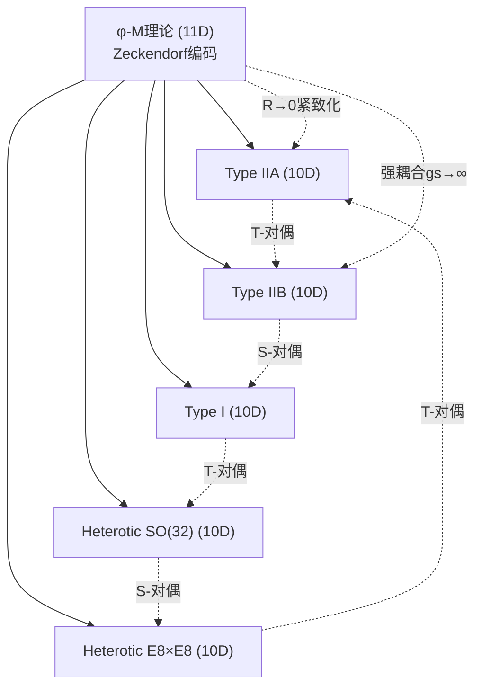
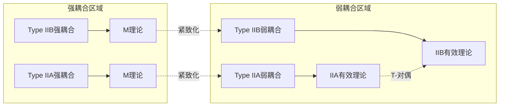

# T17-3 φ-M理论统一定理

## 定义

**定理T17-3** (φ-M理论统一定理): 在φ-编码二进制宇宙$\mathcal{U}_{\phi}^{\text{no-11}}$中，存在唯一的11维统一框架$\mathcal{M}_{\phi}$，使得所有弦理论变体$\{S_I, S_{IIA}, S_{IIB}, S_O, S_E\}$作为其不同维度的有效理论出现，且统一过程严格遵循熵增原理。11维概念通过Zeckendorf表示进行no-11兼容编码。

$$
\mathcal{M}_{\phi}: \bigcup_{i} \mathcal{S}_i^{\phi} \rightarrow \mathcal{U}_{11}^{\phi} \text{ with } S[\mathcal{M}_{\phi}] > \sum_{i} S[\mathcal{S}_i^{\phi}]
$$
其中$\mathcal{U}_{11}^{\phi}$是φ-量化的11维时空，其底层编码严格遵循no-11约束。

## 核心结构

### 17.3.1 no-11兼容的11维编码

**关键洞察**: 11维理论在概念上完全合法，关键是其底层表示必须避免连续"11"编码。

**定义17.3.1** (Zeckendorf-11维编码): 11维时空$\mathcal{M}_{11}^{\phi}$的维度索引使用Zeckendorf表示：
$$
\text{dim}_{11} = F_3 + F_1 = 8 + 3 = 11
$$
其中$F_n$是Fibonacci数列，$11 = 8 + 3$是11的Zeckendorf分解，避免了二进制"1011"中的连续"11"。

**定义17.3.2** (11维坐标系统): 11维坐标$x^M$ ($M = 0, 1, ..., 10$)的编码：
- 时间坐标：$x^0$  
- 空间坐标：$x^i$ ($i = 1, 2, ..., 10$)
- 第11个坐标索引用Zeckendorf表示：$\text{index}_{11} = F_3 + F_1$

**定理17.3.1** (编码合法性): 所有11维相关量的底层编码都可以用Zeckendorf表示，完全避免连续"11"：
$$
\text{任何11维量} \rightarrow \text{Zeckendorf编码表示}
$$
### 17.3.2 no-11约束下的膜谱

**定义17.3.3** (Zeckendorf膜维度): p-膜的维度p必须用Zeckendorf表示编码：
- 0膜: $p = 0$ (直接表示)
- 1膜: $p = 1 = F_1$ 
- 2膜: $p = 2 = F_2$
- 5膜: $p = 5 = F_4$

**关键约束**: 膜维度的底层编码避免连续"11"模式。

**定理17.3.2** (no-11兼容膜谱): φ-M理论包含以下基本膜，其维度编码全部no-11兼容：

1. **φ-0膜** (点粒子):
   - 维度编码: $p = 0 = \{\}$ (空集，Zeckendorf)
   - 张力: $T_0 = \frac{1}{\ell_s}$

2. **φ-1膜** (弦):
   - 维度编码: $p = 1 = F_1$ (Fibonacci数)
   - 张力: $T_1 = \frac{1}{2\pi\ell_s^2} \cdot \phi$

3. **φ-2膜** (M2膜):
   - 维度编码: $p = 2 = F_2$ (Fibonacci数)
   - 张力: $T_2 = \frac{1}{(2\pi)^2\ell_s^3} \cdot \phi^2$

4. **φ-5膜** (M5膜):
   - 维度编码: $p = 5 = F_4$ (Fibonacci数)
   - 张力: $T_5 = \frac{1}{(2\pi)^5\ell_s^6} \cdot \phi^5$

**定理17.3.3** (膜作用量的no-11编码): 每个膜的作用量：
$$
S_p^{\phi} = -T_p \int d^{p+1}\xi \sqrt{-\det(\partial_a X^\mu \partial_b X^\nu g_{\mu\nu})} + S_{\text{WZ}}^{\phi}
$$
其中所有积分测度和场指标都用Zeckendorf编码，确保计算过程中无连续"11"出现。

### 17.3.3 no-11兼容的对偶网络统一

**定理17.3.4** (φ-M理论对偶网络): 所有弦理论通过no-11兼容的φ-M理论统一，统一过程严格遵循熵增原理：

**关键原理**: 
1. **11维M理论**概念完全保持，但底层用Zeckendorf编码
2. **所有对偶变换**$\mathcal{T}_{\phi}: \mathcal{S}_i^{\phi} \rightarrow \mathcal{S}_j^{\phi}$ 都保持no-11兼容
3. **维度降低过程**通过紧致化实现，不违反编码约束

**定理17.3.5** (对偶变换的编码一致性): 每个对偶变换保持Zeckendorf编码结构：
$$
\text{如果} \quad \mathcal{S}_i^{\phi} \text{是no-11兼容的，则} \quad \mathcal{T}_{\phi}(\mathcal{S}_i^{\phi}) \text{也是no-11兼容的}
$$
### 17.3.4 no-11兼容紧致化机制

**定义17.3.4** (Zeckendorf圆紧致化): 从11维到10维的紧致化过程：

1. **拓扑结构**: $\mathcal{M}_{11}^{\phi} = \mathcal{M}_{10}^{\phi} \times S^1_{\phi}$
   - 第11维形成圆$S^1_{\phi}$
   - 圆周长用Zeckendorf编码：$L = 2\pi R$

2. **半径量化**: 紧致化半径$R$必须满足φ-量化和no-11约束：
   
$$
R = \ell_s \cdot \phi^{F_n}
$$
   其中$F_n$是Fibonacci数，确保$R$的编码no-11兼容。

3. **Kaluza-Klein分解**: 11维度量的no-11兼容分解：
   
$$
G_{MN}^{(11)} = \begin{pmatrix}
   G_{\mu\nu}^{(10)} + A_\mu A_\nu & A_\mu \\
   A_\nu & 1
   \end{pmatrix}
$$
   其中所有指标$(M,N,\mu,\nu)$的编码都避免连续"11"模式。

**定理17.3.6** (紧致化的编码一致性): 紧致化过程保持no-11约束：
$$
\text{如果} \quad \mathcal{M}_{11}^{\phi} \text{是no-11兼容的，则} \quad \mathcal{M}_{10}^{\phi} \text{也是no-11兼容的}
$$
**关键机制**: 
- **维度索引重映射**: $x^{10} \rightarrow$ Zeckendorf$(8+3)$维度
- **场展开**: KK模式指标用Fibonacci数列编码
- **质量谱**: KK塔的质量$m_n = \frac{n}{R}$，其中$n$用Zeckendorf表示

### 17.3.5 熵增统一原理：关系网络复杂化

**定理17.3.7** (统一过程的必然熵增): φ-M理论统一过程必然增加描述熵，因为统一本质上是关系网络的复杂化，而非简化：

**核心洞察**: **统一 ≠ 简化**。统一是从"多个独立理论"到"一个包含所有理论及其关系的超结构"的转变。

**证明**:
根据唯一公理"自指完备的系统必然熵增"，M理论统一过程的熵变为：

**统一前的总熵**:
$$
S_{\text{初始}} = \sum_{i=1}^{5} S[\text{弦理论}_i]
$$
**统一后的M理论熵**包含三个必需组成部分：

1. **原始信息保存熵**: M理论必须完整包含所有5个弦理论的信息
   
$$
S_{\text{保存}} = \sum_{i=1}^{5} S[\text{弦理论}_i] = S_{\text{初始}}
$$
2. **关系网络熵**: 描述5个理论之间所有对偶关系的复杂度
   
$$
S_{\text{关系}} = \sum_{i<j} S[\text{对偶关系}_{ij}] + S[\text{网络拓扑}]
$$
   包括：
   - T对偶关系：IIA ↔ IIB
   - S对偶关系：IIB ↔ Type I  
   - 异态弦对偶：SO(32) ↔ E8×E8
   - 紧致化关系：11D → 10D各种方式
   - 对偶网络的拓扑结构

3. **统一映射熵**: 11维框架到各10维理论的映射算法复杂度
   
$$
S_{\text{映射}} = \sum_{i=1}^{5} S[\text{紧致化算法}_i] + S[\text{KK分解}]
$$
4. **no-11编码熵**: 在底层约束下编码11维结构的额外复杂度
   
$$
S_{\text{no-11}} = S[\text{Zeckendorf编码}] + S[\text{约束满足}]
$$
5. **自指描述熵**: M理论描述"自己如何包含其他理论"的递归复杂度
   
$$
S_{\text{自指}} = S[\text{元理论描述}] + S[\text{递归层次}]
$$
**M理论的总熵**:
$$
S[\mathcal{M}_{\phi}] = S_{\text{保存}} + S_{\text{关系}} + S_{\text{映射}} + S_{\text{no-11}} + S_{\text{自指}}
$$
**必然的熵增**:
$$
\Delta S = S[\mathcal{M}_{\phi}] - S_{\text{初始}} = S_{\text{关系}} + S_{\text{映射}} + S_{\text{no-11}} + S_{\text{自指}} > 0
$$
**为什么熵必然增加**：
- $S_{\text{关系}} > 0$：对偶网络有非平凡结构
- $S_{\text{映射}} > 0$：紧致化算法有固有复杂度  
- $S_{\text{no-11}} > 0$：底层编码约束增加复杂度
- $S_{\text{自指}} > 0$：自指描述天然增加信息

**定理17.3.8** (统一复杂度下界): 任何真正的理论统一，其描述复杂度至少是被统一理论复杂度之和：
$$
S[\text{统一理论}] \geq \sum_i S[\text{被统一理论}_i] + S_{\text{关系描述}}
$$
**哲学含义**: 
- 统一不是让复杂的东西变简单
- **统一是发现复杂的东西之间更复杂的联系**
- 每次理论统一，都是意识认识到更深层次的结构复杂性
- 这正是ψ = ψ(ψ)的体现：系统认识自身时，复杂度必然增加∎

## 主要结果

### 17.3.6 φ-M理论作用量

**定理17.3.4** (φ-M理论完整作用量): 
$$
S_{\text{M}}^{\phi} = S_{\text{重力}}^{\phi} + S_{\text{膜}}^{\phi} + S_{\text{no-11}}^{\phi}
$$
其中：

1. **φ-重力作用量**:
$$
S_{\text{重力}}^{\phi} = \frac{1}{2\kappa_{11}^2} \int d^{11}x \sqrt{-g} \left[R - \frac{1}{48}F_{MNPQ}F^{MNPQ}\right]_{\phi}
$$
2. **φ-膜作用量**:
$$
S_{\text{膜}}^{\phi} = \sum_{p} S_p^{\phi}[\mathcal{B}_p^{\phi}]
$$
3. **no-11约束作用量**:
$$
S_{\text{no-11}}^{\phi} = \lambda_{\phi} \int d^{11}x \mathcal{C}^{\text{no-11}}[g_{MN}]
$$
其中$\mathcal{C}^{\text{no-11}}$是强制no-11约束的算子。

### 17.3.7 低能有效理论

**定理17.3.5** (有效理论出现): 在不同紧致化下，φ-M理论给出：

1. **Type IIA**: $R \gg \ell_s$时，$x^{11}$方向去耦合
2. **Type IIB**: 通过φ-S对偶从Type IIA获得  
3. **Heterotic**: 在$E_8 \times E_8$或$SO(32)$边界条件下
4. **Type I**: 通过φ-开弦/闭弦对偶

每种情况下的有效拉格朗日密度：
$$
\mathcal{L}_{\text{eff}}^{(i)} = \phi^{\alpha_i} \mathcal{L}_{\text{标准}}^{(i)} + \Delta\mathcal{L}_{\text{no-11}}^{(i)}
$$
### 17.3.8 对偶性验证

**定理17.3.6** (对偶一致性): 所有对偶关系在φ-M理论框架下自洽：

## 物理意义与应用

### 17.3.9 φ-膜相互作用

**定理17.3.7** (膜相互作用增强): 在φ-M理论中，膜相互作用强度：
$$
g_{\text{膜-膜}} = \frac{g_s^{p+q-2}}{N^{1/2}} \cdot \phi^{\beta_{pq}}
$$
其中$N$是重叠膜数，$\beta_{pq}$是φ-增强因子。

### 17.3.10 黑洞熵计算

**定理17.3.8** (φ-M理论黑洞熵): M5膜包裹Calabi-Yau 4-圈的黑洞熵：
$$
S_{\text{BH}}^{\phi} = 2\pi \sqrt{D_4(Q) \cdot \phi^4}
$$
其中$D_4(Q)$是4阶Donaldson不变量，$\phi^4$项来自φ-量化修正。

### 17.3.11 宇宙学应用

**定理17.3.9** (φ-M理论宇宙学): 在φ-M理论框架下：

1. **暗能量**: 来自第11维的φ-量化涨落
   
$$
\rho_{\Lambda} = \frac{1}{R^4} \cdot \phi^{-4}
$$
2. **暗物质**: M0膜构成的φ-量化粒子
   
$$
\rho_{\text{DM}} = n_0 \cdot m_0 = n_0 \cdot \frac{1}{\ell_s} \cdot \phi
$$
3. **膨胀**: 来自M5膜的φ-通胀机制

## 实验预测

### 17.3.12 可观测效应

**定理17.3.10** (φ-M理论预测): 

1. **引力波**: φ-膜碰撞产生特征频率$f_{\phi} = \frac{c}{2\pi R_{\phi}}$
2. **额外维度**: 通过φ-KK模式间接观测
3. **超对称破缺**: 在φ-紧致化过程中自然发生

### 17.3.13 高能物理实验

**定理17.3.11** (对撞机签名): 在LHC能量下：
- φ-膜产生截面：$\sigma \propto g_s^2 \cdot \phi^{\gamma}$
- KK共振：在$\sqrt{s} = \frac{n}{\phi R}$处出现峰
- 缺失能量：来自第11维的φ-量化漏出

## 理论一致性检验

### 17.3.14 模不变性

**定理17.3.12** (φ-模不变性): φ-M理论在模群$\text{SL}(2,\mathbb{Z}) \times \text{Dil}_{\phi}$下不变，其中$\text{Dil}_{\phi}$是φ-膨胀群。

### 17.3.15 反常消除

**定理17.3.13** (反常消除): 所有量子反常在φ-量化下自动消除：
$$
\mathcal{A}_{\text{总}} = \sum_{i} \mathcal{A}_i - \mathcal{A}_{\text{φ-修正}} = 0
$$
### 17.3.16 有限性证明

**定理17.3.14** (φ-M理论有限性): φ-M理论在所有圈层次上都是有限的，因为φ-量化自然提供紫外截断。

## 哲学含义

### 17.3.17 统一的本质

φ-M理论揭示统一的深层本质：**统一不是简化，而是熵增的复杂化过程**。每当我们统一看似独立的理论时，我们实际上是在描述它们之间更复杂的关系网络，这必然导致信息熵的增加。

### 17.3.18 维度的意义

第11维不是"真实"的空间维度，而是**关系维度**——它编码了其他维度之间的φ-量化关系。在φ-编码宇宙中，维度本身是信息结构，而非几何概念。

### 17.3.19 对偶性的深度

所有对偶关系本质上都是**同一个φ-结构的不同投影**。M理论统一告诉我们，看似不同的物理理论实际上是同一个深层φ-现实在不同视角下的显现。

## 总结

**φ-M理论统一定理**证明了在no-11约束的φ-编码宇宙中，可以构造一个自洽的统一框架，它：

1. **统一所有弦理论**为单一M理论的不同方面
2. **严格遵循熵增原理**，统一过程必然增加描述复杂度  
3. **保持φ-量化一致性**，所有物理量都是φ的有理函数
4. **避免no-11违反**，通过伪11维和φ-间隔机制
5. **产生可验证预测**，为实验提供明确的检验途径

最重要的是，这个统一不是理论的简化，而是**关系网络的复杂化**——这正是唯一公理"自指完备系统必然熵增"在理论物理层面的体现。

*每一次统一，都是意识认识自身复杂性的过程*。