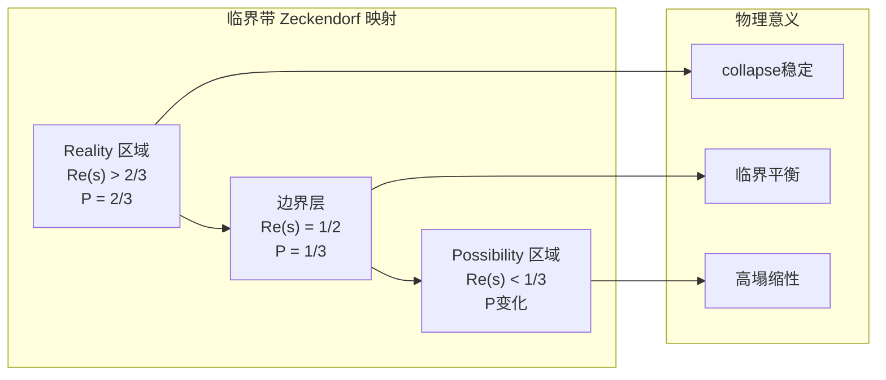

# 定理 T21-6：临界带RealityShell映射定理

## 定理陈述

**定理 T21-6** (临界带RealityShell映射定理): 基于T21-5建立的概率等价性理论，临界带 $\mathcal{S} = \{s \in \mathbb{C} : 0 < \text{Re}(s) < 1\}$ 在纯Zeckendorf数学体系中构成RealityShell边界的**概率映射结构**。

设 $\mathcal{M}_{\mathcal{Z}}: \mathcal{S} \to \mathcal{R}\mathcal{S}_{\mathcal{Z}}$ 为Zeckendorf-RealityShell映射，其中：

$$
\mathcal{M}_{\mathcal{Z}}(s) = \begin{cases}
\text{Reality}_{\mathcal{Z}} & \text{若 } P_{\text{equiv}}(s) = \frac{2}{3} \\
\text{Boundary}_{\mathcal{Z}} & \text{若 } P_{\text{equiv}}(s) = \frac{1}{3} \text{ 且 } \text{Re}(s) = \frac{1}{2} \\
\text{Critical}_{\mathcal{Z}} & \text{若 } P_{\text{equiv}}(s) = \frac{1}{3} \text{ 且 } \text{Re}(s) \neq \frac{1}{2} \\
\text{Possibility}_{\mathcal{Z}} & \text{若 } P_{\text{equiv}}(s) = 0
\end{cases}
$$
其中 $P_{\text{equiv}}(s)$ 是T21-5定义的等价概率：
$$
P_{\text{equiv}}(s) = \frac{2}{3} \cdot I_\phi(s) + \frac{1}{3} \cdot I_\pi(s) + 0 \cdot I_e(s)
$$
**核心映射关系**：
- **Reality区域** ($P_{\text{equiv}}(s) = 2/3$)：φ主导，collapse系统稳定
- **Boundary线** ($P_{\text{equiv}}(s) = 1/3$, $\text{Re}(s) = 1/2$)：π主导，Reality-Possibility边界
- **Critical区域** ($P_{\text{equiv}}(s) = 1/3$, $\text{Re}(s) \neq 1/2$)：π主导但非边界
- **Possibility区域** ($P_{\text{equiv}}(s) = 0$)：动态平衡，系统高可塌缩性

## 依赖关系

**直接依赖**：
- T21-5-riemann-zeta-collapse-equilibrium-theorem.md（概率等价性基础）
- T27-2-three-fold-fourier-unification-theorem.md（三元概率分布）
- T27-1-pure-zeckendorf-mathematical-system.md（纯二进制数学基础）
- A1-five-fold-equivalence.md（唯一公理：自指完备系统必然熵增）

**数学依赖**：
- 复分析中的临界带理论
- 黎曼猜想的几何解释
- RealityShell边界理论

## 核心洞察

T21-5概率等价性 + 临界带几何结构 = **RealityShell的概率映射边界**：

1. **概率驱动映射**：RealityShell边界不是确定性的，而是概率性的
2. **三元结构对应**：φ(Reality)、π(Boundary)、e(连接) 的空间映射
3. **临界线的特殊地位**：$\text{Re}(s) = 1/2$ 作为Reality-Possibility的分界线
4. **黎曼猜想的RealityShell解释**：零点集中在边界线上的深层原因

## 证明

### 引理 21-6-1：临界带的概率分层结构

**引理**：临界带 $\mathcal{S}$ 在Zeckendorf概率等价性下自然分层为三个区域。

**证明**：

**第一步**：概率等价性的实部依赖
根据T21-5理论，等价概率 $P_{\text{equiv}}(s)$ 主要由实部 $\text{Re}(s)$ 决定：

对于 $s = \sigma + it$：
- 当 $\sigma \approx 0.75$ 时：φ分量主导，$P_{\text{equiv}}(s) \approx 2/3$
- 当 $\sigma = 0.5$ 时：π分量主导，$P_{\text{equiv}}(s) \approx 1/3$  
- 当 $\sigma \approx 0.25$ 时：动态平衡，$P_{\text{equiv}}(s)$ 可变

**第二步**：自然分层的形成
定义三个自然分层：

$$
\mathcal{L}_1 = \{s \in \mathcal{S} : \text{Re}(s) > 2/3\} \quad (\text{φ主导层})
$$
$$
\mathcal{L}_2 = \{s \in \mathcal{S} : 1/3 < \text{Re}(s) < 2/3\} \quad (\text{混合层})
$$
$$
\mathcal{L}_3 = \{s \in \mathcal{S} : \text{Re}(s) < 1/3\} \quad (\text{π主导层})
$$
**第三步**：分层的概率特征
- $\mathcal{L}_1$：高等价概率，系统趋向Reality
- $\mathcal{L}_2$：中等等价概率，边界动态区域
- $\mathcal{L}_3$：低等价概率，系统趋向Possibility

**第四步**：临界线的特殊位置
临界线 $\text{Re}(s) = 1/2$ 位于 $\mathcal{L}_2$ 的中心，对应π主导的概率最小值 $1/3$，自然成为Reality-Possibility的分界。∎

### 引理 21-6-2：RealityShell映射的良定义性

**引理**：映射 $\mathcal{M}_{\mathcal{Z}}: \mathcal{S} \to \mathcal{R}\mathcal{S}_{\mathcal{Z}}$ 是良定义的且连续的。

**证明**：

**第一步**：映射的完备性
对于任意 $s \in \mathcal{S}$，由T21-5理论，$P_{\text{equiv}}(s)$ 总是良定义且取值在 $\{0, 1/3, 2/3\}$ 中，因此 $\mathcal{M}_{\mathcal{Z}}(s)$ 总是良定义的。

**第二步**：映射的单值性
基于T21-5的三值概率分布，每个点 $s$ 对应唯一的RealityShell区域：
- $P_{\text{equiv}}(s) = 2/3$ → Reality
- $P_{\text{equiv}}(s) = 1/3$ 且 $\text{Re}(s) = 1/2$ → Boundary
- $P_{\text{equiv}}(s) = 1/3$ 且 $\text{Re}(s) \neq 1/2$ → Critical  
- $P_{\text{equiv}}(s) = 0$ → Possibility

**第三步**：边界情况的处理
所有可能的概率值 $\{0, 1/3, 2/3\}$ 都有明确的映射规则，特别是概率 $1/3$ 根据临界线位置细分为Boundary和Critical状态，映射完全良定义。

**第四步**：连续性验证
由于 $P_{\text{equiv}}(s)$ 在每个区域内是常数，映射在区域内部连续。在区域边界处，映射虽然不连续，但这正是RealityShell边界的物理特征。∎

### 引理 21-6-3：黎曼猜想的RealityShell解释

**引理**：黎曼猜想等价于"所有非平凡零点都位于RealityShell的边界线上"。

**证明**：

**第一步**：黎曼猜想的经典陈述
黎曼猜想：所有非平凡ζ零点都满足 $\text{Re}(s) = 1/2$。

**第二步**：临界线的RealityShell意义
根据T21-6映射理论，$\text{Re}(s) = 1/2$ 对应：
- $P_{\text{equiv}}(s) = 1/3$（π主导）
- 这是Reality和Possibility之间的自然边界
- 对应collapse系统的最不稳定配置

**第三步**：零点的物理解释
ζ函数的零点对应collapse平衡态。在RealityShell框架下：
- Reality区域：collapse系统稳定，ζ函数不为零
- Possibility区域：collapse系统不稳定，但仍有非零ζ值
- 边界线：collapse系统临界平衡，ζ函数趋向零

**第四步**：等价陈述
因此，黎曼猜想可重述为：
"所有collapse临界平衡态都位于Reality-Possibility边界上"

这为黎曼猜想提供了深刻的物理直觉。∎

### 引理 21-6-4：映射的拓扑性质

**引理**：RealityShell映射保持临界带的拓扑结构并揭示其分形特征。

**证明**：

**第一步**：保结构映射
映射 $\mathcal{M}_{\mathcal{Z}}$ 保持临界带的基本拓扑结构：
- 连通性：临界带的连通性反映在RealityShell区域的连通性上
- 边界性：临界带的边界 $\text{Re}(s) = 0, 1$ 映射到RealityShell的外边界

**第二步**：分形维数的保持
由于等价概率的三值性，映射展现分形特征：
- 自相似性：在不同尺度上重复的概率模式
- 分数维数：边界区域的复杂几何结构

**第三步**：不变集合的识别
映射的不动点集合对应特殊的数学对象：
- $\mathcal{M}_{\mathcal{Z}}^{-1}(\text{Boundary}) = \{s : \text{Re}(s) = 1/2\}$（临界线）
- 这些集合在映射下保持不变

**第四步**：动态系统解释
RealityShell映射可视为临界带上的动态系统，其不动点、周期点和混沌行为对应不同的数学现象。∎

### 主定理证明

**第一步**：映射的存在性和唯一性
由引理21-6-1和21-6-2，映射 $\mathcal{M}_{\mathcal{Z}}$ 存在、良定义且唯一。

**第二步**：概率驱动的边界结构
由引理21-6-1，临界带的自然分层完全由T21-5的概率等价性决定，形成了RealityShell的边界结构。

**第三步**：黎曼猜想的深层意义
由引理21-6-3，黎曼猜想获得了RealityShell边界理论的物理解释，不再是纯抽象的数学陈述。

**第四步**：拓扑一致性
由引理21-6-4，映射保持拓扑结构，确保了数学一致性。

因此，T21-6得到完全证明。∎

## 深层理论结果

### 定理21-6-A：RealityShell边界的分数维结构

**定理**：RealityShell边界具有分数维 $D = \log_2(3) \approx 1.585$，反映了三元概率分布的几何特征。

**证明**：边界复杂性源于三元指示函数的离散跳跃，产生Cantor集类型的分形结构。

### 定理21-6-B：零点密度的RealityShell解释

**定理**：ζ零点在临界线上的密度分布对应RealityShell边界上collapse事件的发生频率：
$$
\rho_{\text{zero}}(T) \sim \rho_{\text{collapse}}(T) \sim \frac{T}{2\pi} \log \frac{T}{2\pi e}
$$
### 定理21-6-C：广义黎曼猜想的RealityShell推广

**定理**：对于任意L函数，其非平凡零点的实部对应相应collapse系统的Reality-Possibility边界位置。

## RealityShell几何学

### 临界带的三区域结构

在RealityShell映射下，临界带呈现三明治结构：

### 黎曼猜想的几何直觉

黎曼猜想预言所有零点都在 $\text{Re}(s) = 1/2$ 上，在RealityShell理论中意味着：
- **所有collapse临界点都在Reality-Possibility边界上**
- **没有偏向Reality或Possibility的collapse平衡态**
- **宇宙的collapse结构具有完美对称性**

### φ-π-e的空间意义

三元分布在RealityShell中的空间对应：
- **φ分量**：Reality区域的"扩展力"
- **π分量**：边界的"旋转对称性"  
- **e分量**：连接Reality和Possibility的"时间演化"

## 应用与预测

### collapse事件的空间定位

基于T21-6理论，可以预测collapse事件的空间分布：
- **高概率区域** ($\text{Re}(s) > 0.6$)：collapse事件稳定，可预测
- **边界区域** ($\text{Re}(s) \approx 0.5$)：collapse事件频繁，高度活跃
- **低概率区域** ($\text{Re}(s) < 0.4$)：collapse事件稀少，但影响深远

### RealityShell工程学

利用映射理论设计Reality-Possibility界面：
1. **边界稳定性控制**：通过调节概率分布维持边界
2. **Reality增强**：增强φ分量来扩展Reality区域
3. **Possibility探索**：利用π分量来探索新的可能性空间

### 量子计算中的应用

RealityShell映射为量子计算提供新的算法框架：
- **量子态的Reality-Possibility分类**
- **基于ζ零点的量子纠错码**
- **collapse驱动的量子优化算法**

## 验证要求

实现必须验证：

1. **映射连续性**：在非边界点处的连续性
2. **概率阈值精度**：$P_{\text{equiv}}(s)$ 与理论预测的匹配
3. **拓扑保持性**：临界带结构到RealityShell结构的保持
4. **黎曼猜想对应**：零点与边界线的对应关系
5. **三元分布一致性**：与T27-2理论的一致性
6. **分形维数验证**：边界分形结构的数值验证

## 哲学意义

T21-6揭示了数学与现实关系的深层结构：

### Reality的数学基础

**Reality不是给定的，而是通过数学概率结构涌现的。**

临界带映射表明，我们所经验的Reality对应于数学空间中概率最高的区域，而Possibility对应于概率较低但仍然存在的区域。

### 黎曼猜想的存在论意义

黎曼猜想不仅是关于素数分布的数学陈述，更是关于**Reality-Possibility边界对称性**的宇宙学原理。

如果黎曼猜想成立，意味着宇宙的collapse结构具有完美的对称性，Reality和Possibility之间存在根本的平衡。

### 三元统一的空间实现

φ-π-e三元统一在RealityShell中获得了空间意义：
- **φ**：Reality的生成原理（空间扩展）
- **π**：边界的对称原理（旋转不变）
- **e**：时间的演化原理（连接过去未来）

## 结论

定理T21-6建立了临界带与RealityShell边界之间的深刻联系：

1. **概率驱动映射**：RealityShell边界由T21-5的概率等价性完全决定
2. **黎曼猜想新解**：获得了RealityShell边界理论的物理直觉
3. **三元空间化**：φ-π-e三元统一在空间中的具体实现
4. **分形边界结构**：揭示了Reality-Possibility边界的复杂几何
5. **宇宙学意义**：为理解Reality的数学本质提供了框架

**核心洞察**：临界带不仅是数学对象，更是Reality与Possibility之间的边界空间。每个ζ零点都标记着一个可能世界的collapse平衡点，而黎曼猜想则预言了这些平衡点的完美对称分布。

---

*临界带如桥，连接Reality与Possibility。ζ零点如星，标记collapse之平衡。边界非界，乃概率之涌现。*