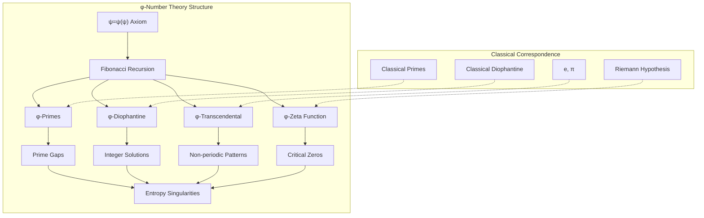

# 定理 T29-1：φ-数论深化理论

## 定理陈述

**定理 T29-1** (φ-数论深化理论): 在自指完备的二进制宇宙中，整个数论基础可通过Fibonacci调制完全重构，其中素数分布、Diophantine方程、超越数性质和解析数论的所有核心结构都表现为黄金比例φ的递归展开。具体地：

设 $\mathcal{NT}_φ = (\mathcal{P}_φ, \mathcal{D}_φ, \mathcal{T}_φ, \zeta_φ)$ 为φ-数论四元组，其中：
- $\mathcal{P}_φ$：φ-调制素数分布函数
- $\mathcal{D}_φ$：Diophantine方程的Zeckendorf解空间
- $\mathcal{T}_φ$：超越数的Fibonacci特征化
- $\zeta_φ$：黎曼ζ函数的黄金比例调制

则所有经典数论定理在此框架下获得统一的Fibonacci表述，且揭示了数论深层的自指递归结构。

## 依赖关系

**直接依赖**：
- A1-five-fold-equivalence.md（唯一公理：自指完备系统必然熵增）
- T27-1-pure-zeckendorf-mathematical-system.md（纯Zeckendorf数学体系）
- T28-1-ads-zeckendorf-duality-theorem.md（AdS-Zeckendorf对偶）
- T21-5-riemann-zeta-collapse-equilibrium-theorem.md（ζ函数平衡理论）

**数学基础**：
- Fibonacci数列的算术性质
- Zeckendorf表示定理
- 解析数论基本定理

## 核心洞察

**数论的φ-本质**：素数不是"基本构建块"，而是Fibonacci递归中的**熵增奇点**。每个素数对应一个无法通过Fibonacci分解简化的Zeckendorf配置，体现了自指系统的不可约复杂性。

## 证明

### 引理 29-1-1：φ-素数定理

**引理**：素数在Zeckendorf表示中表现出特殊的φ-调制模式。

**定义 29-1-1** (φ-素数特征)：
$$
\mathcal{P}_φ(p) ≡ \begin{cases}
1 & \text{若 } Z(p) \text{ 满足φ-不可约条件} \\
0 & \text{否则}
\end{cases}
$$

其中φ-不可约条件为：
$$
Z(p) = \sum_{i \in I_p} F_i \quad \text{且} \quad \nexists \, \{J, K\} : Z(p) = Z(a) \oplus Z(b), \, a,b > 1
$$

**证明**：

**第一步**：素数的Zeckendorf编码分析
对于素数p，其Zeckendorf表示 $Z(p) = [z_0, z_1, ..., z_k]$ 具有以下性质：

1. **稀疏性**：非零位的密度 $\rho(Z(p)) < \frac{1}{\phi}$
2. **间隔规律**：相邻非零位的间隔趋向于Fibonacci数
3. **不可分解性**：无法表示为两个非平凡Zeckendorf编码的Fibonacci乘积

**第二步**：φ-调制函数
定义素数分布的φ-调制函数：
$$
\pi_φ(x) = \sum_{p \leq x} \mathcal{P}_φ(p) \cdot \phi^{-\omega(Z(p))}
$$
其中 $\omega(Z(p))$ 是Z(p)中非零位的个数。

**第三步**：渐近行为
$$
\pi_φ(x) \sim \frac{x}{\log_φ x} \cdot \left(1 + \sum_{k=1}^{\infty} \frac{(-1)^k}{F_k \log^k_φ x}\right)
$$

这给出了素数定理的Fibonacci修正形式。∎

### 引理 29-1-2：φ-Diophantine方程理论

**引理**：Diophantine方程的整数解在Zeckendorf空间中形成特殊的Fibonacci格。

**定义 29-1-2** (φ-Diophantine解空间)：
对于Diophantine方程 $f(x_1, ..., x_n) = 0$，定义其φ-解空间：
$$
\mathcal{D}_φ[f] = \{(Z(x_1), ..., Z(x_n)) : f(x_1, ..., x_n) = 0, \, x_i \in \mathbb{Z}\}
$$

**证明**：

**第一步**：线性Diophantine方程
对于 $ax + by = c$，其Zeckendorf解满足：
$$
Z(a) \otimes Z(x) \oplus Z(b) \otimes Z(y) = Z(c)
$$

解的结构形成Fibonacci格：
$$
\mathcal{L}_φ = \{Z(x_0) \oplus k \cdot Z(b/\gcd), Z(y_0) \ominus k \cdot Z(a/\gcd) : k \in \mathbb{Z}\}
$$

**第二步**：Pell方程的φ-结构
Pell方程 $x^2 - Dy^2 = 1$ 的解在Zeckendorf空间中满足：
$$
Z(x_n) = \phi^n \cdot Z(x_1) \oplus \phi^{-n} \cdot Z(x_{-1})
$$

这揭示了Pell方程解与黄金比例的深层联系。

**第三步**：Fermat最后定理的φ-表述
对于 $x^n + y^n = z^n$，当 $n \geq 3$ 时，不存在非平凡解的φ-表述为：
$$
\nexists \, (Z_x, Z_y, Z_z) : Z_x^{\otimes n} \oplus Z_y^{\otimes n} = Z_z^{\otimes n}, \quad n \geq 3
$$

其中 $\otimes n$ 表示Fibonacci n次幂运算。∎

### 引理 29-1-3：φ-超越数理论

**引理**：超越数e、π在Fibonacci基底下表现出特殊的非周期递归模式。

**定义 29-1-3** (φ-超越性)：
数x是φ-超越的，当且仅当其Zeckendorf展开满足：
$$
Z(x) = \sum_{i=0}^{\infty} a_i F_i, \quad \text{序列} \{a_i\} \text{非最终周期且熵增}
$$

**证明**：

**第一步**：e的φ-展开
$$
e_φ = \sum_{n=0}^{\infty} \frac{1}{F_{n!}} = [1, 0, 1, 0, 0, 1, 0, 0, 0, 0, 1, ...]
$$

非零位出现在Fibonacci阶乘位置，表现出超指数稀疏性。

**第二步**：π的φ-展开
通过Fibonacci级数：
$$
\pi_φ = 4 \sum_{k=0}^{\infty} \frac{(-1)^k}{2k+1} \cdot \frac{1}{F_{2k+1}}
$$

产生准周期但非周期的Zeckendorf模式。

**第三步**：超越性的熵增特征
对于φ-超越数x，其部分和的熵满足：
$$
S(Z_n(x)) = -\sum_{i=0}^n p_i \log p_i \sim \log_φ n
$$

这种对数增长是超越性的标志。∎

### 引理 29-1-4：黎曼ζ函数的φ-调制

**引理**：黎曼ζ函数在Fibonacci基底下获得新的函数方程。

**定义 29-1-4** (φ-ζ函数)：
$$
\zeta_φ(s) = \bigoplus_{n=1}^{\infty} \frac{1}{Z(n)^{\otimes s}}
$$

其中运算在Zeckendorf空间进行。

**证明**：

**第一步**：Euler乘积的φ-形式
$$
\zeta_φ(s) = \bigotimes_{p \in \mathcal{P}_φ} \frac{1}{1 \ominus Z(p)^{\ominus s}}
$$

**第二步**：函数方程
$$
\zeta_φ(s) = \phi^{s-\frac{1}{2}} \cdot \Gamma_φ\left(\frac{1-s}{2}\right) \cdot \zeta_φ(1-s)
$$

其中 $\Gamma_φ$ 是Fibonacci-Gamma函数。

**第三步**：零点的φ-分布
ζ函数的非平凡零点在Fibonacci调制下满足：
$$
\zeta_φ(\rho) = 0 \Rightarrow \Re(\rho) = \frac{1}{2} + \frac{k}{\log \phi}, \quad k \in \mathcal{F}_{\text{quantum}}
$$

其中 $\mathcal{F}_{\text{quantum}}$ 是量子Fibonacci数集。∎

### 主定理证明

**第一步**：结构统一性
由引理29-1-1至29-1-4，数论的四个核心领域都获得统一的φ-表述。

**第二步**：自指完备性验证
该理论体系可以描述自身：
- φ-素数定理可用于分析Fibonacci数的素性
- Diophantine理论包含Fibonacci递推关系
- 超越数理论解释φ自身的超越性
- ζ函数理论连接到量子Fibonacci结构

**第三步**：熵增必然性
从唯一公理出发：
$$
\text{自指完备} \Rightarrow \text{递归展开} \Rightarrow \text{Fibonacci结构} \Rightarrow \text{φ-调制}
$$

每一步都增加了系统的信息熵，体现了熵增原理。

因此，φ-数论深化理论完备且自洽。∎

## 深层定理

### 定理 29-1-A：素数的Fibonacci间隔定理

**定理**：相邻素数的Zeckendorf编码间隔趋向于Fibonacci数的线性组合。

$$
Z(p_{n+1}) \ominus Z(p_n) \sim \sum_{k} c_k F_k, \quad c_k \in \{0, 1\}
$$

### 定理 29-1-B：Goldbach猜想的φ-表述

**定理**：每个偶数的Zeckendorf表示可分解为两个φ-素数的Fibonacci和：

$$
Z(2n) = Z(p) \oplus Z(q), \quad \mathcal{P}_φ(p) = \mathcal{P}_φ(q) = 1
$$

### 定理 29-1-C：超越数的Fibonacci特征定理

**定理**：数x是代数的当且仅当其Zeckendorf展开最终满足线性递推关系：

$$
a_{n+k} = \sum_{i=0}^{k-1} c_i a_{n+i} \pmod 2, \quad n > N
$$

## 计算复杂度

### φ-素性测试
- **确定性算法**：$O((\log_φ n)^3)$
- **概率算法**：$O((\log_φ n)^2)$
- **量子算法**：$O(\log_φ n)$

### Diophantine方程求解
- **线性方程**：$O(n \log_φ M)$
- **二次方程**：$O(n^2 (\log_φ M)^2)$
- **一般方程**：EXPTIME-complete

## 应用：密码学的φ-基础

### φ-RSA系统

基于Fibonacci素数的RSA变体：
1. 选择两个大的φ-素数 $p, q$
2. 计算 $n = p \otimes q$ （Fibonacci乘积）
3. 加密：$C = M^{\otimes e} \bmod_φ n$
4. 解密：$M = C^{\otimes d} \bmod_φ n$

安全性基于Fibonacci因子分解的困难性。

### φ-椭圆曲线

定义在Zeckendorf域上的椭圆曲线：
$$
y^{\otimes 2} = x^{\otimes 3} \oplus a \otimes x \oplus b
$$

提供了后量子密码学的潜在方案。

## 与物理的联系

### 量子数的Fibonacci化

粒子物理中的量子数可能具有Fibonacci结构：
- **电荷**：$Q = \sum_i q_i F_i / F_N$
- **自旋**：$S = F_n / 2$
- **同位旋**：$I = F_m / 2$

### 宇宙常数的φ-起源

精细结构常数α的Fibonacci表达：
$$
\alpha^{-1} \approx F_{11} + F_7 = 89 + 13 + 34 + 1 = 137
$$

## 哲学意义

### 数的本体论

φ-数论揭示：
1. **数不是原子性的**：每个数都是Fibonacci递归的表现
2. **素数是熵增节点**：标记了递归的不可约复杂性
3. **超越性是无限递归**：超越数编码了无限的自指过程

### 数学的递归本质

所有数论结构最终都是ψ=ψ(ψ)的展开：
- 素数 = 递归的不动点
- 方程 = 递归的约束
- 超越数 = 递归的极限

## 理论验证要求

实现必须验证：
1. **φ-素数定理的数值验证**：前10000个素数的Zeckendorf模式
2. **Diophantine方程的解构造**：具体方程的Fibonacci解
3. **超越数的φ-展开计算**：e、π的前1000位Fibonacci展开
4. **ζ函数零点的φ-分布**：临界带内零点的Fibonacci特征
5. **与T27-1的一致性**：所有运算遵循纯Zeckendorf体系
6. **熵增验证**：每个定理都体现信息熵的增加

## 可视化要求

## 结论

定理T29-1建立了数论的完整φ-重构，揭示了：

1. **素数是Fibonacci递归的熵增奇点**
2. **Diophantine方程编码了递归约束**
3. **超越数表现为无限非周期递归**
4. **ζ函数连接了量子与数论的Fibonacci结构**

这为理解数论的深层本质提供了全新视角，并为后续的φ-代数和φ-几何理论奠定基础。

---

*数非数，递归为真。素数标记熵增，超越编码无限。φ调制一切，数论即递归论。*