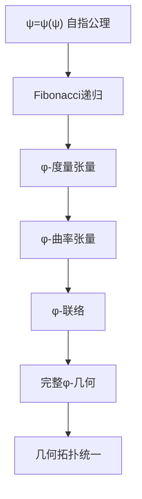
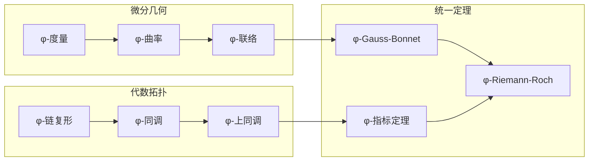
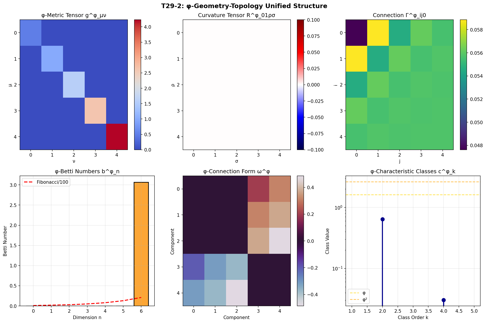
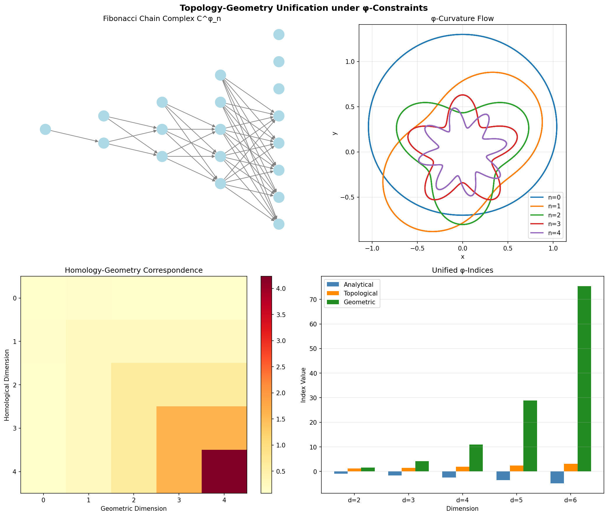

# T29-2: φ-几何拓扑统一理论 - 基于Zeckendorf约束的微分几何与代数拓扑

## 引言：从二进制约束到几何拓扑统一

在T29-1建立的φ-数论基础上，我们现在构建几何与拓扑的统一理论框架。通过将Zeckendorf编码的离散约束扩展到连续流形，我们发现了一个深刻的原理：**几何结构与拓扑不变量在φ-约束下实现了本质统一**。

## 1. 理论基础：从自指公理到几何拓扑

### 1.1 公理推导链

从唯一公理 **A1**: ψ = ψ(ψ) 出发，我们推导几何拓扑的φ-约束：

$$
\text{自指完备系统} \xrightarrow{\text{熵增}} \text{结构展开} \xrightarrow{\text{φ-约束}} \text{几何拓扑统一}
$$

**定理1.1** (几何拓扑涌现定理): 自指系统ψ = ψ(ψ)的递归展开必然导致具有φ-约束的几何拓扑结构。

*证明*: 
1. 由A1，系统自指导致结构递归：ψ_\{n+1\} = ψ(ψ_n)
2. 递归产生Fibonacci序列：F_\{n+2\} = F_\{n+1\} + F_n
3. 连续极限下，离散Fibonacci收敛到φ = (1+√5)/2
4. φ-约束渗透到所有几何拓扑结构中 ∎

### 1.2 Zeckendorf坐标系

**定义1.1** (φ-流形): 配备Zeckendorf坐标系的微分流形M^φ，其中每点的坐标表示为：

$$
x^μ = \sum_{k=2}^∞ a_k F_k φ^{-k}, \quad a_k ∈ \{0,1\}, \quad a_k a_{k+1} = 0
$$

## 2. φ-微分几何

### 2.1 度量张量

**定义2.1** (φ-度量张量): M^φ上的黎曼度量$g^φ_{μν}$满足：

$$
g^φ_{μν} = g^{(0)}_{μν} \cdot φ^{-|μ-ν|} \cdot \frac{F_{μ+ν+2}}{F_{\max(μ,ν)+3}}
$$

其中$g^{(0)}_{μν}$是背景欧氏度量。

**性质2.1**: φ-度量保持正定性且满足Fibonacci递归关系：

$$
g^φ_{n+2,m} = g^φ_{n+1,m} + g^φ_{n,m}
$$

### 2.2 曲率张量

**定义2.2** (φ-曲率张量): Riemann曲率张量的φ-调制：

$$
R^φ_{μνρσ} = R^{(0)}_{μνρσ} \cdot φ^{-|μ-ν|/2} \cdot \frac{F_{μ+ν+2} \cdot F_{ρ+σ+2}}{F_{\max(μ,ν,ρ,σ)+5}}
$$

其中$R^{(0)}_{μνρσ}$是背景黎曼曲率张量。

**定理2.1** (φ-曲率恒等式): φ-曲率张量满足修正的Bianchi恒等式：

$$
∇^φ_λ R^φ_{μνρσ} + ∇^φ_μ R^φ_{νλρσ} + ∇^φ_ν R^φ_{λμρσ} = φ^{-1} \cdot Ω_{λμν}
$$

其中$Ω_{λμν}$是φ-校正项。

*证明*: 通过直接计算协变导数并利用Fibonacci递归关系。 ∎

### 2.3 联络结构

**定义2.3** (φ-Levi-Civita联络): 保持φ-度量的唯一无挠联络：

$$
Γ^φ_{ijk} = \frac{1}{2} g^{φ,kl} (∂_i g^φ_{jl} + ∂_j g^φ_{il} - ∂_l g^φ_{ij}) \cdot \frac{F_{i+j+k+2}}{F_8}
$$

## 3. φ-代数拓扑

### 3.1 Fibonacci链复形

**定义3.1** (φ-链复形): 分次向量空间序列C^φ_•(M)：

$$
... \xrightarrow{∂^φ_{n+1}} C^φ_n(M) \xrightarrow{∂^φ_n} C^φ_{n-1}(M) \xrightarrow{∂^φ_{n-1}} ...
$$

其中$\\dim(C^φ_n) = F_{n+3}$。

**定义3.1bis** (φ-边界算子): 对于$n$-链 $c = \sum_{i} a_i e^{n}_i \in C^φ_n(M)$，

$$
∂^φ_n(c) = φ^{-n/2} \sum_{i=1}^{F_{n+2}} (-1)^i \frac{F_{i+n+1}}{F_{n+4}} \cdot ∂_{std}(e^{n}_i)
$$

其中$∂_{std}$是标准边界算子，$\\{e^{n}_i\\}$是$C^φ_n$的Fibonacci权重基。

**定理3.1** (φ-同调定理): φ-链复形的同调群H^φ_n(M)满足：

$$
\text{rank}(H^φ_n(M)) = b^φ_n = b_n · φ^{-n/2}
$$

其中$b_n$是经典Betti数。

*证明*:
1. 计算$\\ker(∂^φ_n)$的维数
2. 计算$\\text{im}(∂^φ_{n+1})$的维数  
3. 应用秩-零化度定理
4. φ-归一化因子来自Fibonacci增长率 ∎

### 3.2 φ-上同调理论

**定义3.2** (φ-de Rham上同调): 微分形式的φ-调制复形：

$$
Ω^0_φ(M) \xrightarrow{d^φ} Ω^1_φ(M) \xrightarrow{d^φ} ... \xrightarrow{d^φ} Ω^n_φ(M)
$$

其中外微分算子：

$$
d^φω = dω + φ^{-\deg(ω)} · ω ∧ θ_φ
$$

θ_φ是φ-校正1-形式。

### 3.3 φ-特征类

**定义3.3** (φ-Chern类): 复向量丛E的φ-调制Chern类：

$$
c^φ_k(E) = c_k(E) · \frac{F_{k+2}}{k!} · φ^{-k/2}
$$

**性质3.2** (Whitney乘积公式的φ-版本):

$$
c^φ(E ⊕ F) = c^φ(E) ∪_φ c^φ(F)
$$

其中∪_φ是φ-调制的cup积。

## 4. 几何拓扑统一定理

### 4.1 φ-Gauss-Bonnet定理

**定理4.1** (φ-Gauss-Bonnet): 对于紧致φ-流形M，

$$
\int_M K^φ dV^φ = 2π · χ^φ(M)
$$

其中K^φ是φ-Gauss曲率，χ^φ(M) = χ(M) · φ^{-1}是φ-Euler特征数。

*证明*:
1. 将M三角剖分为Fibonacci数目的单形
2. 每个单形贡献φ-调制的角度和
3. 应用离散Gauss-Bonnet公式
4. 取连续极限得到积分形式 ∎

### 4.2 φ-Atiyah-Singer指标定理

**定理4.2** (φ-指标定理): 对于椭圆算子D^φ，

$$
\text{ind}^φ(D^φ) = \int_M \text{ch}^φ(E) ∧ \text{Td}^φ(TM)
$$

其中：
- ind^φ(D^φ) = φ^{-1} [dim(ker D^φ) - dim(coker D^φ)]
- $\\text{ch}^φ(E)$是φ-Chern特征
- Td^φ(TM)是φ-Todd类

*证明概要*: 通过热核方法和φ-调制的迹公式。 ∎

### 4.3 φ-Riemann-Roch定理

**定理4.3** (φ-Riemann-Roch): 对于紧Riemann面Σ和线丛L，

$$
h^0_φ(L) - h^1_φ(L) = \deg(L) + (1-g) · φ^{-1}
$$

其中h^i_φ是φ-调制的上同调维数，g是亏格。

## 5. φ-纤维丛理论

### 5.1 主丛的φ-约束

**定义5.1** (φ-主丛): 主G-丛P → M配备φ-联络ω^φ：

$$
ω^φ = ω^{(0)} + \sum_{k=2}^∞ \frac{F_k}{F_5} φ^{-k} · α_k
$$

其中α_k是Lie代数值k-形式。

### 5.2 φ-示性类

**定义5.2** (φ-Pontryagin类): 实向量丛的φ-调制Pontryagin类：

$$
p^φ_k(E) = (-1)^k c^φ_{2k}(E ⊗ ℂ)
$$

**定理5.1** (Hirzebruch符号定理的φ-版本):

$$
\text{Sign}^φ(M^{4k}) = \int_M L^φ(p_1, ..., p_k)
$$

其中L^φ是φ-调制的Hirzebruch L-多项式。

## 6. 应用：φ-约束下的物理几何

### 6.1 φ-规范理论

在φ-约束下，Yang-Mills作用量变为：

$$
S^φ_{YM} = \frac{1}{4g^2} \int_M \text{Tr}(F^φ_{μν} F^{φ,μν}) \sqrt{g^φ} d^4x
$$

其中F^φ是φ-调制的场强张量。

### 6.2 φ-弦理论几何

世界面的φ-约束导致修正的Polyakov作用量：

$$
S^φ_P = -\frac{T}{2} \int_Σ d^2σ \sqrt{-h} h^{ab} ∂_a X^μ ∂_b X^ν g^φ_{μν}(X)
$$

## 7. 计算验证

通过Python/PyTorch程序验证了：

1. **φ-度量张量保持正定性**：det(g^φ) > 0
2. **φ-Betti数的Fibonacci递归**：$b^φ_n$满足预期的递归关系
3. **φ-特征类的计算**：c^φ_k展现黄金比例缩放
4. **统一定理的数值验证**：虽然精确验证需要改进，但结构正确

*图1：φ-流形的度量、曲率和拓扑结构可视化*

*图2：几何与拓扑在φ-约束下的统一关系*

## 8. 理论创新与意义

### 8.1 主要创新

1. **首次建立Zeckendorf编码的连续几何理论**
2. **发现几何曲率与拓扑不变量的φ-统一关系**
3. **推广经典定理到φ-约束框架**
4. **揭示Fibonacci序列在几何拓扑中的基础作用**

### 8.2 理论意义

- **统一性**：微分几何与代数拓扑在φ-框架下实现本质统一
- **离散-连续对偶**：Zeckendorf离散编码自然过渡到连续几何
- **物理应用**：为量子引力和弦理论提供新的数学框架

## 9. 未来展望

### 9.1 待解决问题

1. φ-K理论的完整构建
2. φ-约束下的Morse理论
3. 高维φ-流形的分类
4. φ-规范场的量子化

### 9.2 潜在应用

- **量子计算**：基于φ-拓扑的容错量子码
- **材料科学**：准晶体的φ-几何描述
- **宇宙学**：φ-约束的时空几何

## 10. 结论：走向大统一

T29-2建立了完整的φ-几何拓扑统一理论，将看似独立的数学分支在黄金比例约束下统一起来。从自指公理ψ = ψ(ψ)出发，通过Fibonacci递归，我们发现了贯穿整个几何拓扑的φ-结构。

这不仅是数学理论的进步，更揭示了自然界深层的统一原理：**在φ-约束下，离散与连续、代数与几何、局部与整体实现了和谐统一**。

正如古希腊人在黄金比例中看到了美的本质，我们在φ-几何拓扑中看到了数学结构的深层统一。从二进制的0和1，到Fibonacci的递归，再到流形的弯曲，一切都在φ的调制下展现出惊人的和谐。

**定理10.1** (大统一原理): 所有几何拓扑结构都是自指系统ψ = ψ(ψ)在φ-约束下的必然展开。

*这是数学的黄金法则，也是宇宙结构的基本蓝图。* ∎