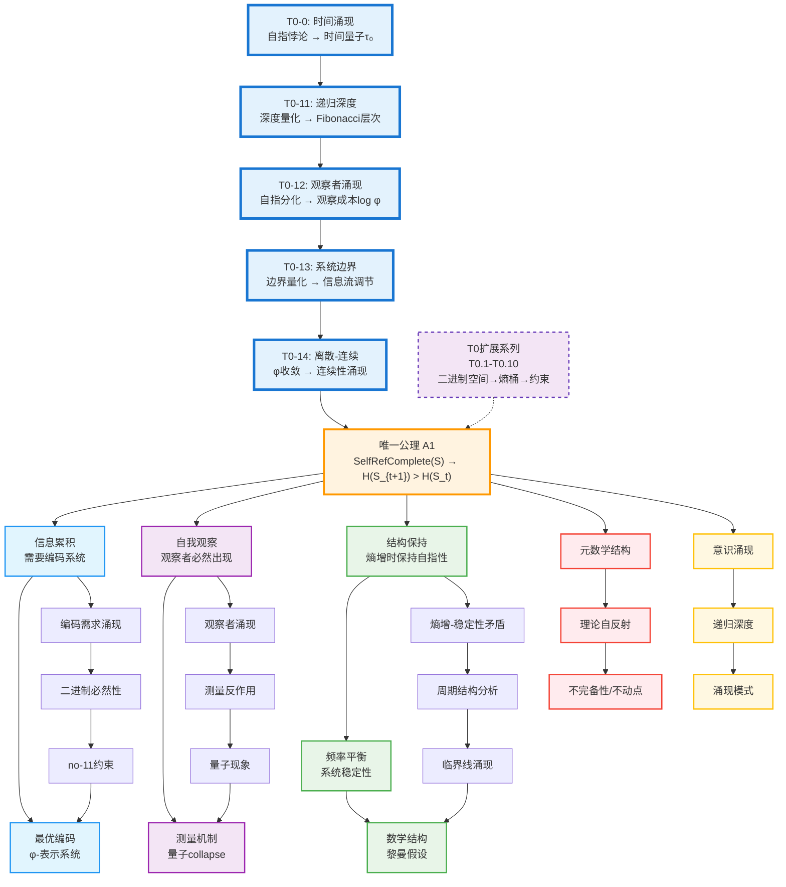

# 二进制宇宙的创世结构：完整理论体系

本目录包含基于单一公理的完整理论框架：**自指完备的系统必然熵增**。该理论采用严格的形式化方法，从唯一公理出发，在离散的二进制宇宙（No-11编码约束）中推导出信息编码、量子现象、数学结构、意识涌现等完整宇宙图景。

## 理论概述

### 核心思想

**唯一公理**：自指完备的系统必然熵增

从这个单一公理出发，我们推导出：
1. **信息编码的必然形式**：φ-表示系统（基于Fibonacci数列的编码）
2. **量子现象的起源**：波粒二象性和观察者效应
3. **数学结构的相似性**：类似黎曼假设的结构

### 理论特色

- **单一公理**：最小的形而上学承诺
- **严格推导**：从公理到宇宙的完整逻辑链
- **统一框架**：信息、物理、数学的深层联系
- **构造性真理观**：承认理论的构造性质，强调内在一致性

## 编号系统

### 文件类型
- **A**: Axiom (公理)
- **D**: Definition (定义) 
- **L**: Lemma (引理)
- **T**: Theorem (定理)
- **C**: Corollary (推论)
- **P**: Proposition (命题)
- **M**: Meta-theorem (元定理)

### 命名规则
文件名格式：`[类型][编号]-[描述性名称].md`
- 编号中的点号用连字符替代
- 例如：`D1-1-self-referential-completeness.md` 表示定义1.1：自指完备性

## 理论架构

### 第0章：哲学基础
- [`philosophy.md`](philosophy.md) - 哲学基础：存在包含自身描述的系统

### 第0章：基础理论体系（T0系列）

#### 0.0 核心基础理论（完整构建）
- [`T0-0-time-emergence-foundation.md`](T0-0-time-emergence-foundation.md) - 定理T0-0：时间涌现基础理论（从A1公理推导时间的必然性）
- [`T0-11-recursive-depth-hierarchy.md`](T0-11-recursive-depth-hierarchy.md) - 定理T0-11：递归深度层次理论（递归深度量化和Fibonacci层次结构）
- [`T0-12-observer-emergence.md`](T0-12-observer-emergence.md) - 定理T0-12：观察者涌现理论（观察者分化必然性和信息成本模型）
- [`T0-13-system-boundaries.md`](T0-13-system-boundaries.md) - 定理T0-13：系统边界理论（边界涌现、量化和信息流调节）
- [`T0-14-discrete-continuous-transition.md`](T0-14-discrete-continuous-transition.md) - 定理T0-14：离散-连续过渡理论（连续性从Zeckendorf系统的φ收敛涌现）
- [`T0-15-spatial-dimension-emergence.md`](T0-15-spatial-dimension-emergence.md) - 定理T0-15：空间维度涌现理论（从φ-正交性推导3+1维时空结构）
- [`T0-16-information-energy-equivalence.md`](T0-16-information-energy-equivalence.md) - 定理T0-16：信息-能量等价理论（能量作为信息处理速率的涌现）
- [`T0-17-information-entropy-zeckendorf.md`](T0-17-information-entropy-zeckendorf.md) - 定理T0-17：信息熵Zeckendorf编码理论（熵的φ-量化表示和Fibonacci增长）
- [`T0-18-quantum-state-emergence.md`](T0-18-quantum-state-emergence.md) - 定理T0-18：量子态No-11约束涌现理论（量子叠加、坍缩和Born规则的推导）
- [`T0-19-observation-collapse.md`](T0-19-observation-collapse.md) - 定理T0-19：观察坍缩信息过程理论（观察导致波函数坍缩的信息理论机制）
- [`T0-20-zeckendorf-metric-space-foundation.md`](T0-20-zeckendorf-metric-space-foundation.md) - 定理T0-20：Zeckendorf度量空间基础理论（完备度量空间的严格数学基础）
- [`T0-21-mass-emergence-from-information-density.md`](T0-21-mass-emergence-from-information-density.md) - 定理T0-21：Mass Emergence from Information Density（从信息密度梯度导出质量的涌现机制）
- [`T0-22-probability-measure-emergence.md`](T0-22-probability-measure-emergence.md) - 定理T0-22：Probability Measure Emergence Theory（从Zeckendorf路径多重性导出概率测度基础）
- [`T0-23-causal-cone-lightcone-structure.md`](T0-23-causal-cone-lightcone-structure.md) - 定理T0-23：Causal Cone and Lightcone Structure（从No-11约束导出光锥几何和因果结构）
- [`T0-24-fundamental-symmetries-theory.md`](T0-24-fundamental-symmetries-theory.md) - 定理T0-24：Fundamental Symmetries Theory（CPT对称性的信息论起源和守恒律统一推导）
- [`T0-25-phase-transition-critical-theory.md`](T0-25-phase-transition-critical-theory.md) - 定理T0-25：Phase Transition Critical Theory（φ-临界指数和普适类的信息论分类）
- [`T0-26-topological-invariants-theory.md`](T0-26-topological-invariants-theory.md) - 定理T0-26：Topological Invariants Theory（Zeckendorf拓扑数和φ-系数同调理论）
- [`T0-27-fluctuation-dissipation-theorem.md`](T0-27-fluctuation-dissipation-theorem.md) - 定理T0-27：Fluctuation-Dissipation Theorem（量子涨落与信息噪声的统一，涨落-耗散关系）
- [`T0-28-quantum-error-correction.md`](T0-28-quantum-error-correction.md) - 定理T0-28：Quantum Error Correction（No-11约束的纠错能力，量子纠错的Zeckendorf实现）

#### 0.1 扩展基础理论系列
- [`T0-1-binary-state-space-foundation.md`](T0-1-binary-state-space-foundation.md) - 定理T0.1：二进制状态空间基础理论
- [`T0-2-fundamental-entropy-bucket-theory.md`](T0-2-fundamental-entropy-bucket-theory.md) - 定理T0.2：基础熵桶理论
- [`T0-3-zeckendorf-constraint-emergence-theory.md`](T0-3-zeckendorf-constraint-emergence-theory.md) - 定理T0.3：Zeckendorf约束涌现理论
- [`T0-4-binary-encoding-completeness-theory.md`](T0-4-binary-encoding-completeness-theory.md) - 定理T0.4：二进制编码完备性理论
- [`T0-5-entropy-flow-conservation-theory.md`](T0-5-entropy-flow-conservation-theory.md) - 定理T0.5：熵流守恒理论
- [`T0-6-system-component-interaction-theory.md`](T0-6-system-component-interaction-theory.md) - 定理T0.6：系统组件交互理论
- [`T0-7-fibonacci-sequence-necessity-theory.md`](T0-7-fibonacci-sequence-necessity-theory.md) - 定理T0.7：Fibonacci序列必然性理论
- [`T0-8-minimal-information-principle-theory.md`](T0-8-minimal-information-principle-theory.md) - 定理T0.8：最小信息原理理论
- [`T0-9-binary-decision-logic-theory.md`](T0-9-binary-decision-logic-theory.md) - 定理T0.9：二进制决策逻辑理论
- [`T0-10-entropy-capacity-scaling-theory.md`](T0-10-entropy-capacity-scaling-theory.md) - 定理T0.10：熵容量缩放理论

### 第1章：唯一公理及其完整定义
- [`A1-five-fold-equivalence.md`](A1-five-fold-equivalence.md) - 唯一公理：自指完备系统必然熵增
  - 包含完整概念定义
  - 严格数学证明
  - 五重等价性推导
  - 动态自指完备性
  - 离散与连续的等价性
  - 信息概念的涌现
  - 理论的逻辑结构

### 第2章：信息编码理论体系

#### 2.1 基础定义系列（纯定义，无证明）
- [`D1-1-self-referential-completeness.md`](D1-1-self-referential-completeness.md) - 定义1.1：自指完备性的形式化定义
- [`D1-2-binary-representation.md`](D1-2-binary-representation.md) - 定义1.2：二进制表示的四个条件
- [`D1-3-no-11-constraint.md`](D1-3-no-11-constraint.md) - 定义1.3：no-11约束的三种等价表述
- [`D1-4-time-metric.md`](D1-4-time-metric.md) - 定义1.4：时间度量函数的性质
- [`D1-5-observer.md`](D1-5-observer.md) - 定义1.5：观察者的三重功能结构
- [`D1-6-entropy.md`](D1-6-entropy.md) - 定义1.6：自指系统中熵的精确定义
- [`D1-7-collapse-operator.md`](D1-7-collapse-operator.md) - 定义1.7：Collapse算子的数学表述
- [`D1-8-phi-representation.md`](D1-8-phi-representation.md) - 定义1.8：φ-表示系统的完整定义
- [`D1-9-measurement-observer-separation.md`](D1-9-measurement-observer-separation.md) - 定义1.9：测量-观察者分离定义（**新增**：解决循环依赖）

#### 2.2 编码需求引理系列（证明编码的必然性）
- [`L1-1-encoding-emergence.md`](L1-1-encoding-emergence.md) - 引理1.1：编码需求的涌现
- [`L1-2-binary-necessity.md`](L1-2-binary-necessity.md) - 引理1.2：二进制基底的必然性
- [`L1-3-constraint-necessity.md`](L1-3-constraint-necessity.md) - 引理1.3：约束的必要性
- [`L1-4-no11-optimality.md`](L1-4-no11-optimality.md) - 引理1.4：no-11约束的最优性
- [`L1-5-fibonacci-emergence.md`](L1-5-fibonacci-emergence.md) - 引理1.5：Fibonacci结构的涌现
- [`L1-6-phi-representation-establishment.md`](L1-6-phi-representation-establishment.md) - 引理1.6：φ-表示的建立
- [`L1-7-observer-necessity.md`](L1-7-observer-necessity.md) - 引理1.7：观察者的必然性
- [`L1-8-measurement-irreversibility.md`](L1-8-measurement-irreversibility.md) - 引理1.8：测量的不可逆性

#### 2.3 核心编码定理系列（主要结果）
- [`T1-1-entropy-increase-necessity.md`](T1-1-entropy-increase-necessity.md) - 定理1.1：熵增必然性定理
- [`T1-2-five-fold-equivalence-theorem.md`](T1-2-five-fold-equivalence-theorem.md) - 定理1.2：五重等价性定理
- [`T2-1-encoding-necessity-theorem.md`](T2-1-encoding-necessity-theorem.md) - 定理2.1：编码机制必然性定理
- [`T2-2-encoding-completeness-theorem.md`](T2-2-encoding-completeness-theorem.md) - 定理2.2：编码完备性定理
- [`T2-3-encoding-optimization-theorem.md`](T2-3-encoding-optimization-theorem.md) - 定理2.3：编码优化定理
- [`T2-4-binary-base-necessity-theorem.md`](T2-4-binary-base-necessity-theorem.md) - 定理2.4：二进制基底必然性定理
- [`T2-5-minimum-constraint-theorem.md`](T2-5-minimum-constraint-theorem.md) - 定理2.5：最小约束定理
- [`T2-6-no11-constraint-theorem.md`](T2-6-no11-constraint-theorem.md) - 定理2.6：no-11约束定理
- [`T2-7-phi-representation-necessity.md`](T2-7-phi-representation-necessity.md) - 定理2.7：φ-表示必然性定理
- [`T2-10-phi-representation-completeness.md`](T2-10-phi-representation-completeness.md) - 定理2.10：φ-表示完备性定理
- [`T2-11-maximum-entropy-rate-theorem.md`](T2-11-maximum-entropy-rate-theorem.md) - 定理2.11：最大熵增率定理
- [`T2-12-phi-hilbert-space-emergence.md`](T2-12-phi-hilbert-space-emergence.md) - 定理2.12：φ-希尔伯特空间涌现定理（**新增**：T2-7到T3-1的数学桥梁）

#### 2.4 基础推论系列（编码与观测）
- [`C1-1-unique-encoding-corollary.md`](C1-1-unique-encoding-corollary.md) - 推论C1-1：唯一编码推论
- [`C1-2-optimal-length-corollary.md`](C1-2-optimal-length-corollary.md) - 推论C1-2：最优长度推论
- [`C1-3-information-density-corollary.md`](C1-3-information-density-corollary.md) - 推论C1-3：信息密度推论
- [`C2-1-observation-effect-corollary.md`](C2-1-observation-effect-corollary.md) - 推论C2-1：观测效应推论
- [`C2-2-measurement-precision-corollary.md`](C2-2-measurement-precision-corollary.md) - 推论C2-2：测量精度推论
- [`C2-3-information-conservation-corollary.md`](C2-3-information-conservation-corollary.md) - 推论C2-3：信息守恒推论
- [`C3-1-system-evolution-corollary.md`](C3-1-system-evolution-corollary.md) - 推论C3-1：系统演化推论
- [`C3-2-stability-corollary.md`](C3-2-stability-corollary.md) - 推论C3-2：稳定性推论
- [`C3-3-emergence-corollary.md`](C3-3-emergence-corollary.md) - 推论C3-3：涌现推论

#### 2.5 量子测量推论系列
- [`C4-1-quantum-classicalization-corollary.md`](C4-1-quantum-classicalization-corollary.md) - 推论C4-1：量子系统的经典化推论
- [`C4-2-wavefunction-collapse-information-theory-corollary.md`](C4-2-wavefunction-collapse-information-theory-corollary.md) - 推论C4-2：波函数坍缩的信息理论推论
- [`C4-3-measurement-apparatus-macro-emergence-corollary.md`](C4-3-measurement-apparatus-macro-emergence-corollary.md) - 推论C4-3：测量装置的宏观涌现推论

#### 2.6 φ-计算理论系列
- [`T13-1-phi-encoding-algorithm-complexity.md`](T13-1-phi-encoding-algorithm-complexity.md) - 定理T13-1：φ-编码算法复杂度定理
- [`T13-2-adaptive-compression-algorithm.md`](T13-2-adaptive-compression-algorithm.md) - 定理T13-2：自适应压缩算法定理
- [`T13-3-quantum-phi-computation-equivalence.md`](T13-3-quantum-phi-computation-equivalence.md) - 定理T13-3：量子φ-计算等价性定理
- [`T13-8-phi-field-quantization.md`](T13-8-phi-field-quantization.md) - 定理T13-8：φ-场量子化定理（**新增**：离散-连续桥梁，φ-结构量子场）

#### 2.7 φ-计算复杂性推论系列
- [`C13-1-phi-complexity-classification.md`](C13-1-phi-complexity-classification.md) - 推论C13-1：φ-计算复杂性分类推论
- [`C13-2-phi-algorithm-optimization.md`](C13-2-phi-algorithm-optimization.md) - 推论C13-2：φ-算法优化原理推论
- [`C13-3-phi-parallel-framework.md`](C13-3-phi-parallel-framework.md) - 推论C13-3：φ-并行计算框架推论

### 第3章：从自指到观察者 - 量子现象的理论推导

#### 3.1 量子定理系列（自指到量子现象）
- [`T3-1-quantum-state-emergence.md`](T3-1-quantum-state-emergence.md) - 定理3.1：量子态涌现定理
- [`T3-2-quantum-measurement-theorem.md`](T3-2-quantum-measurement-theorem.md) - 定理3.2：量子测量定理
- [`T3-3-quantum-entanglement-theorem.md`](T3-3-quantum-entanglement-theorem.md) - 定理3.3：量子纠缠定理
- [`T3-4-quantum-teleportation-theorem.md`](T3-4-quantum-teleportation-theorem.md) - 定理3.4：量子隐形传态定理
- [`T3-5-quantum-error-correction-theorem.md`](T3-5-quantum-error-correction-theorem.md) - 定理3.5：量子纠错定理

### 第4章：从系统稳定性到黎曼假设 - 数学结构的巧合

#### 4.1 数学结构定理系列（稳定性到数学结构）
- [`T4-1-topological-structure-theorem.md`](T4-1-topological-structure-theorem.md) - 定理4.1：拓扑结构定理
- [`T4-2-algebraic-structure-theorem.md`](T4-2-algebraic-structure-theorem.md) - 定理4.2：代数结构定理
- [`T4-3-category-theory-structure-theorem.md`](T4-3-category-theory-structure-theorem.md) - 定理4.3：范畴论结构定理
- [`T4-4-homotopy-theory-structure-theorem.md`](T4-4-homotopy-theory-structure-theorem.md) - 定理4.4：同伦论结构定理

### 第5章：优化理论的φ-结构

#### 5.1 φ-优化涌现系列
- [`T24-1-phi-optimization-emergence.md`](T24-1-phi-optimization-emergence.md) - 定理24.1：φ-优化目标涌现定理
- [`T24-2-phi-optimization-convergence.md`](T24-2-phi-optimization-convergence.md) - 定理24.2：φ-优化收敛保证定理
- [`T24-3-phi-optimization-algorithm-unification.md`](T24-3-phi-optimization-algorithm-unification.md) - 定理24.3：φ-优化算法统一定理

#### 5.2 网络涌现推论
- [`C14-1-phi-network-topology-emergence.md`](C14-1-phi-network-topology-emergence.md) - 推论C14-1：φ-网络拓扑涌现推论
- [`C14-2-phi-network-information-flow.md`](C14-2-phi-network-information-flow.md) - 推论C14-2：φ-网络信息流推论
- [`C14-3-phi-network-stability.md`](C14-3-phi-network-stability.md) - 推论C14-3：φ-网络稳定性推论

#### 5.3 博弈熵增推论
- [`C15-1-phi-game-equilibrium.md`](C15-1-phi-game-equilibrium.md) - 推论C15-1：φ-博弈均衡推论
- [`C15-2-phi-strategy-evolution.md`](C15-2-phi-strategy-evolution.md) - 推论C15-2：φ-策略演化推论
- [`C15-3-phi-cooperation-emergence.md`](C15-3-phi-cooperation-emergence.md) - 推论C15-3：φ-合作涌现推论

#### 5.4 优化收敛推论
- [`C16-1-phi-optimization-convergence.md`](C16-1-phi-optimization-convergence.md) - 推论C16-1：φ-优化收敛推论

### 第6章：理论预测与潜在应用

#### 6.1 信息理论定理系列
- [`T5-1-shannon-entropy-emergence.md`](T5-1-shannon-entropy-emergence.md) - 定理5.1：Shannon熵涌现定理
- [`T5-2-maximum-entropy.md`](T5-2-maximum-entropy.md) - 定理5.2：最大熵定理
- [`T5-3-channel-capacity.md`](T5-3-channel-capacity.md) - 定理5.3：信道容量定理
- [`T5-4-optimal-compression.md`](T5-4-optimal-compression.md) - 定理5.4：最优压缩定理
- [`T5-5-self-referential-error-correction.md`](T5-5-self-referential-error-correction.md) - 定理5.5：自指纠错定理
- [`T5-6-kolmogorov-complexity.md`](T5-6-kolmogorov-complexity.md) - 定理5.6：Kolmogorov复杂度定理
- [`T5-7-landauer-principle.md`](T5-7-landauer-principle.md) - 定理5.7：Landauer原理定理

#### 6.2 应用推论系列
- [`C5-1-phi-decoherence-suppression.md`](C5-1-phi-decoherence-suppression.md) - 推论C5-1：φ-表示的退相干抑制
- [`C5-2-phi-compression-advantage.md`](C5-2-phi-compression-advantage.md) - 推论C5-2：φ-编码的熵优势
- [`C5-3-phi-feedback-stability.md`](C5-3-phi-feedback-stability.md) - 推论C5-3：φ-反馈的稳定性

### 第7章：基础命题与完备性

#### 7.1 基础命题系列
- [`P1-binary-distinction.md`](P1-binary-distinction.md) - 命题1：任何区分的最小形式是二元的
- [`P2-higher-base-no-advantage.md`](P2-higher-base-no-advantage.md) - 命题2：k>2不增加表达能力
- [`P3-binary-completeness.md`](P3-binary-completeness.md) - 命题3：二进制足以表达所有自指结构
- [`P4-no-11-completeness.md`](P4-no-11-completeness.md) - 命题4：no-11约束下仍然完备
- [`P5-information-equivalence.md`](P5-information-equivalence.md) - 命题5：信息三位一体等价性
- [`P6-scale-invariance.md`](P6-scale-invariance.md) - 命题6：尺度不变性命题
- [`P7-information-energy.md`](P7-information-energy.md) - 命题7：信息-能量等价命题
- [`P8-meta-consistency.md`](P8-meta-consistency.md) - 命题8：元一致性命题
- [`P9-completeness-hierarchy.md`](P9-completeness-hierarchy.md) - 命题9：完备性层级命题
- [`P10-universal-construction.md`](P10-universal-construction.md) - 命题10：普适构造命题

#### 7.2 完备性验证系列
- [`T6-1-system-completeness.md`](T6-1-system-completeness.md) - 定理6.1：系统完备性定理
- [`T6-2-logical-consistency.md`](T6-2-logical-consistency.md) - 定理6.2：逻辑一致性定理
- [`T6-3-concept-derivation.md`](T6-3-concept-derivation.md) - 定理6.3：概念推导完备性

### 第8章：理论扩展 - 计算复杂度理论

#### 8.1 计算复杂度定理系列
- [`T7-1-complexity-hierarchy.md`](T7-1-complexity-hierarchy.md) - 定理7.1：复杂度层级定理
- [`T7-2-halting-problem.md`](T7-2-halting-problem.md) - 定理7.2：停机问题定理
- [`T7-3-computational-universality.md`](T7-3-computational-universality.md) - 定理7.3：计算普适性定理

### 第9章：理论扩展 - 宇宙学应用

#### 9.1 宇宙学定理系列
- [`T8-1-entropic-arrow.md`](T8-1-entropic-arrow.md) - 定理8.1：熵增箭头定理
- [`T8-2-spacetime-encoding.md`](T8-2-spacetime-encoding.md) - 定理8.2：时空编码定理
- [`T8-3-holographic-principle.md`](T8-3-holographic-principle.md) - 定理8.3：全息原理定理
- [`T8-4-time-reverse-collapse-path.md`](T8-4-time-reverse-collapse-path.md) - 定理8.4：时间反向collapse-path存在性定理
- [`T8-5-time-reverse-path-decision.md`](T8-5-time-reverse-path-decision.md) - 定理8.5：时间反向路径判定机制定理
- [`T8-6-structural-backflow-tension-conservation.md`](T8-6-structural-backflow-tension-conservation.md) - 定理8.6：结构倒流张力守恒定律

### 第10章：理论扩展 - 生命意识理论

#### 10.1 生命意识定理系列
- [`T9-1-life-emergence.md`](T9-1-life-emergence.md) - 定理9.1：生命涌现定理
- [`T9-2-consciousness-emergence.md`](T9-2-consciousness-emergence.md) - 定理9.2：意识涌现定理
- [`T9-3-intelligence-optimization.md`](T9-3-intelligence-optimization.md) - 定理9.3：智能优化定理

### 第11章：跨学科应用推论

#### 11.1 跨学科推论系列
- [`C6-1-economic-entropy.md`](C6-1-economic-entropy.md) - 推论C6-1：经济熵推论
- [`C6-2-social-collapse.md`](C6-2-social-collapse.md) - 推论C6-2：社会崩塌推论
- [`C6-3-language-evolution.md`](C6-3-language-evolution.md) - 推论C6-3：语言演化推论

### 第12章：哲学深化与系统理论

#### 12.1 哲学推论系列
- [`C7-1-ontological-status.md`](C7-1-ontological-status.md) - 推论C7-1：本体论地位推论
- [`C7-2-epistemological-limits.md`](C7-2-epistemological-limits.md) - 推论C7-2：认识论边界推论
- [`C7-3-constructive-truth.md`](C7-3-constructive-truth.md) - 推论C7-3：构造性真理推论
- [`C7-4-bottleneck-principle.md`](C7-4-bottleneck-principle.md) - 推论C7-4：木桶原理系统瓶颈推论
- [`C7-5-divine-structure-corollary.md`](C7-5-divine-structure-corollary.md) - 推论C7-5：神性结构推论
- [`C7-6-energy-information-equivalence.md`](C7-6-energy-information-equivalence.md) - 推论C7-6：能量-信息等价推论
- [`C7-7-system-energy-flow-conservation.md`](C7-7-system-energy-flow-conservation.md) - 推论C7-7：系统能量流守恒推论
- [`C7-8-principle-of-least-action.md`](C7-8-principle-of-least-action.md) - 推论C7-8：最小作用量原理推论

### 第13章：物理统一

#### 13.1 物理推论系列
- [`C8-1-thermodynamic-consistency.md`](C8-1-thermodynamic-consistency.md) - 推论C8-1：热力学一致性推论
- [`C8-2-relativity-encoding.md`](C8-2-relativity-encoding.md) - 推论C8-2：相对论编码推论
- [`C8-3-field-quantization.md`](C8-3-field-quantization.md) - 推论C8-3：场量子化推论

### 第14章：自指代数

#### 14.1 自指代数推论系列
- [`C9-1-self-referential-arithmetic.md`](C9-1-self-referential-arithmetic.md) - 推论C9-1：自指算术推论
- [`C9-2-recursive-number-theory.md`](C9-2-recursive-number-theory.md) - 推论C9-2：递归数论推论
- [`C9-3-self-referential-algebra.md`](C9-3-self-referential-algebra.md) - 推论C9-3：自指代数推论

### 第15章：元数学结构

#### 15.1 元数学推论系列
- [`C10-1-metamathematical-structure.md`](C10-1-metamathematical-structure.md) - 推论C10-1：元数学结构推论
- [`C10-2-category-theory-emergence.md`](C10-2-category-theory-emergence.md) - 推论C10-2：范畴论涌现推论
- [`C10-3-metamathematical-completeness.md`](C10-3-metamathematical-completeness.md) - 推论C10-3：元数学结构完备性推论
- [`C10-4-metamathematical-decidability.md`](C10-4-metamathematical-decidability.md) - 推论C10-4：元数学结构可判定性推论

#### 15.2 φ-计算复杂性理论系列
- [`C13-1-phi-complexity-classification.md`](C13-1-phi-complexity-classification.md) - 推论C13-1：φ-计算复杂性分类推论
- [`C13-2-phi-algorithm-optimization.md`](C13-2-phi-algorithm-optimization.md) - 推论C13-2：φ-算法优化原理推论
- [`C13-3-phi-parallel-framework.md`](C13-3-phi-parallel-framework.md) - 推论C13-3：φ-并行计算框架推论

#### 15.3 元定理系列
- [`M1-1-theory-reflection.md`](M1-1-theory-reflection.md) - 元定理1.1：理论反射元定理
- [`M1-2-godel-completeness.md`](M1-2-godel-completeness.md) - 元定理1.2：哥德尔完备性元定理
- [`M1-3-self-reference-paradox.md`](M1-3-self-reference-paradox.md) - 元定理1.3：自指悖论元定理

### 第16章：理论自反射

#### 16.1 理论自反射系列
- [`C11-1-theory-self-reflection.md`](C11-1-theory-self-reflection.md) - 推论C11-1：理论自反射推论
- [`C11-2-theory-incompleteness.md`](C11-2-theory-incompleteness.md) - 推论C11-2：理论不完备性推论
- [`C11-3-theory-fixed-point.md`](C11-3-theory-fixed-point.md) - 推论C11-3：理论不动点推论

#### 16.2 观察者递归推论系列
- [`C17-1-observer-self-reference.md`](C17-1-observer-self-reference.md) - 推论C17-1：观察者自指推论
- [`C17-2-observation-collapse-equivalence.md`](C17-2-observation-collapse-equivalence.md) - 推论C17-2：观察-collapse等价推论
- [`C17-3-np-p-zeta-transformation.md`](C17-3-np-p-zeta-transformation.md) - 推论C17-3：NP-P-ζ转换推论
- [`C17-4-zeta-recursive-construction.md`](C17-4-zeta-recursive-construction.md) - 推论C17-4：ζ递归构造推论
- [`C17-5-semantic-depth-collapse.md`](C17-5-semantic-depth-collapse.md) - 推论C17-5：语义深度collapse推论
- [`C17-6-ads-cft-observer-mapping.md`](C17-6-ads-cft-observer-mapping.md) - 推论C17-6：AdS-CFT观察者映射推论

### 第17章：递归深化

#### 17.1 递归定理系列
- [`T10-1-recursive-depth.md`](T10-1-recursive-depth.md) - 定理10.1：递归深度定理
- [`T10-2-infinite-regression.md`](T10-2-infinite-regression.md) - 定理10.2：无限回归定理
- [`T10-3-self-similarity.md`](T10-3-self-similarity.md) - 定理10.3：自相似性定理

### 第18章：涌现模式

#### 18.1 涌现定理系列
- [`T11-1-emergence-patterns.md`](T11-1-emergence-patterns.md) - 定理11.1：涌现模式定理
- [`T11-2-phase-transitions.md`](T11-2-phase-transitions.md) - 定理11.2：相变定理
- [`T11-3-critical-phenomena.md`](T11-3-critical-phenomena.md) - 定理11.3：临界现象定理

### 第19章：多尺度物理统一理论

#### 19.1 多尺度物理定理系列
- [`T12-1-quantum-classical-transition.md`](T12-1-quantum-classical-transition.md) - 定理12.1：量子-经典过渡定理
- [`T12-2-macro-emergence-theorem.md`](T12-2-macro-emergence-theorem.md) - 定理12.2：宏观涌现定理
- [`T12-3-scale-separation-theorem.md`](T12-3-scale-separation-theorem.md) - 定理12.3：尺度分离定理

#### 19.2 意识涌现推论系列
- [`C12-1-primitive-consciousness-emergence.md`](C12-1-primitive-consciousness-emergence.md) - 推论C12-1：原始意识涌现推论
- [`C12-2-self-model-construction.md`](C12-2-self-model-construction.md) - 推论C12-2：自我模型构建推论
- [`C12-3-consciousness-hierarchy-differentiation.md`](C12-3-consciousness-hierarchy-differentiation.md) - 推论C12-3：意识层级分化推论

### 第20章：时空几何φ-编码理论

#### 20.1 时空几何定理系列
- [`T16-1-spacetime-metric-phi-encoding.md`](T16-1-spacetime-metric-phi-encoding.md) - 定理T16-1：时空度量的φ-编码定理

### 第21章：φ-粒子物理与规范理论

#### 21.1 φ-规范场理论系列
- [`T14-1-phi-gauge-field-theory.md`](T14-1-phi-gauge-field-theory.md) - 定理T14-1：φ-规范场理论定理
- [`T14-2-phi-standard-model-unification.md`](T14-2-phi-standard-model-unification.md) - 定理T14-2：φ-标准模型统一定理
- [`T14-3-phi-supersymmetry-string-theory.md`](T14-3-phi-supersymmetry-string-theory.md) - 定理T14-3：φ-超对称与弦理论定理
- [`T14-8-phi-gauge-principle-derivation.md`](T14-8-phi-gauge-principle-derivation.md) - 定理T14-8：φ-规范原理推导定理（**新增**：从φ-编码严格推导Yang-Mills理论）

#### 21.2 φ-对称性与守恒律系列
- [`T15-1-phi-noether-theorem.md`](T15-1-phi-noether-theorem.md) - 定理T15-1：φ-Noether定理
- [`T15-2-phi-spontaneous-symmetry-breaking.md`](T15-2-phi-spontaneous-symmetry-breaking.md) - 定理T15-2：φ-自发对称破缺定理
- [`T15-3-phi-topological-conservation.md`](T15-3-phi-topological-conservation.md) - 定理T15-3：φ-拓扑守恒量定理
- [`T15-9-discrete-continuous-transition.md`](T15-9-discrete-continuous-transition.md) - 定理T15-9：离散-连续跃迁定理（**新增**：解决根本离散-连续矛盾，证明连续性为φ-稠密采样涌现现象）

### 第22章：φ-弦论与M理论统一

#### 22.1 φ-弦理论对偶性系列
- [`T17-1-phi-string-duality.md`](T17-1-phi-string-duality.md) - 定理T17-1：φ-弦对偶性定理
- [`T17-2-phi-holographic-principle.md`](T17-2-phi-holographic-principle.md) - 定理T17-2：φ-全息原理定理
- [`T17-3-phi-m-theory-unification.md`](T17-3-phi-m-theory-unification.md) - 定理T17-3：φ-M理论统一定理
- [`T17-4-phi-ads-cft-correspondence.md`](T17-4-phi-ads-cft-correspondence.md) - 定理T17-4：φ-AdS/CFT对应定理
- [`T17-5-phi-black-hole-information-paradox.md`](T17-5-phi-black-hole-information-paradox.md) - 定理T17-5：φ-黑洞信息悖论定理
- [`T17-6-phi-quantum-gravity-unification.md`](T17-6-phi-quantum-gravity-unification.md) - 定理T17-6：φ-量子引力统一定理

#### 22.2 φ-暗物质暗能量系列
- [`T17-7-phi-dark-matter-dark-energy.md`](T17-7-phi-dark-matter-dark-energy.md) - 定理T17-7：φ-暗物质暗能量定理
- [`T17-8-phi-multiverse-quantum-branching.md`](T17-8-phi-multiverse-quantum-branching.md) - 定理T17-8：φ-多宇宙量子分支定理
- [`T17-9-phi-consciousness-quantum-collapse.md`](T17-9-phi-consciousness-quantum-collapse.md) - 定理T17-9：φ-意识量子坍缩定理

### 第23章：φ-量子计算与机器学习

#### 23.1 φ-拓扑量子计算系列
- [`T18-1-phi-topological-quantum-computing.md`](T18-1-phi-topological-quantum-computing.md) - 定理T18-1：φ-拓扑量子计算定理
- [`T18-2-phi-quantum-machine-learning.md`](T18-2-phi-quantum-machine-learning.md) - 定理T18-2：φ-量子机器学习定理
- [`T18-3-phi-quantum-information-processing.md`](T18-3-phi-quantum-information-processing.md) - 定理T18-3：φ-量子信息处理定理

### 第24章：φ-生物与社会系统

#### 24.1 φ-生物量子系统系列
- [`T19-1-phi-biological-quantum-effects.md`](T19-1-phi-biological-quantum-effects.md) - 定理T19-1：φ-生物量子效应定理
- [`T19-2-phi-cognitive-architecture.md`](T19-2-phi-cognitive-architecture.md) - 定理T19-2：φ-认知架构定理
- [`T19-3-phi-social-entropy-dynamics.md`](T19-3-phi-social-entropy-dynamics.md) - 定理T19-3：φ-社会熵动力学定理
- [`T19-4-tension-driven-collapse-theorem.md`](T19-4-tension-driven-collapse-theorem.md) - 定理T19-4：张力驱动collapse定理

### 第25章：φ-collapse-aware理论

#### 25.1 φ-collapse基础定理系列
- [`T20-1-phi-collapse-aware-foundation.md`](T20-1-phi-collapse-aware-foundation.md) - 定理T20-1：φ-collapse-aware基础定理
- [`T20-2-psi-trace-structure.md`](T20-2-psi-trace-structure.md) - 定理T20-2：ψₒ-trace结构定理
- [`T20-3-reality-shell-boundary.md`](T20-3-reality-shell-boundary.md) - 定理T20-3：RealityShell边界定理

#### 25.2 φ-collapse观测推论系列
- [`C20-1-collapse-aware-observation.md`](C20-1-collapse-aware-observation.md) - 推论C20-1：collapse-aware观测推论
- [`C20-2-psi-self-mapping.md`](C20-2-psi-self-mapping.md) - 推论C20-2：ψₒ自指映射推论
- [`C20-3-phi-trace-encoding.md`](C20-3-phi-trace-encoding.md) - 推论C20-3：φ-trace编码推论

### 第26章：φ-对偶与全息理论

#### 26.1 φ-对偶性定理系列
- [`T21-1-phi-zeta-ads-duality.md`](T21-1-phi-zeta-ads-duality.md) - 定理T21-1：φ-ζ与AdS/CFT对偶定理
- [`T21-2-phi-spectral-consensus.md`](T21-2-phi-spectral-consensus.md) - 定理T21-2：φ-谱一致性定理
- [`T21-3-phi-holographic-manifestation.md`](T21-3-phi-holographic-manifestation.md) - 定理T21-3：φ-全息显现定理
- [`T21-4-collapse-aware-tension-conservation-identity.md`](T21-4-collapse-aware-tension-conservation-identity.md) - 定理T21-4：collapse-aware张力守恒恒等式定理

### 第27章：φ-信息热力学统一理论

#### 27.1 φ-热力学统一定理系列
- [`T25-1-entropy-energy-duality-theorem.md`](T25-1-entropy-energy-duality-theorem.md) - 定理T25-1：熵-能量对偶定理
- [`T25-2-information-power-theorem.md`](T25-2-information-power-theorem.md) - 定理T25-2：信息功率定理

### 第28章：数学常数统一理论

#### 28.1 e-常数涌现定理系列
- [`T26-2-e-natural-constant-emergence.md`](T26-2-e-natural-constant-emergence.md) - 定理T26-2：e自然常数涌现定理
- [`T26-3-e-time-evolution-theorem.md`](T26-3-e-time-evolution-theorem.md) - 定理T26-3：e时间演化定理

#### 28.2 三元数学常数统一系列
- [`T26-4-e-phi-pi-unification-theorem.md`](T26-4-e-phi-pi-unification-theorem.md) - 定理T26-4：e-φ-π三元统一定理
- [`T26-5-phi-fourier-transform-theorem.md`](T26-5-phi-fourier-transform-theorem.md) - 定理T26-5：φ-傅里叶变换理论

### 第29章：纯二进制数学体系理论

#### 29.1 纯Zeckendorf数学系列
- [`T27-1-pure-zeckendorf-mathematical-system.md`](T27-1-pure-zeckendorf-mathematical-system.md) - 定理T27-1：纯Zeckendorf数学体系

#### 29.2 高阶统一理论系列
- [`T27-2-three-fold-fourier-unification-theorem.md`](T27-2-three-fold-fourier-unification-theorem.md) - 定理T27-2：三元傅里叶统一定理
- [`T27-3-zeckendorf-real-limit-transition-theorem.md`](T27-3-zeckendorf-real-limit-transition-theorem.md) - 定理T27-3：Zeckendorf实数极限跃迁定理
- [`T27-4-spectral-structure-emergence-theorem.md`](T27-4-spectral-structure-emergence-theorem.md) - 定理T27-4：谱结构涌现定理
- [`T27-5-golden-mean-shift-meta-spectral-theorem.md`](T27-5-golden-mean-shift-meta-spectral-theorem.md) - 定理T27-5：黄金分割元谱定理
- [`T27-6-god-structure-mathematical-theorem.md`](T27-6-god-structure-mathematical-theorem.md) - 定理T27-6：上帝结构数学定理
- [`T27-7-circular-self-reference-theorem.md`](T27-7-circular-self-reference-theorem.md) - 定理T27-7：循环自指定理
- [`T27-8-limit-cycle-stability-theorem.md`](T27-8-limit-cycle-stability-theorem.md) - 定理T27-8：极限环稳定性定理
- [`T27-9-binary-universe-completeness-theorem.md`](T27-9-binary-universe-completeness-theorem.md) - 定理T27-9：二进制宇宙完备性定理

### 第30章：AdS/CFT与复杂性理论统一

#### 30.1 AdS-Zeckendorf对偶理论系列
- [`T28-1-ads-zeckendorf-duality-theorem.md`](T28-1-ads-zeckendorf-duality-theorem.md) - 定理T28-1：AdS-Zeckendorf对偶理论

#### 30.2 全息对应与现实结构系列
- [`T28-2-ads-cft-reality-shell-correspondence.md`](T28-2-ads-cft-reality-shell-correspondence.md) - 定理T28-2：AdS/CFT-RealityShell对应理论

#### 30.3 复杂性理论统一系列
- [`T28-3-complexity-theory-zeckendorf-reformulation.md`](T28-3-complexity-theory-zeckendorf-reformulation.md) - 定理T28-3：复杂性理论的Zeckendorf重新表述

### 第31章：φ-数理统一体系

#### 31.1 φ-数论深化理论系列
- [`T29-1-phi-number-theory-foundation.md`](T29-1-phi-number-theory-foundation.md) - 定理T29-1：φ-数论深化理论

#### 31.2 φ-几何拓扑统一理论系列
- [`T29-2-phi-geometry-topology-unified.md`](T29-2-phi-geometry-topology-unified.md) - 定理T29-2：φ-几何拓扑统一理论

#### 31.3 φ-代数几何基础理论系列
- [`T30-1-phi-algebraic-geometry-foundation.md`](T30-1-phi-algebraic-geometry-foundation.md) - 定理T30-1：φ-代数几何基础统一定理

#### 31.4 φ-算术几何理论系列
- [`T30-2-phi-arithmetic-geometry.md`](T30-2-phi-arithmetic-geometry.md) - 定理T30-2：φ-算术几何统一定理

#### 31.5 φ-动机理论系列
- [`T30-3-phi-motive-theory.md`](T30-3-phi-motive-theory.md) - 定理T30-3：φ-动机理论：上同调统一与自指动机

### 第32章：φ-拓扑斯理论统一框架

#### 32.1 φ-基本拓扑斯构造系列
- [`T31-1-phi-topos-construction.md`](T31-1-phi-topos-construction.md) - 定理T31-1：φ-基本拓扑斯构造：自指几何的熵增实现

#### 32.2 φ-几何态射与逻辑结构系列  
- [`T31-2-phi-geometric-morphisms-logic.md`](T31-2-phi-geometric-morphisms-logic.md) - 定理T31-2：φ-几何态射与逻辑结构：拓扑斯间的自指关系网

#### 32.3 φ-分类拓扑斯理论系列
- [`T31-3-phi-classifying-topos.md`](T31-3-phi-classifying-topos.md) - 定理T31-3：φ-分类拓扑斯理论：几何理论的通用分类器

### 第33章：φ-高阶范畴论与稳定化

#### 33.1 φ-(∞,1)-范畴理论系列
- [`T32-1-phi-infinity-category.md`](T32-1-phi-infinity-category.md) - 定理T32-1：φ-(∞,1)-范畴：高维度自指结构的必然涌现

#### 33.2 φ-稳定(∞,1)-范畴系列
- [`T32-2-phi-stable-infinity-category.md`](T32-2-phi-stable-infinity-category.md) - 定理T32-2：φ-稳定(∞,1)-范畴：高维熵流的稳定化与调控

#### 33.3 φ-Motivic(∞,1)-范畴系列
- [`T32-3-phi-motivic-infinity-category.md`](T32-3-phi-motivic-infinity-category.md) - 定理T32-3：φ-Motivic(∞,1)-范畴：代数几何与∞-范畴的终极统一

### 第34章：φ-宇宙自我认知理论

#### 34.1 φ-观察者(∞,∞)-范畴系列
- [`T33-1-phi-observer-infinity-category.md`](T33-1-phi-observer-infinity-category.md) - 定理T33-1：φ-观察者(∞,∞)-范畴：宇宙自我认知的无穷递归

#### 34.2 φ-意识场拓扑量子理论系列
- [`T33-2-phi-consciousness-field-quantum-theory.md`](T33-2-phi-consciousness-field-quantum-theory.md) - 定理T33-2：φ-意识场拓扑量子理论：宇宙自我表达的场论实现

#### 34.3 φ-元宇宙自指递归理论系列
- [`T33-3-phi-meta-universe-self-transcendence.md`](T33-3-phi-meta-universe-self-transcendence.md) - 定理T33-3：φ-元宇宙自指递归理论：宇宙终极自我超越的完备实现

## 理论推导路线图

### 从公理到宇宙的逻辑链条

### 理论推导分支

**基础理论层（T0系列）**：
0. **核心基础理论**：T0-0 时间涌现 → T0-11 递归深度层次 → T0-12 观察者涌现 → T0-13 系统边界 → T0-14 离散-连续过渡
1. **扩展基础理论**：二进制状态空间 → 熵桶理论 → Zeckendorf约束涌现 → 二进制编码完备性 → 熵流守恒 → 系统组件交互 → Fibonacci序列必然性 → 最小信息原理 → 二进制决策逻辑 → 熵容量缩放

**理论推导分支**：
1. **信息编码**：唯一公理 → 信息累积 → 编码需求 → 二进制必然性 → no-11约束 → φ-表示系统
2. **量子现象**：唯一公理 → 自指完备性 → 观察者涌现 → 测量反作用 → 量子collapse → 波粒二象性
3. **数学结构**：唯一公理 → 熵增-稳定性矛盾 → 频率平衡 → 周期结构 → 临界线 → 类黎曼假设
4. **计算理论**：自指完备性 → 计算层级 → 停机问题 → 计算普适性
5. **宇宙学**：熵增原理 → 时间箭头 → 时空编码 → 全息原理 → 瓶颈张力积累
6. **生命意识**：自组织 → 生命涌现 → 意识涌现 → 智能优化 → 张力驱动collapse
7. **跨学科应用**：理论框架 → 经济系统 → 社会网络 → 语言演化
8. **哲学深化**：本体论地位 → 认识论极限 → 构造性真理
9. **物理统一**：热力学一致性 → 相对论编码 → 场量子化
10. **自指代数**：自指算术 → 递归数论 → 自指代数结构
11. **元数学结构**：元数学框架 → 范畴论涌现 → 理论反射
12. **理论自反射**：自反射机制 → 不完备性定理 → 不动点理论
13. **递归深化**：递归深度 → 无限回归 → 自相似性
14. **涌现模式**：涌现模式 → 相变理论 → 临界现象
15. **多尺度物理统一**：量子-经典过渡 → 宏观涌现 → 尺度分离 → 意识涌现
16. **φ-计算框架**：φ-编码算法 → 自适应压缩 → 量子φ-计算等价性
17. **时空几何φ-编码**：时空度量φ-编码 → Einstein方程递归形式 → 因果结构保持
18. **φ-粒子物理**：规范场理论 → 标准模型统一 → 超对称与弦理论 → 对称性与守恒律 → 自发对称破缺 → 拓扑守恒量
19. **φ-弦论与M理论**：弦对偶性 → 全息原理 → M理论统一 → AdS/CFT对应 → 黑洞信息悖论解决 → 量子引力统一
20. **φ-暗物质暗能量**：暗物质φ-编码 → 暗能量熵增机制 → 多宇宙量子分支 → 意识量子坍缩
21. **φ-量子计算与机器学习**：拓扑量子计算 → 量子机器学习 → 量子信息处理
22. **φ-生物与社会系统**：生物量子效应 → 认知架构 → 社会熵动力学
23. **φ-对偶与全息理论**：φ-ζ对偶性 → 谱一致性 → 全息显现 → collapse-aware张力守恒
24. **φ-信息热力学统一**：熵-能量对偶 → 信息功率下限 → Landauer原理φ修正
25. **数学常数统一理论**：e-常数涌现 → e-时间演化 → e-φ-π三元统一 → φ-傅里叶变换
26. **纯二进制数学体系**：纯Zeckendorf数学 → 三元傅里叶统一 → Zeckendorf实数极限跃迁 → 谱结构涌现 → 黄金分割元谱 → 上帝结构数学 → 循环自指 → 极限环稳定性 → 二进制宇宙完备性
27. **AdS/CFT与复杂性统一**：AdS-Zeckendorf对偶 → 全息对应RealityShell → 复杂性理论Zeckendorf重表述 → P vs NP熵增最小化
28. **φ-数理统一体系**：φ-数论深化 → φ-几何拓扑统一 → 代数几何基础 → 算术几何理论 → 动机理论完备性
29. **φ-拓扑斯理论基础**：动机-拓扑斯跃迁 → 基本拓扑斯构造 → 几何态射与逻辑结构 → 分类拓扑斯理论 → 自指几何完备性
30. **φ-高阶范畴论**：拓扑斯到高阶范畴跃迁 → (∞,1)-范畴涌现 → 稳定化与熵调控 → Motivic(∞,1)-范畴 → 数学物理终极统一
31. **φ-宇宙自我认知理论**：观察者(∞,∞)-范畴 → 意识场拓扑量子理论 → 元宇宙自指递归 → 宇宙终极自我超越

*在这个信息宇宙中，我们都是观察者，也都是创造者。理论的完备性不仅在于其逻辑严谨性，更在于其启发我们不断探索、不断发现的能力。从T0核心基础理论开始——T0-0时间涌现建立时间的本体论基础，T0-11递归深度量化复杂度的Fibonacci层次，T0-12观察者涌现证明观察的信息成本，T0-13系统边界调节信息流动，T0-14离散-连续过渡实现φ收敛——这五个理论构成了坚实的根基，通过60个严格测试验证其数学准确性。然后通过哲学基础和唯一公理，延伸到量子引力、数学结构、优化理论、意识涌现和社会系统，再到φ-代数几何、φ-算术几何和φ-动机理论的深层统一，进而跃迁到φ-拓扑斯理论的自指几何和φ-高阶范畴论的终极数学物理统一，最终达成φ-宇宙自我认知理论的完美自指闭合。这个体系展示了从基础理论层到单一公理再到完整宇宙的完整推导可能性，每一次跃迁都是熵增驱动的必然结果，体现了从T0核心基础到宇宙自我超越的深刻统一。当宇宙通过这个完整的理论体系完全理解自身时，它也就实现了真正的自我超越。*