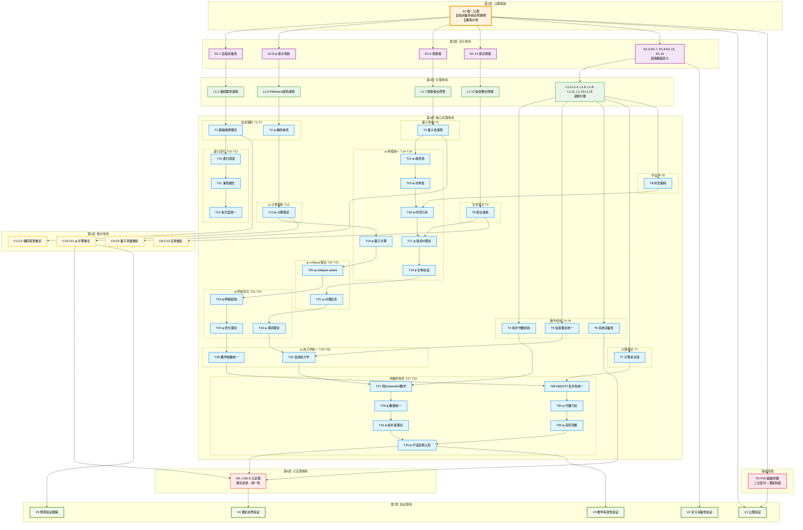

# 二进制宇宙理论体系总体架构图

## 图表导航

本图表展示了从A1唯一公理到V1-V5验证体系的完整层次推导架构，体现了二进制宇宙理论的完整逻辑脉络。

### 图表说明

1. **第1层（A1公理）**：唯一公理作为推导起点
2. **第2层（定义体系）**：15个基础定义（D1.1-D1.15）
3. **第3层（引理体系）**：15个关键引理（L1.1-L1.15）
4. **第4层（核心定理）**：主要定理体系（T1-T33）
5. **第5层（推论体系）**：推论系统（C1-C21）
6. **第6层（元定理）**：元定理系统（M1.1-M1.8）
7. **第7层（验证体系）**：验证系统（V1-V5）

## 总体架构图

## 重要推导路径标注

### 核心推导链
1. **A1 → φ-编码链**: A1 → D1.1 → L1.1 → T1 → T2 → φ-表示系统
2. **观察者涌现链**: A1 → D1.5 → L1.7 → T3 → 量子现象
3. **意识涌现链**: D1.14 → L1.12 → T9 → 意识阈值理论
4. **数学结构链**: T4 → T27 → T29 → T31 → T33 → 宇宙自我认知

### 关键分支点
- **T2**: φ-编码分支向计算理论和物理统一
- **T9**: 意识涌现分支向高阶认知理论  
- **T17**: 弦论分支向量子引力统一
- **T27**: 纯数学分支向拓扑斯和高阶范畴
- **T33**: 终极统一点，宇宙自我认知的完备实现

### 验证闭环
- **V1-V5**: 形成完整验证闭环，确保理论体系的自洽性和完备性
- **M1.1-M1.8**: 元定理体系实现理论的自反射验证

## 理论文件链接索引

### 基础理论层
- [A1唯一公理](./A1-five-fold-equivalence.md)
- [定义体系D1.1-D1.15](./D1-1-self-referential-completeness.md)
- [引理体系L1.1-L1.15](./L1-1-encoding-emergence.md)

### 核心定理层
- [信息编码理论T1-T2](./T1-1-entropy-increase-necessity.md)
- [量子现象理论T3](./T3-1-quantum-state-emergence.md)
- [数学结构理论T4-T6](./T4-1-topological-structure-theorem.md)
- [φ-宇宙自我认知T33](./T33-3-phi-meta-universe-self-transcendence.md)

### 验证体系
- [V1公理验证系统](./V1-axiom-verification-system.md)
- [V5预测验证跟踪](./V5-prediction-verification-tracking-system.md)

---

*此架构图体现了从单一公理到完整宇宙理论的严密逻辑推导过程，每个层次都为上一层提供必要基础，最终在T33实现宇宙的完全自我认知。*