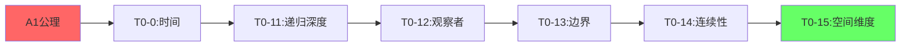
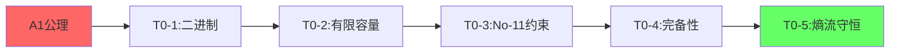
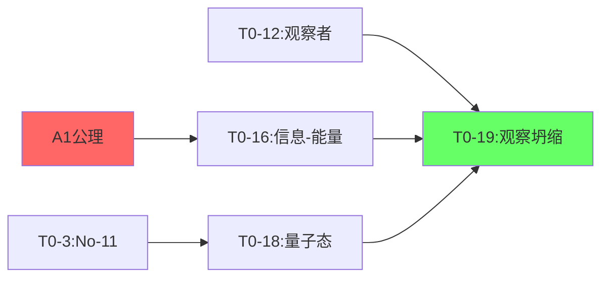
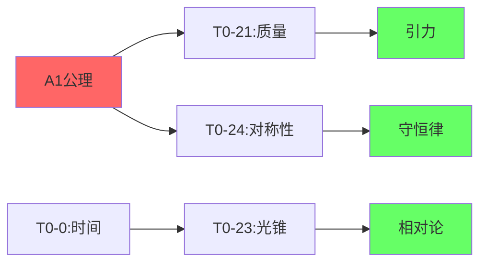
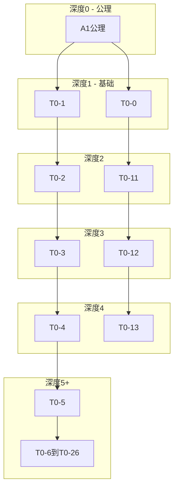
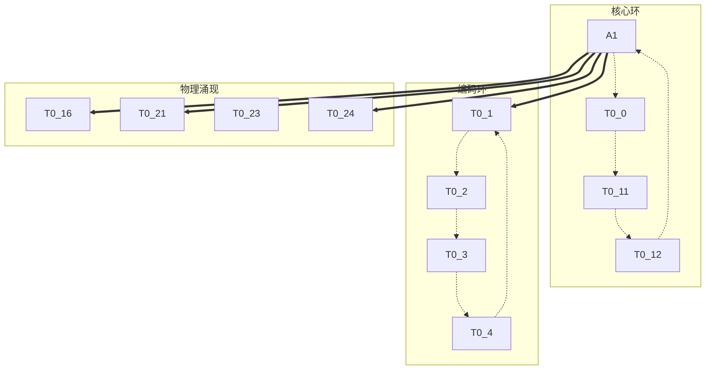

# T0理论依赖关系可视化图表

## 1. 完整依赖关系图（Mermaid格式）

```mermaid
graph TB
    %% 定义节点样式
    classDef axiom fill:#ff6666,stroke:#333,stroke-width:4px,color:#fff
    classDef foundation fill:#ffaa66,stroke:#333,stroke-width:3px
    classDef core fill:#ffff66,stroke:#333,stroke-width:2px
    classDef extended fill:#66ff66,stroke:#333,stroke-width:2px
    classDef physical fill:#66ffff,stroke:#333,stroke-width:2px
    classDef advanced fill:#ff66ff,stroke:#333,stroke-width:2px
    
    %% 公理层
    A1[A1公理<br/>自指完备系统必然熵增]:::axiom
    
    %% 基础层 Layer 0
    A1 ==> T0_0[T0-0: 时间涌现基础<br/>Time Emergence Foundation]:::foundation
    A1 ==> T0_1[T0-1: 二进制状态空间<br/>Binary State Space]:::foundation
    
    %% 第一层 Layer 1
    T0_0 ==> T0_11[T0-11: 递归深度层次<br/>Recursive Depth Hierarchy]:::core
    T0_1 ==> T0_2[T0-2: 基本熵桶理论<br/>Fundamental Entropy Bucket]:::core
    
    %% 第二层 Layer 2
    T0_1 --> T0_3[T0-3: Zeckendorf约束涌现<br/>Zeckendorf Constraint Emergence]:::core
    T0_2 --> T0_3
    
    T0_0 --> T0_12[T0-12: 观察者涌现<br/>Observer Emergence]:::core
    T0_11 --> T0_12
    
    %% 第三层 Layer 3
    T0_0 --> T0_13[T0-13: 系统边界<br/>System Boundaries]:::extended
    T0_11 --> T0_13
    T0_12 --> T0_13
    
    T0_1 --> T0_4[T0-4: 二进制编码完备性<br/>Binary Encoding Completeness]:::extended
    T0_2 --> T0_4
    T0_3 --> T0_4
    
    T0_1 --> T0_5[T0-5: 熵流守恒<br/>Entropy Flow Conservation]:::extended
    T0_2 --> T0_5
    T0_3 --> T0_5
    T0_4 --> T0_5
    
    T0_1 --> T0_6[T0-6: 系统组件交互<br/>System Component Interaction]:::extended
    T0_2 --> T0_6
    T0_3 --> T0_6
    T0_4 --> T0_6
    T0_5 --> T0_6
    
    T0_3 --> T0_7[T0-7: Fibonacci序列必然性<br/>Fibonacci Sequence Necessity]:::extended
    T0_6 --> T0_7
    
    T0_5 --> T0_8[T0-8: 最小信息原理<br/>Minimal Information Principle]:::extended
    T0_7 --> T0_8
    
    T0_3 --> T0_9[T0-9: 二进制决策逻辑<br/>Binary Decision Logic]:::extended
    T0_8 --> T0_9
    
    T0_2 --> T0_10[T0-10: 熵容量缩放<br/>Entropy Capacity Scaling]:::extended
    T0_6 --> T0_10
    T0_7 --> T0_10
    
    %% 第四层 Layer 4 - 物理涌现
    T0_0 --> T0_14[T0-14: 离散-连续过渡<br/>Discrete-Continuous Transition]:::physical
    T0_11 --> T0_14
    T0_13 --> T0_14
    
    T0_0 --> T0_15[T0-15: 空间维度涌现<br/>Spatial Dimension Emergence]:::physical
    T0_11 --> T0_15
    T0_12 --> T0_15
    T0_13 --> T0_15
    
    A1 ==> T0_16[T0-16: 信息-能量等价<br/>Information-Energy Equivalence]:::physical
    
    T0_3 --> T0_17[T0-17: 信息熵Zeckendorf编码<br/>Information Entropy Zeckendorf]:::physical
    
    T0_3 --> T0_18[T0-18: 量子态No-11约束涌现<br/>Quantum State Emergence]:::physical
    
    T0_12 --> T0_19[T0-19: 观察坍缩信息过程<br/>Observation Collapse Process]:::physical
    T0_16 --> T0_19
    
    T0_3 --> T0_20[T0-20: Zeckendorf度量空间<br/>Zeckendorf Metric Space]:::physical
    
    %% 第五层 Layer 5 - 高级物理
    A1 ==> T0_21[T0-21: 质量从信息密度涌现<br/>Mass Emergence from Info Density]:::advanced
    T0_3 --> T0_21
    
    T0_3 --> T0_22[T0-22: 概率测度涌现<br/>Probability Measure Emergence]:::advanced
    
    T0_0 --> T0_23[T0-23: 因果锥与光锥结构<br/>Causal Cone & Lightcone]:::advanced
    
    A1 ==> T0_24[T0-24: 基本对称性<br/>Fundamental Symmetries]:::advanced
    T0_3 --> T0_24
    
    A1 ==> T0_25[T0-25: 相变临界理论<br/>Phase Transition Critical]:::advanced
    
    T0_3 --> T0_26[T0-26: 拓扑不变量<br/>Topological Invariants]:::advanced
```

## 2. 理论分层结构表

| 层级 | 层名称 | 理论编号 | 特征描述 |
|------|--------|----------|----------|
| 公理层 | Axiom | A1 | 唯一公理：自指完备系统必然熵增 |
| 第0层 | Time & Binary Foundation | T0-0, T0-1 | 时间涌现和二进制基础 |
| 第1层 | Primary Structures | T0-2, T0-11 | 熵容器和递归深度 |
| 第2层 | Core Mechanisms | T0-3, T0-12 | 约束机制和观察者 |
| 第3层 | Extended Framework | T0-4到T0-10, T0-13 | 完整编码框架和交互理论 |
| 第4层 | Physical Emergence | T0-14到T0-20 | 物理现象涌现 |
| 第5层 | Advanced Physics | T0-21到T0-26 | 高级物理理论 |

## 3. 关键推导路径图

### 3.1 时间-空间涌现路径

### 3.2 编码完备性路径

### 3.3 量子-观察路径

### 3.4 物理定律涌现路径

## 4. 理论依赖强度热力图

### 4.1 被依赖次数统计

| 理论 | 被直接依赖次数 | 依赖强度等级 |
|------|----------------|--------------|
| A1公理 | 27 | 核心 |
| T0-0 | 8 | 关键枢纽 |
| T0-1 | 7 | 关键枢纽 |
| T0-3 | 9 | 关键枢纽 |
| T0-11 | 5 | 重要节点 |
| T0-12 | 3 | 重要节点 |
| T0-2 | 6 | 重要节点 |
| T0-4 | 2 | 中间节点 |
| T0-5 | 2 | 中间节点 |
| T0-6 | 2 | 中间节点 |
| T0-7 | 2 | 中间节点 |
| T0-13 | 2 | 中间节点 |
| T0-16 | 1 | 端点 |
| 其他 | 0-1 | 端点 |

### 4.2 依赖深度分析

## 5. 独立理论分支识别

### 5.1 可并行发展的分支

1. **时间-观察分支**
   - 路径：T0-0 → T0-11 → T0-12 → T0-13
   - 特点：关注时间、层次、观察者

2. **编码-信息分支**
   - 路径：T0-1 → T0-2 → T0-3 → T0-4 → T0-5
   - 特点：关注二进制编码和信息流

3. **直接物理分支**
   - 理论：T0-16, T0-21, T0-24, T0-25
   - 特点：直接从A1推导物理定律

4. **几何-拓扑分支**
   - 理论：T0-20, T0-22, T0-26
   - 特点：关注数学结构

### 5.2 理论汇聚点

- **T0-13**：需要时间、递归、观察者三条线汇聚
- **T0-15**：需要四个理论（T0-0, T0-11, T0-12, T0-13）
- **T0-19**：连接信息论（T0-16）和观察者（T0-12）

## 6. 理论体系拓扑结构

## 7. 理论验证优先级矩阵

| 优先级 | 理论 | 验证重要性 | 原因 |
|--------|------|------------|------|
| P0-关键 | A1, T0-0, T0-1 | 必须正确 | 整个体系基础 |
| P1-高 | T0-2, T0-3, T0-11 | 非常重要 | 核心机制 |
| P2-中高 | T0-4, T0-5, T0-12 | 重要 | 关键推导 |
| P3-中 | T0-6到T0-10, T0-13 | 较重要 | 框架完整性 |
| P4-中低 | T0-14到T0-20 | 一般 | 物理涌现 |
| P5-低 | T0-21到T0-26 | 可选 | 高级推论 |

## 8. 总结

T0理论依赖关系展现了一个优雅的分层架构：

1. **单一起点**：所有理论源于A1公理
2. **双基础**：T0-0（时间）和T0-1（二进制）构成双支柱
3. **渐进构建**：每层基于前层，逐步增加复杂度
4. **多路径汇聚**：不同分支在关键点汇聚
5. **完整覆盖**：从基础到高级物理的完整推导链

这个可视化清晰展示了二进制宇宙理论的逻辑结构和推导关系。

---
*可视化图表生成时间：2025-08-11*