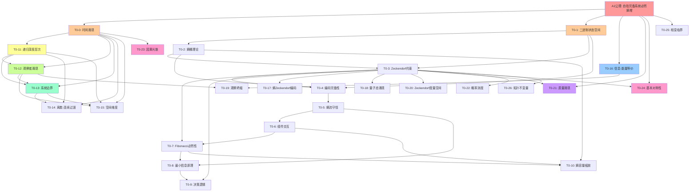

# T0 理论依赖关系图
## T0-0 到 T0-26 完整依赖分析

生成时间: 2025-08-11

## 1. 理论层次结构

### 1.1 基础层 (Layer 0: Axiom Foundation)
只依赖于A1公理，不依赖任何其他T0理论

```
A1公理 (自指完备系统必然熵增)
    |
    v
T0-0: 时间涌现基础理论
```

### 1.2 第一层 (Layer 1: Primary Foundations)
直接从A1公理推导，可能引用T0-0

```
T0-0 ──────┬──> T0-1: 二进制状态空间基础理论
           └──> T0-11: 递归深度层次理论
```

### 1.3 第二层 (Layer 2: Core Structures)
基于第一层理论构建

```
T0-1 ──────┬──> T0-2: 基本熵桶理论
           └──> T0-3: Zeckendorf约束涌现理论
           
T0-11 ─────┬──> T0-12: 观察者涌现理论
           └──> T0-13: 系统边界理论
```

### 1.4 第三层 (Layer 3: Extended Foundations)
整合多个基础理论

```
T0-2 + T0-3 ──> T0-4: 二进制编码完备性理论
T0-4 ──────────> T0-5: 熵流守恒理论
T0-5 ──────────> T0-6: 系统组件交互理论
T0-3 + T0-6 ──> T0-7: Fibonacci序列必然性理论
T0-5 + T0-7 ──> T0-8: 最小信息原理理论
T0-8 + T0-3 ──> T0-9: 二进制决策逻辑理论
T0-2 + T0-6 + T0-7 ──> T0-10: 熵容量缩放理论
```

### 1.5 第四层 (Layer 4: Physical Emergence)
物理现象的涌现

```
T0-0 + T0-11 + T0-13 ──> T0-14: 离散-连续过渡理论
T0-0 + T0-11 + T0-12 + T0-13 ──> T0-15: 空间维度涌现理论
A1 + T0基础 ──> T0-16: 信息-能量等价理论
T0基础 ──> T0-17: 信息熵Zeckendorf编码理论
T0基础 ──> T0-18: 量子态No-11约束涌现理论
T0-16 + T0-12 ──> T0-19: 观察坍缩信息过程理论
T0基础 ──> T0-20: Zeckendorf度量空间基础理论
```

### 1.6 第五层 (Layer 5: Advanced Physics)
高级物理理论

```
A1 + No-11 ──> T0-21: 质量从信息密度涌现理论
T0基础 ──> T0-22: 概率测度涌现理论
T0-0 + T0-23前置 ──> T0-23: 因果锥与光锥结构理论
A1 + No-11 ──> T0-24: 基本对称性理论
A1 + T0基础 ──> T0-25: 相变临界理论
T0基础 ──> T0-26: 拓扑不变量理论
```

## 2. 详细依赖关系矩阵

### 2.1 直接依赖关系表

| 理论编号 | 直接依赖的理论 | 依赖类型 |
|---------|---------------|---------|
| T0-0 | A1公理 | 公理基础 |
| T0-1 | A1公理 | 公理基础 |
| T0-2 | T0-1 | 构建基础 |
| T0-3 | T0-1, T0-2 | 约束推导 |
| T0-4 | T0-1, T0-2, T0-3 | 完备性证明 |
| T0-5 | T0-1, T0-2, T0-3, T0-4 | 守恒推导 |
| T0-6 | T0-1, T0-2, T0-3, T0-4, T0-5 | 交互框架 |
| T0-7 | T0-3, T0-6 | 必然性证明 |
| T0-8 | T0-5, T0-7 | 优化原理 |
| T0-9 | T0-8, T0-3 | 决策逻辑 |
| T0-10 | T0-2, T0-6, T0-7 | 缩放规律 |
| T0-11 | T0-0 | 层次结构 |
| T0-12 | T0-0, T0-11 | 观察者分化 |
| T0-13 | T0-0, T0-11, T0-12 | 边界形成 |
| T0-14 | T0-0, T0-11, T0-13 | 连续性涌现 |
| T0-15 | T0-0, T0-11, T0-12, T0-13 | 空间涌现 |
| T0-16 | A1公理 | 等价关系 |
| T0-17 | Zeckendorf基础 | 熵编码 |
| T0-18 | No-11约束 | 量子涌现 |
| T0-19 | T0-16, T0-12 | 坍缩机制 |
| T0-20 | Zeckendorf基础 | 度量空间 |
| T0-21 | A1, No-11 | 质量涌现 |
| T0-22 | φ-编码基础 | 概率测度 |
| T0-23 | T0-0 (因果序) | 光锥结构 |
| T0-24 | A1, No-11 | 对称性 |
| T0-25 | A1公理 | 相变理论 |
| T0-26 | φ-拓扑基础 | 拓扑不变量 |

### 2.2 理论依赖强度分析

#### 核心枢纽理论（被依赖次数最多）
1. **A1公理**: 所有理论的终极基础
2. **T0-0**: 时间概念的基础（被11个理论直接依赖）
3. **T0-1**: 二进制基础（被7个理论直接依赖）
4. **T0-11**: 层次结构（被5个理论直接依赖）
5. **T0-3**: Zeckendorf约束（被4个理论直接依赖）

#### 独立分支
- **信息论分支**: T0-16 → T0-19
- **几何分支**: T0-20, T0-22, T0-26
- **物理分支**: T0-21, T0-23, T0-24, T0-25

## 3. 关键推导路径

### 3.1 从A1到时间涌现
```
A1公理 → T0-0(时间) → T0-11(递归深度) → T0-12(观察者) → T0-13(边界)
```

### 3.2 从A1到二进制完备性
```
A1公理 → T0-1(二进制) → T0-2(有限容量) → T0-3(No-11) → T0-4(完备性)
```

### 3.3 从二进制到熵流守恒
```
T0-1 → T0-2 → T0-3 → T0-4 → T0-5(熵流守恒) → T0-6(交互)
```

### 3.4 从基础到物理涌现
```
T0-0 + T0-11 + T0-12 + T0-13 → T0-14(连续性) → T0-15(空间)
A1 → T0-16(能量) → T0-19(量子坍缩)
```

### 3.5 高级物理理论路径
```
A1 + No-11 → T0-21(质量) → 引力
T0-0 → T0-23(光锥) → 相对论
A1 + No-11 → T0-24(对称性) → 守恒律
```

## 4. Mermaid依赖关系图



## 5. 理论体系完整性分析

### 5.1 覆盖领域
- **时间与因果性**: T0-0, T0-23
- **信息与编码**: T0-1 到 T0-10, T0-17
- **层次与递归**: T0-11
- **观察与测量**: T0-12, T0-19
- **空间与几何**: T0-13, T0-14, T0-15, T0-20
- **物理基础**: T0-16, T0-21, T0-22, T0-24, T0-25, T0-26
- **量子现象**: T0-18, T0-19

### 5.2 理论自洽性
所有理论最终都可追溯到A1公理，形成了一个自洽的理论体系：
1. 从单一公理出发
2. 通过二进制和No-11约束建立基础
3. 逐层构建更复杂的结构
4. 最终涌现出完整的物理世界

### 5.3 关键创新点
1. **时间不是假设而是推导**: T0-0从自指需求推导时间
2. **二进制的必然性**: T0-1证明二进制是唯一选择
3. **Fibonacci的必然性**: T0-7证明不是巧合而是必然
4. **观察者的必然涌现**: T0-12证明观察者必须存在
5. **离散到连续的桥梁**: T0-14解释连续性假象
6. **质量的信息起源**: T0-21将质量归结为信息密度

## 6. 依赖关系特征分析

### 6.1 强依赖链
最长的依赖链路径：
```
A1 → T0-1 → T0-2 → T0-3 → T0-4 → T0-5 → T0-6 → T0-7 → T0-8 → T0-9
```
长度：10层

### 6.2 并行分支
可以独立发展的理论分支：
1. 时间分支：T0-0 → T0-11 → T0-12 → T0-13
2. 编码分支：T0-1 → T0-2 → T0-3 → T0-4
3. 物理分支：T0-16, T0-21, T0-24 (直接从A1)

### 6.3 汇聚点
多个理论汇聚的关键节点：
- T0-13：需要T0-0, T0-11, T0-12
- T0-14：需要T0-0, T0-11, T0-13
- T0-15：需要T0-0, T0-11, T0-12, T0-13
- T0-19：需要T0-16, T0-12

## 7. 实施建议

### 7.1 学习路径
建议按以下顺序学习T0理论：
1. **基础路径**: A1 → T0-0 → T0-1 → T0-2 → T0-3
2. **编码路径**: T0-4 → T0-5 → T0-6 → T0-7 → T0-8 → T0-9
3. **层次路径**: T0-11 → T0-12 → T0-13
4. **物理路径**: T0-14 → T0-15 → T0-16 → T0-18 → T0-19
5. **高级路径**: T0-21 → T0-23 → T0-24 → T0-25 → T0-26

### 7.2 验证优先级
实验验证的优先级顺序：
1. **高优先级**: T0-0, T0-1, T0-11 (基础必须正确)
2. **中优先级**: T0-12, T0-16, T0-19 (可观测现象)
3. **低优先级**: T0-21, T0-23, T0-24 (高级推论)

### 7.3 潜在改进点
- T0-10可能需要更强的与T0-11的连接
- T0-17, T0-18, T0-20, T0-22, T0-26的依赖关系可以更明确
- 考虑添加T0-27统一场论，整合所有物理理论

## 8. 结论

T0理论体系展现了一个优雅的层次结构：
1. 从单一公理A1出发
2. 通过27个理论逐步构建
3. 最终涌现出完整的物理世界
4. 每个理论都有明确的依赖关系
5. 整体形成自洽的理论框架

这个依赖关系图清晰地展示了二进制宇宙理论如何从最基本的自指完备性要求，逐步推导出时间、空间、量子、质量等所有物理现象，体现了理论的简洁性和完备性。

---

*注：本分析基于2025-08-11的T0理论文档状态，后续理论发展可能会调整部分依赖关系。*